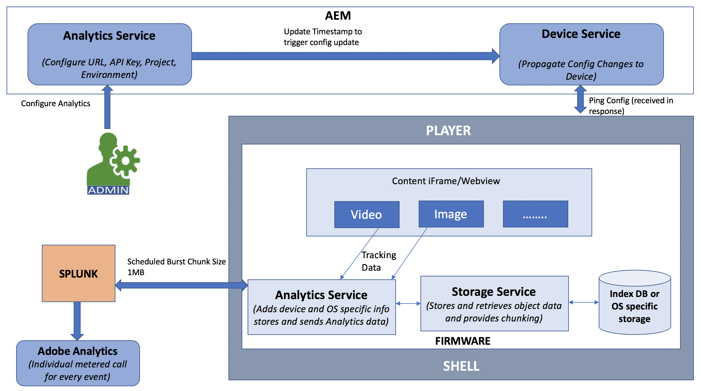
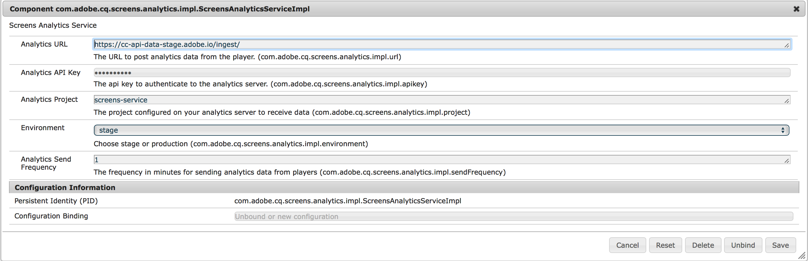

# Adobe Analytics与AEM Screens集成 {#adobe-analytics-integration-with-aem-screens}

>[!IMPORTANT]
>此内容对AEM on-premise/AMS（AEM 6.5LTS和AEM 6.5）有效。 有关AEM as a Cloud Service Screens的内容，请参阅[AEM as a Cloud Service指南](https://experienceleague.adobe.com/en/docs/experience-manager-cloud-service/content/screens-as-cloud-service/overview/introduction)。

>[!CAUTION]
>
>仅当您安装了AEM Screens 6.4.2 Feature Pack 2最低版本或AEM 6.3.3 Feature Pack 4时，才能使用此AEM功能。 对于AEM Screens Cloud Service客户，请联系您的Adobe关系经理，以在Screens Cloud中启用Adobe Analytics。

>[!NOTE]
>
>要访问任何这些功能包，请与Adobe支持联系并请求获取访问权限。 您可以使用您的Adobe ID从[软件分发门户](https://experience.adobe.com/#/downloads/content/software-distribution/en/aem.html)下载AEM Screens的最新功能包。

本节涵盖以下主题：

* **概述**
* **架构详细信息**
* **配置属性**

## 概述 {#overview}

***AEM Screens***&#x200B;使用Adobe Analytics，借助该工具，您可以实现市场上独一无二的功能 — 跨渠道分析，帮助将位置中显示的内容与其他数据源相关联。

AEM Screens提供了与Adobe Analytics的现成集成，并为您提供了使用证明。

本节介绍以下与AEM Screens项目与Adobe Analytics的连接相关的功能：

* 允许按设备提供播放报告验证
* 允许按资产提供播放报表的证明
* 确保捕获所有播放器事件并为其添加时间戳
* 如果播放未连接到网络，请确保所有播放器事件都存储在本地
* 可以创建反馈循环，以跟踪随时间变化的播放事件
* 允许系统根据内容作者定义的成功标准编辑内容和布局

因此，Adobe Analytics与AEM Screens的集成强制实施以下&#x200B;*目标*：

* 实现数字标牌实施的ROI
* 集成Analytics作为未来支持收集和分析使用信息的基础

## 体系结构详细信息 {#architectural-details}

一位AEM Screens客户想要了解在哪个时间显示了哪些内容，以及显示了多长时间（汇总）。 这种必要性是标牌解决方案的一种通用功能。 AEM Screens使用Adobe Analytics，而不是构建单独的分析应用程序。 通过组合，我们能够实现市场中的独特功能 — 跨渠道分析，这有助于将位置中显示的内容与其他数据源相关联。

以下架构图介绍了Adobe Analytics与AEM Screens的集成：

## 在AEM Screens中启用Adobe Analytics {#enabling-adobe-analytics-in-aem-screens}

可以从OSGi控制台配置Adobe Analytics设置。

导航到&#x200B;**Adobe Experience Manager Web控制台配置**，以便为AEM Screens配置Adobe Analytics。

## Screens Analytics：启用流程 {#screens-analytics-enablement-flow}

>[!CAUTION]
>
>在配置属性之前，请与Adobe关系经理联系以创建票证，以获取&#x200B;**Analytics API密钥**&#x200B;和&#x200B;**Analytics项目**，用于AEM Screens。

### 配置属性 {#configuring-the-properties}

>[!CAUTION]
>
>在配置属性之前，请与Adobe关系经理联系以创建票证，以获取&#x200B;**Analytics API密钥**&#x200B;和&#x200B;**Analytics项目**，用于AEM Screens。

下表重点列出了用于为AEM Screens配置Adobe Analytics的属性及其说明：

<table>
 <tbody>
  <tr>
   <td><strong>属性</strong></td>
   <td><strong>描述</strong></td>
  </tr>
  <tr>
   <td><strong>Analytics URL</strong></td>
   <td>用于从播放器发布分析数据的URL。  
   用于开发/暂存</em> - https://cc-api-data-stage.adobe.io/ingest/  <em>用于生产</em> - https://cc-api-data.adobe.io/ingest/   </td>
  </tr>
  <tr>
   <td><strong>Analytics API密钥</strong></td>
   <td>用于向Adobe Analytics服务器进行身份验证的API密钥（由帐户管理器提供）。</td>
  </tr>
  <tr>
   <td><strong>Analytics项目</strong></td>
   <td>在您的Analytics上配置为接收数据的AEM Screens项目（由客户经理提供）。</td>
  </tr>
  <tr>
   <td><strong>环境</strong></td>
   <td>
暂存或生产环境（选择暂存或生产）。
</td>
  </tr>
  <tr>
   <td><strong>Analytics发送频率</strong></td>
   <td>从播放器发送分析数据的频率（分钟）。 默认情况下，此时间设置为15分钟。</td>
  </tr>
 </tbody>
</table>

>[!NOTE]
>
>默认情况下，**Analytics发送频率**&#x200B;为15分钟。

#### 在AEM Screens中使用Adobe Analytics服务 {#using-adobe-analytics-service-in-aem-screens}

此方案通过来自固件中分析服务的REST调用调用Analytics API。 它还会设置AEM Screens核心组件的工具，以创建并发送特定于特定用例的事件。 所有这些功能，同时支持可扩展性，任何自定义消息都可从自定义开发的渠道发送到Analytics。

Analytics事件离线存储在indexedDB中，稍后进行分块并发送到云。

>[!NOTE]
>
>要了解有关&#x200B;***排序***&#x200B;和&#x200B;***事件标准数据模型***&#x200B;的更多信息，请参阅&#x200B;**[为AEM Screens配置Adobe Analytics](configuring-adobe-analytics-aem-screens.md)**。
