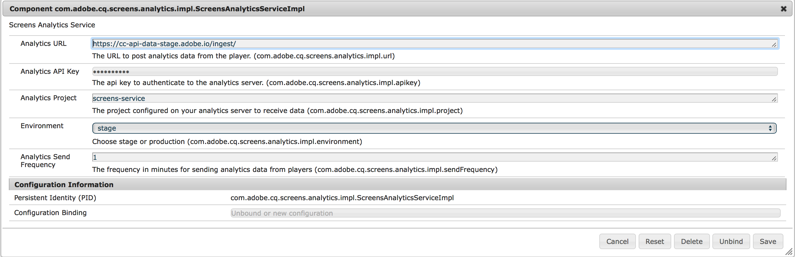

# AdobeAnalytics与AEM Screens集成 {#adobe-analytics-integration-with-aem-screens}

>[!CAUTION]
>
>此AEM Screens功能仅在您安装了AEM 6.4.2功能包2和AEM 6.3.3功能包4时可用。

>[!NOTE]
>
>要访问这些功能包中的任何一个，您必须联系Adobe支持并请求访问权限。 您获得权限后，就可以从“包共享”下载它。

本节涵盖以下主题：

* **概述**
* **架构细节**
* **配置属性**

## 概述 {#overview}

***AEM Screens*** 利用Adobe Depication，您可以在市场中实现独一无二的功能——跨渠道分析功能可帮助将位置显示的内容与其他数据源关联起来。

AEM Screens提供与AdobeAnalytics的开箱即用集成，并为您提供一个重头戏。

本节介绍将AEM Screens项目与AdobeAnalytics连接时涉及的以下功能：

* 允许按设备验证播放报告
* 允许按资产验证播放报告
* 确保捕获所有播放器事件并加盖时间戳
* 确保当播放未连接到网络时，所有播放器事件都存储在本地
* 允许创建反馈循环，跟踪一段时间内的播放事件
* 允许系统根据内容作者定义的成功标准修改内容和布局

因此，AdobeAnalytics与AEM Screens的集成执行了以 *下目标*:

* 通过数字标牌实施实现ROI
* 将Analytics整合为未来收集和分析使用信息的基础

## 架构细节 {#architectural-details}

AEM Screens客户希望了解在什么时间显示哪些内容以及显示时间（汇总）。 这是标牌解决方案的常见功能。 AEM Screens将利用Adobe Deation，而不是构建自己的分析，从而在市场上实现独一无二的功能——跨渠道分析，帮助将位置显示的内容与其他数据源关联起来。

以下架构图说明了AdobeAnalytics与AEM Screens的集成：

## 在AEM Screens支持AdobeAnalytics {#enabling-adobe-analytics-in-aem-screens}

可以从OSGi控制台配置AdobeAnalytics设置。

导航到 **Adobe Experience ManagerWeb控制台配置** ，为AEM Screens配置AdobeAnalytics，如下图所示：

## 屏幕Analytics: Enablement Flow {#screens-analytics-enablement-flow}

>[!CAUTION]
>
>在配置属性之前，请与Adobe关系经理联系以创建票证以获 **取Anaytics API Key****和Anaytics Project** ，以便与AEM Screens一起使用。

### 配置属性 {#configuring-the-properties}

>[!CAUTION]
>
>在配置属性之前，请与Adobe关系经理联系以创建票证以获 **取Anaytics API Key****和Anaytics Project** ，以便与AEM Screens一起使用。

下表重点介绍了为AEM Screens配置AdobeAnalytics的属性及其说明：

<table>
 <tbody>
  <tr>
   <td><strong>属性</strong></td>
   <td><strong>描述</strong></td>
  </tr>
  <tr>
   <td><strong>AnalyticsURL</strong></td>
   <td>用于从播放器发布分析数据的URL。  
   针对开发／阶段</em> - https://cc-api-data-stage.adobe.io/ingest/ <em>针对生产</em> - https://cc-api-data.adobe.io/ingest/</em>   </td>
  </tr>
  <tr>
   <td><strong>AnalyticsAPI密钥</strong></td>
   <td>用于验证到AdobeAnalytics服务器（由客户经理提供）的API密钥。</td>
  </tr>
  <tr>
   <td><strong>Analytics项目</strong></td>
   <td>AEM Screens在您的分析上配置为接收数据的项目（由帐户管理器提供）。</td>
  </tr>
  <tr>
   <td><strong>环境</strong></td>
   <td>
暂存或生产环境（选择暂存或生产）。
</td>
  </tr>
  <tr>
   <td><strong>Analytics发送频率</strong></td>
   <td>从播放器发送分析数据的频率（以分钟为单位）。 默认情况下，它设置为15分钟。</td>
  </tr>
 </tbody>
</table>

>[!NOTE]
>
>默认情况下， **Analytics发送频** 率为15分钟。

#### 在AEM Screens中使用AdobeAnalytics服务 {#using-adobe-analytics-service-in-aem-screens}

此方案通过来自固件和仪器屏幕核心组件中分析服务的REST调用调用AnalyticsAPI，以显式创建和发送特定用例的事件，同时允许可扩展性，在可扩展性方面，任何自定义消息都可以从自定义开发的渠道发送到Analytics。

Analytics事件离线存储在indexedDB中，稍后分块并发送到云。

>[!NOTE]
>
>要进一步了解 ***事件的*** Sequencing ***and Standard Data Model(排序和标***&#x200B;准数据模型) **[，请参](configuring-adobe-analytics-aem-screens.md)**阅为AEM Screens配置Adobe Deta Model。

