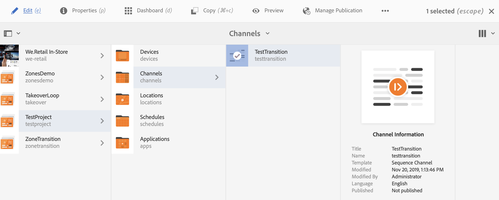
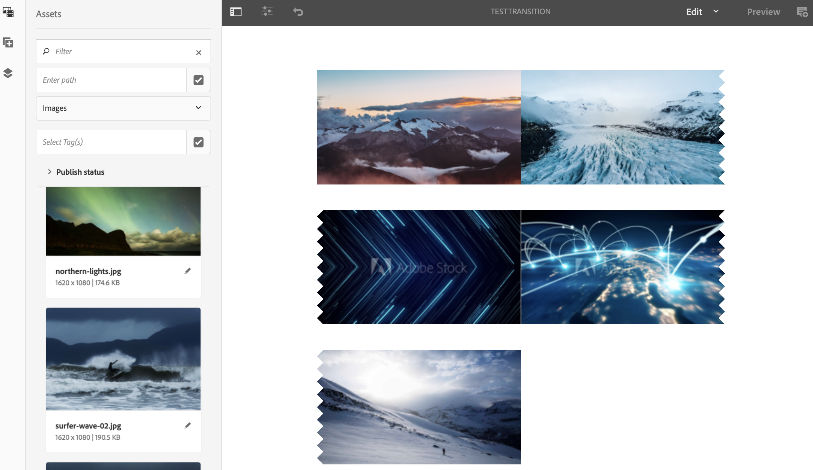

# 应用过渡 {#applying-transitions}

本节将介绍如何应用 **过渡** 不同资产（图像和视频）和渠道中的嵌入式序列之间的组件。

>[!CAUTION]
>
>详细了解 **过渡** 组件，请参见 [过渡](adding-components-to-a-channel.md#transition).

## 将过渡组件添加到渠道中的资产 {#adding-transition}

请按照以下步骤向AEM Screens项目添加过渡组件：

>[!NOTE]
>
>**前提条件**
>
>创建AEM Screens项目 **测试项目** 与渠道 **TestTransition**. 此外，设置位置和显示以查看输出。

1. 导航到渠道 **TestTransition** 并单击 **编辑** 从操作栏中。

   

   >[!NOTE]
   >
   >此 **TestTransition** 渠道中已有一些资产（图像和视频）。 例如， **TestTransition** 渠道包括三个图像和两个视频，如下所示：

   

1. 拖放 **过渡** 组件添加到编辑器中。

   >[!CAUTION]
   >
   >在将过渡添加到渠道中的资产之前，请确保不要在顺序渠道中的第一个资产之前添加过渡。 渠道中的第一个项目必须是资源而不是过渡。

   

   >[!NOTE]
   >
   >默认情况下，过渡组件的属性 **类型** 设置为 **渐隐** 和 **持续时间** 设置为 *1600毫秒*. 此外，不建议设置比应用它的资产更长的过渡持续时间。

1. 此外，如果您添加 **嵌入式序列** 组件（包括序列渠道）到此渠道编辑器中，您可以在末尾添加过渡组件。 这样做可确保内容以正确的顺序播放，如下图所示：

   
