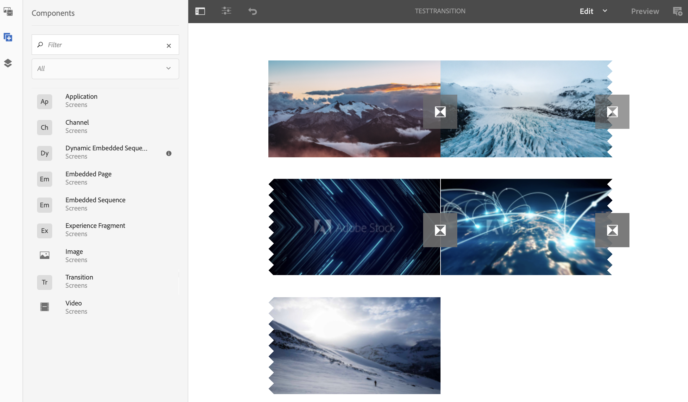

# 应用过渡 {#applying-transitions}

>[!IMPORTANT]
>此内容对AEM on-premise/AMS（AEM 6.5LTS和AEM 6.5）有效。 有关AEM as a Cloud Service Screens的内容，请参阅[AEM as a Cloud Service指南](https://experienceleague.adobe.com/en/docs/experience-manager-cloud-service/content/screens-as-cloud-service/overview/introduction)。

本节介绍如何在渠道中的不同资产（图像和视频）和嵌入序列之间应用&#x200B;**过渡**&#x200B;组件。

>[!CAUTION]
>
>要详细了解&#x200B;**过渡**&#x200B;组件的属性，请参阅[过渡](adding-components-to-a-channel.md#transition)。

## 在渠道中将过渡组件添加到Assets {#adding-transition}

请按照以下步骤向AEM Screens项目添加过渡组件：

>[!NOTE]
>
>**先决条件**
>
>创建渠道为&#x200B;**TestTransition**&#x200B;的AEM Screens项目&#x200B;**TestProject**。 此外，设置位置和显示以查看输出。

1. 导航到渠道&#x200B;**TestTransition**，然后单击操作栏中的&#x200B;**编辑**。

   

   >[!NOTE]
   >
   >**TestTransition**&#x200B;渠道中已有一些资产（图像和视频）。 例如，**TestTransition**&#x200B;渠道包含三个图像和两个视频，如下所示：

   

1. 将&#x200B;**过渡**&#x200B;组件拖放到编辑器中。

   >[!CAUTION]
   >
   >在将过渡添加到渠道中的资产之前，请确保不要在顺序渠道中的第一个资产之前添加过渡。 渠道中的第一个项目必须是资源而不是过渡。

   

   >[!NOTE]
   >
   >默认情况下，过渡组件（如&#x200B;**Type**）的属性设置为&#x200B;**渐隐**，并且&#x200B;**持续时间**&#x200B;设置为&#x200B;*1600毫秒*。 此外，不建议设置比应用它的资产更长的过渡持续时间。

1. 此外，如果将&#x200B;**嵌入式序列**&#x200B;组件（包括一个序列渠道）添加到此渠道编辑器，则可以在末尾添加过渡组件。 这样做可确保内容以正确的顺序播放，如下图所示：

   
