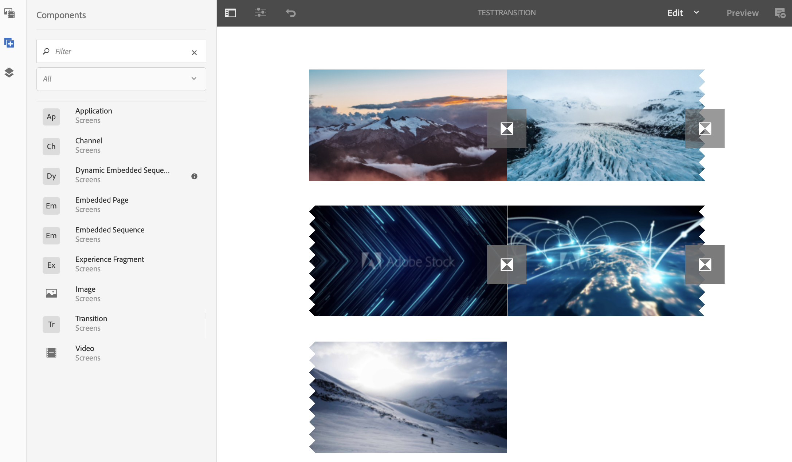

# 应用过渡 {#applying-transitions}

本节将介绍 **Transition** 组件如何允许您向Screens项目添加过渡。

>[!CAUTION]
>
>要详细了解过渡组件的属性，请参阅过渡 [。](adding-components-to-a-channel.md#transition)

## 向渠道中的资产添加过渡组件 {#adding-transition}

请按照以下步骤将过渡组件添加到AEM Screens项目：

>[!NOTE]
>
>**前提条件**
> 使用渠道TestTransition创建AEM Screens **项**&#x200B;目TestProject ****。 此外，设置查看输出的位置和显示屏。

1. 导航到Channel **TestTransition** ，然 **后单击操作** 栏中的“编辑”。

   

   >[!NOTE]
   >
   >TestTransition **渠道中的** TestTransition渠道已经很少包含资源（图像和视频）。 例如， **TestTransition** 通道包括三个图像和两个视频，如下所示：

   

1. 将“过渡”组 **件拖放到** “编辑器”中。
   >[!CAUTION]
   >
   >在渠道中向资产添加过渡之前，请确保：您不会在顺序渠道中的第一个资产之前添加过渡。 渠道中的第一个项目必须是资产，而不是过渡。

   

   > [!NOTE]
   >
   >默认情况下，过渡组件设置为“类型”( **Type** ),“持 **续时间”(Duration** )设 *置为600 ms*。  此外，不建议设置比其所应用的资产长的过渡持续时间。

## 向渠道中的视频添加过渡组件 {#adding-transition-videos}

在视频之间应用过渡组件时，请始终将 **Type** （类型） **设置为Fade** ，将 **Sequence Duration（序列持续时间）** 设置为 **** 1600 ms。

