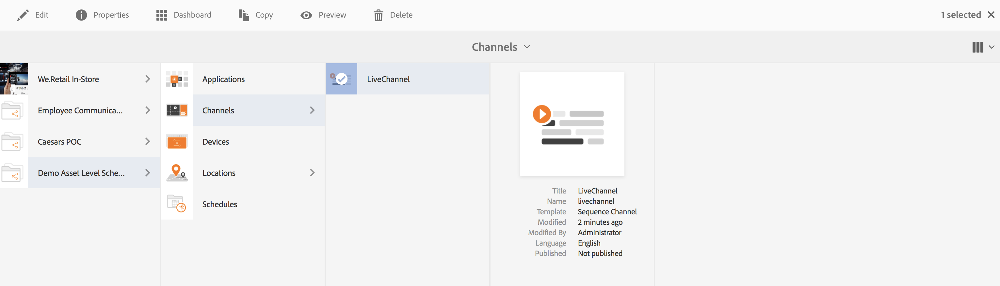
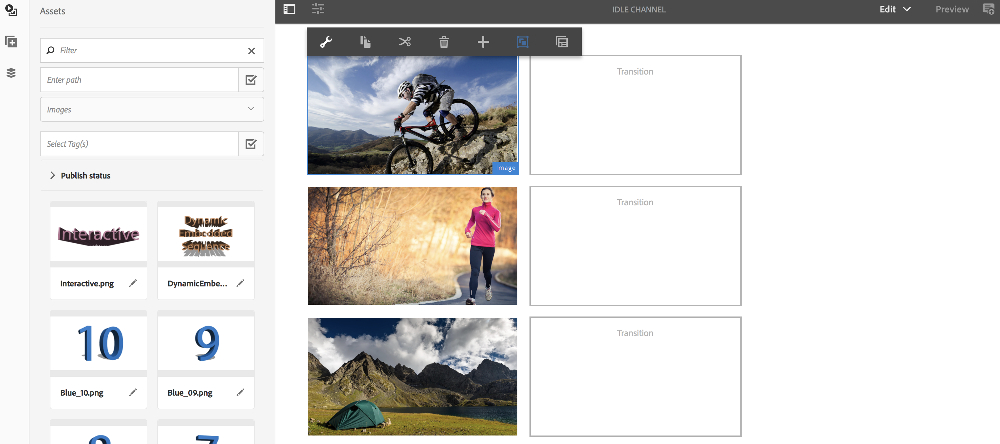
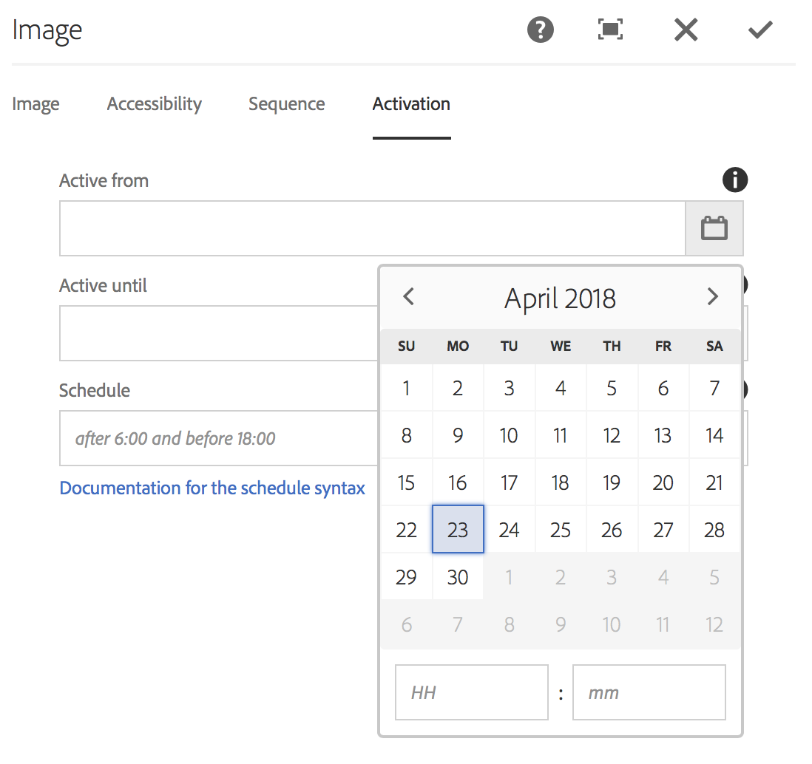

# 资产层计划 {#asset-level-scheduling}

本节介绍渠道中使用的资产的资产级别计划。

本节将介绍以下主题：

* OvervieW
* 使用资产层计划
* 处理资产中的循环
* 多资产计划

>[!CAUTION]
>
>仅当您安装了AEM 6.3功能包3或AEM 6.4屏幕功能包1时，此AEM Screens功能才可用。
>
>要获取此功能包，您必须联系 Adobe 支持人员并申请访问权限。您获得权限后，就可以从“包共享”下载它。

## 概述 {#overview}

***资产级别计划***，允许您在渠道中为播放器的本地时区中的预定时间帧激活特定资产。 这适用于图像、视频、过渡、页面和嵌入式渠道（动态或静态）。

*例如*，您希望在周一和周三的快乐时段（下午2点到下午5点）才能显示特殊促销。

利用此功能，您不仅可以指定开始和结束日期和时间，还可以指定循环模式。

## 使用资产层计划 {#using-asset-level-scheduling}

资产级别计划是通过在访问资产属性 **时配置** “激活”选项卡来完成的。

请按照以下步骤执行资产级别计划：

1. 选择任何渠道，然后 **单击操作栏** 中的编辑，以在渠道中添加或编辑内容。

   

   >[!NOTE]
   >
   >详细了解如何
   >
   >* 创建项目，请参阅 [创建新项目](creating-a-screens-project.md)。
   >* 创建内容并将其添加到渠道，请参阅管 [理渠道](managing-channels.md)。

1. 单击 **编辑** ，以打开渠道编辑器，然后选择要将计划应用到的资产。

   

1. 选择资产，然后单击左上角 **的配置** 图标以打开图像的属性。

   Click the **Activation** tab.

   

1. 您可以从“活动自”和“活动至”字段的日期选取 **器中指定****日期** 。

   如果您选择“ **活动自** ”和“活动 **** 至日期和时间”，则资产将仅显示该开始日期／时间和结束日期／时间之间的周期。

   

## 处理资产中的循环 {#handling-recurrence-in-assets}

您可以根据需要安排资产在每日、每周或每月的特定间隔重复使用。

假定您希望仅在星期五的晚上1:00至晚上10:00显示图像。 您可以使用激活选项卡来设置资产所需的重复时间间隔。

### 为资产添加重复事件 {#adding-a-recurring-event-for-your-asset}

1. 选择资产，然后单击 **配置** 图标以打开属性对话框。
1. 输入开始日期／时间和结束／日期时间后，您可以使用cron表达式或自然文本版本指定循环计划。

   您可以在Web上搜索免费的cron表达式生成器，然后将cron表达式复制并粘贴到 **Schedule** ，此时您的资产将显示特定的日期和时间间隔。

   *或者*，您也可以使用自然文本版本(如周五的6:00 *之后和18:00* 之前)来完成您的任务。 在计划中输入文 **本** ，以显示资产。

## 多资产计划 {#multi-asset-scheduling}

>[!CAUTION]
>
>仅 **当您安装了AEM 6.3功能包** 5或AEM 6.4功能包3时，才提供多资产计划功能。

***通过多资产计划*** ，用户可以选择多个资产并将播放计划应用到所有选定的资产。

### 前提条件 {#prerequisites}

要对资产使用多资产级别计划，请创建一个包含序列渠道的AEM Screens项目。 例如，以下用例展示了该功能的实现：

* 创建标题为MultiAssetDemo的AEM Screens项 **目**
* 创建标题为 **MultiAssetChannel的渠道** ，并向渠道添加内容，如下图所示

请按照以下步骤选择多个资产并计划其在AEM Screens项目中的显示：

1. Select **MultiAssetChannel** and click **Edit** from the action bar to open the editor.

   

1. 从编辑器中选择多个资产，然后单击 **编辑激活** （左上角的图标）。

   

1. 从“组件激活”对话框 **的“活动****时间”和“活** 动到”中选 **择日期和时间** 。 选择计划后，单击复选标记图标。

   

1. 单击刷新以检查应用了多资产计划的资产。

   >[!NOTE]
   >
   >计划图标显示在具有多个资产计划的资产的右上角。

   

