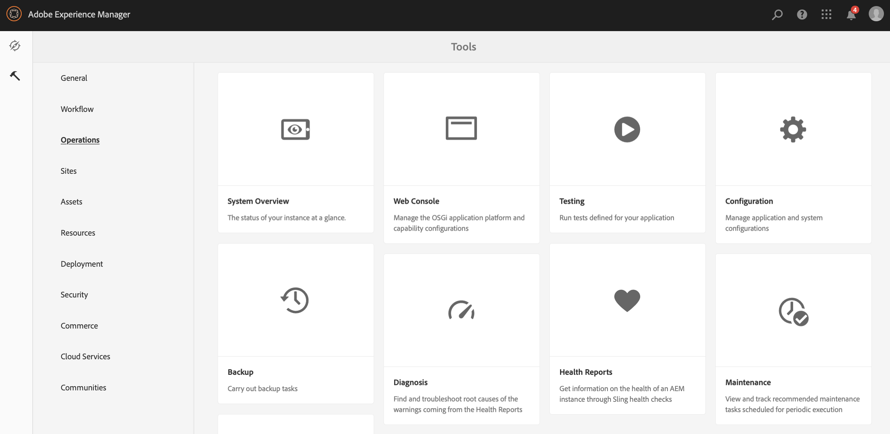
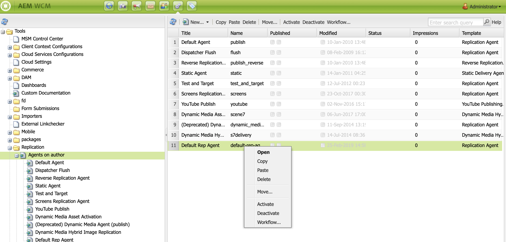
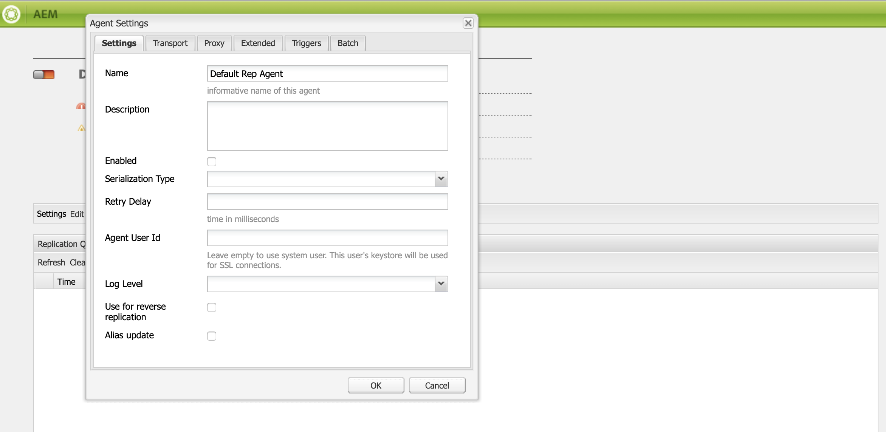

# 在AEM Screens中配置作者和发布 {#configuring-author-and-publish-in-aem-screens}

本页重点介绍以下主题：

* **配置作者实例和发布实例**
* **设置发布拓扑**
* **管理发布：将内容更新从作者交付到发布到设备**

## 前提条件 {#prerequisites}

在开始使用创作和发布服务器之前，您应该事先了解：

* **AEM Topology**
* **创建和管理AEM Screens项目**
* **设备注册过程**

>[!NOTE]
>
>此AEM Screens功能仅在您安装了AEM 6.4 Screens功能包2时可用。 要获取此功能包，您必须联系 Adobe 支持人员并申请访问权限。您获得权限后，就可以从“包共享”下载它。

## 配置作者实例和发布实例 {#configuring-author-and-publish-instances}

>[!NOTE]
>
>要进一步了解作者和发布架构概述以及如何在AEM作者实例上创作内容，然后将其转发复制到多个发布实例，请参阅作 [者和发布架构概述](author-publish-architecture-overview.md)。

以下部分介绍如何在创作和发布拓扑上设置复制代理。

您可以设置一个简单的示例，在该示例中，您可以承载一个作者和两个发布实例：

* 作者—&gt; localhost:4502
* Publish 1(pub1)—&gt; localhost:4503
* 发布(pub2)—&gt; localhost:4504

## 在作者上设置复制代理 {#setting-replication-agents}

要创建复制代理，您必须学习如何创建标准复制代理。

Screens需要3个复制代理：

1. **默认复制代&#x200B;***理(指定为&#x200B;***Standard Replication Agent**)
1. **Screens复制代理**
1. **反向复制代理**

### 第1步：创建默认复制代理 {#step-creating-a-default-replication-agent}

请按照以下步骤创建默认复制代理：

1. 导航到AEM实例—&gt;锤子图标—&gt; **Operations** —&gt; **Configuration**。

   

1. 从左侧导 **航树中** ，选择复制。

   

1. 从“复 **制”文件夹中选择作者代理** ，然后单击“新建 ******** ”以创建新的标准复制代理。

   

1. 输入标 **题** 和名 **称** ，以创建复制代理，然后单击 **创建**。

   

1. 右键单击复制代理，然后单击 **打开** ，以编辑设置。

   

1. 单击 **编辑** ，打开“代理 **设置** ”对话框以输入详细信息。

   

1. 导航到“传 **输** ”选项卡，然后输入 **URI**、 **User** and **** PasswordPresight。

   

   >[!NOTE]
   >
   >您还可以复制和重命名现有的默认复制代理。

#### 创建标准复制代理 {#creating-standard-replication-agents}

1. 为pub1创建标准复制代理（现成默认代理应已配置）(例如， *https://&lt;hostname&gt;:4503/bin/receive?sling:authRequestLogin=1*)
1. 创建适用于pub2的标准复制代理。 您可以复制pub1的rep代理，并通过更改传输配置中的端口来更新要用于pub2的传输。 (例如， *https://&lt;hostname&gt;:4504/bin/receive?sling:authRequestLogin=1*)

#### 创建Screens复制代理 {#creating-screens-replication-agents}

1. 为pub1创建AEM Screens复制代理。 现成，有一个名为Screens Replication Agent的代理，它指向端口4503。 需要启用此功能。
1. 为pub2创建AEM Screens复制代理。 复制pub1的Screens复制代理，将pub2的端口更改为4504。

#### 创建屏幕反向复制代理 {#creating-screens-reverse-replication-agents}

1. 为pub1创建标准的反向复制代理。
1. 为pub2创建标准的反向复制代理。 您可以复制pub1的反向代表代理，并通过更改传输配置中的端口来更新要用于pub2的传输。

## 设置发布拓扑 {#setting-up-publish-topology}

### 第1步：配置基于Apache Sling Oak的发现 {#step-configure-apache-sling-oak-based-discovery}

为拓扑中的所有Publish实例设置Apache Sling Oak-Based Discovery

对于每个发布实例：

1. 导航至 `https://<host>:<port>/system/console/configMgr`
1. 选择 **Apache Sling Oak-Based Discovery Service** Configuration。
1. 更新拓扑连接器URL:添加所有参与发布实例的URL, `https://localhost:4502/libs/sling/topology/connector`
1. 拓扑连接器白名单：适应包含参与发布实例的IP或子网
1. 启 **用自动停止本地循环**

每个发布实例的配置应相同，自动停止本地循环可防止无限循环。

#### 第2步：验证发布拓扑 {#step-verify-publish-topology}

对于任何Publish实例，导航到 `https://<host>:<port>/system/console/topology`。 您应当看到拓扑中表示的每个发布实例。

#### 第3步：设置ActiveMQ Artemis群集 {#step-setup-activemq-artemis-cluster}

此步骤允许您为ActiveMQ Artemis群集创建加密密码。
拓扑中所有发布实例的群集用户和口令必须相同。 需要加密ActiveMQ Artemis配置的口令。 由于每个实例都有其自己的加密密钥，因此必须使用加密支持来创建加密的密码字符串。 然后，加密密码将用于ActiveMQ的OSGi配置。

在每个Publish实例上：

1. 在OSGi控制台中，导航到 **MAIN** —&gt; **Crypto Support** (*https://&lt;host&gt;:&lt;port&gt;/system/console/crypto*)。
1. 在纯文本中键入所需的纯文本口令（对于所有实例都相同） ****
1. 单击“ **保护**”。
1. 将值“受保护 **文本** ”复制到记事本或文本编辑器。 此值将用于ActiveMQ的OSGi配置。

由于每个发布实例默认具有唯一的加密密钥，因此您需要在每个发布实例上执行此步骤，并保存下一个配置的唯一密钥。

*例如*,

Pub1 - `{1ec346330f1c26b5c48255084c3b7272a5e85260322edd59119828d1fa0a610e}`Pub2 - `{8d3d113c834cc4f52c2daee0da3cb0a21122a31f0138bfe4b70c9ead79415f41}`

#### 第4步：激活ActiveMQ Artemis群集 {#step-activate-activemq-artemis-cluster}

在每个发布实例上：

1. 导航到OSGi Config *manager https://&lt;host&gt;:&lt;port&gt;/system/console/configMgr*
1. 选择 **Apache ActiveMQ Artemis JMS提供者配置** 。
1. 更新以下内容：

* ***群集密码***:（在每个实例中使用上一步中的加密值）
* ***主题***:{name:'commands'，地址：'com.adobe.cq.screens.commands', maxConsumers:50}

#### 验证ActiveMQ Artemis群集 {#verify-activemq-artemis-cluster}

对每个Publish实例执行以下步骤：

1. 导航到OSGi控制台-&gt;主&gt; ActiveMQ Artemis `[https://localhost:4505/system/console/mq`。
1. 验证并检查以在“群集信息”&gt;“拓扑”&gt;“节点=2, members=2”下查看其他实例的端口。
1. 发送测试消息（屏幕顶部的“Broker Information”下）
1. 在字段中输入以下更改：

   1. **目标**:/com.adobe.cq.screens/devTestTopic
   1. **文本**:《你好世界》
   1. 查看每个实例的error.log，以查看消息是在群集中发送和接收的

>[!NOTE]
>
>导航到OSGI控制台可能需要几秒钟时间才能在上一步中保存配置。 您还可以检查error.log以获取更多详细信息。

例如，成功配置ActiveMQ Artemis server时，将显示以下图像。

如果未从 */system/console/mq中看到以下配置*，请导航到 */system/console/mq* ，然后单击“ **Restart** （重新启动）”以重新启动代理。

#### 删除引用标题要求 {#remove-referrer-header-requirement}

按照每个Publish实例中的步骤操作：

1. 导航到 **OSGi控制台** &gt;配置 **管理器**
1. 选择 **Apache Sling引用过滤器**
1. 更新配置并选 **中允许空**

### 配置作者和发布实例 {#configuring-author-and-publish-instance}

设置发布主题后，您需要配置作者实例和发布实例，以查看实施的实际结果：

>[!NOTE]
>
>**前提条件**
>
>要开始使用此示例，请创建一个新的AEM Screens项目，然后在项目中创建位置、显示屏和渠道。 将内容添加到渠道，然后将渠道分配给显示屏。

#### 第1步：启动AEM Screens播放器（设备） {#step-starting-an-aem-screens-player-device}

1. 启动一个单独的浏览器窗口。
1. Go to Screens player using the *web browser*, that is,`https://localhost:4502/content/mobileapps/cq-screens-player/firmware.html` or launch the AEM Screens app. 在打开设备时，您会注意到设备的状态为未注册。

>[!NOTE]
>
>您可以使用您下载的AEM Screens应用程序或使用Web浏览器打开AEM Screens播放器。

#### 第2步：在作者上注册设备 {#step-registering-a-device-on-author}

1. 转到或选 `https://localhost:4502/screens.html/content/screens/we-retail` 择您的项目，然后导航到设备&gt;设备管理器。
1. 选择“ **注册设备**”。
1. 单击“ **设备注册** ”以查看设备。
1. Select the device you want to register and click **Register Device**.
1. 验证注册代码，然后单击“ **验证**”。
1. 输入设备标题，然后单击“注 **册”**。

#### 第3步：将设备指定到显示 {#step-assigning-the-device-to-display}

1. 在上 **一步的对话框中** ，单击“指定显示”(Assign Display)。
1. 从位置文件夹中选择渠道的显 **示路径** 。
1. Click **Assign**.
1. Click **Finish** to complete the process, and now the device is assigned.

检查您的播放器，您就会看到您在渠道中添加的内容。

#### 第4步：将设备配置发布到发布实例 {#step-publishing-device-configuration-to-publish-instances}

**验证设备**

之前，请执行以下步骤，确保验证设备ID。 要进行验证，请在CRXDELite中搜索设备ID，路径为 */home/users/screens/{project}/devices*。

按照以下步骤复制设备用户：

1. 导航到用户管理页面(例如： `https://localhost:4502/useradmin`
1. 搜索 **screens-devices-master组**
1. 右键单击用户组，然后单击激 **活**

>[!CAUTION]
>
>请勿激活author-publish-screens-service，因为它是系统用户，由作者作业使用。

您还可以从设备管理控制台激活设备。 按照以下步骤操作：

1. 导航到您的Screens项目—&gt;设 **备**。
1. 单击操作栏中的**设备管理器**。
1. 选择设备，然后单 **击操作栏** ，如下图所示。

>[!NOTE]
>
>或者，在激活设备后，您还可以通过单击操作栏中的**编辑服务器URL **来编辑或更新服务器URL，如下图所示，您所做的更改将传播到AEM Screens播放器。

### 发布检查列表 {#publishing-check-list}

以下几点汇总了“发布检查”列表：

* *Screens设备用户* -它存储为AEM用户，并从“工具” **** &gt;“安全性” **&gt;“用** 户”激活 ****。 用户将在前面加上带有长序列号字符串的“screens”。

* *项目* - AEM Screens项目。
* *位置* -设备所连接的位置。
* *渠道* -在位置显示的一个或多个渠道
* *计划* -如果使用计划，请确保已发布此计划
* *位置、计划和渠道文件夹* -如果相应的资源位于文件夹中。

验证核对清单后，您需要验证渠道中的以下更改／行为：

* 发布设备配置后，将打开Screens播放器配置并将其指向发布实例。 此外，您还可以从设备管理控制台激活设备。
* 更新“作者”上的某些渠道内容并发布它，并验证已更新的渠道现在显示在AEM Screens播放器上。
* 将Screens播放器连接到其他发布实例并验证上述行为。

#### 第5步：在“管理面板”中指向设备以发布实例 {#step-pointing-the-device-to-publish-instance-in-the-admin-panel}

1. 从Screens播放器中查看管理员UI，长按左上角以打开“管理员”菜单，在启用了触控功能的AEM Screens播放器中，或使用鼠标打开该菜单。
1. 单击侧 **面板中** 的“配置”选项。
1. 将作者实例更改为在 **Server中发布实例**。

查看AEM Screens播放器中的更改。

或者，您也可以通过设备管理控制台使用以下步骤更新／编辑服务器URL:

1. 导航到您的AEM Screens项目，然后选择设备 **文件夹** 。
1. Click **Device Manager** from the action bar.
1. 选择设备，然后单击操作栏中的**编辑服务器URL **，如下图所示，您所做的更改将传播到AEM Screens播放器。

