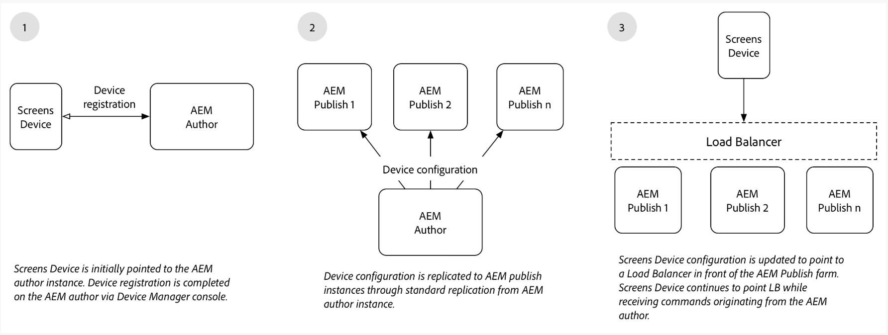

# 创作和发布架构概述 {#author-and-publish-architectural-overview}

本页重点介绍以下主题：

* **发布服务器简介**
* **架构概述**
* **注册流程**

## 前提条件 {#prerequisites}

在开始使用创作和发布服务器之前，您应该事先了解以下知识：

* **AEM拓扑**
* **创建和管理AEM Screens项目**
* **设备注册流程**

>[!NOTE]
>
>此AEM Screens功能仅在安装了AEM 6.4 Screens Feature Pack 2时才可用。 要访问此功能包，您必须联系Adobe支持部门并请求获取访问权限。 一旦您拥有权限，就可以从包共享下载它。

## 简介 {#introduction}

AEM Screens架构类似于传统的AEM Sites架构。 内容在AEM创作实例上创作，然后转发到多个发布实例。 AEM Screens设备现在可以通过负载平衡器连接到AEM发布场。 可以添加多个AEM发布实例以继续扩展发布场。

*例如*，AEM Screens内容作者在创作系统上为配置为与发布场交互的特定设备发出命令，或者AEM Screens内容作者获取有关配置为与发布场交互的设备的信息。

下图说明了创作和发布环境。

## 体系结构设计 {#architectural-design}

有五个体系结构组件，可帮助实现此解决方案：

* ***复制内容*** 从创作到发布以供设备显示

* ***反向*** 将二进制内容从发布（从设备接收）复制到创作
* ***正在发送*** 通过特定REST API从作者到发布的命令
* ***消息传送*** 在发布实例之间同步设备信息更新和命令
* ***轮询*** 发布实例的作者通过特定的REST API获取设备信息

### 内容和配置的复制（转发）  {#replication-forward-of-content-and-configurations}

标准复制代理用于复制screens通道内容、位置配置和设备配置。 这允许作者更新渠道的内容，并在发布渠道更新之前选择性地完成某种审批工作流。 需要为发布场中的每个发布实例创建复制代理。

下图说明了复制过程：

>[!NOTE]
>
>需要为发布场中的每个发布实例创建复制代理。

### Screens复制代理和命令  {#screens-replication-agents-and-commands}

可创建特定于Custom Screens的复制代理，以将命令从Author实例发送到AEM Screens设备。 AEM Publish实例充当将这些命令转发到设备的中介。

这允许作者继续管理设备，例如，发送设备更新，并从创作环境拍摄屏幕快照。 AEM Screens复制代理具有自定义传输配置，如标准复制代理。

### 发布实例之间的消息传递  {#messaging-between-publish-instances}

在许多情况下，命令只应发送到设备一次。 但在负载平衡的发布架构中，未知设备连接到哪个发布实例。

因此，创作实例会将消息发送到所有发布实例。 但是，只应将一条消息中继到设备。 为确保消息传递正确，发布实例之间必须进行通信。 这是通过使用以下方式实现的 *Apache ActiveMQ Artemis*. 使用基于Oak的Sling发现服务将每个发布实例置于松散耦合的拓扑中，并配置ActiveMQ，以便每个发布实例可以通信并创建单个消息队列。 Screens设备通过负载平衡器轮询发布场，并从队列顶部选取命令。

### 反向复制 {#reverse-replication}

在许多情况下，执行命令后，Screens设备中的某种响应应转发到Author实例。 要实现此AEM ***反向复制*** 已使用。

* 为每个发布实例创建一个反向复制代理，类似于标准复制代理和screens复制代理。
* 工作流启动器配置会侦听在发布实例上修改的节点，然后触发工作流以将设备的响应放入发布实例的发件箱中。
* 此上下文中的反向复制仅用于设备提供的二进制数据（例如，日志文件和屏幕截图）。 通过轮询检索非二进制数据。
* 从AEM创作实例轮询的反向复制会检索响应并将其保存到创作实例。

### 轮询发布实例  {#polling-of-publish-instances}

创作实例需要能够轮询设备以获取心跳，并了解已连接设备的运行状况。

设备ping负载平衡器并路由到发布实例。 然后，发布实例通过提供的发布API公开设备的状态。 **api/screens-dcc/devices/static** 适用于所有活动设备和 **api/screens-dcc/devices/&lt;device_id>/status.json** 用于单个设备。

创作实例可轮询所有发布实例，并将设备状态响应合并为单个状态。 轮询作者的计划作业为 `com.adobe.cq.screens.impl.jobs.DistributedDevicesStatiUpdateJob` 并且可以基于cron表达式进行配置。

## 注册 {#registration}

注册仍源自AEM创作实例。 AEM Screens Device指向创作实例并完成注册。

在创作环境中注册设备后，设备配置和渠道/计划分配将复制到AEM发布实例。 AEM Screens设备配置随后将更新，以指向AEM发布场前的负载平衡器。 此操作旨在一次性设置，一旦Screens设备成功连接到发布环境，它就可以继续接收来自创作环境的命令，并且无需将Screens设备直接连接到创作环境。

### 后续步骤 {#the-next-steps}

了解AEM Screens中创作和发布设置的架构设计后，请参阅 [为AEM Screens配置“创作”和“发布”](author-and-publish.md) 了解更多详细信息。
