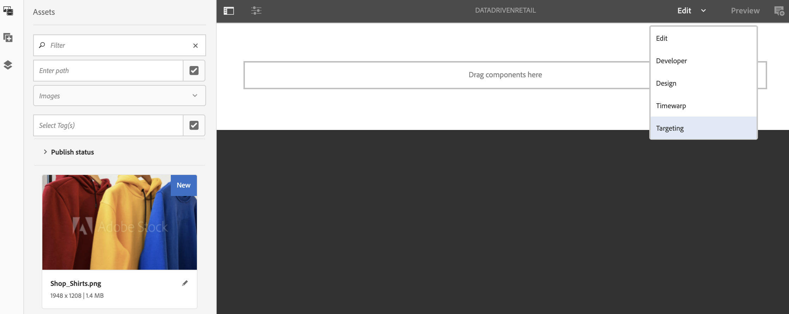

# 使用Data Triggers创作 {#authoring-with-data-triggers}

本节重点介绍如何在渠道中启用定位。

>[!IMPORTANT]
>
>在AEM Screens渠道中支持数据触发器的最低版本是AEM 6.5.3 Feature Pack 3。

## 先决条件 {#prereqs}

在执行以下步骤以在渠道中启用定位之前，请了解 [在AEM Screens中配置的关键术语](configuring-context-hub.md) 了解AEM Screens中的ContextHub和定位时需要使用。

>[!IMPORTANT]
>
>建议您先了解并设置ContextHub配置，然后再在AEM Screens渠道中启用定位。

有关详细信息，请访问下面的链接：

1. **[设置数据存储](configuring-context-hub.md)**
1. **[设置受众分段](configuring-context-hub.md)**

完成上述步骤后，便可在渠道中启用定位。

## 使用Data Triggers创作概述 {#author-targeting}

>[!VIDEO](https://video.tv.adobe.com/v/31921)

## 在AEM Screens渠道中启用定位 {#enabling-targeting}

执行以下步骤以在渠道中启用定位。

1. 导航到某个AEM Screens渠道。 以下步骤演示了如何使用启用定位 **DataDrivenRetail** *（序列渠道）* 在AEM Screens渠道中创建。

1. 选择渠道 **DataDrivenRetail** 并选择 **属性** 从操作栏中。

   

1. 选择 **个性化** 选项卡，以便您可以设置ContextHub配置并选择ContextHub和区段路径。

   1. 选择 **ContextHub路径** 作为 **库** > **设置** > **云设置** > **默认** > **ContextHub配置** 并选择 **选择**.

   1. 选择 **区段路径** 作为 **会议** > **`We.Retail`** > **设置** > **wcm** > **区段** 并选择 **选择**.

   1. 选择&#x200B;**保存并关闭**。

   >[!NOTE]
   >
   >使用ContextHub和区段路径，您最初是在其中保存了Context Hub配置和区段。

   

1. 导航并选择 **DataDrivenRetail** 从 **DataDrivenAssets** > **渠道** 并选择 **编辑** 从操作栏中。 将资产拖放到渠道编辑器中。

   >[!NOTE]
   >
   >如果一切设置正确，您会看到 **定位** 选项，如下图所示。

   

1. 选择 **定位**.

1. 选择 **品牌** 和 **活动** 从下拉菜单中选择 **开始定位**.

### 了解详情：示例用例 {#learn-more-example-use-cases}

为AEM Screens项目配置ContextHub后，您可以按照不同的用例来了解数据触发的资源如何在不同的行业中发挥重要作用：

1. **[零售库存目标激活](retail-inventory-activation.md)**
1. **[行程中心温度激活](local-temperature-activation.md)**
1. **[Hospitality Reservation Activation](hospitality-reservation-activation.md)**
