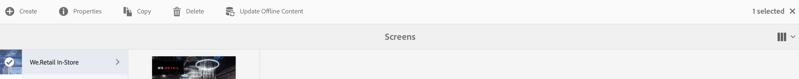

# 批量脱机更新 {#bulk-offline-update}

>[!IMPORTANT]
>此内容对AEM on-premise/AMS（AEM 6.5LTS和AEM 6.5）有效。 有关AEM as a Cloud Service Screens的内容，请参阅[AEM as a Cloud Service指南](https://experienceleague.adobe.com/en/docs/experience-manager-cloud-service/content/screens-as-cloud-service/overview/introduction)。

本节介绍有关批量脱机更新的以下主题：

* **概述**
* **使用批量脱机更新**

<!--
OBSOLETE VERSIONS
>[!CAUTION]
>
>This AEM Screens functionality is only available, if you have installed AEM 6.3 Feature Pack 3 or AEM 6.4 Screens Feature Pack 1.
>
>To get access to this Feature Pack, contact Adobe Support and request access. When you have permissions you can download it from Package Share.
-->

## 概述 {#overview}

批量脱机更新允许您批量更新所有渠道。 它可避免导航到特定渠道并更新内容的麻烦。 相反，您可以立即为一个特定项目更新渠道中的所有内容。

您也可以将此活动安排在网络流量较低的时间进行。

>[!NOTE]
>
>批量离线更新功能已得到优化，可仅更新那些已修改的渠道。

## 使用批量脱机更新 {#using-bulk-offline-update}

您可以从用户界面(UI)手动使用批量脱机更新，或计划从OSGi服务进行批量更新。

### 使用AEM Screens用户界面 {#using-aem-screens-user-interface}

请按照以下步骤对AEM Screens项目使用批量离线更新：

1. 导航到您的AEM Screens项目。
1. 单击项目，然后单击操作栏中的&#x200B;**更新离线内容**，以便您可以手动更新渠道内容。

   

### Adobe Experience Manager Web控制台配置 {#adobe-experience-manager-web-console-configuration}

请按照以下步骤对AEM Screens项目使用批量离线更新：

1. Adobe Experience Manager Web控制台配置。
1. 搜索批量脱机更新服务。

   

1. 添加以下属性：

   **项目路径** — 指定AEM Screens项目的路径。 路径通常为`/content/screens/<Name of your project>`。

   *例如*，`/content/screens/we-retail`。 您可以通过选择AEM Screens下的任何项目（不单击图标），在URL中找到此路径。

   >[!NOTE]
   >
   >指定相对于渠道的项目路径。

   **计划频率** — 指定此服务应更新脱机内容的时间，例如，下午5:00或17:00。

1. 单击&#x200B;**保存**&#x200B;以保存您的设置。 您的内容将在指定时间更新。

