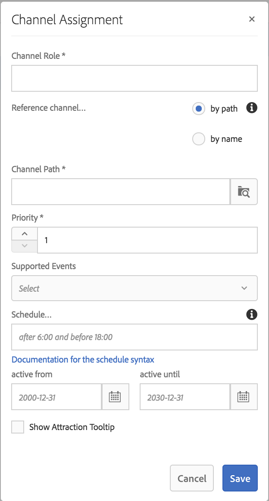

# 渠道分配 {#channel-assignment}

本节涵盖以下主题：

* **分配渠道**
* **了解“渠道分配”对话框的属性**
* **分时段功能**

定义显示屏后，您需要为显示屏分配一个渠道。

本页介绍了如何为显示屏分配渠道。

**先决条件**：

* [配置和部署 Screens](configuring-screens-introduction.md)
* [创建和管理Screens项目](creating-a-screens-project.md)
* [创建和管理渠道](managing-channels.md)
* [创建和管理位置](managing-locations.md)
* [创建和管理显示屏](managing-displays.md)

## 分配渠道 {#assign-a-channel}

请按照以下步骤为显示屏分配渠道：

1. 导航到所需的显示屏，例如 **DemoProject*** *—&gt; **Locations** —&gt; **SanJose** —&gt; **** StoreDisplayDesplay。

   

1. 点按／单击操作栏中的**分配渠道**

   或者，

   Tap/click **Dashboard **and** **click** +Assign Channel **from the** ASSIGNED CHANNNELS **panel to open the **Channel Assignment** dialog box.

   

   您可以从**渠道分配**对话框配置以下属性：

   **渠道角色**：

   渠道角色定义了显示屏的上下文。该角色由各种操作定位，并且与完成该角色的实际渠道无关。

   **引用渠道**：

   引用渠道允许您按渠道名称或渠道路径提供对所需渠道的引用。

   * **按路径**：您可以使用渠道的绝对路径提供显式引用。
   * **按名称**:输入将根据上下文解析为实际渠道的渠道名称。 此功能允许您创建渠道的本地版本，以便动态解析特定于位置的内容。For example, a channel with name *deals of the day*, where the actual content would be different in two cities, but you still have the sane channel role on all the displays.
   **优先级：**

   优先级用于在多个分配匹配播放条件时对分配进行排序。具有最高值的分配将始终优先于具有较低值的分配。例如，如果有两个渠道 A 和 B。A 的优先级为 1，B 的优先级为 2，则会显示渠道 B，因为它的优先级高于 A。

   如上所述，在**渠道分配**对话框中，渠道的优先级设置为数字（最小为1）。 此外，分配的渠道会按优先级以降序排列。

   **支持的事件**：

   * **初始加载**：播放器启动时加载渠道。可以将该事件与计划一起分配到多个渠道
   * **空闲屏幕**：屏幕空闲时加载。可以将该事件与计划一起分配到多个渠道
   * **计时器**：提供计划时需要对其进行设置
   * **用户交互**：如果在空闲渠道中屏幕（触控）上存在用户交互，播放器将切换到指定的渠道，并将在触摸屏幕时加载该渠道
   **计划**：

   通过计划，您可以在应当显示渠道时提供文本形式的说明。It also let's you define a start date (**active from**) and an end date (**active until**) for the channel to be shown. 计划表达式的语法基于later.js的文本和cron语法：

   * [https://bunkat.github.io/later/parsers.html#text](https://bunkat.github.io/later/parsers.html#text)
   * [https://bunkat.github.io/later/parsers.html#cron](https://bunkat.github.io/later/parsers.html#cron)
   **显示有趣内容工具提示**：

   “显示有趣内容工具提示”定义了在渠道运行时是否必须显示有趣内容工具提示（“触摸任何位置可开始&#x200B;**”）。

1. 单击&#x200B;**保存**&#x200B;可将创建的渠道分配给显示屏。

### 分时段功能 {#dayparting}

Schedules when when combined with **Dayparting**, allows you to set a global schedule with multiple channels running at specific times of the day, and re-use that setup for all your displays at once.

分时段功能是指将一天分成多个时段并指定在所需时间播放的内容。AEM Screens 允许您按照要求在一天、一周或一个月内分时段计划渠道。

以下示例说明了在三种不同情景下如何对渠道使用分时段功能：

#### 在一天内分多个时段播放内容 {#playing-content-on-a-single-day-divided-into-multiple-time-slots}

此示例显示了一家餐厅如何使用分时段功能展示其早餐、午餐和晚餐菜单。

在此，我们将每天分为三个不同的时段，以便渠道内容按一天的指定时间播放：

| **渠道** | **角色** | **优先级** | **计划** |
|---|---|---|---|
| Menu_A | 早餐 |  | 6:00 至 11:00 期间 |
| Menu_B | 午餐 |  | 11:00 至 15:00 期间 |
| Menu_C | 晚餐 |  | 15:00 至 20:00 期间 |

#### 在一周中的特定一天播放内容 {#playing-content-on-a-particular-day-of-the-week}

此示例显示了如何在一家俱乐部实现分时段功能，该俱乐部在每周末的晚上 8 点到晚上 10 点会举办现场活动，晚上 10 点到凌晨 1 点会推出特价晚餐。

<table>
 <tbody>
  <tr>
   <td><strong>渠道</strong></td>
   <td><strong>角色</strong></td>
   <td><strong>优先级</strong></td>
   <td><strong>计划</strong></td>
  </tr>
  <tr>
   <td>LiveConcert</td>
   <td>周末</td>
   <td> </td>
   <td>2017年10月21日- 2017年10月22   日20点前</td>
  </tr>
  <tr>
   <td>特价晚餐</td>
   <td>周末</td>
   <td> </td>
   <td>2017年10月21日- 2017年10月22   日1点前22分</td>
  </tr>
 </tbody>
</table>

#### 在特定月份播放内容 {#playing-content-for-a-particular-month-months}

此示例显示了一家商店如何使用分时段功能在 6 月到 8 月展示他们的夏季收藏品，在 9 月到 10 月底展示秋季收藏品。

在此示例中，您将按照月份划分时段，以便渠道内容每年按照指定的月份来播放。

| **渠道** | **角色** | **优先级** | **计划** |
|---|---|---|---|
| SummerCollection | 夏日 |  | 2017年6月1日至2017年8月31日 |
| FallCollection | 秋 |  | 2017年9月1日至2017年10月30日 |

>[!NOTE]
>
>此外，您可以为每个渠道定义&#x200B;***优先级**。*&#x200B;例如，如果将两个渠道设置为同一天同一时间或同一个月播放，则将先播放具有较高优先级的渠道。优先级的最小值可以设置为 0。

#### 播放具有相同优先级的渠道内容 {#playing-content-for-channels-with-same-priority}

此示例显示了一家商店如何使用分时段功能在 12 月份按照相同的计划展示冬季收藏品。但是，由于在最后一周渠道 B 的优先级设置为 2，因此，渠道 B 会播放其内容，而渠道 A 则不会播放内容。

| **渠道** | **角色** | **优先级** | **计划** |
|---|---|---|---|
| A | 温特 | 1 | 2017年12月1日至2017年12月31日 |
| B | 圣诞节 | 2 | 2017年12月24日至2017年12月31日 |

