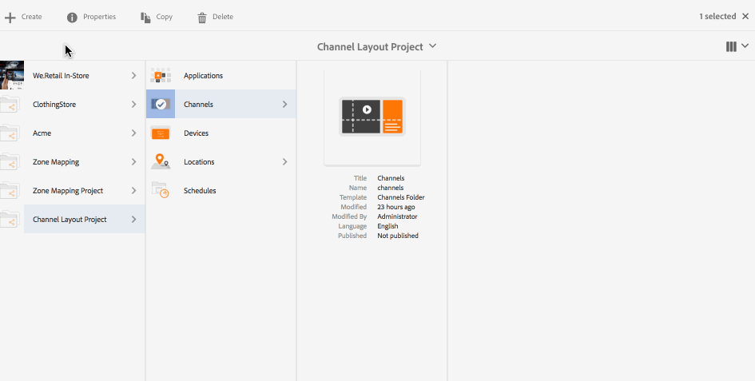

# 渠道布局编辑器 {#channel-layout-editor}

***“渠道布局编辑器”***&#x200B;允许您创建多区域内容并使用各种资产（例如视频、图像和文本），这些资产可通过上下文方式组合到单个屏幕中。您可以拖入图像、视频和文本，并将它们全都混合在一起，创建直观的互动式数字体验。

根据项目要求，有时您需要在渠道中使用多个区域并将其作为一个完整的单位进行编辑。例如，具有相关社交媒体源的产品序列在单个渠道的三个单独区域中运行。

## 概述 {#overview}

创建渠道时，您可以使用不同的模板来创建渠道中的区域。您可以根据项目要求添加图像、视频或嵌入式渠道以利用内容。

### 用例描述 {#use-case-description}

以下用例介绍了如何在渠道中创建多个区域。

1. ***创建 Screens 项目***

   1. 选择 Adobe Experience Manager 链接（左上方），然后选择&#x200B;**屏幕**。Alternatively, you can go directly to: `http://localhost:4502/screens.html/content/screens`.
   1. Click **Create** to create a new Screens project.
   1. Select **Screens** from the **Create Screens Project** wizard and click **Next**.
   1. Enter the title as **Channel Layout Project** and click **Create**.
   

1. ***创建渠道***

   1. Navigate to **Channel Layout Project**.
   1. 单击操作栏中的&#x200B;**创建**。此时将打开一个向导。
   1. Choose the **1x2 Split Screen Channel** and click **Next**.
   1. Enter the **Title** as **Split horizontal** and click **Create**.
   

1. ***向渠道添加内容***

   1. Navigate to the **Channel Layout Project** you created and select the channel (**Split Channel**).
   1. Click **Edit** from the action bar and the editor for the **Split Channel** opens.
   1. 单击操作栏左侧用于切换侧面板的图标以打开资产和组件。将您希望添加的组件拖放到渠道中。
   

   >[!NOTE]
   >
   >例如，在编辑器中已将以下两个图像添加到渠道中。

   

1. ***创建位置***

   1. Navigate to the Locations folder where you want to create your display (**Channel Layout Project**--&gt; **Locations**).
   1. 单击操作栏中的&#x200B;**创建**。
   1. Select **Location** from the **Create** wizard and click **Next**.
   1. Enter **Title** for your location as **San Jose**.
   1. 单击&#x200B;**创建**。
   

1. ***创建新显示屏***

   1. Navigate to the location where you want to create your display (**Acme** --&gt; **Locations** --&gt; **San Jose**) and select **San Jose**.
   1. 单击操作栏中的&#x200B;**创建**。Select **Display** from the **Create** wizard and click **Next**.
   1. Enter **Title** for your display location (enter the title as **Split Display)**.
   1. Under the **Display** tab, choose the details of the Layout. Choose the **Resolution** as **Full HD**. Choose the **Number of Devices Horizontally** as 1 and the **Number of Devices Vertically** as **1**.
   1. 单击&#x200B;**创建**。
   

1. ***分配渠道***

   1. Navigate to the display from **Channel Layout Project** --&gt; **Locations** --&gt; **San Jose** --&gt; **Split Display**.
   1. Select **Split Display** and tap/click **Assign Channel** from the action bar, Or,
   1. Click **Dashboard** and select **+Assign Channel** at the top right from **ASSIGNED CHANNELS &amp; SCHEDULES** panel. **“渠道分配** ”对话框打开。
   1. Enter the **Channel Role** as **Split**.
   1. Select **Reference Channel** by path. Select the channel folder path (**Channel Layout Project** --&gt; **Channels** --&gt; **Split horizontal**) in the Channel.
   1. Select the **Priority** for this channel as **1**.
   1. Choose the **Supported Events** as **Initial Load** and **Idle Screen**.
   1. 单击&#x200B;**保存**。
   

1. ***注册和分配设备***

   1. 启动一个单独的浏览器窗口。使用Web浏览器转到Screens播放器或启动AEM Screens应用程序。
   1. 在打开设备时，您会注意到设备的状态为未注册。From the AEM dashboard, navigate to **Channel Layout Project** --&gt; **Devices**.
   1. Click **Device Manager** from the action bar.
   1. Click **Device Registration** and you will see the pending devices. Select the device you want to register and click **Register Device**.
   1. 您将需要从 Web 浏览器或 AEM Screens 播放器中验证代码。Click **Validate** to navigate to **Device Registration** screen.
   1. Enter Title as **NewD** and click **Register** and the device will be registered.
   1. Click **Assign Display** to move on to the next step where you assign the device to a display.
   1. 单击“指定设备”，然后选择渠道()的显示路径(/content/screens/Test_Project/Locations/TestLocation/TestDisplay)。 Click **Assign**.
   1. Click **Finish** to complete the process, and now the device is assigned.
   

#### 在 AEM Screens 播放器中查看内容 {#viewing-content-in-aem-screens-player}

加载您的 AEM Screens 播放器或使用 Web 浏览器。您将注意到渠道内容会显示在 Screens 播放器中。内容会以 1x2 分屏渠道模板显示。

### 总结 {#inference}

通过在创建渠道时使用可用的模板，您可以在不同区域中利用和显示内容。以上示例显示了 2x2 模板的用例。

随附图像显示了使用不同模板可以实现的布局。
