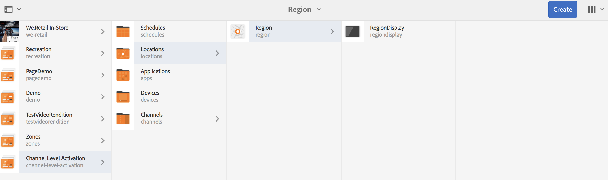

# 渠道级别激活 {#channel-level-activation-single-event-playback}

本页介绍渠道中使用的资产的渠道级别激活。

本节将介绍以下主题：

* 概述
* 激活窗口
* 将渠道级别激活用作单个事件播放
* 处理渠道中资产的循环
   * 分时段
   * WeekParting
   * 月份划分
   * 零件组合
* 将渠道级别激活用作单个事件播放

## 概述 {#overview}

***渠道级别*** 活动允许渠道在特定设置的计划后进行切换。单个事件渠道在设置计划后替换主渠道并播放特定时间，直到主渠道再次播放其内容为止。

以下示例重点介绍以下关键术语，从而提供了解决方案：

* 全局序列的&#x200B;***主序列通道***
* 在设置时间只运行一次的&#x200B;***单个事件通道***
* ***为主序列渠道内发生的单个播放事件设置计划和优先级***

## 激活窗口 {#using-channel-level-activation}

以下部分介绍如何在渠道中为AEM Screens项目创建单个事件播放。

### 前提条件 {#prerequisites}

在开始实施此功能之前，请确保您已准备好以下先决条件以开始实施渠道级别激活：

* 创建一个AEM Screens项目，在本例中为&#x200B;**渠道级别激活**

* 在&#x200B;**Channels**&#x200B;文件夹下创建作为&#x200B;**MainAdChannel**&#x200B;的渠道

* 在&#x200B;**Channels**&#x200B;文件夹下创建另一个渠道，作为&#x200B;**TargetedSinglePlay**

* 将相关资产添加到这两个渠道

下图显示了&#x200B;**渠道**&#x200B;文件夹中包含&#x200B;**MainAdChannel**&#x200B;和&#x200B;**TargetedSinglePlay**&#x200B;渠道的&#x200B;**渠道级别激活**&#x200B;项目。

>[!NOTE]
>
>有关如何创建项目以及如何创建序列渠道的其他信息，请参阅以下资源：
>
>* [创建和管理项目](creating-a-screens-project.md)

* [管理渠道](managing-channels.md)

### 实施 {#implementation}

在AEM Screens项目中实施渠道级别激活涉及三项主要任务：

1. **设置项目分类，包括渠道、位置和显示**
1. **将渠道分配到显示**
1. **设置计划和优先级**

请按照以下步骤实施该功能：

1. **创建位置**

   导航到AEM Screens项目中的&#x200B;**Locations**&#x200B;文件夹，并创建一个位置： **Region**。

   

   >[!NOTE]
   要了解如何创建位置，请参阅&#x200B;**[创建和管理位置](managing-locations.md)**。

1. **在“位置”下创建显示**

   1. 导航到&#x200B;**渠道级别激活** > **位置** > **区域**。
   1. 选择&#x200B;**区域**&#x200B;并单击操作栏中的&#x200B;**+创建**。
   1. 从向导中选择&#x200B;**Display**&#x200B;并创建标题为&#x200B;**RegionDisplay的显示。**

   

1. **将渠道分配给显示**

   对于&#x200B;**MainAdChannel:**

   1. 导航至&#x200B;**渠道级别激活** > **位置** > **区域** > **区域显示**，然后单击操作栏中的&#x200B;**分配渠道**。
   1. **“渠道** 分配”对话框打开。
   1. 按路径选择&#x200B;**引用渠道**...。
   1. 选择&#x200B;**渠道路径**&#x200B;作为&#x200B;**渠道级别激活** —> ***渠道*** —> ***MainAdChannel***。
   1. **渠道角色**&#x200B;填充为&#x200B;**mainadchannel**。
   1. 选择&#x200B;**优先级**&#x200B;作为&#x200B;**1**。
   1. 将&#x200B;**支持的事件**&#x200B;选择为&#x200B;**初始加载**&#x200B;和&#x200B;**空闲屏幕**。
   1. 单击&#x200B;**保存**。

   

   >[!NOTE]
   您还可以从显示功能板中分配渠道，方法是导航到&#x200B;**渠道级别激活** —> **位置** —> **区域** —> **区域显示**，然后单击操作栏中的&#x200B;**功能板**。 单击&#x200B;**已分配的渠道和计划**&#x200B;面板中的&#x200B;**+分配渠道**。

   同样，为display指定渠道&#x200B;**TargetedSinglePlay****:

   1. 导航到&#x200B;**渠道级别激活** —> **位置** —> **区域** —> **RegionDisplay** ，然后单击操作栏中的&#x200B;**分配渠道**。
   1. **“渠道** 分配”对话框打开。
   1. 按路径选择&#x200B;**引用渠道**...。
   1. 选择&#x200B;**渠道路径**&#x200B;作为&#x200B;**渠道级别激活*** —> ***渠道*** —> ***TargetedSinglePlay***。
   1. **渠道角色**&#x200B;填充为&#x200B;**targetedsingleplay**。
   1. 将&#x200B;**优先级**&#x200B;设置为&#x200B;**2**。
   1. 将&#x200B;**受支持事件**&#x200B;选择为&#x200B;**初始加载**、**空闲屏幕**&#x200B;和&#x200B;**计时器**, *如下图所示。
   1. 选择&#x200B;**活动日期（从**&#x200B;开始）为2018年11月27日11:59 pm，在&#x200B;**活动日期（从2018年11月28日12:05 am）为**&#x200B;活动日期。
   1. 单击&#x200B;**保存**。

   >[!CAUTION]
   必须将&#x200B;**TargetedSinglePlay**&#x200B;渠道的优先级设置为高于&#x200B;**MainAdSegment**&#x200B;渠道。

   

   >[!NOTE]
   要选择当天，您必须选择第二天，然后手动编辑到当天但是以后的日期。 这会限制用户选择过去的日期。 请参阅以下示例：

   

## 查看结果 {#viewing-the-results}

设置渠道和显示结束后，请启动AEM Screens播放器以查看内容。

播放器显示&#x200B;**MainAdChannel**&#x200B;的内容，并且正好在晚上11:59（如计划中所设）， **TargetedSinglePlay**&#x200B;渠道将显示其内容，直到凌晨12:05，然后&#x200B;**MainAdChannel**&#x200B;将恢复播放其内容。

>[!NOTE]
要了解AEM Screen Player，请参阅以下资源：
[AEM Screens Player下载](https://download.macromedia.com/screens/)
[使用AEM Screens Player](working-with-screens-player.md)

## 处理渠道中资产的循环 {#handling-recurrence-in-assets}

您可以根据需要安排渠道中的资产在每日、每周或每月定期发生。

假设您希望仅在星期五下午1:00至晚上10:00显示渠道的内容。 您可以使用&#x200B;**Activation**&#x200B;选项卡为资产设置所需的循环间隔。

### 将日期分开 {#day-parting}

1. 选择渠道，然后单击操作栏中的&#x200B;**功能板**&#x200B;以打开渠道功能板。

1. 在&#x200B;**渠道分配**&#x200B;对话框中输入开始日期/时间和结束/日期时间后，可以使用表达式或自然文本版本来指定循环计划。

   >[!NOTE]
   您可以跳过或包括&#x200B;**Active from**&#x200B;和&#x200B;**Active Until**&#x200B;字段，并根据您的要求将表达式添加到“计划”字段。

1. 在&#x200B;**Schedule**&#x200B;中输入表达式，此时资产将按特定的日期和时间间隔显示。

#### 将日期分开的示例表达式 {#example-one}

下表汇总了在将渠道分配给显示屏时可添加到计划的几个示例表达式。

| **表达式** | **解释** |
|---|---|
| 早8点之前 | 渠道中的资产每天早上8点之前播放 |
| 下午2:00后 | 渠道中的资产每天下午2:00后播放 |
| 12:15后和12:45前 | 渠道中的资产每天中午12:15后播放，持续30分钟 |
| 12点15分之前也是12点45分之后 | 渠道中的资产每天中午12:15之前播放，然后也会在中午12:45之后播放 |
| 周一、周二、周三或周三 | 从星期一到星期三，资产在渠道中播放 |
| 1月1日下午2点以后，也是1月2日，也是1月3日凌晨3点以前 | 渠道中的资产在1月1日下午2点后开始播放，在1月2日持续播放一整天，直到1月3日凌晨3点 |
| 1月1-2日下午2:00及1月2-3日凌晨3:00 | 渠道中的资产在1月1日下午2:00后启动播放器，继续播放到1月2日凌晨3:00，然后在1月2日下午2:00再次启动，并继续播放到1月3日凌晨3:00 |

>[!NOTE]
您还可以使用&#x200B;_军事时间_&#x200B;符号（即14:00），而不是&#x200B;*am/pm*&#x200B;符号（即下午2:00）。

### WeekParting {#week-parting}

1. 选择渠道，然后单击操作栏中的&#x200B;**功能板**&#x200B;以打开渠道功能板。

1. 在&#x200B;**渠道分配**&#x200B;对话框中输入开始日期/时间和结束/日期时间后，可以使用表达式或自然文本版本来指定循环计划。

   >[!NOTE]
   您可以跳过或包括&#x200B;**Active from**&#x200B;和&#x200B;**Active Until**&#x200B;字段，并根据您的要求将表达式添加到“计划”字段。

1. 在&#x200B;**Schedule**&#x200B;中输入表达式，此时资产将按特定的日期和时间间隔显示。

#### 用于将星期分开的示例表达式 {#example-two}

下表汇总了在将渠道分配给显示屏时可添加到计划的几个示例表达式。

| **表达式** | **解释** |
|---|---|
| 周一、周二、周三或周三 | 从星期一到星期三，资产在渠道中播放 |
| 早8点之前 | 渠道中的资产每天早上8点之前播放 |
| 下午2:00后 | 渠道中的资产每天下午2:00后播放 |
| 12:15后和12:45前 | 渠道中的资产每天中午12:15后播放，持续30分钟 |
| 12点15分之前也是12点45分之后 | 频道每天中午12:15之前播放，晚上12:45之后也播放 |

>[!NOTE]
您还可以使用&#x200B;_军事时间_&#x200B;符号（即14:00），而不是&#x200B;*am/pm*&#x200B;符号（即下午2:00）。

### 月份划分 {#month-parting}

1. 选择渠道，然后单击操作栏中的&#x200B;**功能板**&#x200B;以打开渠道功能板。

1. 在&#x200B;**渠道分配**&#x200B;对话框中输入开始日期/时间和结束/日期时间后，可以使用表达式或自然文本版本来指定循环计划。

   >[!NOTE]
   您可以跳过或包括&#x200B;**Active from**&#x200B;和&#x200B;**Active Until**&#x200B;字段，并根据您的要求将表达式添加到“计划”字段。

1. 在&#x200B;**Schedule**&#x200B;中输入表达式，此时资产将按特定的日期和时间间隔显示。

#### 月份划分的示例表达式 {#example-three}

下表汇总了在将渠道分配给显示屏时可添加到计划的几个示例表达式。

| **表达式** | **解释** |
|---|---|
| 2月、5月、8月、11月 | 资产在2月、5月、8月、11月的渠道中播放 |

>[!NOTE]
在定义一周中的日期和月份时，您既可以使用短手符号和全名符号，如周一/周一和一月/一月。

>[!NOTE]
您还可以使用&#x200B;_军事时间_&#x200B;符号（即14:00），而不是&#x200B;*am/pm*&#x200B;符号（即下午2:00）。

### 零件组合 {#combined-parting}

1. 选择渠道，然后单击操作栏中的&#x200B;**功能板**&#x200B;以打开渠道功能板。

1. 在&#x200B;**渠道分配**&#x200B;对话框中输入开始日期/时间和结束/日期时间后，可以使用表达式或自然文本版本来指定循环计划。

   >[!NOTE]
   您可以跳过或包括&#x200B;**Active from**&#x200B;和&#x200B;**Active Until**&#x200B;字段，并根据您的要求将表达式添加到“计划”字段。

1. 在&#x200B;**Schedule**&#x200B;中输入表达式，此时资产将按特定的日期和时间间隔显示。

#### 部分组合的示例表达式 {#example-four}

下表汇总了在将渠道分配给显示屏时可添加到计划的几个示例表达式。

| **表达式** | **解释** |
|---|---|
| 1月31日周一6点多和18点之前 | 从1月到3月底的周一和周三，资产会在渠道中播放，介于6点到6点之间 |
| 1月1日下午2点以后，也是1月2日，也是1月3日凌晨3点以前 | 渠道中的资产在1月1日下午2点后开始播放，在1月2日持续播放一整天，直到1月3日凌晨3点 |
| 1月1-2日下午2:00及1月2-3日凌晨3:00 | 渠道中的资产在1月1日下午2:00后启动播放器，继续播放到1月2日凌晨3:00，然后在1月2日下午2:00再次启动，并继续播放到1月3日凌晨3:00 |

>[!NOTE]
在定义一周中的日期和月份时，您既可以使用短手符号和全名符号，如周一/周一和一月/一月。  此外，您还可以使用&#x200B;_军事时间_&#x200B;符号（即14:00），而不是&#x200B;*am/pm*&#x200B;符号（即下午2:00）。
