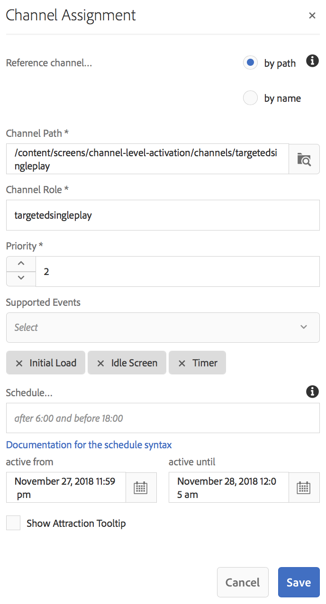

# 渠道级别激活 {#channel-level-activation-single-event-playback}

本页介绍渠道中使用的资产的渠道级别激活。

本节涵盖以下主题：

* 概述
* 激活窗口
* 将渠道级别激活用作单个事件播放
* 在渠道中处理Assets的重复项
   * DayParting
   * WeekParting
   * MonthParting
   * 部件的组合
* 将渠道级别激活用作单个事件播放

## 概述 {#overview}

***渠道级别激活***&#x200B;允许渠道在特定设置计划之后切换。 单个事件渠道在设置计划后替换主渠道，并在特定时间播放，直到主渠道再次播放其内容为止。

以下示例通过关注以下关键术语提供了解决方案：

* 全局序列的&#x200B;***主序列通道***
* 在指定时间只运行一次的&#x200B;***单个事件通道***
* 为主序列频道内发生的单次播放事件设置&#x200B;***计划和优先级***

## 激活窗口 {#using-channel-level-activation}

以下部分介绍如何在AEM Screens项目的渠道中创建单个事件播放。

### 先决条件 {#prerequisites}

在开始实施此功能之前，请确保您具备以下先决条件，可以开始实施渠道级别激活：

* 创建一个AEM Screens项目，在本例中为&#x200B;**渠道级别激活**。

* 在&#x200B;**Channels**&#x200B;文件夹下创建通道作为&#x200B;**MainAdChannel**。

* 在&#x200B;**渠道**&#x200B;文件夹下创建另一个渠道作为&#x200B;**TargetedSinglePlay**。

* 将相关资产添加到这两个渠道。

下图显示了&#x200B;**渠道**&#x200B;文件夹中具有&#x200B;**MainAdChannel**&#x200B;和&#x200B;**TargetedSinglePlay**&#x200B;渠道的&#x200B;**渠道级别激活**&#x200B;项目。

>[!NOTE]
>
>有关如何创建项目以及如何创建序列渠道的其他信息，请参阅以下资源：
>
>* [创建和管理项目](creating-a-screens-project.md)
>
>* [管理渠道](managing-channels.md)
>

### 实施 {#implementation}

在AEM Screens项目中实施渠道级别激活涉及三个主要任务：

1. **设置项目分类，包括渠道、位置和显示区**
1. **将渠道分配给显示区**
1. **设置计划和优先级**

请按照以下步骤实施该功能：

1. **创建位置**

   导航到AEM Screens项目中的&#x200B;**位置**&#x200B;文件夹，并创建一个位置作为&#x200B;**区域**。

   

   >[!NOTE]
   >
   >要了解如何创建位置，请参阅&#x200B;**[创建和管理位置](managing-locations.md)**。

1. **在位置**&#x200B;下创建显示区

   1. 导航到&#x200B;**渠道级激活** > **位置** > **区域**。
   1. 单击&#x200B;**区域**，然后单击操作栏中的&#x200B;**+创建**。
   1. 单击向导中的&#x200B;**显示**，并创建一个标题为&#x200B;**区域显示**&#x200B;的显示

   

1. **将渠道分配给显示区**

   对于&#x200B;**MainAdChannel：**

   1. 导航到&#x200B;**渠道级别激活** > **位置** > **区域** > **区域显示**，然后单击操作栏中的&#x200B;**分配渠道**。
   1. 在&#x200B;**渠道分配**&#x200B;对话框中，单击&#x200B;**按路径引用渠道**。
   1. 单击&#x200B;**渠道路径**，然后单击&#x200B;**渠道级别激活** > ***渠道*** > ***MainAdChannel***。
   1. **渠道角色**&#x200B;已填充为&#x200B;**mainadchannel**。
   1. 单击&#x200B;**优先级**&#x200B;并设置为&#x200B;**1**。
   1. 单击&#x200B;**支持的事件**，如&#x200B;**初始加载**&#x200B;和&#x200B;**空闲屏幕**。
   1. 单击&#x200B;**保存**。

   

   >[!NOTE]
   >
   >您还可以从显示功能板分配渠道。 导航到&#x200B;**渠道级别激活** > **位置** > **区域** > **区域显示**。 在操作栏上，选择&#x200B;**仪表板**。 在&#x200B;**分配的渠道和计划**&#x200B;面板中，单击&#x200B;**+分配渠道**。

   同样，为显示分配渠道&#x200B;**TargetedSinglePlay****：

   1. 导航到&#x200B;**渠道级别激活** > **位置** > **区域** > **区域显示**，然后单击操作栏中的&#x200B;**分配渠道**。
   1. 在&#x200B;**渠道分配**&#x200B;对话框中，单击&#x200B;**按路径引用渠道**。
   1. 单击&#x200B;**渠道路径**，然后单击&#x200B;**渠道级别激活** > ***渠道*** > ***TargetedSinglePlay***。
   1. **渠道角色**&#x200B;已填充为&#x200B;**targetedsingleplay**。
   1. 将&#x200B;**优先级**&#x200B;设置为&#x200B;**2**。
   1. 单击&#x200B;**支持的事件**，设置&#x200B;**初始加载**、**空闲屏幕**&#x200B;和&#x200B;**计时器**，如下图所示。
   1. 在&#x200B;**中，从**&#x200B;开始激活，设置为2018年11月27日晚上11:59；在&#x200B;**中，一直激活到**，设置为2018年11月28日凌晨12:05。
   1. 单击&#x200B;**保存**。

   >[!CAUTION]
   >
   >将&#x200B;**TargetedSinglePlay**&#x200B;频道的优先级设置得高于&#x200B;**MainAdSegment**&#x200B;频道。

   

   >[!NOTE]
   >
   >要选择同一天，请单击第二天，然后手动将日期编辑为同一天，但稍后再编辑。 这样做会限制用户选择过去的日期。 请参阅以下示例：

   

## 查看结果 {#viewing-the-results}

完成渠道设置并显示后，启动AEM Screens Player以查看内容。

播放器显示&#x200B;**MainAdChannel**&#x200B;的内容，并且恰好在晚上11:59（如计划中所设置），**TargetedSinglePlay**&#x200B;渠道显示其内容直到凌晨12:05。然后&#x200B;**MainAdChannel**&#x200B;重新恢复播放其内容。

>[!NOTE]
>
>要了解AEM屏幕播放器，请参阅以下资源：
>[AEM Screens播放器下载](https://download.macromedia.com/screens/)
>[使用AEM Screens Player](working-with-screens-player.md)

## 在渠道中处理Assets的重复项 {#handling-recurrence-in-assets}

您可以安排渠道中的资产按特定间隔重复出现，周期可以是每日、每周或每月一次，具体取决于您的要求。

假设您只想在星期五下午1:00到晚上10:00显示某个渠道的内容。 您可以使用&#x200B;**激活**&#x200B;选项卡为资源设置所需的循环间隔。

### 日划分 {#day-parting}

1. 单击渠道，然后单击操作栏中的&#x200B;**仪表板**。

1. 在&#x200B;**渠道分配**&#x200B;对话框中输入开始日期/时间和结束/日期时间后，可以使用表达式或自然文本版本指定循环计划。

   >[!NOTE]
   >
   >您可以根据需要跳过或包含&#x200B;**从**&#x200B;开始的活动和&#x200B;**到**&#x200B;的活动字段，并将表达式添加到“计划”字段。

1. 在&#x200B;**计划**&#x200B;中输入表达式，您的资产将以特定的日期和时间间隔显示。

#### Day划分的示例表达式 {#example-one}

下表总结了将渠道分配给显示内容时可以添加到计划的几个示例表达式。

| **表达式** | **解释** |
|---|---|
| 上午8点之前。 | 渠道中的资产在每天上午8:00之前播放 |
| 下午2点以后。 | 渠道中的资产在每日下午2:00之后播放 |
| 12:15 至 12:45 期间 | 渠道中的资产在每日下午12:15之后播放30分钟 |
| 12:15之前以及12:45之后 | 渠道中的资产在每天中午12:15之前播放，然后在中午12:45之后播放。 |
| 周一、周二、周三或周一周三 | 资产会在渠道中从星期一到星期三播放资产 |
| 1月第一日下午2点后，也在1月第二日，也在1月第三日凌晨3点前。 | 渠道中的资产在1月1日下午2点后开始播放，并在1月2日继续播放一整天，一直到1月3日凌晨3点 |
| 1月1-2日下午2:00之后以及1月2-3日凌晨3:00之前 | 渠道中的资产在1月1日下午2:00之后开始播放，继续播放直到1月2日凌晨3:00，然后在1月2日下午2:00重新开始播放，并继续播放直到1月3日凌晨3:00 |

>[!NOTE]
>
>您还可以使用&#x200B;_军用时间_&#x200B;表示法(14:00)，而不是&#x200B;*A.M./P.M.*（下午2:00）。

### WeekParting {#week-parting}

1. 单击渠道，然后单击操作栏中的&#x200B;**仪表板**。

1. 在&#x200B;**渠道分配**&#x200B;对话框中输入开始日期/时间和结束/日期时间后，可以使用表达式或自然文本版本指定循环计划。

   >[!NOTE]
   >
   >您可以根据需要跳过或包含&#x200B;**从**&#x200B;开始的活动和&#x200B;**到**&#x200B;的活动字段，并将表达式添加到“计划”字段。

1. 在&#x200B;**计划**&#x200B;中输入表达式，您的资产将以特定的日期和时间间隔显示。

#### WeekParting的示例表达式 {#example-two}

下表总结了将渠道分配给显示内容时可以添加到计划的几个示例表达式。

| **表达式** | **解释** |
|---|---|
| 周一、周二、周三或周一周三 | 资产会在渠道中从星期一到星期三播放资产 |
| 上午8点之前。 | 渠道中的资产在每天上午8:00之前播放 |
| 下午2点以后。 | 渠道中的资产在每日下午2:00之后播放 |
| 12:15 至 12:45 期间 | 渠道中的资产在每日下午12:15之后播放30分钟 |
| 12:15之前以及12:45之后 | 该频道在每天中午12:15之前播放，然后在中午12:45之后播放。 |

>[!NOTE]
>
>您还可以使用&#x200B;_军用时间_&#x200B;表示法(14:00)，而不是&#x200B;*A.M./P.M.*（下午2:00）。

### MonthParting {#month-parting}

1. 单击渠道，然后单击操作栏中的&#x200B;**仪表板**。

1. 在&#x200B;**渠道分配**&#x200B;对话框中输入开始日期/时间和结束/日期时间后，可以使用表达式或自然文本版本指定循环计划。

   >[!NOTE]
   >
   >您可以根据需要跳过或包含&#x200B;**从**&#x200B;开始的活动和&#x200B;**到**&#x200B;的活动字段，并将表达式添加到“计划”字段。

1. 在&#x200B;**计划**&#x200B;中输入表达式，您的资产将以特定的日期和时间间隔显示。

#### MonthParting的示例表达式 {#example-three}

下表总结了将渠道分配给显示内容时可以添加到计划的几个示例表达式。

| **表达式** | **解释** |
|---|---|
| /`February,May,August,November` | 该资产将于2月、5月、8月、11月在渠道中播放 |

>[!NOTE]
>
>在定义星期和月份时，可以同时使用短写符号和全名符号，例如，周一/星期一和一月/一月。

>[!NOTE]
>
>您还可以使用&#x200B;_军用时间_&#x200B;表示法(14:00)，而不是&#x200B;*A.M./P.M.*（下午2:00）。

### 部件的组合 {#combined-parting}

1. 单击渠道，然后单击操作栏中的&#x200B;**仪表板**。

1. 在&#x200B;**渠道分配**&#x200B;对话框中输入开始日期/时间和结束/日期时间后，可以使用表达式或自然文本版本指定循环计划。

   >[!NOTE]
   >
   >您可以根据需要跳过或包含&#x200B;**从**&#x200B;开始的活动和&#x200B;**到**&#x200B;的活动字段，并将表达式添加到“计划”字段。

1. 在&#x200B;**计划**&#x200B;中输入表达式，您的资产将以特定的日期和时间间隔显示。

#### 分块组合的示例表达式 {#example-four}

下表总结了将渠道分配给显示内容时可以添加到计划的几个示例表达式。

| **表达式** | **解释** |
|---|---|
| 周一6:00至18:00之间，1月3日星期三 | 从1月到3月底，周一和周三上午6点到下午6点之间，该资产会在渠道中播放 |
| 1月第一日下午2点后，也在1月第二日，也在1月第三日凌晨3点前。 | 渠道中的资产在1月1日下午2点后开始播放，并在1月2日继续播放一整天，一直到1月3日凌晨3点 |
| 1月1-2日下午2:00之后以及1月2-3日凌晨3:00之前 | 渠道中的资产在1月1日下午2:00之后开始播放，继续播放直到1月2日凌晨3:00，然后在1月2日下午2:00重新开始播放，并继续播放直到1月3日凌晨3:00 |

>[!NOTE]
>
>在定义星期和月份时，您可以使用短写符号和全名符号，例如，周一/星期一和一月/一月。 此外，您还可以使用&#x200B;_军用时间_&#x200B;表示法(14:00)，而不是&#x200B;*A.M./P.M.*（下午2:00）。
