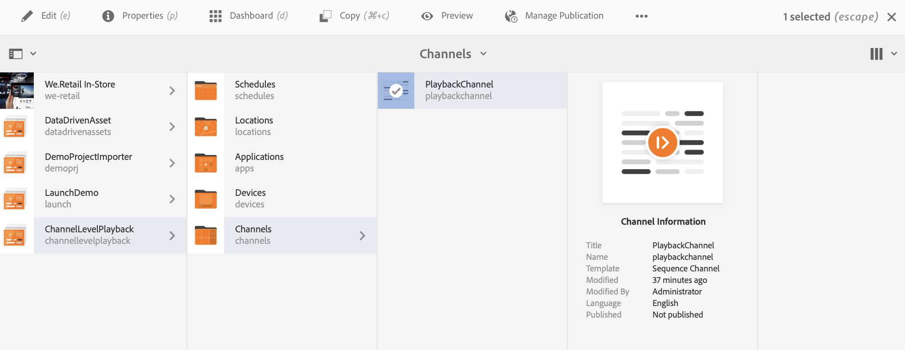

# 渠道级别的批量图像播放持续时间 {#channel-level-bulk-image-playback-duration}

## 概述 {#overview}

创建序列渠道并向其中添加图像时，默认情况下，所有图像都采用渠道级别配置中定义的播放持续时间。 任何单个图像仍可以覆盖默认值，并且播放持续时间也不同，这是通过编辑特定图像组件的播放持续时间来实现的。

### 先决条件 {#prerequisites}

在开始实施此功能之前，请确保已设置项目作为开始实施此功能的先决条件。 例如，

1. 创建一个AEM Screens项目示例， **ChannelLevelPlayback**.

1. 创建序列渠道为 **PlaybackChannel** 下 **渠道** 文件夹。

1. 将内容添加到 **PlaybackChannel**.

## 编辑渠道级别图像播放持续时间分配 {#editing-channel-level-image-playback-duration-assignment}

以下部分介绍如何在AEM Screens渠道中编辑内容的播放持续时间。

### 更新渠道中图像的播放持续时间 {#updating-the-playback-duration-for-images-in-a-channel}

请按照以下步骤了解如何更新渠道级别图像播放持续时间分配：

1. 导航到序列渠道 **PlaybackChannel**.

   

1. 选择 **编辑** 从操作栏中。

   

1. 在渠道编辑器中添加两个或更多图像，如下图所示。

   

1. 选择渠道中的所有图像并选择左上角的扳手图标（如下图所示），以便打开“渠道级别配置”对话框。

   

1. 此 **页面** 对话框打开。

   >[!NOTE]
   >默认情况下，渠道中的图像设置为8秒的播放持续时间。

   

   编辑 **持续时间** 从8000（毫秒）到3000（毫秒），即3秒。 选择右上角的复选标记 **页面** 对话框，以便保存更改。

   

### 查看结果 {#viewing-the-result}

更新渠道播放持续时间（在本例中是所有三个图像）后，请注意，现在播放的图像时长为3秒，而不是8秒（默认值）。

