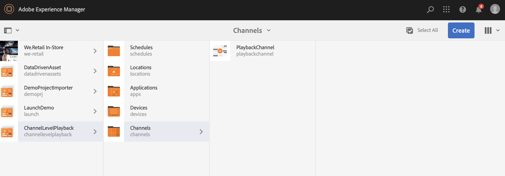
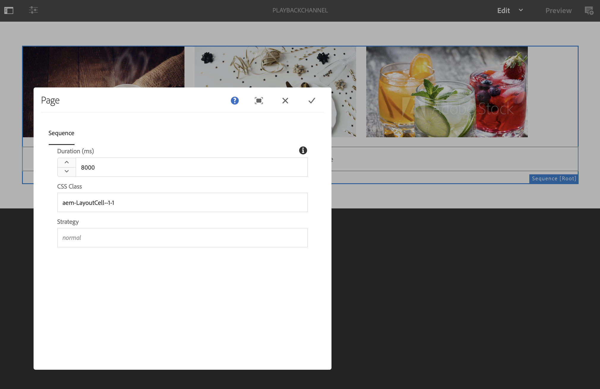

# 渠道级别的批量图像播放持续时间 {#channel-level-bulk-image-playback-duration}

## 概述 {#overview}

>[!IMPORTANT]
>此内容对AEM on-premise/AMS（AEM 6.5LTS和AEM 6.5）有效。 有关AEM as a Cloud Service Screens的内容，请参阅[AEM as a Cloud Service指南](https://experienceleague.adobe.com/en/docs/experience-manager-cloud-service/content/screens-as-cloud-service/overview/introduction)。

创建序列渠道并向其中添加图像时，默认情况下，所有图像都采用渠道级别配置中定义的播放持续时间。 任何单个图像仍可以覆盖默认值，并且具有不同的播放持续时间。 此功能通过编辑特定图像组件的播放持续时间来完成。

### 先决条件 {#prerequisites}

在开始实施此功能之前，请确保已设置项目作为开始实施此功能的先决条件。 例如，

1. 创建AEM Screens项目示例&#x200B;**ChannelLevelPlayback**。

1. 在&#x200B;**Channels**&#x200B;文件夹下创建序列频道作为&#x200B;**PlaybackChannel**。

1. 将内容添加到&#x200B;**PlaybackChannel**。

## 编辑渠道级别图像播放持续时间分配 {#editing-channel-level-image-playback-duration-assignment}

以下部分介绍如何在AEM Screens渠道中编辑内容的播放持续时间。

### 更新渠道中图像的播放持续时间 {#updating-the-playback-duration-for-images-in-a-channel}

请按照以下步骤了解如何更新渠道级别图像播放持续时间分配：

1. 导航到序列频道&#x200B;**PlaybackChannel**。

   

1. 单击操作栏中的&#x200B;**编辑**。

   

1. 在渠道编辑器中添加两个或更多图像，如下图所示。

   

1. 单击渠道中的所有图像，然后单击左上角的扳手图标（如下图所示），以打开“渠道级别配置”对话框。

   

1. 将打开&#x200B;**页面**&#x200B;对话框。

   >[!NOTE]
   >默认情况下，渠道中的图像设置为8秒的播放持续时间。

   

   将&#x200B;**持续时间**&#x200B;从8000（毫秒）编辑为3000（毫秒），即3秒。 单击&#x200B;**页面**&#x200B;对话框右上角的复选标记，以便保存更改。

   

### 查看结果 {#viewing-the-result}

更新渠道播放持续时间（在本例中是所有三个图像）后，请注意，现在播放图像的时间是3秒而不是8秒（默认值）。

