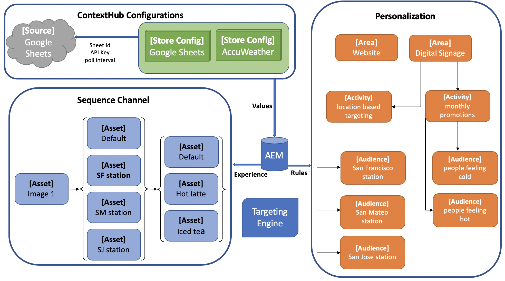

# 在AEM Screens中配置ContextHub {#configuring-contexthub-in-aem-screens}

本节重点介绍如何使用数据存储创建和管理数据驱动的资产更改。

## 主要条款 {#key-terms}

在我们了解有关在AEM Screens项目中创建和管理库存驱动型渠道的详细信息之前，您必须了解一些重要且与不同方案相关的关键术语。

**品牌** -指您的高级项目描述。

**区域** ：指您的AEM Screens项目名称，如数字广告标牌

**活动** 定义规则类别，如库存驱动、天气驱动、部门可用性驱动等。

**受众** 定义规则。

**细分** ：指按照给定规则播放的资产版本，例如，如果温度低于50华氏度，则屏幕将显示热咖啡的图像，否则显示冷饮。

下图直观地展示了ContextHub配置如何与活动、受众和渠道保持一致。



## 先决条件 {#preconditions}

在开始为AEM Screens项目配置Context Hub配置之前，必须设置Google工作表（用于演示目的）。

>[!CAUTION]
>
>在以下示例中，Google Sheets用作获取值的示例数据库系统，仅用于教育目的。 Adobe不支持将Google工作表用于生产环境。
>
>有关详细信息，请参 [阅Google文档中的Get API Key](https://developers.google.com/maps/documentation/javascript/get-api-key) 。

## 第1步：设置数据存储 {#step-setting-up-a-data-store}

可以将数据存储设置为本地I/O事件或本地数据库事件。

### 本地I/O事件 {#local-io-event}

按照以下步骤设置数据存储（如ASCII事件），该事件允许您使用ContextHub配置和AEM Screens渠道的区段路径。

### 本地数据库事件 {#local-db-event}

请按照以下步骤设置数据存储（如Excel表），以便使用ContextHub配置和AEM Screens渠道的区段路径。

1. **导航到ContextHub**

   导航到您的AEM实例，然后单击左侧提要栏中的工具图标。 单 **击Sites** —> **ContextHub**，如下图所示。

   

1. **创建新的ContextHub存储配置**

   1. 导航到 **全局** > **default** > **ContextHub配置**。

   1. 单击 **创建** > **配置容器** ，然后输入 **ContextHubDemo作为标题**。

   1. **** 导航到&#x200B;**ContextHubDemo**>**** ContentHub存储配置……打开配置 **向导**。

   1. 输入Google **Sheets** , **Store Sheets,** Store Name **, as************Google Sheets, Store Store Sheets Sheets, Store Name, as Contexthub-jsonp.**

   1. Click **Next**
   1. 输入您的特定json配置。 例如，您可以将以下json用于演示目的。
   1. 单击&#x200B;**保存**。

   ```
   {
     "service": {
       "host": "sheets.googleapis.com",
       "port": 80,
       "path": "/v4/spreadsheets/<your sheet it>/values/Sheet1",
       "jsonp": false,
       "secure": true,
       "params": {
         "key": "<your API key>"
       }
     },
     "pollInterval": 3000
   }
   ```

   >[!NOTE]
   >
   >在上述示例代码中， **pollInterval** 定义刷新值的频率（以毫秒为单位）。
   >
   >
   >将代码替换为您在设 *置Google工作表时获取的**&lt;Sheet ID>和*&lt;API Key>。

   >[!CAUTION]
   如果您在旧版文件夹（例如您自己的项目文件夹中）之外创建Google工作表存储配置，则定位将不会开箱即用。
   如果要在全局旧文件夹之外配置Google Sheets商店配置，则必须将 **Store Name** （商店名称）设置为 **segmentation** ，将 **Store Type** （商店类型）设 ****&#x200B;置为aem.segmentationProducer。 此外，您还必须跳过定义上述定义的json的过程。

1. **在活动中创建品牌**

   1. 从AEM实例导航到“个性化” **>“活****动”**

   1. 单击 **创建** >创 **建品牌**

   1. Select **Brand** from the **Create Page** wizard and click **Next**

   1. Enter the **Title** as **ContextHubDemo** and click **Create**. 您的品牌现在创建如下。
   


   >[!CAUTION]
   已知问题：
   要添加区域，请从URL中删除主页，如
   `https://localhost:4502/libs/cq/personalization/touch-ui/content/v2/activities.html/content/campaigns/contexthubdemo/master`

1. **在品牌中创建区域**

   按照以下步骤在品牌中创建区域：

   1. 单击“ **创建** ”，然后单 **击“创建区域”**

   1. Select **Area** from the **Create Page** wizard and click Next

   1. Enter the **Title** as **GoogleSheets** and click **Create**.
您的区域将在活动中创建。

## 第2步：设置受众细分 {#step-setting-up-audience-segmentation}

设置数据存储并定义品牌后，请按照以下步骤设置受众细分。

1. **在受众中创建区段**

   1. 从您的AEM实例导航到“个 **性化** ”>“受众 **”** >“ **We.Retail**”。

   1. 单击 **创建** > **创建Context Hub区段。** “新 **建ContextHub区段** ”对话框打开。

   1. Enter the **Title** as **SheetA1 1** and click **Create**. 同样，创建标题为 **SheetA2 2的另一个区段**。

1. **编辑区段**

   1. 选择区段 **工作表A1 1** (在步骤(5)中创建)，然后单击操 **作栏中的编** 辑。

   1. 拖放比 **较：属性——编辑器的值组件** 。
   1. 单击扳手图标以打开“ **将属性与值比较** ”对话框。
   1. 从 **属性名称的下拉菜单中选择** googlesheets/value/1/0 ****。

   1. 从下拉 **菜单中选** 择Operator **as** Equal。

   1. 输入 **值** 1 ****。
   >[!NOTE]
   AEM会将区段显示为绿色，以验证Google工作表中的数据。

   

   同样，编辑表A1 2 **的属性值**。

   1. 拖放比 **较：属性——编辑器的值组件** 。
   1. 单击扳手图标以打开“ **将属性与值比较** ”对话框。
   1. 从 **属性名称的下拉菜单中选择** googlesheets/value/1/0 ****。

   1. 从下拉 **菜单中选** 择Operator **as** Equal。

   1. 将值输 **入****为2**。
   >[!NOTE]
   在前面的步骤中应用的规则只是一个示例，说明如何设置区段以实现以下用例。

## 第3步：在渠道中启用定位 {#step-enabling-targeting-in-channels}

按照以下步骤在您的渠道中启用定位。

1. 导航到其中一个AEM Screens渠道。 以下步骤演示了如何使用在AEM Screens渠道中创 **建的DataDrivenRetail** 启用定位。

1. 选择渠道 **DataDrivenRetail** ，然后 **单击操作栏中的** “属性”。

   

1. 选择“个 **性化** ”选项卡以设置ContextHub配置。

   1. 选择“ **Hub Path** ”作 **为** Libs **>** > Settings > DefaultHub **>DefaultHob Context Configurations(Libs**************> Settings > DefaultHub Context And Click SelectCloud”的Context路径。

   1. 选择“路径 **”** >“会议” **>“零售”****>“零售”** >“Wcm **”**************>“Adobe ClickSelectSelectDign”的段。

   1. 单击 **保存并关闭**。
   >[!NOTE]
   使用ContextHub和“区段”路径，您最初在该路径中保存了Context Hub配置和区段。

   

1. 导航并从DataDrivenAssets > **Channels中选择** DataDriven Retail **，然后单击** ActionBar中 ******** 的EditRetail。

   >[!NOTE]
   如果您正确设置了所有内容，您将在编辑器的下拉框中看到 **Targeting** （定位）选项，如下图所示。

   

   >[!NOTE]
   为渠道配置ContextHub配置后，如果您希望遵循以下所有使用案例，请确保对其他三个序列渠道也遵循前面的步骤（从1到4）。

## 了解更多：示例用例 {#learn-more-example-use-cases}

在为AEM Screens项目配置ContextHub后，您可以按照不同的使用案例了解数据触发资产如何在不同行业中扮演关键角色：

1. **[零售库存定向激活](retail-inventory-activation.md)**
1. **[旅行中心温度激活](local-temperature-activation.md)**
1. **[酒店预订激活](hospitality-reservation-activation.md)**
