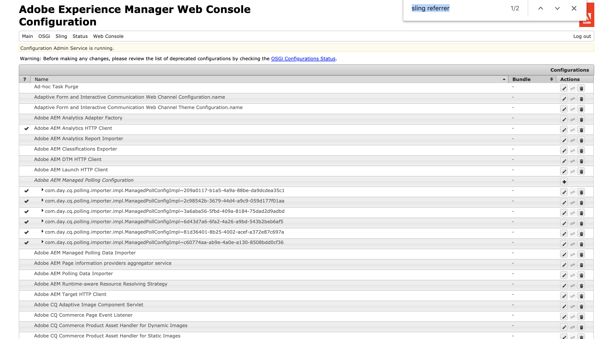

# Configuring and Deploying AEM Screens {#configuring-and-deploying-aem-screens}

本页说明如何在您的设备上安装和配置Screens播放器。

## Server Configuration {#server-configuration}

>[!NOTE]
>
>**重要信息**：
>
>AEM Screens播放器不使用跨站点请求伪造(CSRF)令牌。 因此，要配置AEM服务器并使其准备好用于AEM Screens，请通过允许空的引用来跳过引用过滤器。

## 运行状况检查框架 {#health-check-framework}

运行AEM Screens项目之前，运行状况检查框架允许用户检查是否设置了两个必需的配置。

它允许用户验证以下两个配置检查以运行AEM Screens项目，即检查以下两个过滤器的状态：

1. **允许空参照**
2. **https**

请按照以下步骤检查是否为AEM Screens启用了这两个重要配置：

1. 导航到 [Adobe Experience Manager Web ConsoleSling运行状况检查](http://localhost:4502/system/console/healthcheck?tags=screensconfigs&overrideGlobalTimeout=)。

   

2. 单击执 **行选定的运行状况检查** ，以对上面列出的两个属性运行验证。

   如果同时启用了这两个过滤器，则 **Screens Configuration Health Service** （屏幕配置健康服务） **将“结果** ”显示为“ **确定** ”(OK)，同时启用这两个配置。

   

   如果禁用了其中一个或两个过滤器，则会为用户显示警报，如下图所示。

   以下警报显示是否同时禁用了这两个过滤器：
   

>[!NOTE]
>
>* 要启用 **Apache Sling引用过滤器**，请参阅 [允许空引用请求](/help/user-guide/configuring-screens-introduction.md#allow-empty-referrer-requests)。
>* 要启用 **HTTP** ，请参阅 [Apache Felix Jetty基于HTTP服务](/help/user-guide/configuring-screens-introduction.md#allow-apache-felix-service)。

### 前提条件 {#prerequisites}

以下要点可帮助配置和AEM服务器以便准备好用于AEM Screens。

#### 允许空的引用请求 {#allow-empty-referrer-requests}

1. 通过 **AEM实例—>锤子图标—>操作** —> web控制台，导航到 **Adobe Experience Manager Web Console配置******。

   

1. **Adobe Experience Manager Web Console配置将打开** 。 搜索sling引用。

   要搜索sling referrer属性，请按 **Command+F** ( **Mac** )和 **Control+F(****** Windows)。

   

1. 选中“ **允许为空** ”选项，如下图所示。

   

1. 单击 **保存** ，以启用Apache Sling引用过滤器允许空。

#### 基于Apache Felix Jetty的HTTP服务 {#allow-apache-felix-service}

1. 通过 **AEM实例—>锤子图标—>操作** —> web控制台，导航到 **Adobe Experience Manager Web Console配置******。

   

1. **Adobe Experience Manager Web Console配置将打开** 。 搜索基于Apache Felix Jetty的HTTP服务。

   要搜索此属性，请 **按Command+F** ( **Mac** )和 **Control+F(****** Windows)。

1. 选中 **“启用HTTP** ”选项，如下图所示。

   

1. 单击 **保存** ，以启用 *http服务* 。

#### 为AEM Screens启用触屏UI {#enable-touch-ui-for-aem-screens}

AEM Screens需要触屏UI，并且不能用于Adobe Experience Manager(AEM)的经典UI。

1. 导航到 *&lt;yourAuthorInstance>/system/console/configMgr/com.day.cq.wcm.core.impl.AuthoringUIModeServiceImpl*
1. 确保将“默 **认创作UI** ”模式设 **置为“TOUCH**”，如下图所示

或者，您也可以使用 *&lt;yourAuthorInstance>*->*(hammer图标->* Operations **->)对WCM创作模式服务进行搜索和Web Console创作，**********&#x200B;以及对Adobe Sui suite的ReadChonse执行相同的设置。

>[!NOTE]
>
>您始终可以使用用户首选项为特定用户启用经典UI。

#### NOSAMPLECONTENT运行模式中的AEM {#aem-in-nosamplecontent-runmode}

在生产中运行AEM使用 **NOSAMPLECONTENT运行模式** 。 从&#x200B;*RemovetheX-Frame-Options=SAMEORIGIN* header（在其他响应头部分）

`https://localhost:4502/system/console/configMgr/org.apache.sling.engine.impl.SlingMainServlet`.

AEM Screens播放器必须具备此功能才能播放联机渠道。

#### 密码限制 {#password-restrictions}

对 ***DeviceServiceImpl进行最新更改&#x200B;***，您不必删除密码限制。

您可以通过 ***以下链接配置DeviceServiceImpl ***，以在为屏幕设备用户创建口令时启用口令限制：

`https://localhost:4502/system/console/configMgr/com.adobe.cq.screens.device.impl.DeviceService`

请按照以下步骤配置 ***DeviceServiceImpl ***:

1. 通过 **AEM实例—>锤子图标—>操作** —> web控制台，导航到 **Adobe Experience Manager Web Console配置******。

1. **Adobe Experience Manager web控制台配置**打开。 搜索deviceservice. 要搜索属性，请 **按Command+F** ( **Mac)和** Control+F(Windows) ********(Windows)。

#### Dispatcher Configuration {#dispatcher-configuration}

要了解如何为AEM Screens项目配置调度程序，请参阅为AEM Screens项 [目配置调度程序](dispatcher-configurations-aem-screens.md)。

#### Java编码 {#java-encoding}

将 ***Java编码设置为&#x200B;***Unicode。 例如，*Dfile.encoding=Cp1252 *将不起作用。

>[!NOTE]
>
>**推荐:**
>
>建议在生产使用中对AEM Screens服务器使用HTTPS。

