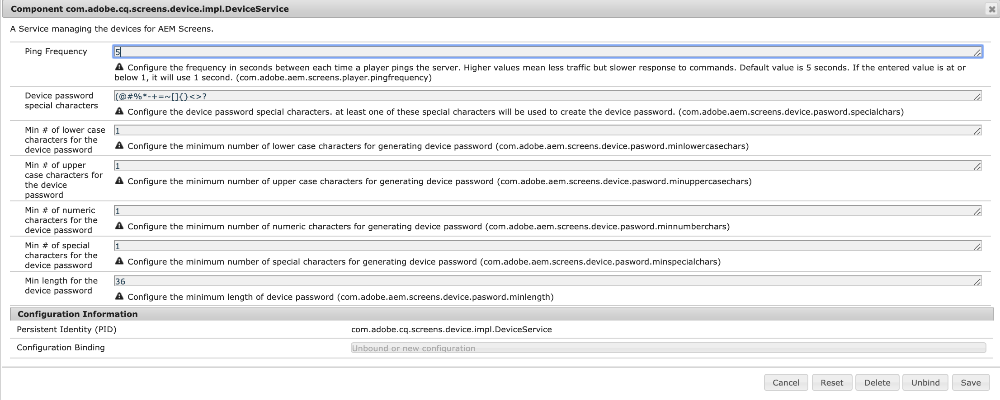

# 配置和部署AEM Screens {#configuring-and-deploying-aem-screens}

本页说明如何在您的设备上安装和配置Screens播放器。

## 服务器配置{#server-configuration}

>[!NOTE]
>
>**重要信息**：
>
>AEM Screens player未使用跨站点请求伪造(CSRF)令牌。 因此，为了配置和AEM服务器以准备好用于AEM Screens，请通过允许空推荐人跳过推荐人过滤器。

## 运行状况检查框架{#health-check-framework}

运行状况检查框架允许用户在运行AEM Screens项目之前检查是否设置了两个必需的配置。

它允许用户验证以下两个配置检查以运行AEM Screens项目，即检查以下两个过滤器的状态：

1. **允许空推荐人**
2. **https**

请按照以下步骤检查是否为AEM Screens启用了以下两个重要配置：

1. 导航至[Adobe Experience Manager Web Console Sling运行状况检查](http://localhost:4502/system/console/healthcheck?tags=screensconfigs&amp;overrideGlobalTimeout=)。

   

2. 单击&#x200B;**执行选定的运行状况检查**&#x200B;以对以上列出的两个属性运行验证。

   如果同时启用了这两个过滤器，则&#x200B;**Screens Configuration Health Service**&#x200B;将&#x200B;**Result**&#x200B;显示为&#x200B;**OK**，同时启用这两个配置。

   

   如果禁用了一个或两个过滤器，则会为用户显示警报，如下图所示。

   以下警报会显示是否同时禁用了这两个过滤器:
   

>[!NOTE]
>
>* 要启用&#x200B;**Apache Sling推荐人筛选器**，请参阅[允许空推荐人请求](/help/user-guide/configuring-screens-introduction.md#allow-empty-referrer-requests)。
>* 要启用&#x200B;**HTTP**&#x200B;服务，请参阅[基于Apache Felix Jetty的HTTP服务](/help/user-guide/configuring-screens-introduction.md#allow-apache-felix-service)。

### 前提条件 {#prerequisites}

以下要点有助于配置和AEM服务器，使其随时可用于AEM Screens。

#### 允许空推荐人请求{#allow-empty-referrer-requests}

1. 通过AEM实例 — >锤子图标 — > **Operations** —> **Web控制台**&#x200B;导航到&#x200B;**Adobe Experience Manager Web Console Configuration**。

   

1. **Adobe Experience Manager Web控制台** 配置打开。搜索吊带推荐人。

   要搜索吊具推荐人属性，请按&#x200B;**Command+F**（对于&#x200B;**Mac**）和&#x200B;**Control+F**（对于&#x200B;**Windows**）。

1. 选中&#x200B;**允许空**&#x200B;选项，如下图所示。

   

1. 单击&#x200B;**保存**&#x200B;以启用Apache Sling推荐人过滤器允许空。

#### 基于Apache Felix Jetty的HTTP服务{#allow-apache-felix-service}

1. 通过AEM实例 — >锤子图标 — > **Operations** —> **Web控制台**&#x200B;导航到&#x200B;**Adobe Experience Manager Web Console Configuration**。

   

1. **Adobe Experience Manager Web控制台** 配置打开。搜索基于Apache Felix Jetty的HTTP服务。

   要搜索此属性，请按&#x200B;**Command+F**（对于&#x200B;**Mac**）和&#x200B;**Control+F**（对于&#x200B;**Windows**）。

1. 选中&#x200B;**ENABLE HTTP**&#x200B;选项，如下图所示。

   

1. 单击&#x200B;**保存**&#x200B;以启用&#x200B;*http*&#x200B;服务。

#### 为AEM Screens {#enable-touch-ui-for-aem-screens}启用触屏UI

AEM Screens需要触屏UI，并且不能用于Adobe Experience Manager(AEM)的经典UI。

1. 导航到&#x200B;*&lt;yourAuthorInstance>/system/console/configMgr/com.day.cq.wcm.core.impl.AuthoringUIModeServiceImpl*
1. 确保将&#x200B;**默认创作UI模式**&#x200B;设置为&#x200B;**TOUCH**，如下图所示

或者，也可以使用您的AuthorInstance *->*&#x200B;工具（锤子图标） — > **操作** -> **Web控制台**&#x200B;执行相同的设置，并搜索&#x200B;**WCM创作UI模式服务**。

>[!NOTE]
>
>您始终可以使用用户首选项为特定用户启用经典UI。

#### AEM in NOSAMPLECONTENT runmode {#aem-in-nosamplecontent-runmode}

在生产中运行AEM使用&#x200B;**NOSAMPLECONTENT**&#x200B;运行模式。 从&#x200B;**

`https://localhost:4502/system/console/configMgr/org.apache.sling.engine.impl.SlingMainServlet`。

这是AEM Screens Player播放在线渠道所必需的。

#### 密码限制{#password-restrictions}

对&#x200B;***DeviceServiceImpl***&#x200B;进行最新更改后，您不必删除密码限制。

您可以通过以下链接配置&#x200B;***DeviceServiceImpl***&#x200B;以在为屏幕设备用户创建口令时启用口令限制：

`https://localhost:4502/system/console/configMgr/com.adobe.cq.screens.device.impl.DeviceService`

请按照以下步骤配置&#x200B;***DeviceServiceImpl***:

1. 通过AEM实例 — >锤子图标 — > **Operations** —> **Web控制台**&#x200B;导航到&#x200B;**Adobe Experience Manager Web Console Configuration**。

1. **Adobe Experience Manager Web控制台** 配置打开。搜索&#x200B;*deviceservice*。 要搜索属性，请按&#x200B;**Command+F**（对于macOS）和&#x200B;**Control+F**（对于Microsoft Windows）。

#### 调度程序配置{#dispatcher-configuration}

要了解如何为AEM Screens项目配置调度程序，请参阅[为AEM Screens项目配置调度程序](dispatcher-configurations-aem-screens.md)。

#### Java编码{#java-encoding}

将&#x200B;***Java encoding***&#x200B;设置为Unicode。 例如，*Dfile.encoding=Cp1252*&#x200B;将不起作用。

>[!NOTE]
>**推荐:**
>建议在生产使用中使用AEM Screens Server的HTTPS。

