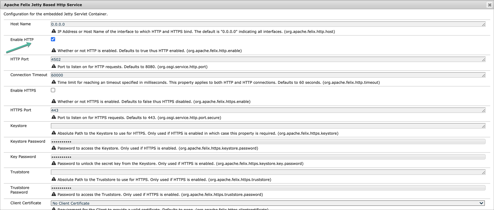

# 配置和部署AEM Screens {#configuring-and-deploying-aem-screens}

本页说明如何在设备上安装和配置Screens播放器。

## 服务器配置 {#server-configuration}

>[!IMPORTANT]
>
>AEM Screens播放器不使用跨站点请求伪造(CSRF)令牌。 因此，要将AEM服务器配置为可用于AEM Screens，请通过允许空反向链接跳过反向链接过滤器。

## 运行状况检查框架 {#health-check-framework}

运行状况检查框架让用户在运行AEM Screens项目之前检查是否设置了两个必要的配置。

它允许用户验证以下两项配置检查以运行AEM Screens项目，即检查以下两个筛选器的状态：

1. **允许空反向链接**
2. **https**

请按照以下步骤检查是否已为AEM Screens启用这两个重要配置：

1. 导航到 [Adobe Experience Manager Web控制台Sling运行状况检查](http://localhost:4502/system/console/healthcheck?tags=screensconfigs&amp;overrideGlobalTimeout=).

   

2. 单击 **执行选定的运行状况检查** 因此，您可以为上面列出的两个属性运行验证。

   如果已启用这两个过滤器，则 **Screens配置运行状况服务** 显示 **结果** 作为 **确定** 将两个配置都启用后。

   

   如果禁用了一个或两个过滤器，则会为用户显示警报，如下图所示。

   如果两个过滤器都处于禁用状态，则会显示以下警报：
   

>[!NOTE]
>
>* 要启用 **Apache Sling引用过滤器**，请参见 [允许空反向链接请求](/help/user-guide/configuring-screens-introduction.md#allow-empty-referrer-requests).
>* 要启用 **HTTP** 服务，请参见 [基于Apache Felix Jetty的HTTP服务](/help/user-guide/configuring-screens-introduction.md#allow-apache-felix-service).

### 先决条件 {#prerequisites}

以下要点有助于配置和AEM服务器，以便随时用于AEM Screens。

#### 允许空反向链接请求 {#allow-empty-referrer-requests}

1. 导航到 **Adobe Experience Manager Web控制台配置** 通过AEM实例>锤子图标> **操作** > **Web控制台**.

   

1. **Adobe Experience Manager Web控制台配置** 打开。 搜索Sling反向链接。

   要搜索sling反向链接属性，请按 **Command+F** 对象 **Mac** 和 **Control+F** 对象 **Windows**.

1. 查看 **允许为空** 选项，如下图所示。

   

1. 单击 **保存** 以启用Apache Sling引用过滤器允许为空。

#### 基于Apache Felix Jetty的HTTP服务 {#allow-apache-felix-service}

1. 导航到 **Adobe Experience Manager Web控制台配置** 通过AEM实例>锤子图标> **操作** > **Web控制台**.

   

1. **Adobe Experience Manager Web控制台配置** 打开。 搜索基于Apache Felix Jetty的HTTP服务

   要搜索此属性，请按 **Command+F** 对象 **Mac** 和 **Control+F** 对象 **Windows**.

1. 查看 **启用HTTP** 选项，如下图所示。

   

1. 单击 **保存** 以启用 *Http* 服务。

#### 为AEM Screens启用Touch UI {#enable-touch-ui-for-aem-screens}

AEM Screens需要使用TOUCH UI，不能用于Adobe Experience Manager (AEM)的经典UI。

1. 导航到 `*<yourAuthorInstance>/system/console/configMgr/com.day.cq.wcm.core.impl.AuthoringUIModeServiceImpl*`
1. 确保 **默认创作UI模式** 设置为 **触控**，如下图所示

或者，您也可以使用AuthorInstance执行相同的设置 *>* 工具（锤子图标）> **操作** > **Web控制台** 和搜索 **WCM创作UI模式服务**.

>[!NOTE]
>
>您始终可以使用用户首选项为特定用户启用经典UI。

#### NOSAMPLECONTENT运行模式中的AEM {#aem-in-nosamplecontent-runmode}

在生产环境中运行AEM会使用 **NOSAMPLECONTENT** 运行模式。 删除 *X-Frame-Options=SAMEORIGIN* 标头（在额外的响应标头部分）来自

`https://localhost:4502/system/console/configMgr/org.apache.sling.engine.impl.SlingMainServlet`。

AEM Screens Player需要移除该选项才能播放在线渠道。

#### 密码限制 {#password-restrictions}

包含对的最新更改 ***DeviceserviceImpl***，您无需删除密码限制。

您可以配置 ***DeviceserviceImpl*** 在为屏幕设备用户创建密码时启用密码限制：

`https://localhost:4502/system/console/configMgr/com.adobe.cq.screens.device.impl.DeviceService`

按照以下步骤配置 ***DeviceserviceImpl***：

1. 导航到 **Adobe Experience Manager Web控制台配置** 通过AEM实例> hammer图标> **操作** > **Web控制台**.

1. **Adobe Experience Manager Web控制台配置** 打开。 搜索 `*deviceservice*`. 要搜索属性，请按 **Command+F** 适用于macOS和 **Control+F** 适用于Microsoft® Windows的。

#### Dispatcher 配置 {#dispatcher-configuration}

要了解如何为AEM Screens项目配置Dispatcher，请参阅 [为AEM Screens项目配置Dispatcher](dispatcher-configurations-aem-screens.md).

#### Java™编码 {#java-encoding}

设置 ***Java™编码*** 更改为Unicode。 例如， `*Dfile.encoding=Cp1252*` 不起作用。

>[!NOTE]
>
>在生产中使用用于AEM Screens Server的HTTPS。
