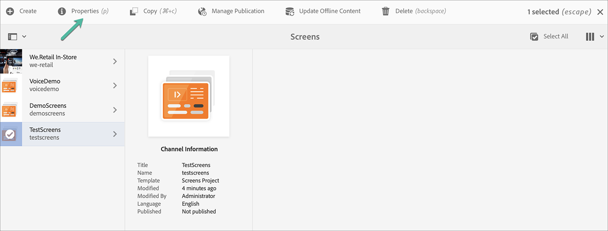

# 创建和管理项目 {#creating-and-managing-projects}

选择Adobe Experience Manager链接（左上方），然后选择Screens ，即可使用AEM Screens。

或者，您可以直接导航到： `http://localhost:4502/screens.html/content/screens`

>[!NOTE]
>**导航提示：**
>您还可以使用光标键在AEM中的不同文件夹中导航。 此外，单击特定图元后，按空格键可编辑或查看该特定文件夹的属性。

## 创建新的Screens项目

1. 单击AEM实例中的&#x200B;**Screens**。
1. 单击&#x200B;**创建Screens项目**。
1. 将标题输入为&#x200B;**TestScreens**，然后单击&#x200B;**保存**。

将创建项目并带回Screens项目控制台。 您现在可以单击项目。

在项目中，有五种类型的文件夹，如下图所示：

* **计划**
* **位置**
* **应用程序**
* **设备**
* **渠道**

>[!NOTE]
>
>默认情况下，初始结构包含&#x200B;**计划**、**位置**、**应用程序**、**渠道**&#x200B;和&#x200B;**设备**&#x200B;主页面，但如果需要，可以手动调整此结构。 如果可用的选项与项目无关，则可以删除这些选项。

## 查看属性 {#viewing-properties}

创建Screens项目后，单击该项目，然后单击操作栏中的&#x200B;**属性**，以便编辑项目的属性。

以下选项允许您编辑/更改&#x200B;**TestScreens**&#x200B;的属性。

## 创建自定义文件夹 {#creating-a-custom-folder}

您还可以在项目中可用的&#x200B;**计划**、**位置**、**应用程序**、**渠道**&#x200B;和&#x200B;**设备**&#x200B;主页面下创建自己的自定义文件夹。

要创建自定义文件夹，请执行以下操作：

1. 单击您的项目，然后单击操作栏中加号图标旁的&#x200B;**创建**。
1. 将打开&#x200B;**创建**&#x200B;向导，然后单击相应的选项。
1. 单击&#x200B;**下一步**。
1. 输入属性并单击&#x200B;**创建**。

以下步骤显示在&#x200B;**TestScreens**&#x200B;中向&#x200B;**应用程序**&#x200B;主页面创建应用程序文件夹。

### 后续步骤 {#the-next-steps}

创建自己的项目后，请参阅[渠道管理](managing-channels.md)创建和管理渠道中的内容。
