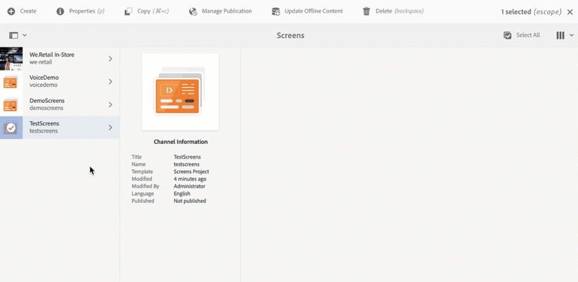

# 创建和管理项目 {#creating-and-managing-projects}

选择Adobe Experience Manager链接（左上方），然后选择Screens ，即可使用AEM Screens。

或者，您可以直接导航到： `http://localhost:4502/screens.html/content/screens`

>[!NOTE]
>**导航提示：**
>您还可以使用光标键在AEM中的不同文件夹中导航。 此外，选择特定实体后，点击空格键可编辑或查看该特定文件夹的属性。

## 创建新屏幕项目

1. 选择 **Screens** 从您的AEM实例中。
1. 单击 **创建屏幕项目**.
1. 输入标题为 **TestScreens** 并单击 **保存**.

项目随即会创建，并带您返回“屏幕项目”控制台。 您现在可以选择您的项目。

在项目中，有五种类型的文件夹，如下图所示：

* **时间表**
* **位置**
* **应用程序**
* **设备**
* **渠道**

>[!NOTE]
>
>默认情况下，初始结构包含 **时间表**， **位置**， **应用程序**， **渠道**、和 **设备** 主页面，但如果需要，可以手动调整此设置。 如果可用的选项与项目无关，则可以删除这些选项。

## 查看属性 {#viewing-properties}

创建屏幕项目后，选择该项目并单击 **属性** 以编辑项目的属性。

以下选项允许您编辑/更改的属性 **TestScreens**.

## 创建自定义文件夹 {#creating-a-custom-folder}

您还可以在下创建自己的自定义文件夹 **时间表**， **位置**， **应用程序**， **渠道**、和 **设备** 您的项目中可用的主页面。

要创建自定义文件夹，请执行以下操作：

1. 选择您的项目并单击 **创建** 位于操作栏中的加号图标旁边。
1. 此 **创建** 向导将打开，并选择相应的选项。
1. 单击&#x200B;**下一步**。
1. 输入属性并单击 **创建**.

以下步骤显示了如何创建应用程序文件夹，以便 **应用程序** 主页面位于 **TestScreens**.

### 后续步骤 {#the-next-steps}

创建自己的项目后，请参阅 [渠道管理](managing-channels.md) 以创建和管理渠道中的内容。
