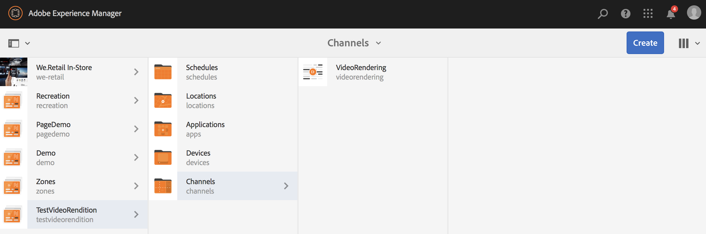
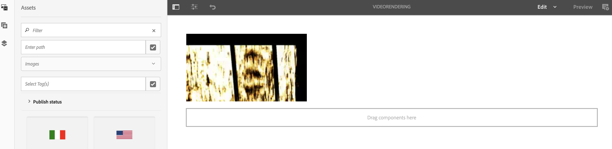

# 创建视频填充工作流 {#creating-a-video-padding-workflow}

本节涵盖以下主题：

* **概述**
* **前提条件**
* **创建视频填充工作流**
   * **创建工作流**
   * **使用AEM Screens项目中的工作流**

* **验证工作流的输出**

## 概述 {#overview}

以下用例涉及在显示为1920 x 1080的通道中放置视频（示例：1280 x 720）并将视频放置在0x0（左上）处。 不应以任何方式拉伸或修改视频，也不得使用 **封面** 在视频组件中。

该视频在像素1至像素1280的横向显示和从像素1至像素720的纵向显示作为对象，并且通道的其余部分为缺省颜色。

## 先决条件 {#prerequisites}

在创建视频工作流之前，请完成以下先决条件：

1. 上传视频于 **资产** AEM实例中的文件夹
1. 创建一个AEM Screens项目(例如， **TestVideoRendition**)和名为(**VideoRender**)，如下图所示：

## 创建视频填充工作流 {#creating-a-video-padding-workflow-1}

要创建视频填充工作流，请为视频创建工作流，然后在AEM Screens项目渠道中使用相同工作流。

请按照以下步骤创建并使用工作流：

1. 创建工作流
1. 在AEM Screens项目中使用工作流

### 创建工作流 {#creating-a-workflow}

请按照以下步骤为您的视频创建工作流：

1. 导航到您的AEM实例。
1. 单击侧边栏中的工具。
1. 选择 **工作流** > **模型** 这样就可以创建一个模型。

   

1. 单击 **模型** > **创建** > **创建模型**. 输入 **标题** (如 **VideoRendition**)和 **名称** 在 **添加工作流模型**. 单击 **完成** 以添加工作流模型。

   

1. 创建工作流模型后，选择模型(**VideoRendition**)，然后单击 **编辑** 从操作栏中。

   

1. 拖放 **`Command Line`** 组件添加到工作流。

   

1. 选择 **`Command Line`** 组件并打开属性对话框。

   

1. 选择 **参数** 选项卡。
1. 在 **命令行 — 步骤属性** 对话框中，在 **Mime类型** (如 ***video/mp4***)和命令为(***/usr/local/Cellar/ffmpeg -i ${filename} -vf &quot;pad=1920：height=1080：x=0：y=0：color=black&quot; cq5dam.video.fullhd-hp.mp4***)。 此命令启动工作流于 **命令** 字段。

   有关详细信息，请参阅 **Mime类型** 和 **命令** ，如下所述。

   

1. 选择工作流(**VideoRenditions**)。
1. 单击 **启动工作流** 从操作栏中。

   

1. 在 **运行工作流** 对话框中，选择资源的路径 **有效负荷** (如 ***/content/dam/huseinpeyda-crossroads01_512kb 2.mp4***)并输入 **标题** 作为 ***RunVideo*** 并单击 **运行**.

   

### 在AEM Screens项目中使用工作流 {#using-the-workflow-in-an-aem-screens-project}

请按照以下步骤在您的AEM Screens项目中使用工作流：

1. 导航到AEM Screens项目(**TestVideoRendition** > **渠道** >**VideoRendition**)。

   

1. 单击 **编辑** 从操作栏中。 拖放您最初上传到的视频 **资产**.

   

1. 上传视频后，单击 **预览** 以查看输出。

   

## 验证工作流的输出 {#validating-the-output-for-the-workflow}

您可以通过以下方式验证输出：

* 检查渠道中的视频预览
* 导航至 ***/content/dam/testvideo.mp4/jcr：content/renditions/cq5dam.video.fullhd-hp.mp4*** CRXDE Lite时，如下图所示：

