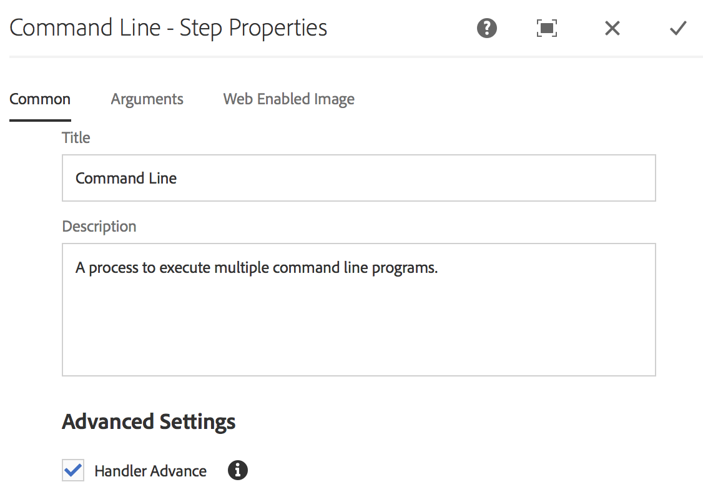

# 创建视频填充工作流 {#creating-a-video-padding-workflow}

本节涵盖以下主题：

* **概述**
* **先决条件**
* **创建视频填充工作流**
   * **创建工作流**
   * **在AEM Screens项目中使用工作流**

* **正在验证工作流的输出**

## 概述 {#overview}

以下用例涉及在显示为1920 x 1080的通道中放置视频（示例：1280 x 720）并将视频放置在0x0（左上）处。 不应以任何方式拉伸或修改视频，并且不要在视频组件中使用&#x200B;**Cover**。

该视频在像素1至像素1280之间跨像素1至像素720下显示为对象。 渠道的其余部分为默认颜色。

## 先决条件 {#prerequisites}

在创建视频工作流之前，请完成以下先决条件：

1. 在AEM实例的&#x200B;**Assets**&#x200B;文件夹中上传视频
1. 创建一个AEM Screens项目（例如&#x200B;**TestVideoRendition**）和一个名为(**VideoRendering**)的通道，如下图所示：

## 创建视频填充工作流 {#creating-a-video-padding-workflow-1}

要创建视频填充工作流，请为视频创建工作流，然后在AEM Screens项目渠道中使用相同工作流。

请按照以下步骤创建并使用工作流：

1. 创建工作流
1. 在AEM Screens项目中使用工作流

### 创建工作流 {#creating-a-workflow}

请按照以下步骤为您的视频创建工作流：

1. 导航到您的AEM实例。
1. 单击侧边栏中的工具。
1. 单击&#x200B;**工作流** > **模型**，以便创建模型。

   

1. 单击&#x200B;**模型** > **创建** > **创建模型**。 在&#x200B;**添加工作流模型**&#x200B;中输入&#x200B;**标题**（如&#x200B;**VideoRendition**）和&#x200B;**名称**。 单击&#x200B;**完成**&#x200B;以添加工作流模型。

   

1. 创建工作流模型后，单击模型(**VideoRendition**)，然后单击操作栏中的&#x200B;**编辑**。

   

1. 将&#x200B;**`Command Line`**&#x200B;组件拖放到您的工作流中。

   

1. 单击&#x200B;**`Command Line`**&#x200B;组件并打开属性对话框。

   

1. 单击&#x200B;**参数**&#x200B;选项卡。
1. 在&#x200B;**命令行 — 步骤属性**&#x200B;对话框中，在&#x200B;**Mime类型** （作为&#x200B;***video/mp4***）中输入格式，并以(***`/usr/local/Cellar/ffmpeg -i ${filename} -vf "pad=1920:height=1080:x=0:y=0:color=black" cq5dam.video.fullhd-hp.mp4`***)输入命令。 此命令在&#x200B;**命令**&#x200B;字段中启动工作流。

   请在下面的注释中查看有关&#x200B;**Mime类型**&#x200B;和&#x200B;**命令**&#x200B;的详细信息。

   

1. 单击工作流(**VideoRenditions**)。
1. 单击操作栏中的&#x200B;**启动工作流**。

   

1. 在&#x200B;**运行工作流**&#x200B;对话框中，单击&#x200B;**有效负载**&#x200B;中资产的路径（如&#x200B;***/content/dam/huseinpeyda-crossroads01_512kb 2.mp4***），然后输入&#x200B;**Title**&#x200B;作为&#x200B;***RunVideo***，然后单击&#x200B;**运行**。

   

### 在AEM Screens项目中使用工作流 {#using-the-workflow-in-an-aem-screens-project}

请按照以下步骤在您的AEM Screens项目中使用工作流：

1. 导航到AEM Screens项目（**TestVideoRendition** > **渠道** >**VideoRendition**）。

   

1. 单击操作栏中的&#x200B;**编辑**。 将您最初上传的视频拖放到&#x200B;**Assets**。

   

1. 上传视频后，单击&#x200B;**预览**&#x200B;查看输出。

   

## 验证工作流的输出 {#validating-the-output-for-the-workflow}

您可以通过以下方式验证输出：

* 检查渠道中的视频预览
* 导航到CRXDE Lite中的&#x200B;***/content/dam/testvideo.mp4/jcr：content/renditions/cq5dam.video.fullhd-hp.mp4***，如下图所示：

