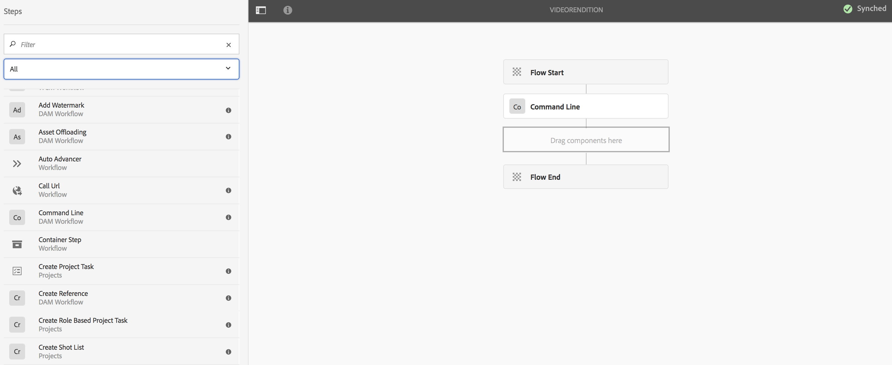

# 创建视频填充工作流{#creating-a-video-padding-workflow}

本节涵盖以下主题：

* **概述**
* **前提条件**
* **创建视频填充工作流**
   * **创建工作流**
   * **在AEM Screens项目中使用工作流**

* **验证工作流的输出**

## 概述 {#overview}

以下用例涉及放置视频(示例：1280 x 720)，其渠道显示器为1920 x 1080，且视频放置在0x0（左上方）。 不应以任何方式拉伸或修改视频，并且不应在视频组件中使用&#x200B;**封面**。

该渠道将作为对象显示，从像素1到像素1280跨像素和从像素1到像素720向下，其余的视频将是默认颜色。

## 前提条件 {#prerequisites}

在创建视频工作流之前，请完成以下先决条件：

1. 在AEM实例的&#x200B;**Assets**&#x200B;文件夹中上传视频
1. 创建AEM Screens项目（例如，**TestVideoRendition**）和名为(**VideoRending**)的渠道，如下图所示：

## 创建视频填充工作流{#creating-a-video-padding-workflow-1}

要创建视频填充工作流，您必须为视频创建工作流，然后在AEM Screens项目渠道中使用相同的工作流。

请按照以下步骤创建和使用工作流：

1. 创建工作流
1. 在AEM Screens项目中使用工作流

### 创建工作流{#creating-a-workflow}

请按照以下步骤为视频创建工作流：

1. 导航到您的AEM实例，然后单击侧边栏中的工具。 选择&#x200B;**工作流** —> **模型**&#x200B;以创建新模型。

   

1. 单击&#x200B;**模型** —> **创建** —> **创建模型**。 在&#x200B;**添加工作流模型**&#x200B;中输入&#x200B;**标题**（作为&#x200B;**VideoRendition**）和&#x200B;**名称**。 单击&#x200B;**完成**&#x200B;以添加工作流模型。

   

1. 创建工作流模型后，请选择该模型(**VideoRendition**)，然后单击操作栏中的&#x200B;**编辑**。

   

1. 将&#x200B;**命令行**&#x200B;组件拖放到工作流中。

   

1. 选择&#x200B;**命令行**&#x200B;组件并打开属性对话框。

   

1. 选择&#x200B;**参数**&#x200B;选项卡以在&#x200B;**命令行 — 步骤属性**&#x200B;对话框中输入字段。

   在&#x200B;**Mime类型**（作为&#x200B;***video/mp4***）中输入格式，并将命令作为(***/usr/local/Cellar/ffmpeg -i ${filename} -vf &quot;pad=1920:height=1080:x=0:col=black&quot; cdam.video.fullhd-hp.mp4***)，以开始&#x200B;**命令**&#x200B;字段中的工作流。

   请参阅以下说明中有关&#x200B;**Mime类型**&#x200B;和&#x200B;**命令**&#x200B;的详细信息。

   

1. 选择工作流(**VideoRenditions**)，然后单击操作栏中的&#x200B;**开始工作流**&#x200B;以打开&#x200B;**运行工作流**&#x200B;对话框。

   

1. 在&#x200B;**Payload**(as ***/content/dam/huseinpeyda-crossroads01_512kb 2.mp4***)中选择资产的路径，然后将&#x200B;**Title**&#x200B;输入为&#x200B;***RunVideo***&#x200B;并单击&#x200B;**运行**。

   

### 在AEM Screens项目{#using-the-workflow-in-an-aem-screens-project}中使用工作流

请按照以下步骤使用AEM Screens项目中的工作流：

1. 导航到AEM Screens项目(**TestVideoRendition** —> **渠道** —>**VideoRendition**)。

   

1. 单击操作栏中的&#x200B;**编辑**。 拖放您最初上传到&#x200B;**资产**&#x200B;的视频。

   

1. 上传视频后，单击&#x200B;**预览**&#x200B;视图输出。

   

## 验证工作流{#validating-the-output-for-the-workflow}的输出

您可以通过以下方式验证输出：

* 检查渠道中的预览
* 导航到CRXDE Lite中的&#x200B;***/content/dam/testvideo.mp4/jcr:content/renditions/cq5dam.video.fullhd-hp.mp4***，如下图所示：

