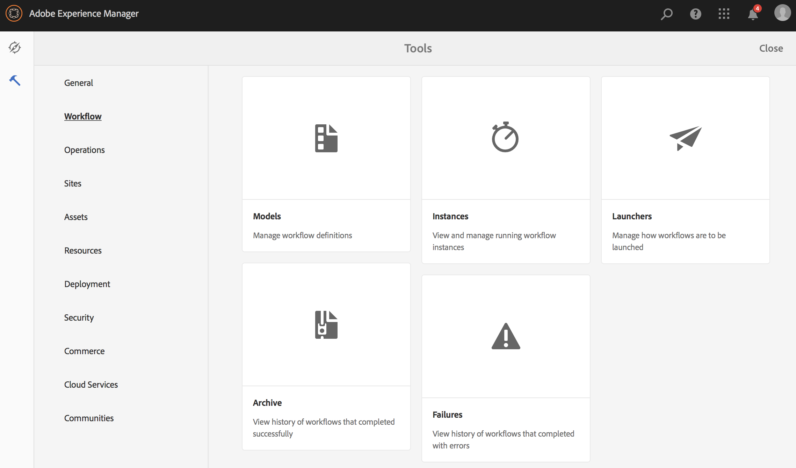

# 创建视频填充工作流 {#creating-a-video-padding-workflow}

本节涵盖以下主题：

* **概述**
* **前提条件**
* **创建视频填充工作流**
   * **创建工作流**
   * **使用AEM Screens项目中的工作流**

* **验证工作流的输出**

## 概述 {#overview}

以下用例涉及将视频（示例：1280 x 720）放置在显示为1920 x 1080的通道中，并将视频放置在0x0（左上角）。 不应以任何方式拉伸或修改视频，且不得使用 **封面** 在视频组件中。

视频将作为对象显示，从像素1到像素1280，从像素1到像素720，其余通道将是默认颜色。

## 前提条件 {#prerequisites}

在创建视频工作流之前，请完成以下先决条件：

1. 上传视频于 **资产** AEM实例中的文件夹
1. 创建一个AEM Screens项目(例如， **TestVideoRendition**)和名为(**视频渲染**)，如下图所示：

## 创建视频填充工作流 {#creating-a-video-padding-workflow-1}

要创建视频填充工作流，您必须为视频创建工作流，然后在AEM Screens项目渠道中使用相同工作流。

请按照以下步骤创建和使用工作流：

1. 创建工作流
1. 在AEM Screens项目中使用工作流

### 创建工作流 {#creating-a-workflow}

请按照以下步骤为您的视频创建工作流：

1. 导航到AEM实例，然后单击侧边栏中的工具。 选择 **工作流** —> **模型** 以创建新模型。

   

1. 单击 **模型** —> **创建** —> **创建模型**. 输入 **标题** (作为 **VideoRendition**)和 **名称** 在 **添加工作流模型**. 单击 **完成** 以添加工作流模型。

   

1. 创建工作流模型后，选择模型(**VideoRendition**)，然后单击 **编辑** 操作栏中的。

   

1. 拖放 **命令行** 组件添加到工作流。

   

1. 选择 **命令行** 组件并打开“属性”对话框。

   

1. 选择 **参数** 选项卡，以输入 **命令行 — 步骤属性** 对话框。

   在 **Mime类型** (作为 ***video/mp4***)和命令(***/usr/local/Cellar/ffmpeg -i ${filename} -vf &quot;pad=1920：height=1080：x=0：y=0：color=black&quot; cq5dam.video.fullhd-hp.mp4***)启动中的工作流 **命令** 字段。

   请参阅以下详细信息： **Mime类型** 和 **命令** ，请参阅下面的说明。

   

1. 选择工作流(**VideoRenditions**)，然后单击 **启动工作流** 以打开 **运行工作流** 对话框。

   

1. 在中选择资源的路径 **有效负荷** (作为 ***/content/dam/huseinpeyda-crossroads01_512kb 2.mp4***)并输入 **标题** 作为 ***RunVideo*** 并单击 **运行**.

   

### 在AEM Screens项目中使用工作流 {#using-the-workflow-in-an-aem-screens-project}

请按照以下步骤在您的AEM Screens项目中使用工作流：

1. 导航到AEM Screens项目(**TestVideoRendition** —> **渠道** —>**VideoRendition**)。

   

1. 单击 **编辑** 操作栏中的。 拖放您最初上传到的视频 **资产**.

   

1. 上传视频后，单击 **预览** 以查看输出。

   

## 验证工作流的输出 {#validating-the-output-for-the-workflow}

您可以通过以下方式验证输出：

* 检查渠道中的视频预览
* 导航到 ***/content/dam/testvideo.mp4/jcr：content/renditions/cq5dam.video.fullhd-hp.mp4*** CRXDE Lite时，如下图所示：

