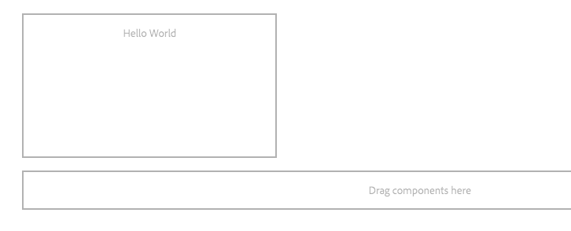

# 为AEM Screens开发自定义组件 {#developing-a-custom-component-for-aem-screens}

以下教程将介绍为AEM Screens创建自定义组件的步骤。 AEM Screens可重复使用其他AEM产品的许多现有设计模式与技术。 本教程重点介绍了为AEM Screens开发时的差异和特殊注意事项。

## 概述 {#overview}

本教程面向不熟悉AEM Screens的开发人员。 在本教程中，为AEM Screens中的序列渠道构建了一个简单的“Hello World”组件。 通过对话框，作者可以更新显示的文本。


## 先决条件 {#prerequisites}

要完成本教程，需要执行以下操作：

1. [AEM 6.5](https://experienceleague.adobe.com/zh-hans/docs/experience-manager-65/content/release-notes/release-notes)以及最新的Screens Feature Pack。

1. [AEM Screens播放器](https://experienceleague.adobe.com/en/docs/experience-manager-screens/user-guide/administering/configuring-screens-introduction)
1. 本地开发环境

使用&#x200B;**CRXDE-Lite**&#x200B;执行教程步骤和屏幕截图。 IDE也可用于完成本教程。 有关使用IDE开发带有AEM的[的详细信息，请访问此处。](https://experienceleague.adobe.com/en/docs/experience-manager-learn/getting-started-wknd-tutorial-develop/project-archetype/project-setup)


## 项目设置 {#project-setup}

Screens项目的源代码通常作为多模块Maven项目进行管理。 为了加快本教程，已使用[AEM项目原型13](https://github.com/adobe/aem-project-archetype)预生成了一个项目。 有关[使用Maven AEM项目原型创建项目的更多详细信息见此处](https://experienceleague.adobe.com/en/docs/experience-manager-learn/getting-started-wknd-tutorial-develop/project-archetype/project-setup)。

1. 使用[CRX包管理器](http://localhost:4502/crx/packmgr/index.jsp)下载并安装以下包：

[获取文件](assets/base-screens-weretail-runuiapps-001-snapshot.zip)

   [获取文件](assets/base-screens-weretail-runuicontent-001-snapshot.zip)
   **可选**&#x200B;如果使用Eclipse或其他IDE，请下载以下源包。 使用Maven命令将项目部署到本地AEM实例：

   **`mvn -PautoInstallPackage clean install`**

   启动HelloWorld SRC Screens `We.Retail`运行项目。

[获取文件](assets/src-screens-weretail-run.zip)

1. 在[CRX包管理器](http://localhost:4502/crx/packmgr/index.jsp)中，验证是否安装了以下两个包：

   1. **screens-weretail-run.ui.content-0.0.1-SNAPSHOT.zip**
   1. **screens-weretail-run.ui.apps-0.0.1-SNAPSHOT.zip**

   

   Screens `We.Retail`运行通过CRX包管理器安装的`Ui.Apps`和`Ui.Content`包。

1. **screens-weretail-run.ui.apps**&#x200B;包会在`/apps/weretail-run`下安装代码。

   此包中包含用于呈现项目自定义组件的代码。 此包中包含组件代码以及所需的任何JavaScript或CSS。 此包还嵌入了&#x200B;**screens-weretail-run.core-0.0.1-SNAPSHOT.jar**，其中包含项目所需的任何Java™代码。

   >[!NOTE]
   >
   >在本教程中，不会编写任何Java™代码。 如果需要更复杂的业务逻辑，可以使用核心Java™捆绑包创建和部署后端Java™。

   

   CRXDE Lite中ui.apps代码的表示形式

   **Hello World**&#x200B;组件只是一个占位符。 在本教程中，新增了功能，作者可以更新组件显示的消息。

1. **screens-weretail-run.ui.content**&#x200B;包在下方安装代码：

   * `/conf/we-retail-run`
   * `/content/dam/we-retail-run`
   * `/content/screens/we-retail-run`

   此资源包包含项目所需的起始内容和配置结构。 **`/conf/we-retail-run`**&#x200B;包含`We.Retail`运行项目的所有配置。 **`/content/dam/we-retail-run`**&#x200B;包括项目的开始数字资源。 **`/content/screens/we-retail-run`**&#x200B;包含Screens内容结构。 所有这些路径的内容主要在AEM中进行更新。 为了提高环境（本地、开发、暂存、生产）之间的一致性，通常将基本内容结构保存在源代码控制中。

1. **导航到AEM Screens > `We.Retail`运行项目：**

   从AEM的“开始”菜单中，单击Screens图标。 验证是否看到`We.Retail`运行项目。

   

## 创建Hello World组件 {#hello-world-cmp}

Hello World组件是一个简单的组件，它允许用户输入要在屏幕上显示的消息。 该组件基于[AEM Screens组件模板： https://github.com/Adobe-Marketing-Cloud/aem-screens-component-template](https://github.com/Adobe-Marketing-Cloud/aem-screens-component-template)。

AEM Screens具有一些有趣的限制，对于传统的WCM Sites组件未必是这样。

* 大多数Screens组件必须在目标数字标牌设备上全屏运行
* 必须能够在序列渠道中嵌入大多数Screens组件才能生成幻灯片
* 创作应允许编辑序列渠道中的各个组件，因此无法全屏呈现它们

1. 在&#x200B;**CRXDE-Lite**&#x200B;中，`http://localhost:4502/crx/de/index.jsp`（或所选的IDE）导航到`/apps/weretail-run/components/content/helloworld.`

   将以下属性添加到`helloworld`组件：

   ```
       jcr:title="Hello World"
       sling:resourceSuperType="foundation/components/parbase"
       componentGroup="We.Retail Run - Content"
   ```

   /apps/weretail-run/components/content/helloworld

   /apps/weretail-run/components/content/helloworld的属性

   **Hello World**&#x200B;组件扩展了&#x200B;**foundation，组件，parbase**&#x200B;组件，以便可以在序列通道中正确使用它。

1. 在`/apps/weretail-run/components/content/helloworld`下创建名为`helloworld.html.`的文件

   使用以下内容填充文件：

   ```xml
   <!--/*
   
    /apps/weretail-run/components/content/helloworld/helloworld.html
   
   */-->
   
   <!--/* production: preview authoring mode + unspecified mode (i.e. on publish) */-->
   <sly data-sly-test.production="${wcmmode.preview || wcmmode.disabled}" data-sly-include="production.html" />
   
   <!--/* edit: any other authoring mode, i.e. edit, design, scaffolding, etc. */-->
   <sly data-sly-test="${!production}" data-sly-include="edit.html" />
   ```

   根据正在使用的[创作模式](https://experienceleague.adobe.com/en/docs/experience-manager-64/authoring/authoring/author-environment-tools)，Screens组件需要两种不同的渲染：

   1. **生产**：预览或发布模式(wcmmode=disabled)
   1. **编辑**：用于所有其他创作模式，即编辑、设计、基架、开发人员……

   `helloworld.html`充当开关，检查哪个创作模式处于活动状态并重定向到另一个HTL脚本。 Screens组件使用的常见约定是，对于编辑模式，具有`edit.html`脚本；对于生产模式，具有`production.html`脚本。

1. 在`/apps/weretail-run/components/content/helloworld`下创建名为`production.html.`的文件

   使用以下内容填充文件：

   ```xml
   <!--/*
    /apps/weretail-run/components/content/helloworld/production.html
   
   */-->
   
   <div data-duration="${properties.duration}" class="cmp-hello-world">
    <h1 class="cmp-hello-world__message">${properties.message}</h1>
   </div>
   ```

   以上是Hello World组件的生产标记。 由于该组件在序列渠道中被使用，因此包含`data-duration`特性。 序列渠道使用`data-duration`属性来了解序列项显示的时长。

   该组件呈现带有文本的`div`和`h1`标记。 `${properties.message}`是HTL脚本的一部分，该脚本输出名为`message`的JCR属性的内容。 稍后将创建一个对话框，允许用户输入`message`属性文本的值。

   另请注意，组件使用BEM（块元素修饰符）表示法。 BEM是一种CSS编码约定，它使创建可重用组件变得更容易。 BEM是[AEM的核心组件](https://github.com/adobe/aem-core-wcm-components/wiki/CSS-coding-conventions)使用的表示法。<!-- DEAD LINK More info can be found at: [https://getbem.com/](https://getbem.com/) -->

1. 在`/apps/weretail-run/components/content/helloworld`下创建名为`edit.html.`的文件

   使用以下内容填充文件：

   ```xml
   <!--/*
   
    /apps/weretail-run/components/content/helloworld/edit.html
   
   */-->
   
   <!--/* if message populated */-->
   <div
    data-sly-test.message="${properties.message}"
    class="aem-Screens-editWrapper cmp-hello-world">
    <p class="cmp-hello-world__message">${message}</p>
   </div>
   
   <!--/* empty place holder */-->
   <div data-sly-test="${!message}"
        class="aem-Screens-editWrapper cq-placeholder cmp-hello-world"
        data-emptytext="${'Hello World' @ i18n, locale=request.locale}">
   </div>
   ```

   以上是Hello World组件的已编辑标记。 如果填充了对话框消息，则第一个块会显示组件的已编辑版本。

   如果没有输入对话框消息，则会呈现第二个块。 在这种情况下，`cq-placeholder`和`data-emptytext`将标签&#x200B;***Hello World***&#x200B;呈现为占位符。 可以使用i18n国际化标签的字符串，以支持在多个区域设置中进行创作。

1. **复制Screens图像对话框以用于Hello World组件。**

   最简单的方法是从现有对话框开始，然后进行修改。

   1. 从以下位置复制对话框： `/libs/screens/core/components/content/image/cq:dialog`
   1. 将对话框粘贴到`/apps/weretail-run/components/content/helloworld`下方

   

1. **更新Hello World对话框以包含消息选项卡。**

   更新对话框，使其与以下内容匹配。 JCR节点结构的最后一个对话框以XML形式展示如下：

   ```xml
   <?xml version="1.0" encoding="UTF-8"?>
   <jcr:root xmlns:sling="https://sling.apache.org/jcr/sling/1.0" xmlns:cq="https://www.day.com/jcr/cq/1.0" xmlns:jcr="https://www.jcp.org/jcr/1.0" xmlns:nt="https://www.jcp.org/jcr/nt/1.0"
       jcr:primaryType="nt:unstructured"
       jcr:title="Hello World"
       sling:resourceType="cq/gui/components/authoring/dialog">
       <content
           jcr:primaryType="nt:unstructured"
           sling:resourceType="granite/ui/components/coral/foundation/tabs"
           size="L">
           <items jcr:primaryType="nt:unstructured">
               <message
                   jcr:primaryType="nt:unstructured"
                   jcr:title="Message"
                   sling:resourceType="granite/ui/components/coral/foundation/fixedcolumns">
                   <items jcr:primaryType="nt:unstructured">
                       <column
                           jcr:primaryType="nt:unstructured"
                           sling:resourceType="granite/ui/components/coral/foundation/container">
                           <items jcr:primaryType="nt:unstructured">
                               <message
                                   jcr:primaryType="nt:unstructured"
                                   sling:resourceType="granite/ui/components/coral/foundation/form/textfield"
                                   fieldDescription="Message for component to display"
                                   fieldLabel="Message"
                                   name="./message"/>
                           </items>
                       </column>
                   </items>
               </message>
               <sequence
                   jcr:primaryType="nt:unstructured"
                   jcr:title="Sequence"
                   sling:resourceType="granite/ui/components/coral/foundation/fixedcolumns">
                   <items jcr:primaryType="nt:unstructured">
                       <column
                           jcr:primaryType="nt:unstructured"
                           sling:resourceType="granite/ui/components/coral/foundation/container">
                           <items jcr:primaryType="nt:unstructured">
                               <duration
                                   jcr:primaryType="nt:unstructured"
                                   sling:resourceType="granite/ui/components/coral/foundation/form/numberfield"
                                   defaultValue=""
                                   fieldDescription="Amount of time the image is shown in the sequence, in milliseconds"
                                   fieldLabel="Duration (milliseconds)"
                                   min="0"
                                   name="./duration"/>
                           </items>
                       </column>
                   </items>
               </sequence>
           </items>
       </content>
   </jcr:root>
   ```

   消息文本字段已保存到名为`message`的属性，持续时间数字字段已保存到名为`duration`的属性。 这两个属性均在`/apps/weretail-run/components/content/helloworld/production.html`中由HTL作为`${properties.message}`和`${properties.duration}`引用。

   

   Hello World — 已完成的对话框

## 创建客户端库 {#clientlibs}

客户端库提供了一种机制，用于整理和管理AEM实施所需的CSS和JavaScript文件。

AEM Screens组件在编辑模式与预览 — 生产模式中的呈现方式有所不同。 创建了两个客户端库：一个用于编辑模式，另一个用于预览生产模式。

1. 为Hello World组件的客户端库创建文件夹。

   在`/apps/weretail-run/components/content/helloworld`下创建名为`clientlibs`的文件夹。

   

1. 在`clientlibs`文件夹下，创建名为`shared`且类型为`cq:ClientLibraryFolder`的节点。

   

1. 将以下属性添加到共享客户端库：

   * `allowProxy` | 布尔型 | `true`

   * `categories`| 字符串[] | `cq.screens.components`

   /apps/weretail-run/components/content/helloworld/clientlibs/shared的

   /apps/weretail-run/components/content/helloworld/clientlibs/shared的属性

   categories属性是一个用于标识客户端库的字符串。 cq.screens.componentscategory在“编辑”和“预览 — 生产”模式下均使用。 因此，在sharedclientlib中定义的任何CSS或JS都将以所有模式加载。

   作为最佳实践，绝不应该公开生产环境中直接指向`/apps`的任何路径。 allowProxy属性确保通过前缀`/etc.clientlibs`引用客户端库CSS和JS。

1. 在共享文件夹下创建名为`css.txt`的文件。

   使用以下内容填充文件：

   ```
   #base=css
   
   styles.less
   ```

1. 在`shared`文件夹下创建名为`css`的文件夹。 在`css`文件夹下添加名为`style.less`的文件。 客户端库的结构现在应如下所示：

   

   本教程不会直接编写CSS，而是使用LESS。 [LESS](https://lesscss.org/)是一种常用的CSS预编译器，它支持CSS变量、mixin和函数。 AEM客户端库本身支持LESS编译。 您可以使用Sass或其他预编译器，但必须在AEM之外编译它们。

1. 使用以下内容填充`/apps/weretail-run/components/content/helloworld/clientlibs/shared/css/styles.less`：

   ```css
   /**
       Shared Styles
      /apps/weretail-run/components/content/helloworld/clientlibs/shared/css/styles.less
   
   **/
   
   .cmp-hello-world {
       background-color: #fff;
   
    &__message {
     color: #000;
     font-family: Helvetica;
     text-align:center;
    }
   }
   ```

1. 复制并粘贴`shared`客户端库文件夹以创建名为`production`的客户端库。

   

   复制共享客户端库以创建生产客户端库。

1. 将生产客户端库的`categories`属性更新为`cq.screens.components.production.`

   这样做可确保仅在“预览 — 生产”模式下加载样式。

   /apps/weretail-run/components/content/helloworld/clientlibs/production的

   `/apps/weretail-run/components/content/helloworld/clientlibs/production`的属性。

1. 使用以下内容填充`/apps/weretail-run/components/content/helloworld/clientlibs/production/css/styles.less`：

   ```css
   /**
       Production Styles
      /apps/weretail-run/components/content/helloworld/clientlibs/production/css/styles.less
   
   **/
   .cmp-hello-world {
   
       height: 100%;
       width: 100%;
       position: fixed;
   
    &__message {
   
     position: relative;
     font-size: 5rem;
     top:25%;
    }
   }
   ```

   上述样式将消息居中显示在屏幕中央，但仅在“生产”模式下显示。

第三个客户端库类别： `cq.screens.components.edit`可用于向组件添加仅用于编辑的特定样式。

| Clientlib类别 | 用途 |
|---|---|
| `cq.screens.components` | 在编辑模式和生产模式之间共享的样式和脚本 |
| `cq.screens.components.edit` | 仅在编辑模式下使用的样式和脚本 |
| `cq.screens.components.production` | 仅在生产模式下使用的样式和脚本 |

## 创建设计页面 {#design-page}

AEM Screens使用[静态页面模板](https://experienceleague.adobe.com/en/docs/experience-manager-65/content/implementing/developing/platform/templates/page-templates-static)和[设计配置](https://experienceleague.adobe.com/en/docs/experience-manager-64/authoring/siteandpage/default-components-designmode)进行全局更改。 设计配置通常用于为通道上的Parsys配置允许的组件。 最佳做法是以特定于应用程序的方式存储这些配置。

在`We.Retail`运行设计页面下创建，该页面存储了特定于`We.Retail`运行项目的所有配置。

1. 在&#x200B;**CRXDE Lite** `http://localhost:4502/crx/de/index.jsp#/apps/settings/wcm/designs`中，导航到`/apps/settings/wcm/designs`。
1. 在designs文件夹下创建一个名为`we-retail-run`且类型为`cq:Page`的节点。
1. 在`we-retail-run`页面下，添加另一个名为`jcr:content`且类型为`nt:unstructured`的节点。 将以下属性添加到`jcr:content`节点：

   | 名称 | 类型 | 价值 |
   |---|---|---|
   | `jcr:title` | 字符串 | `We.Retail`运行 |
   | `sling:resourceType` | 字符串 | `wcm`，`core`，`components`，`designer` |
   | `cq:doctype` | 字符串 | html_5 |

   

   在`/apps/settings/wcm/designs/we-retail-run`设计页面。

## 创建序列渠道 {#create-sequence-channel}

Hello World组件用于Sequence频道。 要测试组件，将创建一个新的序列渠道。

1. 从AEM“开始”菜单中，导航到&#x200B;**Screens** > **`We.Retail`运行** >并单击&#x200B;**渠道**。

1. 单击&#x200B;**创建**&#x200B;按钮

   1. 选择&#x200B;**创建实体**

   

1. 在创建向导中：

1. 模板步骤 — 选择&#x200B;**序列频道**

   1. 属性步骤

   * 基本选项卡>标题= **空闲频道**
   * 渠道选项卡>选中&#x200B;**使渠道联机**

   

1. 打开“空闲通道”的页面属性。
1. 更新设计字段，使其指向`/apps/settings/wcm/designs/we-retail-run`，即在上一部分中创建的设计页面。

   

   指向/apps/settings/wcm/designs/we-retail-run的设计配置

1. 编辑新创建的空闲通道，以便将其打开。

1. 将页面模式切换到&#x200B;**设计**&#x200B;模式。

   1. 单击Parsys中的&#x200B;**扳手**&#x200B;图标，以便配置允许的组件。

   1. 单击&#x200B;**Screens**&#x200B;组和&#x200B;**`We.Retail`运行 — 内容**&#x200B;组。

   

1. 将页面模式切换到&#x200B;**编辑**。 Hello World组件现在可以添加到页面中，并与其他序列渠道组件相结合。

   

1. 在&#x200B;**CRXDE Lite** `http://localhost:4502/crx/de/index.jsp#/apps/settings/wcm/designs/we-retail-run/jcr%3Acontent/sequencechannel/par`中，导航到`/apps/settings/wcm/designs/we-retail-run/jcr:content/sequencechannel/par`。 请注意，`components`属性现在包含`group:Screens`、`group:We.Retail Run - Content`。

   在/apps/settings/wcm/designs/we-retail-run下

   /apps/settings/wcm/designs/we-retail-run下的设计配置

## 自定义处理程序模板 {#custom-handlers}

如果您的自定义组件使用外部资源，如资产（图像、视频、字体和图标）、特定资产演绎版或客户端库（css和js），则这些资源不会自动添加到离线配置。 原因是默认情况下，只有HTML标记是捆绑的。

为了让您自定义和优化已下载到播放器的确切资源，Adobe提供了一个扩展机制。 此机制用于自定义组件向AEM Screens中的离线缓存逻辑公开其依赖项。

以下部分显示了自定义脱机资源处理程序的模板。 它还显示了`pom.xml`中特定项目的最低要求。

```java
package …;

import javax.annotation.Nonnull;

import org.apache.felix.scr.annotations.Component;
import org.apache.felix.scr.annotations.Reference;
import org.apache.felix.scr.annotations.Service;
import org.apache.sling.api.resource.Resource;
import org.apache.sling.api.resource.ResourceUtil;
import org.apache.sling.api.resource.ValueMap;

import com.adobe.cq.screens.visitor.OfflineResourceHandler;

@Service(value = OfflineResourceHandler.class)
@Component(immediate = true)
public class MyCustomHandler extends AbstractResourceHandler {

 @Reference
 private …; // OSGi services injection

 /**
  * The resource types that are handled by the handler.
  * @return the handled resource types
  */
 @Nonnull
 @Override
 public String[] getSupportedResourceTypes() {
     return new String[] { … };
 }

 /**
  * Accept the provided resource, visit and traverse it as needed.
  * @param resource The resource to accept
  */
 @Override
 public void accept(@Nonnull Resource resource) {
     ValueMap properties = ResourceUtil.getValueMap(resource);
     
     /* You can directly add explicit paths for offline caching using the `visit`
        method of the visitor. */
     
     // retrieve a custom property from the component
     String myCustomRenditionUrl = properties.get("myCustomRenditionUrl", String.class);
     // adding that exact asset/rendition/path to the offline manifest
     this.visitor.visit(myCustomRenditionUrl);
     
     
     /* You can delegate handling for dependent resources so they are also added to
        the offline cache using the `accept` method of the visitor. */
     
     // retrieve a referenced dependent resource
     String referencedResourcePath = properties.get("myOtherResource", String.class);
     ResourceResolver resolver = resource.getResourceResolver();
     Resource referencedResource = resolver.getResource(referencedResourcePath);
     // let the handler for that resource handle it
     if (referencedResource != null) {
         this.visitor.accept(referencedResource);
     }
   }
}
```

以下代码提供了`pom.xml`中特定项目的最低要求：

```css
   <dependencies>
        …
        <!-- Felix annotations -->
        <dependency>
            <groupId>org.apache.felix</groupId>
            <artifactId>org.apache.felix.scr.annotations</artifactId>
            <version>1.9.0</version>
            <scope>provided</scope>
        </dependency>

        <!-- Screens core bundle with OfflineResourceHandler/AbstractResourceHandler -->
        <dependency>
            <groupId>com.adobe.cq.screens</groupId>
            <artifactId>com.adobe.cq.screens</artifactId>
            <version>1.5.90</version>
            <scope>provided</scope>
        </dependency>
        …
      </dependencies>
```

**注意** ：如果存在AEM as a Cloud Service，请在`pom.xml`中为该特定项目使用下面的依赖项。

```css
   <dependencies>
        …
        <!-- AEM Screens SDK API with OfflineResourceHandler/AbstractResourceHandler -->
        <dependency>
            <groupId>com.adobe.aem</groupId>
            <artifactId>aem-screens-sdk-api</artifactId>
            <version>1.0.8</version>
        </dependency>
        …
      </dependencies>
```

## 融于一起 {#putting-it-all-together}

以下视频介绍了已完成的组件以及如何将其添加到序列渠道。 然后，该渠道会添加到位置显示中，并最终分配给Screens播放器。

>[!VIDEO](https://video.tv.adobe.com/v/22385?quaity=9)

## 自定义组件嵌入其他页面或片段的其他注意事项 {#additional-considerations}

如果您的自定义组件旨在包含其他页面或体验片段，并且您希望播放器自动拾取嵌入内容中的更改而不重新发布渠道，请考虑以下两个限制：

1. 您必须扩展`screens/core/components/content/page`或`screens/core/components/content/experiencefragment`，而不是直接扩展`foundation/components/parbase`
2. 用于引用嵌入内容的属性的名称必须为`pagePath`。

使用这两个Screens核心组件还提供了额外的好处，即它们可以绑定您需要的一些依赖项（客户端库、字体等）。 此功能可通过它们在组件对话框中的离线配置选项来完成。 然后，它可以减少您必须用于它的任何自定义离线处理程序的责任。 有时，它甚至可以完全消除在最初使用密钥的需要。

## 完成的代码 {#finished-code}

以下是教程中完成的代码。 **screens-weretail-run.ui.apps-0.0.1-SNAPSHOT.zip**&#x200B;和&#x200B;**screens-weretail-run.ui.content-0.0.1-SNAPSHOT.zip**&#x200B;是编译的AEM包。 **SRC-screens-weretail-run-0.0.1.zip **是可以使用Maven部署的未编译的源代码。

[获取文件](assets/screens-weretail-runuiapps-001-snapshot.zip)

[获取文件](assets/screens-weretail-runuicontent-001-snapshot.zip)

[获取文件](assets/screens-weretail-run.zip)
