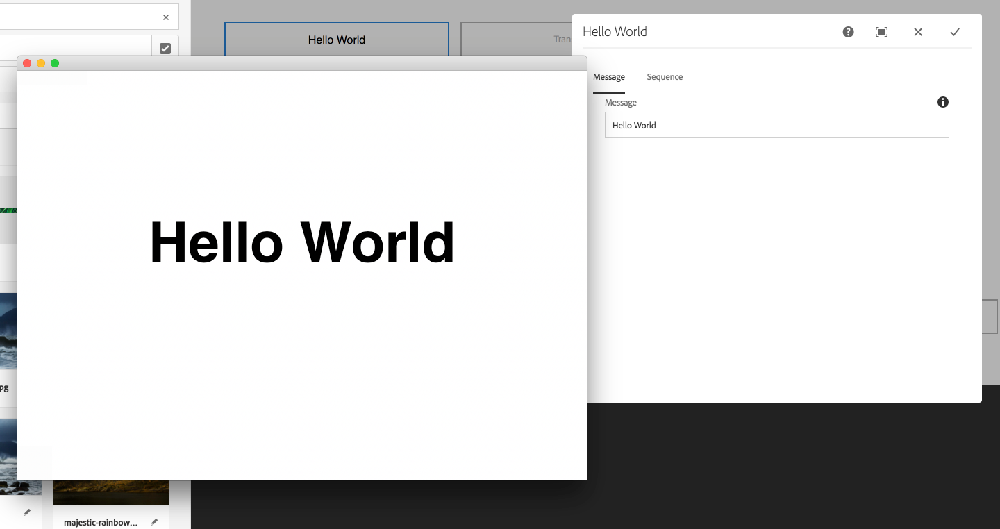
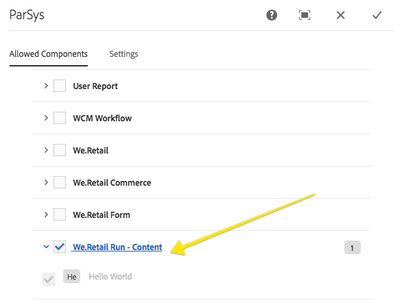

# 为AEM Screens开发自定义组件 {#developing-a-custom-component-for-aem-screens}

以下教程将逐步介绍为AEM Screens创建自定义组件的步骤。 AEM Screens重新使用其他AEM产品的许多现有设计模式和技术。 本教程重点介绍了在为AEM Screens进行开发时的差异和特殊注意事项。

## 概述 {#overview}

本教程面向不熟悉AEM Screens的开发人员。 在本教程中，为AEM Screens中的序列渠道构建了一个简单的“Hello World”组件。 通过对话框，作者可以更新显示的文本。



## 前提条件 {#prerequisites}

要完成本教程，需要以下内容：

1. [AEM 6.5或](https://helpx.adobe.com/cn/experience-manager/6-4/release-notes.html) AEM [6.3](https://helpx.adobe.com/cn/experience-manager/6-3/release-notes.html) +最新屏幕功能包

1. [AEM Screens 播放器](https://helpx.adobe.com/experience-manager/6-4/sites/deploying/using/configuring-screens-introduction.html)
1. 本地开发环境

教程步骤和屏幕截图是使用 **CRXDE-Lite执行的**。 IDE还可用于完成教程。 有关使用IDE与AEM进行开发的 [更多信息，请参阅此处。](https://helpx.adobe.com/experience-manager/kt/sites/using/getting-started-wknd-tutorial-develop/part1.html#eclipse-ide)


## 项目设置 {#project-setup}

Screens项目的源代码通常作为多模块Maven项目进行管理。 为加快教程的进行，项目是使用AEM项目原 [型13预生成的](https://github.com/Adobe-Marketing-Cloud/aem-project-archetype)。 有关使用Maven AEM [项目原型创建项目的更多详细信息，请参阅此处](https://helpx.adobe.com/experience-manager/kt/sites/using/getting-started-wknd-tutorial-develop/part1.html#maven-multimodule)。

1. 使用CRX包管理器下载并安装 [以下包](http://localhost:4502/crx/packmgr/index.jsp):

   [获取文件](assets/base-screens-weretail-runuiapps-001-snapshot.zip)

   [获取文件](assets/base-screens-weretail-runuicontent-001-snapshot.zip)
   **(可选** )如果使用Eclipse或其他IDE，请下载以下源包。 使用Maven命令将项目部署到本地AEM实例：

   **`mvn -PautoInstallPackage clean install`**

   开始HelloWorld SRC屏幕We.Retail运行项目

   [获取文件](assets/src-screens-weretail-run.zip)

1. 在CRX [包管理器中](http://localhost:4502/crx/packmgr/index.jsp) ，验证以下两个包是否已安装：

   1. **screens-weretail-run.ui.content-0.0.1-SNAPSHOT.zip**
   1. **screens-weretail-run.ui.apps-0.0.1-SNAPSHOT.zip**
   

   Screens We.Retail运行通过CRX包管理器安装的Ui.Apps和Ui.Content包

1. screens-weretail-run.ui.apps **包** 在下面安装代码 `/apps/weretail-run`。

   此包包含负责渲染项目自定义组件的代码。 此包包含组件代码以及所需的任何JavaScript或CSS。 此包还嵌 **入screens-weretail-run.core-0.0.1-SNAPSHOT.jar** ，其中包含项目所需的任何Java代码。

   >[!NOTE]
   >
   >在本教程中，不编写任何Java代码。 如果需要更复杂的业务逻辑，可以使用核心Java捆绑包创建和部署后端Java。

   

   在CRXDE Lite中表示ui.apps代码

   helloworld **组件** 当前只是一个占位符。 在教程中，将添加允许作者更新组件显示的消息的功能。

1. screens-weretail-run.ui.co **ntent** 包在以下位置安装代码：

   * `/conf/we-retail-run`
   * `/content/dam/we-retail-run`
   * `/content/screens/we-retail-run`
   此包包含项目所需的启动内容和配置结构。 **`/conf/we-retail-run`** 包含We.Retail Run项目的所有配置。 **`/content/dam/we-retail-run`** 包括为项目启动数字资产。 **`/content/screens/we-retail-run`** 包含Screens内容结构。 所有这些路径下的内容主要在AEM中更新。 为了提高环境（本地、开发、舞台、产品）之间的一致性，通常在源代码控件中保存基本内容结构。

1. **导航到AEM Screens > We.Retail Run项目：**

   从AEM开始菜单>单击屏幕图标。 验证是否可以看到We.Retail Run Project。

   

## 创建Hello World组件 {#hello-world-cmp}

Hello World组件是一个简单的组件，它允许用户输入要在屏幕上显示的消息。 该组件基于AEM Screens [组件模板： https://github.com/Adobe-Marketing-Cloud/aem-screens-component-template](https://github.com/Adobe-Marketing-Cloud/aem-screens-component-template)。

AEM Screens有一些有趣的限制，传统WCM Sites组件不一定存在这些限制。

* 大多数屏幕组件需要在目标数字标牌设备上全屏运行
* 大多数Screens组件需要可嵌入到序列渠道中才能生成幻灯片
* 创作应允许在序列渠道中编辑单个组件，因此无需全屏渲染它们

1. 在 **CRXDE-Lite** (或选择的 `http://localhost:4502/crx/de/index.jsp` IDE)中，导航到 `/apps/weretail-run/components/content/helloworld.`

   向组件添加以下属 `helloworld` 性：

   ```
       jcr:title="Hello World"
       sling:resourceSuperType="foundation/components/parbase"
       componentGroup="We.Retail Run - Content"
   ```

   

   /apps/weretail-run/components/content/helloworld的属性

   helloworld **组件** 扩展了 **** foundation/components/parbase组件，因此它可以在序列渠道中正确使用。

1. 在名称下创建文 `/apps/weretail-run/components/content/helloworld` 件 `helloworld.html.`

   使用以下内容填充文件：

   ```xml
   <!--/*
   
    /apps/weretail-run/components/content/helloworld/helloworld.html
   
   */-->
   
   <!--/* production: preview authoring mode + unspecified mode (i.e. on publish) */-->
   <sly data-sly-test.production="${wcmmode.preview || wcmmode.disabled}" data-sly-include="production.html" />
   
   <!--/* edit: any other authoring mode, i.e. edit, design, scaffolding, etc. */-->
   <sly data-sly-test="${!production}" data-sly-include="edit.html" />
   ```

   Screens组件需要两种不同的渲染方式，具体取决于 [使用的创作模](https://helpx.adobe.com/experience-manager/6-4/sites/authoring/using/author-environment-tools.html#PageModes) 式：

   1. **生产**: 预览模式或发布模式(wcmmode=disabled)
   1. **编辑**: 用于所有其他创作模式，如编辑、设计、基架、开发人员……
   `helloworld.html`充当交换机，检查当前处于活动状态的创作模式并重定向到另一个HTL脚本。 屏幕组件使用的一个常见惯例是为“编辑” `edit.html` 模式设置脚本，为“ `production.html` 生产”模式设置脚本。

1. 在名称下创建文 `/apps/weretail-run/components/content/helloworld` 件 `production.html.`

   使用以下内容填充文件：

   ```xml
   <!--/*
    /apps/weretail-run/components/content/helloworld/production.html
   
   */-->
   
   <div data-duration="${properties.duration}" class="cmp-hello-world">
    <h1 class="cmp-hello-world__message">${properties.message}</h1>
   </div>
   ```

   以上是Hello World组件的制作标记。 由 `data-duration` 于组件用于“序列”渠道，因此包含属性。 序 `data-duration` 列渠道使用该属性来了解显示序列项的时长。

   组件使用文 `div` 本呈现 `h1` 和标记。 `${properties.message}` 是HTL脚本的一部分，它将输出名为的JCR属性的内容 `message`。 稍后会创建一个对话框，允许用户为属性文本输 `message` 入值。

   另请注意，BEM（块元素修饰符）记号用于组件。 BEM是一种CSS编码规范，它使创建可重用组件更加容易。 BEM是AEM核心组 [件使用的记号](https://github.com/Adobe-Marketing-Cloud/aem-core-wcm-components/wiki/CSS-coding-conventions)。 更多信息，请访问： [https://getbem.com/](https://getbem.com/)

1. 在名称下创建文 `/apps/weretail-run/components/content/helloworld` 件 `edit.html.`

   使用以下内容填充文件：

   ```xml
   <!--/*
   
    /apps/weretail-run/components/content/helloworld/edit.html
   
   */-->
   
   <!--/* if message populated */-->
   <div
    data-sly-test.message="${properties.message}"
    class="aem-Screens-editWrapper cmp-hello-world">
    <p class="cmp-hello-world__message">${message}</p>
   </div>
   
   <!--/* empty place holder */-->
   <div data-sly-test="${!message}"
        class="aem-Screens-editWrapper cq-placeholder cmp-hello-world"
        data-emptytext="${'Hello World' @ i18n, locale=request.locale}">
   </div>
   ```

   上面是Hello World组件的编辑标记。 如果填充了对话框消息，则第一个块显示组件的编辑版本。

   如果未输入对话消息，则呈现第二块。 在此 `cq-placeholder` 情 `data-emptytext` 况下，将标 ***签Hello World*** 作为占位符进行渲染。 标签的字符串可以使用i18n进行国际化，以便支持在多个语言环境中进行创作。

1. **复制屏幕要用于Hello World组件的图像对话框。**

   最容易从现有对话框中开始，然后进行修改。

   1. 从以下位置复制对话框： `/libs/screens/core/components/content/image/cq:dialog`
   1. 在下方粘贴对话框 `/apps/weretail-run/components/content/helloworld`
   

1. **更新“Hello World”对话框以包含消息选项卡。**

   更新对话框，使其与以下内容匹配。 最终对话框的JCR节点结构以XML形式显示：

   ```xml
   <?xml version="1.0" encoding="UTF-8"?>
   <jcr:root xmlns:sling="https://sling.apache.org/jcr/sling/1.0" xmlns:cq="https://www.day.com/jcr/cq/1.0" xmlns:jcr="https://www.jcp.org/jcr/1.0" xmlns:nt="https://www.jcp.org/jcr/nt/1.0"
       jcr:primaryType="nt:unstructured"
       jcr:title="Hello World"
       sling:resourceType="cq/gui/components/authoring/dialog">
       <content
           jcr:primaryType="nt:unstructured"
           sling:resourceType="granite/ui/components/coral/foundation/tabs"
           size="L">
           <items jcr:primaryType="nt:unstructured">
               <message
                   jcr:primaryType="nt:unstructured"
                   jcr:title="Message"
                   sling:resourceType="granite/ui/components/coral/foundation/fixedcolumns">
                   <items jcr:primaryType="nt:unstructured">
                       <column
                           jcr:primaryType="nt:unstructured"
                           sling:resourceType="granite/ui/components/coral/foundation/container">
                           <items jcr:primaryType="nt:unstructured">
                               <message
                                   jcr:primaryType="nt:unstructured"
                                   sling:resourceType="granite/ui/components/coral/foundation/form/textfield"
                                   fieldDescription="Message for component to display"
                                   fieldLabel="Message"
                                   name="./message"/>
                           </items>
                       </column>
                   </items>
               </message>
               <sequence
                   jcr:primaryType="nt:unstructured"
                   jcr:title="Sequence"
                   sling:resourceType="granite/ui/components/coral/foundation/fixedcolumns">
                   <items jcr:primaryType="nt:unstructured">
                       <column
                           jcr:primaryType="nt:unstructured"
                           sling:resourceType="granite/ui/components/coral/foundation/container">
                           <items jcr:primaryType="nt:unstructured">
                               <duration
                                   jcr:primaryType="nt:unstructured"
                                   sling:resourceType="granite/ui/components/coral/foundation/form/numberfield"
                                   defaultValue=""
                                   fieldDescription="Amount of time the image will be shown in the sequence, in milliseconds"
                                   fieldLabel="Duration (ms)"
                                   min="0"
                                   name="./duration"/>
                           </items>
                       </column>
                   </items>
               </sequence>
           </items>
       </content>
   </jcr:root>
   ```

   消息的文本字段将保存到名为的属性中， `message` 持续时间的编号字段将保存到名为的属性中 `duration`。 这两个属性都由HTL `/apps/weretail-run/components/content/helloworld/production.html` as和 `${properties.message}` 引用 `${properties.duration}`。

   

   Hello World —— 已完成对话框

## 创建客户端库 {#clientlibs}

客户端库提供了组织和管理AEM实施所需的CSS和JavaScript文件的机制。

在编辑模式与预览/生产模式下，AEM Screens组件的呈现方式不同。 将创建两个客户端库，一个用于编辑模式，另一个用于预览/生产。

1. 为Hello World组件的客户端库创建文件夹。

   在下 `/apps/weretail-run/components/content/helloworld`面创建一个名为的新文 `clientlibs`件夹。

   

1. 在文件 `clientlibs` 夹下面创建一个名为类型 `shared` 的新节点 `cq:ClientLibraryFolder.`

   

1. 将以下属性添加到共享客户端库：

   * `allowProxy` | 布尔型 | `true`

   * `categories`|字符串[] | `cq.screens.components`
   

   /apps/weretail-run/components/content/helloworld/clientlibs/shared的属性

   类别属性是标识客户端库的字符串。 cq.screens.components类别在“编辑”和“预览/生产”模式下都使用。 因此，在sharedclientlib中定义的任何CSS/JS都以所有模式加载。

   在生产环境，绝不直接向/apps显示任何路径是最佳做法。 allowProxy属性确保客户端库CSS和JS通过前缀of/etc.clientlibs进行引用。

1. 创建共享文 `css.txt` 件夹下方的文件。

   使用以下内容填充文件：

   ```
   #base=css
   
   styles.less
   ```

1. 在文件夹下创建 `css` 一个名 `shared` 为的文件夹。 在文件夹下添加 `style.less` 一个名 `css` 为的文件。 客户端库的结构现在应当如下：

   

   本教程使用的不是直接编写CSS，而是LESS。 [LESS是](https://lesscss.org/) 一款流行的CSS预编译器，它支持CSS变量、混合和函数。 AEM客户端库本机支持LESS编译。 Sass或其他预编译器可用，但需要在AEM之外进行编译。

1. 填充 `/apps/weretail-run/components/content/helloworld/clientlibs/shared/css/styles.less` 以下内容：

   ```css
   /**
       Shared Styles
      /apps/weretail-run/components/content/helloworld/clientlibs/shared/css/styles.less
   
   **/
   
   .cmp-hello-world {
       background-color: #fff;
   
    &__message {
     color: #000;
     font-family: Helvetica;
     text-align:center;
    }
   }
   ```

1. 复制并粘贴客 `shared` 户端库文件夹，以创建名为的新客户端库 `production`。

   

   复制共享客户端库以创建新的生产客户端库

1. 将生 `categories` 产客户端库的属性更新为 `cq.screens.components.production.`

   这确保样式仅在预览/生产模式下加载。

   

   /apps/weretail-run/components/content/helloworld/clientlibs/production的属性

1. 填充 `/apps/weretail-run/components/content/helloworld/clientlibs/production/css/styles.less` 以下内容：

   ```css
   /**
       Production Styles
      /apps/weretail-run/components/content/helloworld/clientlibs/production/css/styles.less
   
   **/
   .cmp-hello-world {
   
       height: 100%;
       width: 100%;
       position: fixed;
   
    &__message {
   
     position: relative;
     font-size: 5rem;
     top:25%;
    }
   }
   ```

   以上样式将在屏幕中间显示消息，但仅在生产模式下显示。

第三个客户端库类别: `cq.screens.components.edit` 可用于向组件添加仅编辑特定样式。

| Clientlib类别 | 使用 |
|---|---|
| `cq.screens.components` | 在编辑和制作模式之间共享的样式和脚本 |
| `cq.screens.components.edit` | 仅在编辑模式下使用的样式和脚本 |
| `cq.screens.components.production` | 仅在生产模式中使用的样式和脚本 |

## 创建设计页面 {#design-page}

AEM Screens使用静 [态页面模板](https://helpx.adobe.com/experience-manager/6-5/sites/developing/using/page-templates-static.html) 和 [设计配置进](https://helpx.adobe.com/experience-manager/6-4/sites/authoring/using/default-components-designmode.html) 行全局更改。 设计配置经常用于在渠道上为Parsys配置允许的组件。 最佳实践是以特定于应用程序的方式存储这些配置。

将在创建的“We.Retail Run Design”页面下存储特定于We.Retail Run项目的所有配置。

1. 在 **CRXDE-Lite中** ，导航 `http://localhost:4502/crx/de/index.jsp#/apps/settings/wcm/designs` 到 `/apps/settings/wcm/designs`
1. 在设计文件夹下创建一个新节点，该节 `we-retail-run` 点以类型命名 `cq:Page`。
1. 在页面 `we-retail-run` 下，添加另一个名为类 `jcr:content` 型的节 `nt:unstructured`点。 向节点添加以下属 `jcr:content` 性：

   | 名称 | 类型 | 值 |
   |---|---|---|
   | jcr:title | 字符串 | We.Retail Run |
   | sling:resourceType | 字符串 | wcm/core/components/designer |
   | cq:doctype | 字符串 | html_5 |

   

   设计页面，网址为：/apps/settings/wcm/designs/we-retail-run

## 创建序列渠道 {#create-sequence-channel}

Hello World组件用于序列渠道。 要测试组件，将创建新的序列渠道。

1. 从AEM开始菜单中，导航 **到Screens** > **We.Retail** Run >并选择 **渠道**。

1. 单击“创 **建** ”按钮

   1. 选择 **创建实体**
   

1. 在创建向导中：

1. 模板步骤——选择序 **列渠道**

   1. 属性步骤
   * 基本选项卡>标题=空 **闲渠道**
   * 渠道选项卡>选中使 **渠道联机**
   

1. 打开空闲渠道的页面属性。 更新“设计”字段，以指 `/apps/settings/wcm/designs/we-retail-run,`向在上一节中创建的设计页面。

   

   指向/apps/settings/wcm/designs/we-retail-run的设计配置

1. 编辑新创建的空闲渠道以将其打开。

1. 将页面模式切换为 **设计** 模式

   1. 单击Parsys **中的** “扳手图标”以配置允许的组件

   1. 选择 **Screens** 组和 **We.Retail Run - Content** 组。
   

1. 将页面模式切换为 **编辑**。 现在可以将Hello World组件添加到页面并与其他序列渠道组件组合。

   

1. 在 **CRXDE-Lite中** ，导航 `http://localhost:4502/crx/de/index.jsp#/apps/settings/wcm/designs/we-retail-run/jcr%3Acontent/sequencechannel/par` 到 `/apps/settings/wcm/designs/we-retail-run/jcr:content/sequencechannel/par`。 注意， `components` 该属性现在 `group:Screens`包括 `group:We.Retail Run - Content`。

   

   /apps/settings/wcm/designs/we-retail-run下的设计配置

## 自定义处理函数的模板 {#custom-handlers}

如果您的自定义组件使用外部资源(如资产（图像、视频、字体、图标等）、特定资产演绎版或客户端库（css、js等），则这些资源不会自动添加到脱机配置中，因为默认情况下我们仅捆绑HTML标记。

为了让您自定义和优化下载到播放器的确切资产，我们优惠了自定义组件的扩展机制，以在Screens中显示其依赖关系到脱机缓存逻辑。

以下部分显示自定义脱机资源处理程序的模板以及特定项目 `pom.xml` 的最低要求。

```java
package …;

import javax.annotation.Nonnull;

import org.apache.felix.scr.annotations.Component;
import org.apache.felix.scr.annotations.Reference;
import org.apache.felix.scr.annotations.Service;
import org.apache.sling.api.resource.Resource;
import org.apache.sling.api.resource.ResourceUtil;
import org.apache.sling.api.resource.ValueMap;

import com.adobe.cq.screens.visitor.OfflineResourceHandler;

@Service(value = OfflineResourceHandler.class)
@Component(immediate = true)
public class MyCustomHandler extends AbstractResourceHandler {

 @Reference
 private …; // OSGi services injection

 /**
  * The resource types that are handled by the handler.
  * @return the handled resource types
  */
 @Nonnull
 @Override
 public String[] getSupportedResourceTypes() {
     return new String[] { … };
 }

 /**
  * Accept the provided resource, visit and traverse it as needed.
  * @param resource The resource to accept
  */
 @Override
 public void accept(@Nonnull Resource resource) {
     ValueMap properties = ResourceUtil.getValueMap(resource);
     
     /* You can directly add explicit paths for offline caching using the `visit`
        method of the visitor. */
     
     // retrieve a custom property from the component
     String myCustomRenditionUrl = properties.get("myCustomRenditionUrl", String.class);
     // adding that exact asset/rendition/path to the offline manifest
     this.visitor.visit(myCustomRenditionUrl);
     
     
     /* You can delegate handling for dependent resources so they are also added to
        the offline cache using the `accept` method of the visitor. */
     
     // retrieve a referenced dependent resource
     String referencedResourcePath = properties.get("myOtherResource", String.class);
     ResourceResolver resolver = resource.getResourceResolver();
     Resource referencedResource = resolver.getResource(referencedResourcePath);
     // let the handler for that resource handle it
     if (referencedResource != null) {
         this.visitor.accept(referencedResource);
     }
   }
}
```

以下代码为特定项目提 `pom.xml` 供最低要求：

```css
   <dependencies>
        …
        <!-- Felix annotations -->
        <dependency>
            <groupId>org.apache.felix</groupId>
            <artifactId>org.apache.felix.scr.annotations</artifactId>
            <version>1.9.0</version>
            <scope>provided</scope>
        </dependency>

        <!-- Screens core bundle with OfflineResourceHandler/AbstractResourceHandler -->
        <dependency>
            <groupId>com.adobe.cq.screens</groupId>
            <artifactId>com.adobe.cq.screens</artifactId>
            <version>1.5.90</version>
            <scope>provided</scope>
        </dependency>
        …
      </dependencies>
```

## 将所有内容整合在一起 {#putting-it-all-together}

以下视频显示完成的组件以及如何将其添加到序列渠道。 然后，该渠道会添加到“位置”显示屏，并最终分配给Screens播放器。

>[!VIDEO](https://video.tv.adobe.com/v/22385?quaity=9)

## 完成的代码 {#finished-code}

下面是教程中完成的代码。 screens-weretail-run.ui.ap **ps-0.0.1-SNAPSHOT.zip和screens-weretail-run.ui.co** ntent-0.0.1-SNAPSHOT.zip是已编译的AEM包 **** 。 **SRC-screens-weretail-run-0.0.1.zip **是未编译的源代码，可使用Maven进行部署。

[获取文件](assets/screens-weretail-runuiapps-001-snapshot.zip)

[获取文件](assets/screens-weretail-runuicontent-001-snapshot.zip)

[获取文件](assets/screens-weretail-run.zip)
