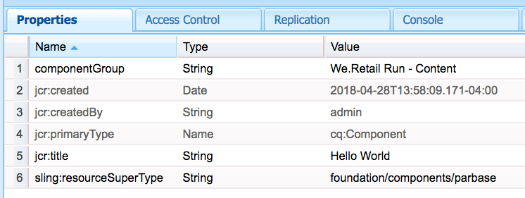

# 开发AEM Screens的自定义组件 {#developing-a-custom-component-for-aem-screens}

以下教程介绍了为AEM Screens创建自定义组件的步骤。 AEM Screens可重复使用其他AEM产品的许多现有设计模式和技术。 本教程重点介绍了为AEM Screens开发时的差异和特殊注意事项。

## 概述 {#overview}

本教程面向不熟悉AEM Screens的开发人员。 在本教程中，将为AEM Screens中的序列渠道构建一个简单的“Hello World”组件。 通过对话框，作者可以更新显示的文本。


## 前提条件 {#prerequisites}

要完成本教程，需要执行以下操作：

1. [AEM 6.5](https://helpx.adobe.com/cn/experience-manager/6-4/release-notes.html) 或 [AEM 6.3](https://helpx.adobe.com/cn/experience-manager/6-3/release-notes.html) +最新Screens功能包

1. [AEM Screens 播放器](https://helpx.adobe.com/experience-manager/6-4/sites/deploying/using/configuring-screens-introduction.html)
1. 本地开发环境

使用执行教程步骤和屏幕截图 **CRXDE-Lite**. IDE也可用于完成本教程。 有关使用IDE开发的详细信息 [使用AEM可在此处找到。](https://helpx.adobe.com/experience-manager/kt/sites/using/getting-started-wknd-tutorial-develop/part1.html#eclipse-ide)


## 项目设置 {#project-setup}

屏幕项目的源代码通常作为多模块Maven项目进行管理。 为了加快教程，使用预生成了一个项目 [AEM项目原型13](https://github.com/Adobe-Marketing-Cloud/aem-project-archetype). 更多详细信息 [可在此处找到使用Maven AEM项目原型创建项目的内容](https://helpx.adobe.com/experience-manager/kt/sites/using/getting-started-wknd-tutorial-develop/part1.html#maven-multimodule).

1. 使用下载并安装以下包 [CRX包管理器](http://localhost:4502/crx/packmgr/index.jsp)：

[获取文件](assets/base-screens-weretail-runuiapps-001-snapshot.zip)

   [获取文件](assets/base-screens-weretail-runuicontent-001-snapshot.zip)
   **（可选）** 如果使用Eclipse或其他IDE，请下载以下源包。 使用Maven命令将项目部署到本地AEM实例：

   **`mvn -PautoInstallPackage clean install`**

   启动HelloWorld SRC Screens We.Retail运行项目

[获取文件](assets/src-screens-weretail-run.zip)

1. In [CRX包管理器](http://localhost:4502/crx/packmgr/index.jsp) 验证是否安装了以下两个软件包：

   1. **screens-weretail-run.ui.content-0.0.1-SNAPSHOT.zip**
   1. **screens-weretail-run.ui.apps-0.0.1-SNAPSHOT.zip**

   

   Screens We.Retail运行通过CRX包管理器安装的Ui.Apps和Ui.Content包

1. 此 **screens-weretail-run.ui.apps** 软件包在下方安装代码 `/apps/weretail-run`.

   此包包含用于呈现项目自定义组件的代码。 此包中包含组件代码以及所需的任何JavaScript或CSS。 此包还嵌入了 **screens-weretail-run.core-0.0.1-SNAPSHOT.jar** ，其中包含项目所需的任何Java代码。

   >[!NOTE]
   >
   >在本教程中，不会编写任何Java代码。 如果需要更复杂的业务逻辑，可以使用核心Java捆绑包创建和部署后端Java。

   

   ui.apps代码的CRXDE Lite表示形式

   此 **地狱世界** 组件当前只是一个占位符。 在本教程中，将添加功能，以便作者更新组件显示的消息。

1. 此 **screens-weretail-run.ui.content** 软件包在下方安装代码：

   * `/conf/we-retail-run`
   * `/content/dam/we-retail-run`
   * `/content/screens/we-retail-run`

   此资源包包含项目所需的起始内容和配置结构。 **`/conf/we-retail-run`** 包含We.Retail运行项目的所有配置。 **`/content/dam/we-retail-run`** 包括项目的开始数字资产。 **`/content/screens/we-retail-run`** 包含Screens内容结构。 所有这些路径下的内容主要在AEM中更新。 为了提高环境（本地、开发、暂存、生产）之间的一致性，通常将基本内容结构保存在源代码控制中。

1. **导航到AEM Screens > We.Retail运行项目：**

   从AEM的“开始”菜单>单击屏幕图标。 验证是否可以看到We.Retail运行项目。

   

## 创建Hello World组件 {#hello-world-cmp}

Hello World组件是一个简单的组件，允许用户输入要在屏幕上显示的消息。 该组件基于 [AEM Screens组件模板：https://github.com/Adobe-Marketing-Cloud/aem-screens-component-template](https://github.com/Adobe-Marketing-Cloud/aem-screens-component-template).

AEM Screens有一些有趣的限制，对于传统WCM Sites组件不一定是这样。

* 大多数Screens组件需要在目标数字标牌设备上全屏运行
* 大多数Screens组件需要嵌入到序列渠道中才能生成幻灯片
* 创作应允许编辑序列渠道中的各个组件，因此无法在全屏上渲染它们

1. In **CRXDE-Lite** `http://localhost:4502/crx/de/index.jsp` （或选择的IDE）导航到 `/apps/weretail-run/components/content/helloworld.`

   将以下属性添加到 `helloworld` 组件：

   ```
       jcr:title="Hello World"
       sling:resourceSuperType="foundation/components/parbase"
       componentGroup="We.Retail Run - Content"
   ```

   

   /apps/weretail-run/components/content/helloworld的属性

   此 **地狱世界** 组件扩展 **foundation/components/parbase** 组件，以便能够在序列渠道中正确使用它。

1. 在下创建文件 `/apps/weretail-run/components/content/helloworld` 已命名 `helloworld.html.`

   使用以下内容填充文件：

   ```xml
   <!--/*
   
    /apps/weretail-run/components/content/helloworld/helloworld.html
   
   */-->
   
   <!--/* production: preview authoring mode + unspecified mode (i.e. on publish) */-->
   <sly data-sly-test.production="${wcmmode.preview || wcmmode.disabled}" data-sly-include="production.html" />
   
   <!--/* edit: any other authoring mode, i.e. edit, design, scaffolding, etc. */-->
   <sly data-sly-test="${!production}" data-sly-include="edit.html" />
   ```

   Screens组件需要两种不同的渲染，具体取决于哪种 [创作模式](https://helpx.adobe.com/experience-manager/6-4/sites/authoring/using/author-environment-tools.html#PageModes) 正在使用：

   1. **生产**：预览或发布模式(wcmmode=disabled)
   1. **编辑**：用于所有其他创作模式，即编辑、设计、基架、开发人员……

   `helloworld.html`充当开关，检查哪个创作模式当前处于活动状态并重定向到另一个HTL脚本。 Screens组件使用的常见约定是 `edit.html` 编辑模式脚本和 `production.html` 生产模式的脚本。

1. 在下创建文件 `/apps/weretail-run/components/content/helloworld` 已命名 `production.html.`

   使用以下内容填充文件：

   ```xml
   <!--/*
    /apps/weretail-run/components/content/helloworld/production.html
   
   */-->
   
   <div data-duration="${properties.duration}" class="cmp-hello-world">
    <h1 class="cmp-hello-world__message">${properties.message}</h1>
   </div>
   ```

   以上是Hello World组件的生产标记。 A `data-duration` 属性包含在内，因为组件在序列渠道上使用。 此 `data-duration` 属性由序列渠道用来了解序列项目要显示多长时间。

   组件渲染 `div` 和 `h1` 标记和文本。 `${properties.message}` 是HTL脚本的一部分，将输出名为的JCR属性的内容 `message`. 稍后将创建一个对话框，允许用户为 `message` 属性文本。

   另请注意，组件使用了BEM（块要素修改量）表示法。 BEM是一种CSS编码约定，它使创建可重用组件变得更加容易。 BEM是使用的表示法 [AEM核心组件](https://github.com/Adobe-Marketing-Cloud/aem-core-wcm-components/wiki/CSS-coding-conventions). <!-- DEAD LINK More info can be found at: [https://getbem.com/](https://getbem.com/) -->

1. 在下创建文件 `/apps/weretail-run/components/content/helloworld` 已命名 `edit.html.`

   使用以下内容填充文件：

   ```xml
   <!--/*
   
    /apps/weretail-run/components/content/helloworld/edit.html
   
   */-->
   
   <!--/* if message populated */-->
   <div
    data-sly-test.message="${properties.message}"
    class="aem-Screens-editWrapper cmp-hello-world">
    <p class="cmp-hello-world__message">${message}</p>
   </div>
   
   <!--/* empty place holder */-->
   <div data-sly-test="${!message}"
        class="aem-Screens-editWrapper cq-placeholder cmp-hello-world"
        data-emptytext="${'Hello World' @ i18n, locale=request.locale}">
   </div>
   ```

   上面是Hello World组件的编辑标记。 如果填充了对话框消息，则第一个块将显示组件的编辑版本。

   如果没有输入对话框消息，则会呈现第二个块。 此 `cq-placeholder` 和 `data-emptytext` 渲染标签 ***《你好世界》*** 作为这种情况的占位符。 可以使用i18n国际化标签的字符串，以支持在多个区域设置中进行创作。

1. **复制Screens图像对话框以用于Hello World组件。**

   最简单的方法是从现有对话框开始，然后进行修改。

   1. 从以下位置复制对话框： `/libs/screens/core/components/content/image/cq:dialog`
   1. 将对话框粘贴到下 `/apps/weretail-run/components/content/helloworld`

   

1. **更新Hello World对话框以包含消息的选项卡。**

   更新对话框，使其与以下内容匹配。 JCR节点结构的最后一个对话框以XML形式显示如下：

   ```xml
   <?xml version="1.0" encoding="UTF-8"?>
   <jcr:root xmlns:sling="https://sling.apache.org/jcr/sling/1.0" xmlns:cq="https://www.day.com/jcr/cq/1.0" xmlns:jcr="https://www.jcp.org/jcr/1.0" xmlns:nt="https://www.jcp.org/jcr/nt/1.0"
       jcr:primaryType="nt:unstructured"
       jcr:title="Hello World"
       sling:resourceType="cq/gui/components/authoring/dialog">
       <content
           jcr:primaryType="nt:unstructured"
           sling:resourceType="granite/ui/components/coral/foundation/tabs"
           size="L">
           <items jcr:primaryType="nt:unstructured">
               <message
                   jcr:primaryType="nt:unstructured"
                   jcr:title="Message"
                   sling:resourceType="granite/ui/components/coral/foundation/fixedcolumns">
                   <items jcr:primaryType="nt:unstructured">
                       <column
                           jcr:primaryType="nt:unstructured"
                           sling:resourceType="granite/ui/components/coral/foundation/container">
                           <items jcr:primaryType="nt:unstructured">
                               <message
                                   jcr:primaryType="nt:unstructured"
                                   sling:resourceType="granite/ui/components/coral/foundation/form/textfield"
                                   fieldDescription="Message for component to display"
                                   fieldLabel="Message"
                                   name="./message"/>
                           </items>
                       </column>
                   </items>
               </message>
               <sequence
                   jcr:primaryType="nt:unstructured"
                   jcr:title="Sequence"
                   sling:resourceType="granite/ui/components/coral/foundation/fixedcolumns">
                   <items jcr:primaryType="nt:unstructured">
                       <column
                           jcr:primaryType="nt:unstructured"
                           sling:resourceType="granite/ui/components/coral/foundation/container">
                           <items jcr:primaryType="nt:unstructured">
                               <duration
                                   jcr:primaryType="nt:unstructured"
                                   sling:resourceType="granite/ui/components/coral/foundation/form/numberfield"
                                   defaultValue=""
                                   fieldDescription="Amount of time the image will be shown in the sequence, in milliseconds"
                                   fieldLabel="Duration (ms)"
                                   min="0"
                                   name="./duration"/>
                           </items>
                       </column>
                   </items>
               </sequence>
           </items>
       </content>
   </jcr:root>
   ```

   消息的textfield将保存到名为的属性 `message` 并且Duration的数字字段将保存到名为的属性 `duration`. 这两个资产均引用自 `/apps/weretail-run/components/content/helloworld/production.html` 由HTL作为 `${properties.message}` 和 `${properties.duration}`.

   

   Hello World — 已完成的对话框

## 创建客户端库 {#clientlibs}

客户端库提供了一种机制，用于组织和管理AEM实施所需的CSS和JavaScript文件。

AEM Screens组件在编辑模式与预览/生产模式中的呈现方式有所不同。 将创建两个客户端库，一个用于编辑模式，另一个用于预览/生产模式。

1. 为Hello World组件的客户端库创建文件夹。

   下方 `/apps/weretail-run/components/content/helloworld`新建一个名为的文件夹 `clientlibs`.

   

1. 在 `clientlibs` 文件夹创建一个名为的新节点 `shared` 类型 `cq:ClientLibraryFolder.`

   

1. 将以下属性添加到共享客户端库：

   * `allowProxy` | 布尔型 | `true`

   * `categories`| 字符串[] | `cq.screens.components`

   

   /apps/weretail-run/components/content/helloworld/clientlibs/shared的属性

   categories属性是用于标识客户端库的字符串。 cq.screens.componentscategory在“编辑”和“预览/生产”模式下使用。 因此，在sharedclientlib中定义的任何CSS/JS都将以所有模式加载。

   最佳做法是绝不要在生产环境中向/apps直接公开任何路径。 allowProxy属性确保通过前缀of/etc.clientlibs引用客户端库CSS和JS。

1. 创建名为的文件 `css.txt` 在共享文件夹下。

   使用以下内容填充文件：

   ```
   #base=css
   
   styles.less
   ```

1. 创建名为的文件夹 `css` 在 `shared` 文件夹。 添加名为的文件 `style.less` 在 `css` 文件夹。 客户端库的结构现在应如下所示：

   

   本教程不直接编写CSS，而是使用LESS。 [更少](https://lesscss.org/) 是支持CSS变量、mixin和函数的常用CSS预编译器。 AEM客户端库本机支持LESS编译。 可以使用Sass或其他预编译器，但需要在AEM外部编译。

1. 填充 `/apps/weretail-run/components/content/helloworld/clientlibs/shared/css/styles.less` ，如下所示：

   ```css
   /**
       Shared Styles
      /apps/weretail-run/components/content/helloworld/clientlibs/shared/css/styles.less
   
   **/
   
   .cmp-hello-world {
       background-color: #fff;
   
    &__message {
     color: #000;
     font-family: Helvetica;
     text-align:center;
    }
   }
   ```

1. 复制并粘贴 `shared` 用于创建新客户端库的客户端库文件夹，名为 `production`.

   

   复制共享客户端库以创建新的生产客户端库

1. 更新 `categories` 要成为的生产客户端库的属性 `cq.screens.components.production.`

   这可确保仅在“预览”/“生产”模式下加载样式。

   

   /apps/weretail-run/components/content/helloworld/clientlibs/production的属性

1. 填充 `/apps/weretail-run/components/content/helloworld/clientlibs/production/css/styles.less` ，如下所示：

   ```css
   /**
       Production Styles
      /apps/weretail-run/components/content/helloworld/clientlibs/production/css/styles.less
   
   **/
   .cmp-hello-world {
   
       height: 100%;
       width: 100%;
       position: fixed;
   
    &__message {
   
     position: relative;
     font-size: 5rem;
     top:25%;
    }
   }
   ```

   上述样式将在屏幕中间居中显示消息，但仅在生产模式下显示。

第三种clientlibrary类别： `cq.screens.components.edit` 可用于向组件添加仅用于编辑的特定样式。

| Clientlib类别 | 用途 |
|---|---|
| `cq.screens.components` | 在编辑模式和生产模式之间共享的样式和脚本 |
| `cq.screens.components.edit` | 仅在编辑模式下使用的样式和脚本 |
| `cq.screens.components.production` | 仅在生产模式下使用的样式和脚本 |

## 创建设计页面 {#design-page}

AEM Screens使用 [静态页面模板](https://helpx.adobe.com/cn/experience-manager/6-5/sites/developing/using/page-templates-static.html) 和 [设计配置](https://helpx.adobe.com/experience-manager/6-4/sites/authoring/using/default-components-designmode.html) 实现全球变革。 设计配置通常用于为通道上的Parsys配置允许的组件。 最佳做法是以特定于应用程序的方式存储这些配置。

在We.Retail运行设计页面的下方，将创建用于存储特定于We.Retail运行项目的所有配置。

1. In **CRXDE-Lite** `http://localhost:4502/crx/de/index.jsp#/apps/settings/wcm/designs` 导航到 `/apps/settings/wcm/designs`
1. 在designs文件夹下创建一个新节点，名为 `we-retail-run` 具有类型 `cq:Page`.
1. 在 `we-retail-run` 页面，添加另一个名为的节点 `jcr:content` 类型 `nt:unstructured`. 将以下属性添加到 `jcr:content` 节点：

   | 名称 | 类型 | 价值 |
   |---|---|---|
   | jcr:title | 字符串 | We.Retail运行 |
   | sling:resourceType | 字符串 | wcm/core/components/designer |
   | cq：doctype | 字符串 | html_5 |

   

   位于/apps/settings/wcm/designs/we-retail-run的设计页面

## 创建序列渠道 {#create-sequence-channel}

Hello World组件将用于序列频道。 要测试组件，将创建一个新的序列渠道。

1. 从AEM的“开始”菜单，导航至 **Screens** > **We.Retail Ru** n >并选择 **渠道**.

1. 单击 **创建** 按钮

   1. 选择 **创建实体**

   

1. 在“创建”向导中：

1. 模板步骤 — 选择 **序列渠道**

   1. 属性步骤
   * 基本选项卡>标题= **空闲频道**
   * 渠道选项卡>检查 **使渠道联机**

   

1. 打开空闲渠道的页面属性。 更新设计字段以指向 `/apps/settings/wcm/designs/we-retail-run,`在上一部分中创建的设计页面。

   

   指向/apps/settings/wcm/designs/we-retail-run的设计配置

1. 编辑新创建的空闲渠道以将其打开。

1. 将页面模式切换到 **设计** 模式

   1. 单击 **扳手** Parsys中用于配置允许的组件的图标

   1. 选择 **Screens** 组和 **We.Retail运行 — 内容** 组。

   

1. 将页面模式切换到 **编辑**. Hello World组件现在可以添加到页面中，并与其他序列渠道组件相结合。

   

1. In **CRXDE-Lite** `http://localhost:4502/crx/de/index.jsp#/apps/settings/wcm/designs/we-retail-run/jcr%3Acontent/sequencechannel/par` 导航到 `/apps/settings/wcm/designs/we-retail-run/jcr:content/sequencechannel/par`. 请注意 `components` 资产现在包括 `group:Screens`， `group:We.Retail Run - Content`.

   

   在/apps/settings/wcm/designs/we-retail-run下设计配置

## 自定义处理程序的模板 {#custom-handlers}

如果您的自定义组件使用外部资源，如资源（图像、视频、字体、图标等）、特定的资源演绎版或客户端库（css、js等），则这些资源不会自动添加到离线配置中，因为默认情况下我们只捆绑HTML标记。

为了让您自定义和优化下载到播放器的确切资产，我们为自定义组件提供了一个扩展机制，以向Screens中的离线缓存逻辑公开其依赖关系。

以下部分展示了自定义离线资源处理程序的模板以及 `pom.xml` 特定项目的。

```java
package …;

import javax.annotation.Nonnull;

import org.apache.felix.scr.annotations.Component;
import org.apache.felix.scr.annotations.Reference;
import org.apache.felix.scr.annotations.Service;
import org.apache.sling.api.resource.Resource;
import org.apache.sling.api.resource.ResourceUtil;
import org.apache.sling.api.resource.ValueMap;

import com.adobe.cq.screens.visitor.OfflineResourceHandler;

@Service(value = OfflineResourceHandler.class)
@Component(immediate = true)
public class MyCustomHandler extends AbstractResourceHandler {

 @Reference
 private …; // OSGi services injection

 /**
  * The resource types that are handled by the handler.
  * @return the handled resource types
  */
 @Nonnull
 @Override
 public String[] getSupportedResourceTypes() {
     return new String[] { … };
 }

 /**
  * Accept the provided resource, visit and traverse it as needed.
  * @param resource The resource to accept
  */
 @Override
 public void accept(@Nonnull Resource resource) {
     ValueMap properties = ResourceUtil.getValueMap(resource);
     
     /* You can directly add explicit paths for offline caching using the `visit`
        method of the visitor. */
     
     // retrieve a custom property from the component
     String myCustomRenditionUrl = properties.get("myCustomRenditionUrl", String.class);
     // adding that exact asset/rendition/path to the offline manifest
     this.visitor.visit(myCustomRenditionUrl);
     
     
     /* You can delegate handling for dependent resources so they are also added to
        the offline cache using the `accept` method of the visitor. */
     
     // retrieve a referenced dependent resource
     String referencedResourcePath = properties.get("myOtherResource", String.class);
     ResourceResolver resolver = resource.getResourceResolver();
     Resource referencedResource = resolver.getResource(referencedResourcePath);
     // let the handler for that resource handle it
     if (referencedResource != null) {
         this.visitor.accept(referencedResource);
     }
   }
}
```

以下代码提供了 `pom.xml` 对于该特定项目：

```css
   <dependencies>
        …
        <!-- Felix annotations -->
        <dependency>
            <groupId>org.apache.felix</groupId>
            <artifactId>org.apache.felix.scr.annotations</artifactId>
            <version>1.9.0</version>
            <scope>provided</scope>
        </dependency>

        <!-- Screens core bundle with OfflineResourceHandler/AbstractResourceHandler -->
        <dependency>
            <groupId>com.adobe.cq.screens</groupId>
            <artifactId>com.adobe.cq.screens</artifactId>
            <version>1.5.90</version>
            <scope>provided</scope>
        </dependency>
        …
      </dependencies>
```

## 融于一起 {#putting-it-all-together}

以下视频展示了已完成的组件以及如何将其添加到序列渠道。 然后，该渠道会添加到位置显示中，并最终分配给Screens播放器。

>[!VIDEO](https://video.tv.adobe.com/v/22385?quaity=9)

## 嵌入其他页面或片段的自定义组件的其他注意事项 {#additional-considerations}

如果您正在开发的自定义组件旨在包含其他页面或体验片段，并且如果您希望播放器自动提取嵌入内容中的更改而无需重新发布渠道，则需要考虑以下2个限制：

1. 而不是直接扩展 `foundation/components/parbase`，则必须扩展 `screens/core/components/content/page` 或 `screens/core/components/content/experiencefragment`
2. 用于引用嵌入内容的属性的名称需要是 `pagePath`

利用这2个Screens核心组件还可以获得额外的好处，即它们可以捆绑您需要的一些依赖项（客户端库、字体等） 通过“组件”对话框中的离线配置选项，这可以减轻为此而必须使用的任何自定义离线处理程序的责任，有时甚至可以完全消除第一次使用离线处理程序的需要。

## 完成的代码 {#finished-code}

以下是教程中完成的代码。 此 **screens-weretail-run.ui.apps-0.0.1-SNAPSHOT.zip** 和 **screens-weretail-run.ui.content-0.0.1-SNAPSHOT.zip** 是编译的AEM包。 **SRC-screens-weretail-run-0.0.1.zip **是可以使用Maven部署的未编译源代码。

[获取文件](assets/screens-weretail-runuiapps-001-snapshot.zip)

[获取文件](assets/screens-weretail-runuicontent-001-snapshot.zip)

[获取文件](assets/screens-weretail-run.zip)
