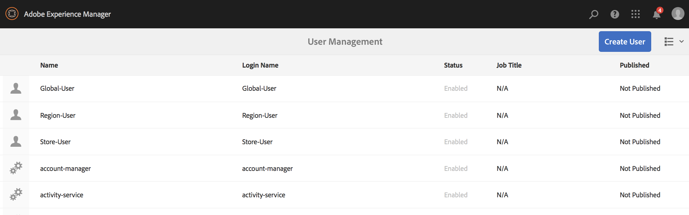
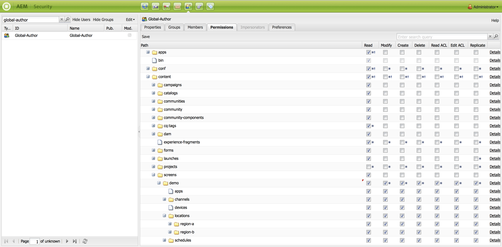
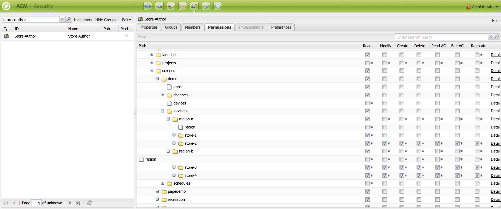

# 使用动态嵌入式序列 {#using-dynamic-embedded-sequence}

使用动态嵌入式序列涵盖以下主题：

* **概述**
* **在AEM Screens中使用动态嵌入式体验**
* **查看结果**
* **限制用户和修改ACL**

## 概述 {#overview}

***动态嵌入式序列*** 为遵循父子层次结构的大型项目创建，其中子项在位置文件夹内引用，而不是在渠道文件夹内引用。 它允许用户通过以下方式在渠道中嵌入序列 ***渠道角色***. 它让用户可以使用主渠道中的嵌入式序列，为不同的办公室定义特定于位置的占位符。

在为显示分配渠道时，您可以选择指定显示的路径。 或者，您可以指定按上下文解析为实际渠道的渠道角色。

要使用动态嵌入式序列，可通过以下方式分配渠道 ***渠道角色***. 渠道角色定义显示的上下文。 该角色可定向各种操作，且独立于履行该角色的实际渠道。 本节介绍按角色定义渠道的用例，以及如何将该内容应用于全局渠道。 您还可以将角色视为分配的标识符，或者在上下文中视为渠道的别名。

### 使用动态嵌入式序列的优势 {#benefits-of-using-dynamic-embedded-sequences}

将序列渠道放在位置而非渠道文件夹中可允许本地或区域作者编辑与其相关的内容。 它还允许限制它编辑层次结构中较高位置的渠道。

引用 *渠道（按角色）*，可创建渠道的本地版本。 这样做可动态解析特定于位置的内容，还可以让您创建全局渠道，并将该内容用于特定于位置的渠道。

>[!NOTE]
>
>**嵌入式序列与动态嵌入式序列**
>
>动态嵌入式序列类似于嵌入式序列，但允许用户遵循某个层次结构，在该层次结构中，对一个渠道所做的更改和更新会传播到相关的其他渠道中。 它遵循父子层次结构，并且还包括图像或视频等资产。
>
>***动态嵌入式序列*** 允许您显示特定于位置的内容，而 ***嵌入式序列*** 仅显示内容的常规幻灯片。 此外，在设置动态嵌入式序列时，请使用渠道角色和名称配置渠道。 请参阅以下步骤以进行实际实施。
>
>要了解有关实现嵌入序列的详细信息，请参阅 [嵌入式序列](embedded-sequences.md) 在AEM Screens中。

以下示例通过关注以下关键术语提供了解决方案：

* a ***主序列渠道*** 对于全局序列。
* ***动态嵌入式序列*** 序列中每个可本地自定义部分的组件。
* ***单个序列通道*** 在各个位置，具有 *角色* 在显示中，与 **动态嵌入式序列组件的 *角色***.

>[!NOTE]
>
>要了解有关渠道分配的更多信息，请参阅 **[渠道分配](channel-assignment.md)** 在AEM Screens文档的“创作”部分下。

## 使用动态嵌入式序列 {#using-dynamic-embedded-sequence-2}

以下部分介绍如何在AEM Screens渠道中创建动态嵌入式序列。

### 先决条件 {#prerequisites}

在开始实施此功能之前，请确保具备以下先决条件以便开始实施动态嵌入式序列：

* 创建一个AEM Screens项目(在此示例中， **演示**)。
* 创建 **全局** 下的渠道 **渠道** 文件夹。
* 将内容添加到您的 **全局** 渠道(*Check **Resources.zip**相关资产的*)。

下图显示了 **演示** 使用的项目 **全局** 中的渠道 **渠道** 文件夹。

### 资源 {#resources}

您可以下载以下资源（图像并将它们添加到资产），然后进一步将它们用作渠道内容以进行演示。

[获取文件](assets/resources.zip)

>[!NOTE]
>
>有关如何创建项目以及如何创建序列渠道的其他信息，请参阅以下资源：
>
>* **[创建和管理项目](creating-a-screens-project.md)**
>* **[管理渠道](managing-channels.md)**
>

在AEM Screens项目中实施动态嵌入式序列涉及三个主要任务：

1. **设置项目分类，包括渠道、位置和显示**
1. **创建时间表**
1. **为每次显示分配计划**

请按照以下步骤实施该功能：

>[!CAUTION]
>
>实施动态嵌入式序列时，请小心 **名称** 和 **标题** 在每个位置下创建渠道时显示的字段。 请仔细按照命名法上的说明进行操作。

1. **创建两个位置文件夹。**

   导航到 **位置** AEM Screens创建两个位置文件夹作为 **区域A** 和 **区域B**.

   >[!NOTE]
   >
   >创建 **区域A** 位置文件夹，确保输入 **标题** 作为 **区域A** 你可以离开 **名称** 字段为空，因此自动 **区域a** 已选取名称。
   >
   >与创建位置文件夹的情况类似 **区域B**，如下所示：

   

   >[!NOTE]
   >要了解如何创建位置，请参阅 **[创建和管理位置](managing-locations.md)**.

1. **在每个位置文件夹下创建两个位置和一个渠道。**

   1. 导航到 **演示** > **位置** > **区域A**.
   1. 单击 **区域A** 并单击 **+创建** 从操作栏中。
   1. 单击 **位置** 从向导，使用 **标题** 作为 **商店1**. 同样，从向导创建另一个位置，标题为 **商店2** 使用 **标题** 作为 **商店2**. 您可以离开 **名称** 创建时字段为空 **商店1** 和 **商店2**.
   1. 重复步骤(b)，现在单击 **序列渠道** 从向导中。 输入 **标题** 作为 **区域A** 和 **名称** 作为 **区域** 用于此渠道。

   >[!CAUTION]
   >
   >确保在创建渠道时 **区域A**，输入 **标题** 作为 **区域A** 和 **名称** as a **区域**.

   

   同样，在下创建两个位置 **区域B** 标题为 **商店3** 和 **商店4**. 此外，创建 **序列渠道** 替换为 **标题** 作为 **区域B** 和 **名称** 作为 **区域**.

   >[!CAUTION]
   >
   >确保您对在中创建的渠道可以使用相同的名称 **区域A** 和 **区域B** 作为 **区域**.

   

1. **在每个位置下创建显示和渠道。**

   1. 导航到 **演示** > **位置** > **区域A** > **商店1**.
   1. 单击 **商店1** 并单击 **+创建** 从操作栏中。
   1. 单击 **显示** 从向导中创建 **`Store1Display`**.
   1. 重复步骤(b)，这次单击 **序列渠道** 从向导中。 输入 **标题** 作为 **`Store1Channel`** 和 **名称** 作为 **存储**.

   >[!CAUTION]
   >
   >创建序列渠道( **标题** 可以按您的要求使用，但 **名称** 所有本地渠道中的内容应该相同。
   >在此示例中，位于以下位置的渠道 **区域A** 和 **区域B** 共享 **名称** 作为 **区域** 下的和渠道 **`Store 1`**， **`Store 2`**， **`Store 3`**、和 **`Store 4`** 共享 **名称** 作为 **存储**.

   

   同样，创建显示为 **`Store2Display`** 和渠道 **`Store2Channel`** 下 **`Store `2** (名称为 **存储**)。

   >[!NOTE]
   >确保您对在中创建的渠道可以使用相同的名称 **`Store 1`** 和 **`Store 2`** 作为 **存储**.

   

   请按照上述步骤进行操作，以便创建渠道并显示 **`Store 3`** 和 **`Store 4`** 下 **区域B**. 再次重申，确保使用相同的 **名称** 作为 **存储** 创建渠道时 **`Store3Channel`** 和 **`Store4Channel`** 的量度。

   下图显示了中的显示区和渠道 **`Store 3`**.

   

   下图显示了中的显示区和渠道 **`Store 4`**.

   

1. **将内容添加到各自位置的渠道中。**

   导航至 **演示** > **位置** > **区域A** > **区域A** 并单击 **编辑** 从操作栏中。 拖放要添加到渠道的资产。

   >[!NOTE]
   >您可以使用 ***Resources.zip*** 文件来自 **资源** 部分，将图像用作渠道内容的资产。

   

   同样，导航到 **演示** > **位置** > **区域B** > **区域B** 并单击 **编辑** 将资产拖放到渠道中，如下所示：

   

   按照上述步骤和资源操作，以便您可以将内容添加到以下渠道：

   * **`Store1Channel`**
   * **`Store2Channel`**
   * **`Store3Channel`**
   * **`Store4Channel`**

1. **创建计划**

   导航并单击 **时间表** AEM Screens文件夹。 然后单击 **创建** 从操作栏中。

   下图显示了 **AdSchedule** 在中创建 **演示** 项目。

   

1. **将渠道分配给计划**

   1. 导航到 **演示** > **时间表** > **AdSchedule** 并单击 **仪表板** 从操作栏中。
   1. 单击 **+分配渠道** 从 **已分配渠道** 面板，以便您打开 **渠道分配** 对话框。
   1. 单击 **引用渠道** 按路径。
   1. 单击 **渠道路径**，就像 **演示** > ***渠道*** > ***全局***.
   1. 输入 **渠道角色**，就像 **全局广告区段**.
   1. 单击 **受支持的事件**，就像 **初始加载**， **空闲屏幕**、和 **用户交互**.
   1. 单击&#x200B;**保存**。

   **按地区角色分配渠道：**

   1. 单击 **+分配渠道** 从 **已分配渠道** 面板。
   1. 在渠道分配对话框中，单击 **引用渠道** 按名称。
   1. 输入 **渠道名称** 作为 **区域***.
   1. 输入 **渠道角色** 作为 **RegionAdSegment**.
   1. 单击&#x200B;**保存**。

   **按角色为存储分配渠道：**

   1. 单击 **+分配渠道** 从 **已分配渠道** 面板。
   1. 在渠道分配对话框中，单击 **引用渠道** 按名称。
   1. 输入 **渠道名称** 作为 **存储**.
   1. 输入 **渠道角色** 作为 **StoreAdSegment**.
   1. 单击&#x200B;**保存**。

   下图显示了按路径和角色分配的渠道。

   

1. **正在配置全局通道的动态嵌入式序列。**

   导航至 **全局** 您最初在中创建的渠道 **演示** 项目。

   单击 **编辑** 从操作栏中。

   

   在编辑器中，拖放两个 **动态嵌入式序列** 渠道编辑器中的组件。

   打开其中一个组件的属性，然后输入 **渠道分配角色** 作为 **RegionAdSegment**.

   同样，单击其他组件并打开属性以输入 **渠道分配角色** 作为 **StoreAdSegment**.

   

1. **为每次显示分配计划**

   1. 导航到每个显示区，如 **演示** > **位置** > **区域A** >**商店1** >**`Store1Display`**.
   1. 单击 **仪表板** 从操作栏中。
   1. 在功能板上，单击 **...** 从 **已分配的渠道和计划** 面板，然后单击 **+分配计划**.
   1. 单击计划的路径(例如，此处， **演示** > **时间表** > **AdSchedule**)。
   1. 单击&#x200B;**保存**。

## 查看结果 {#viewing-the-results}

完成渠道设置并显示后，启动AEM Screens Player以查看内容。

>[!NOTE]
>
>要了解AEM Screens Player，请参阅以下资源：
>
>* [下载AEM Screens Player](https://download.macromedia.com/screens/)
>* [使用AEM Screens Player](working-with-screens-player.md)

以下输出根据显示路径，确认您在AEM Screens Player中的渠道内容。

**场景1**：

如果将显示路径分配为 **演示** > **位置** > **区域A** > **商店1** > **`Store1Display`**，则您的AEM Screens播放器上显示以下内容。

**场景1**：

如果将显示路径分配为 **演示** > **位置** > **区域B** > **商店3** > **`Store3Display`**，则您的AEM Screens播放器上显示以下内容。

## 限制用户和修改ACL {#restricting-users-and-modifying-the-acls}

您可以创建全局、区域或本地作者来编辑与他们相关的内容，同时受限制无法编辑层次结构中较高层的渠道。

编辑ACL ，以便您可以根据它们的位置限制用户对内容的访问。

### 示例用例 {#example-use-case}

以下示例允许您为上述演示项目创建三个用户。

这些权限按如下方式分配给每个组：

**组**：

* **Global-Author**：由对中的所有位置和渠道具有访问权限的用户组成 **演示** 并拥有所有读、写和编辑权限。

* **Region-Author**：包含对具有读取、写入和编辑权限的用户 **区域A** 和 **区域B**.

* **Store-Author**：由只对具有读取、写入和编辑权限的用户组成 **商店1**， **商店2**， **商店3**、和 **商店4**.

#### 创建用户组、用户和设置ACL的步骤 {#steps-for-creating-user-groups-users-and-setting-up-acls}

>[!NOTE]
>
>要详细了解如何使用ACL隔离项目，以便每个个人或团队处理自己的项目，请参阅 **设置ACL**.

按照以下步骤创建组、用户，并根据权限修改ACL：

1. **创建组**

   1. 导航到 **Adobe Experience Manager**.
   1. 单击 **工具** > **安全性** > **组**.
   1. 单击 **创建组** 并输入 **Global-Author** 在 **ID**.
   1. 单击“**保存并关闭**”。

   同样，创建两个其他组，例如 **Region-Author** 和 **Store-Author**.

   

1. **创建用户并将用户添加到组**

   1. 导航到 **Adobe Experience Manager**.
   1. 单击&#x200B;**工具** > **安全** > **用户**。
   1. 单击 **创建用户** 并输入 **全局用户** 在 **ID**.
   1. 输入 **密码** 并确认此用户的密码。
   1. 单击 **组** 选项卡，并在中输入组名称 **单击组**&#x200B;例如，输入 **Global-Author** 添加 **全局用户** 到那个特定的群组。
   1. 单击“**保存并关闭**”。

   同样，创建两个其他用户，例如 **Region-User** 和 **存储用户**，并将它们添加到 **Region-Author** 和 **Store-Author** 的量度。

   >[!NOTE]
   >最佳做法是在组中添加用户，然后向每个特定的用户组分配权限。

   

1. **将所有组添加到参与者**

   1. 导航到 **Adobe Experience Manager**.
   1. 单击 **工具** > **安全性** > **组**.
   1. 单击 **参与者** 从列表中，单击 **成员** 选项卡。
   1. 单击 **组** 例如 **Global-Author**， **Region-Author，** 和 **Store-Author** 贡献者。
   1. 单击“**保存并关闭**”。

1. **访问每个组的权限**

   1. 导航至 *用户管理员* 并使用此UI修改不同组的权限。
   1. 搜索 **Global-Author** 然后单击 **权限** 选项卡，如下图所示。
   1. 同样，您可以访问 **Region-Author** 和 **Store-Author**.

   

1. **修改每个组的权限**

   **对于Global-Author：**

   1. 导航至 **权限** 选项卡
   1. 导航到 ***/content/screens/demo*** 并检查所有权限
   1. 导航到 ***/content/screens/demo/locations*** 并检查所有权限
   1. 导航到 ***/content/screens/demo/locations/region-a*** 并检查所有权限。 同样，检查以下各项的权限： **`region-b`**.

   请参阅下图以了解这些步骤：
   

   以下显示了 **全局用户** 有权访问 **全局渠道**. 并且，可以访问两者 **区域A** 和 **区域B** 全部四间店铺之薪酬如下： **商店1**， **商店2**， **商店3**、和 **商店4**.

   

   **对于Region-Author ：**

   1. 导航至 **权限** 选项卡。
   1. 导航到 ***/content/screens/demo*** 并且只检查 **读取** 权限。
   1. 导航到 ***/content/screens/demo/locations*** 并且只检查 **读取** 权限。
   1. 导航到 ***/content/screens/demo/channels*** 并取消选中以下项的权限： **全局** 渠道。
   1. 导航到 ***/content/screens/demo/locations***/***区域a*** 并检查所有权限。 同样，检查以下各项的权限： **`region-b`**.

   请参阅下图，以便您了解相关步骤：

   

   以下显示了Region-User对两者的访问权限 **区域A** 和 **区域B**. 此外，我们亦可存取四家店铺，即 **商店1**， **商店2**， **商店3**、和 **商店4**，但不访问 **全局** 渠道。

   

   **对于Store-Author：**

   1. 导航至 **权限** 选项卡。
   1. 导航到 ***/content/screens/demo*** 并且只检查 **读取** 权限。
   1. 导航到 ***/content/screens/demo/locations*** 并且只检查 **读取** 权限。
   1. 导航到 ***/content/screens/demo/channels*** 并取消选中以下项的权限： **全局** 渠道。
   1. 导航到 ***/content/screens/demo/locations/region-a*** 并且只检查 **读取** 权限。 同样，仅检查 **读取** 权限： **`region-b`**.
   1. 导航到 ***/content/screens/demo/locations***/***region-a /store-1*** 并检查所有权限。 同样，检查以下各项的权限： **商店2，商店3** 和 **store-4**.

   请参阅下图，以便您了解相关步骤：

   

   以下显示了 **存储用户** 只能访问 **商店1**， **商店2**， **商店3**、和 **商店4**. 但是，它无权访问 **全局** 或区域(**区域A** 和 **区域B**)渠道。

   

>[!NOTE]
>
>要详细了解设置权限，请参阅 [设置ACL](setting-up-acls.md).
