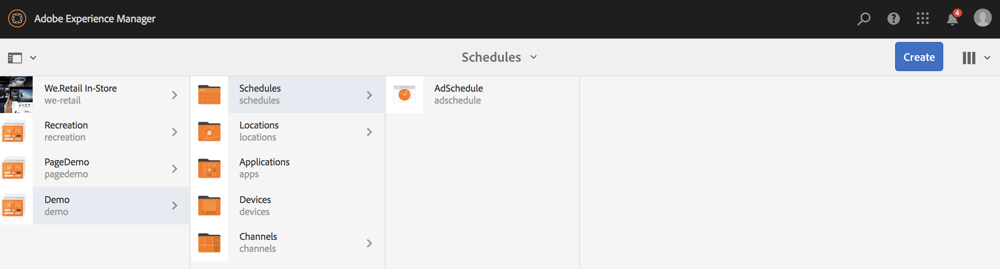

# 使用动态嵌入式序列 {#using-dynamic-embedded-sequence}

使用动态嵌入式序列涵盖以下主题：

* **概述**
* **在AEM Screens中使用动态嵌入式体验**
* **查看结果**
* **限制用户和修改ACL**

## 概述 {#overview}

***为遵循父*** 子层次结构的大型项目创建动态嵌入式序列，其中子项在位置文件夹而不是渠道文件夹中引用。它允许用户通过&#x200B;***渠道角色***&#x200B;在渠道中嵌入序列。 它允许用户使用主渠道中的嵌入式序列为不同办公室定义特定于位置的占位符。

将渠道分配给显示屏时，您可以选择指定显示屏的路径或渠道角色，这些角色将按上下文解析为实际渠道。

要使用动态嵌入式序列，请通过&#x200B;***渠道角色***&#x200B;分配渠道。 渠道角色定义显示的上下文。 角色由各种操作定位，并且与履行角色的实际渠道无关。 此部分描述了一个按角色定义渠道的用例，以及如何将该内容用于全局渠道。您还可以将角色视为分配的标识符，或上下文中渠道的别名。

### 使用动态嵌入式序列的好处{#benefits-of-using-dynamic-embedded-sequences}

将序列渠道放置在位置而不是渠道文件夹中的主要好处是，允许本地或区域作者编辑与其相关的内容，同时限制他们在层次结构中上方编辑渠道。

通过引用&#x200B;*按角色划分的渠道*，可创建渠道的本地版本，以便动态解析特定于位置的内容，并且还允许您创建全局渠道，以利用特定于位置的渠道的内容。

>[!NOTE]
>
>**嵌入式序列与动态嵌入式序列**
>
>动态嵌入式序列类似于嵌入式序列，但允许用户遵循一个层次结构，在该层次结构中，对一个渠道所做的更改/更新会传播到相关的其他渠道中。 它遵循父子层次结构，并且还包括图像或视频等资产。
>
>***动态嵌入*** 式序列允许您显示特定于位置的内容，而嵌 ***入式*** 序列则只显示内容的常规幻灯片放映。此外，在设置动态嵌入式序列时，您需要使用渠道角色和名称配置渠道。 有关实际实施，请参阅以下步骤。
>
>要了解有关实施嵌入式序列的更多信息，请参阅AEM Screens中的[嵌入式序列](embedded-sequences.md)。

以下示例重点介绍以下关键术语，从而提供了解决方案：

* 全局序列的&#x200B;***主序列通道***
* ***用于序*** 列的每个本地可自定义部分的动态嵌入式序列组件
* ***单个序*** 列在相应位置中以与 ** 动态嵌入式序列组件的 **角色匹配的角色 *改变*。**

>[!NOTE]
>
>要了解有关渠道分配的更多信息，请参阅AEM Screens文档创作部分下的&#x200B;**[渠道分配](channel-assignment.md)**。

## 使用动态嵌入式序列 {#using-dynamic-embedded-sequence-2}

以下部分介绍如何在AEM Screens渠道中创建动态嵌入式序列。

### 前提条件 {#prerequisites}

在开始实施此功能之前，请确保您已准备好以下先决条件以开始实施动态嵌入式序列：

* 创建AEM Screens项目（在此示例中为&#x200B;**Demo**）

* 在&#x200B;**Channels**&#x200B;文件夹下创建作为&#x200B;**Global**&#x200B;的渠道

* 向&#x200B;**全局**&#x200B;渠道中添加内容（*请检查&#x200B;**Resources.zip**以获取相关资产*）

下图显示了&#x200B;**渠道**&#x200B;文件夹中具有&#x200B;**Global**&#x200B;渠道的&#x200B;**Demo**项目。

### 资源 {#resources}

您可以下载以下资源（图像并将这些资源添加到资产中），并进一步将这些资源用作渠道内容以进行演示。

[获取文件](assets/resources.zip)

>[!NOTE]
>
>有关如何创建项目以及如何创建序列渠道的其他信息，请参阅以下资源：
>
>* **[创建和管理项目](creating-a-screens-project.md)**
>* **[管理渠道](managing-channels.md)**

>

在AEM Screens项目中实施动态嵌入式序列涉及三个主要任务：

1. **设置项目分类，包括渠道、位置和显示**
1. **创建计划**
1. **将计划分配给每个显示**

请按照以下步骤实施该功能：

>[!CAUTION]
>
>在实施动态嵌入式序列时，请在每个位置下创建渠道时，请注意&#x200B;**名称**&#x200B;和&#x200B;**标题**&#x200B;字段。 请认真按照命名法的说明操作。

1. **创建两个位置文件夹。**

   导航到AEM Screens项目中的&#x200B;**Locations**&#x200B;文件夹，并创建两个位置文件夹，分别作为&#x200B;**Region A**&#x200B;和&#x200B;**Region B**。

   >[!NOTE]
   >
   >在创建&#x200B;**区域A**&#x200B;位置文件夹时，请确保将&#x200B;**标题**&#x200B;输入为&#x200B;**区域A**，并且可以将&#x200B;**名称**&#x200B;字段留空，以便自动选取&#x200B;**区域 — a**&#x200B;名称。
   >
   >类似的情况是，创建位置文件夹&#x200B;**区域B**，如下所示：

   

   >[!NOTE]
   >要了解如何创建位置，请参阅&#x200B;**[创建和管理位置](managing-locations.md)**。

1. **在每个位置文件夹下创建两个位置和一个渠道。**

   1. 导航到&#x200B;**Demo** —> **位置** —> **区域A**。
   1. 选择&#x200B;**区域A**，然后单击操作栏中的&#x200B;**+创建**。
   1. 从向导中选择&#x200B;**位置**，将&#x200B;**标题**&#x200B;作为&#x200B;**存储1**。 同样，从标题为&#x200B;**Store 2**&#x200B;的向导中创建另一个位置，其中&#x200B;**Title**&#x200B;为&#x200B;**Store 2**。 在创建&#x200B;**Store 1**&#x200B;和&#x200B;**Store 2**&#x200B;时，可以将&#x200B;**Name**&#x200B;字段留空。
   1. 重复步骤(b)，现在从向导中选择&#x200B;**序列渠道**。 为此渠道输入&#x200B;**标题**&#x200B;作为&#x200B;**区域A**&#x200B;和&#x200B;**名称**&#x200B;作为&#x200B;**区域**。

   >[!CAUTION]
   >
   >请确保在创建渠道&#x200B;**区域A**&#x200B;时，将&#x200B;**标题**&#x200B;输入为&#x200B;**区域A**，将&#x200B;**名称**&#x200B;输入为&#x200B;**区域**。

   

   同样，在&#x200B;**区域B**&#x200B;下创建两个名为&#x200B;**存储3**&#x200B;和&#x200B;**存储4**&#x200B;的位置。 此外，创建&#x200B;**序列通道**，其中&#x200B;**标题**&#x200B;为&#x200B;**区域B**,**名称**&#x200B;为&#x200B;**区域**。

   >[!CAUTION]
   >
   >请确保可以对在&#x200B;**区域A**&#x200B;和&#x200B;**区域B**&#x200B;中创建的渠道使用相同的名称作为&#x200B;**区域**。

   

1. **在每个位置下创建显示和渠道。**

   1. 导航到&#x200B;**Demo** —> **位置** —> **区域A** —> **存储1**。
   1. 选择&#x200B;**存储1**，然后单击操作栏中的&#x200B;**+创建**。
   1. 从向导中选择&#x200B;**Display**&#x200B;并创建&#x200B;**Store1Display。**
   1. 重复步骤(b)，此时从向导中选择&#x200B;**序列渠道**。 将&#x200B;**标题**&#x200B;输入为&#x200B;**Store1Channel**，将&#x200B;**名称**&#x200B;输入为&#x200B;**store**。

   >[!CAUTION]
   >
   >创建序列渠道时，渠道的&#x200B;**标题**&#x200B;可以作为您的要求，但&#x200B;**名称**在所有本地渠道中应相同。
   >在本例中，**区域A**&#x200B;和&#x200B;**区域B**&#x200B;下的通道与&#x200B;**区域**&#x200B;下的&#x200B;**名称**&#x200B;和&#x200B;**存储1**、**存储2**、**存储3**&#x200B;和&#x200B;**存储16/>下的通道共享相同的**/>将&#x200B;**命名为** store **。**

   

   同样，在&#x200B;**Store 2**&#x200B;下创建&#x200B;**Store2Display**&#x200B;和通道&#x200B;**Store2Channel**（名称为&#x200B;**store**）的显示。

   >[!NOTE]
   >请确保可以对在&#x200B;**Store 1**&#x200B;和&#x200B;**Store 2**&#x200B;中创建的渠道使用与&#x200B;**store**&#x200B;中创建的渠道相同的名称。

   

   按照上述步骤创建通道并显示在&#x200B;**Store 3**&#x200B;和&#x200B;**Store 4**&#x200B;下的&#x200B;**Region B**&#x200B;中。 再次重申，请确保在分别创建渠道&#x200B;**Store3Channel**&#x200B;和&#x200B;**Store4Channel**&#x200B;时，使用与&#x200B;**store**&#x200B;相同的&#x200B;**名称**。

   下图显示了&#x200B;**Store 3**&#x200B;中的显示屏和通道。

   

   下图显示了&#x200B;**Store 4**&#x200B;中的显示屏和通道。

   

1. **将内容添加到渠道各自位置的渠道中。**

   导航到&#x200B;**Demo** -> **位置** -> **区域A** -> **区域A** ，然后单击操作栏中的&#x200B;**编辑**。 将要添加的资产拖放到渠道中。

   >[!NOTE]
   >您可以使用上面&#x200B;**Resources**&#x200B;部分中的&#x200B;***Resources.zip***&#x200B;文件，将图像用作渠道内容的资产。

   

   同样，导航到&#x200B;**Demo** -> **位置** -> **区域B** -> **区域B** ，然后单击操作栏中的&#x200B;**编辑**&#x200B;将资产拖放到您的渠道，如下所示：

   

   按照上述步骤和资源，向以下渠道添加内容：

   * **Store1Channel**
   * **Store2Channel**
   * **Store3Channel**
   * **Store4Channel**

1. **创建计划**

   导航并选择AEM Screens项目中的&#x200B;**Schedules**&#x200B;文件夹，然后单击操作栏中的&#x200B;**创建**&#x200B;以创建新计划。

   下图显示了在&#x200B;**Demo**&#x200B;项目中创建的&#x200B;**AdSchedule**。

   

1. **将渠道分配给计划**

   1. 导航到&#x200B;**Demo** —> **计划** —> **AdSchedule** ，然后单击操作栏中的&#x200B;**功能板**。
   1. 单击&#x200B;**+从**&#x200B;已分配通道&#x200B;**面板中的+分配通道**&#x200B;以打开&#x200B;**通道分配**&#x200B;对话框。
   1. 按路径选择&#x200B;**引用渠道**...。
   1. 选择&#x200B;**渠道路径**&#x200B;作为&#x200B;**Demo** —> ***渠道*** —> ***全局***。
   1. 将&#x200B;**渠道角色**&#x200B;输入为&#x200B;**GlobalAdSegment**。
   1. 选择&#x200B;**支持的事件**&#x200B;作为&#x200B;**初始加载**、**空闲屏幕**&#x200B;和&#x200B;**用户交互**。
   1. 单击&#x200B;**保存**。

   **按角色为区域分配渠道：**

   1. 单击&#x200B;**+从**&#x200B;已分配通道&#x200B;**面板中的+分配通道**&#x200B;以打开&#x200B;**通道分配**&#x200B;对话框。
   1. 选择&#x200B;**引用渠道**.. 按照名称.
   1. 输入&#x200B;**通道名称**&#x200B;作为&#x200B;**区域***。
   1. 将&#x200B;**渠道角色**&#x200B;输入为&#x200B;**RegionAdSegment**。
   1. 单击&#x200B;**保存**。

   **按角色为存储分配渠道：**

   1. 单击&#x200B;**+从**&#x200B;已分配通道&#x200B;**面板中的+分配通道**&#x200B;以打开&#x200B;**通道分配**&#x200B;对话框。
   1. 选择&#x200B;**引用渠道**.. 按照名称.
   1. 输入&#x200B;**通道名称**&#x200B;作为&#x200B;**store**。
   1. 将&#x200B;**渠道角色**&#x200B;输入为&#x200B;**StoreAdSegment**。
   1. 单击&#x200B;**保存**。

   下图显示了按路径和角色分配的渠道。

   

1. **将动态嵌入式序列配置到全局渠道。**

   导航到&#x200B;**Global**&#x200B;渠道，您最初是在&#x200B;**Demo**&#x200B;项目中创建的。

   单击操作中的&#x200B;**编辑**&#x200B;以打开编辑器。

   

   在渠道编辑器中拖放两个&#x200B;**动态嵌入式序列**&#x200B;组件。

   从其中一个组件中打开属性，然后输入&#x200B;**渠道分配角色**&#x200B;作为&#x200B;**RegionAdSegment**。

   同样，选择其他组件并打开属性，以输入&#x200B;**渠道分配角色**&#x200B;作为&#x200B;**StoreAdSegment**。

   

1. **将计划分配给每个显示**

   1. 导航到每个显示屏，如&#x200B;**Demo** —> **位置** —> **区域A** —>**存储1** —>**Store1Display**。
   1. 单击操作中的&#x200B;**功能板**&#x200B;以打开显示功能板。
   1. 单击&#x200B;**...**&#x200B;从&#x200B;**已分配的渠道和计划**&#x200B;面板中，进一步单击&#x200B;**+分配计划**。
   1. 选择计划的路径（例如，此处，**Demo** —> **计划** —>**AdSchedule**）。
   1. 单击&#x200B;**保存**。

## 查看结果{#viewing-the-results}

设置渠道和显示结束后，请启动AEM Screens播放器以查看内容。

>[!NOTE]
>
>要了解AEM Screen Player，请参阅以下资源：
>
>* [AEM Screens播放器下载](https://download.macromedia.com/screens/)
>* [使用AEM Screens Player](working-with-screens-player.md)

以下输出结果会根据显示路径确认您在AEM Screens播放器中的渠道内容。

**场景1**:

如果将显示路径指定为&#x200B;**Demo** —> **位置** —> **区域A** —> **存储1** —> **Store1Display**，则以下内容将显示在您的AEM Screens播放器上。

**场景1**:

如果将显示路径指定为&#x200B;**Demo** —> **位置** —> **区域B** —> **存储3** —> **Store3Display**，则以下内容将显示在您的AEM Screens播放器上。

## 限制用户和修改ACL {#restricting-users-and-modifying-the-acls}

您可以创建全局、区域或本地作者以编辑与他们相关的内容，同时限制他们编辑层次结构中较高层的渠道。

您需要修改ACL以根据用户的位置限制用户对内容的访问。

### 用例{#example-use-case}示例

以下示例允许您为上述演示项目创建三个用户。

将权限分配给每个组如下所示：

**组**:

* **全局作者**:由有权访问Demoproject中所有位置和渠道并具有所 **** 有读取、写入和编辑权限的用户组成。

* **区域 — 作者**:包含对区域和区域B具有读取、写入和编辑 **权** 限 **的用户**。

* **商店 — 作者**:包含只对“存储1”、“存储2”、“存储3”和“ **存储4”拥有读取、写入和编辑权限的用**&#x200B;户，这些用户对“存储1”、“ **存储2”**、“存储3”和“存储4” **具有读取、写入和编辑权限。** ****

#### 创建用户组、用户和设置ACL的步骤{#steps-for-creating-user-groups-users-and-setting-up-acls}

>[!NOTE]
要详细了解如何使用ACL分隔项目，以便每个人或团队都能够处理自己的项目，请参阅&#x200B;**设置ACL**。

按照以下步骤创建组、用户并根据权限修改ACL:

1. **创建群组**

   1. 导航到&#x200B;**Adobe Experience Manager**。
   1. 单击&#x200B;**工具** —> **安全** —> **组**。
   1. 单击&#x200B;**创建组**，然后在&#x200B;**ID**&#x200B;中输入&#x200B;**Global-Author**。
   1. 单击&#x200B;**保存并关闭**。

   同样，创建其他两个组，如&#x200B;**Region-Author**&#x200B;和&#x200B;**Store-Author**。

   

1. **创建用户并将用户添加到群组**

   1. 导航到&#x200B;**Adobe Experience Manager**。
   1. 单击&#x200B;**工具** —> **安全** —> **用户**。
   1. 单击&#x200B;**创建用户**，然后在&#x200B;**ID**&#x200B;中输入&#x200B;**Global-User**。
   1. 输入&#x200B;**Password**&#x200B;并确认此用户的密码。
   1. 单击&#x200B;**组**&#x200B;选项卡并在&#x200B;**选择组**&#x200B;中输入组名称，例如，输入&#x200B;**Global-Author**&#x200B;以将&#x200B;**Global-User**&#x200B;添加到该特定组。
   1. 单击&#x200B;**保存并关闭**。

   同样，创建其他两个用户，如&#x200B;**Region-User**&#x200B;和&#x200B;**Store-User**，并分别将这些用户添加到&#x200B;**Region-Author**&#x200B;和&#x200B;**Store-Author**。

   >[!NOTE]
最佳做法是在群组中添加用户，然后为每个特定用户群组分配权限。

   

1. **将所有组添加到参与者**

   1. 导航到&#x200B;**Adobe Experience Manager**。
   1. 单击&#x200B;**工具** —> **安全** —> **组**。
   1. 从列表中选择&#x200B;**参与者**，然后选择&#x200B;**成员**&#x200B;选项卡。
   1. 选择&#x200B;**Group**，如&#x200B;**Global-Author**、**Region-Author、**&#x200B;和&#x200B;**Store-Author**&#x200B;给参与者。
   1. 单击&#x200B;**保存并关闭**。

1. **访问每个群组的权限**

   1. 导航到&#x200B;*Useradmin*，然后使用此UI修改不同组的权限。
   1. 搜索&#x200B;**Global-Author**&#x200B;并单击&#x200B;**权限**&#x200B;选项卡，如下图所示。
   1. 同样，您也可以访问&#x200B;**Region-Author**&#x200B;和&#x200B;**Store-Author**&#x200B;的权限。

   

1. **修改每个群组的权限**

   **对于全局作者：**

   1. 导航到&#x200B;**Permissions**&#x200B;选项卡
   1. 导航到&#x200B;***/content/screens/demo***&#x200B;并检查所有权限
   1. 导航到&#x200B;***/content/screens/demo/locations***&#x200B;并检查所有权限
   1. 导航到&#x200B;***/content/screens/demo/locations/region-a***&#x200B;并检查所有权限。 同样，请检查&#x200B;**region-b**&#x200B;的权限。

   请参阅下图以了解这些步骤：
   

   下图显示，现在&#x200B;**全局用户**&#x200B;可以访问&#x200B;**全局通道**&#x200B;和&#x200B;**区域A**&#x200B;和&#x200B;**区域B**，所有四个存储均为&#x200B;**存储1**、**存储2**、**存储3**&#x200B;和&#x200B;**存储5/>。**

   

   **对于区域 — 作者：**

   1. 导航到&#x200B;**Permissions**&#x200B;选项卡。
   1. 导航到&#x200B;***/content/screens/demo***&#x200B;并仅查看&#x200B;**读取**&#x200B;权限。
   1. 导航到&#x200B;***/content/screens/demo/locations***&#x200B;并仅查看&#x200B;**读取**&#x200B;权限。
   1. 导航到&#x200B;***/content/screens/demo/channels***&#x200B;并取消检查&#x200B;**全局**&#x200B;渠道的权限。
   1. 导航到&#x200B;***/content/screens/demo/locations***/***region-a***&#x200B;并检查所有权限。 同样，请检查&#x200B;**region-b**&#x200B;的权限。

   请参阅下图以了解这些步骤：

   

   下图显示，现在区域用户可以同时访问&#x200B;**区域A**&#x200B;和&#x200B;**区域B**，所有四个存储都是：**存储1**、**存储2**、**存储3**&#x200B;和&#x200B;**存储4**，但不访问&#x200B;**全局A13/>通道。**

   

   **对于Store-Author:**

   1. 导航到&#x200B;**Permissions**&#x200B;选项卡。
   1. 导航到&#x200B;***/content/screens/demo***&#x200B;并仅查看&#x200B;**读取**&#x200B;权限。
   1. 导航到&#x200B;***/content/screens/demo/locations***&#x200B;并仅查看&#x200B;**读取**&#x200B;权限。
   1. 导航到&#x200B;***/content/screens/demo/channels***&#x200B;并取消检查&#x200B;**全局**&#x200B;渠道的权限。
   1. 导航到&#x200B;***/content/screens/demo/locations/region-a***&#x200B;并仅检查&#x200B;**读取**&#x200B;权限。 同样，请仅检查&#x200B;**region-b**&#x200B;的&#x200B;**读取**&#x200B;权限。
   1. 导航到&#x200B;***/content/screens/demo/locations***/***region-a /store-1***&#x200B;并检查所有权限。 同样，检查&#x200B;**store-2、store-3、**&#x200B;和&#x200B;**store-4**&#x200B;的权限。

   请参阅下图以了解这些步骤：

   

   下图显示，现在&#x200B;**Store-User**&#x200B;只能访问四个存储区，即&#x200B;**Store 1**、**Store 2**、**Store 3**&#x200B;和&#x200B;**Store 4**，但无权访问&#x200B;**Global**&#x200B;或区域（**A13/>和**&#x200B;区域）**)渠道。**

   

>[!NOTE]
要详细了解如何设置权限，请参阅[设置ACL](setting-up-acls.md)。
