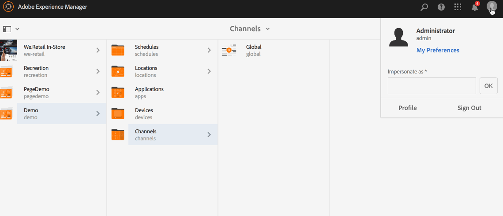

# 使用动态嵌入式序列 {#using-dynamic-embedded-sequence}

使用动态嵌入式序列涵盖以下主题：

* **概述**
* **在AEM Screens使用动态嵌入式体验**
* **查看结果**
* **限制用户和修改ACL**

## 概述 {#overview}

***为遵循父子层次*** (其中，子级引用在位置文件夹而非渠道文件夹内)的大型项目创建动态嵌入式序列。 It allows the user to embed a sequence inside a channel by ***Channel Role***. 它允许用户使用主渠道中的嵌入式序列为不同办公室定义特定于位置的占位符。

将渠道分配给显示屏时，您可以选择指定显示屏的路径或渠道的角色，该角色将按上下文解析为实际渠道。

要使用动态嵌入式序列，请按渠道角色分 ***配渠道***。 渠道角色定义显示的上下文。 该角色由各种操作来定位，并且与完成该角色的实际渠道无关。 此部分描述了一个按角色定义渠道的用例，以及如何将该内容用于全局渠道。您还可以将角色视为分配的标识符，或渠道在上下文中的别名。

### 使用动态嵌入式序列的优势 {#benefits-of-using-dynamic-embedded-sequences}

将序列渠道放在位置而不是渠道文件夹中的主要好处是允许本地或区域作者编辑与其相关的内容，同时限制其在层次结构中上一级编辑渠道。

Referencing a *Channel By Role*, allows you to create local version of a channel, in order to dynamically resolve location-specific content and also allows you to create a global channel that leverages the content for the location-specific channels.

>[!NOTE]
>
>**嵌入式序列与动态嵌入式序列**
>
>动态嵌入式序列与嵌入式序列类似，但允许用户遵循一个层次结构，在该层次结构中，对一个渠道所做的更改／更新会传播到相关的另一个。 它遵循父子层次结构，还包括图像或视频等资产。
>
>***“动态嵌入式序列*** ”允许您显示特定于位置的内容，而 ***“嵌入式序列*** ”仅显示内容的常规幻灯片。 此外，在设置动态嵌入式序列时，您需要使用渠道角色和名称配置渠道。 有关实际实施，请参阅以下步骤。
>
>要了解有关实现嵌入式序列的更多信息，请参 [阅AEM Screens的](embedded-sequences.md) “嵌入式序列”。

以下示例重点介绍以下关键术语，以提供解决方案：

* 全 ***局序列的主序列渠道*** （英文）
* ***用于序列的每个*** 、本地可自定义部分的动态嵌入式序列组件
* ***单个序列渠道*** ，位于显示屏中 *具有* 、与动态嵌入式序列组 **件的角色相匹配的相应&#x200B;*位置*。**

>[!NOTE]
>
>To learn more about channel assignment, see **[Channel Assignment](channel-assignment.md)** under Authoring section in AEM Screens documentation.

## 使用动态嵌入式序列 {#using-dynamic-embedded-sequence-2}

下节介绍如何在AEM Screens渠道中创建动态嵌入式序列。

### 前提条件 {#prerequisites}

在开始实现此功能之前，请确保您已准备好以下先决条件以开始实现动态嵌入式序列：

* 创建AEM Screens项目(在本例中为 **Demo**)

* 在“渠道”文 **件夹下** ，创 **建渠道** 。

* 将内容添加到 **全局** 渠道&#x200B;*中&#x200B;**(请**检查* Resources.zip以了解相关资产)

下图显示了在“渠道 **”文件夹** 中具 **有“全局** 渠道 **”的Demo** 项目。

### 资源 {#resources}

您可以下载以下资源（图像并将这些资源添加到资产），并进一步将它们用作渠道内容以进行演示。

[获取文件](assets/resources.zip)

>[!NOTE]
>
>有关如何创建项目以及如何创建序列渠道的其他信息，请参阅以下资源：
>
>* **[创建和管理项目](creating-a-screens-project.md)**
>* **[管理渠道](managing-channels.md)**

>

在AEM Screens项目中实施动态嵌入式序列涉及三大任务:

1. **设置项目分类，包括渠道、位置和显示**
1. **创建计划**
1. **将计划分配给每个显示屏**

请按照以下步骤实施该功能：

>[!CAUTION]
>
>在实施动态嵌入式序列时，在每个位置下创建 **渠道****时，** 请注意“名称”和“标题”字段。 请仔细按照命名说明操作。

1. **创建两个位置文件夹。**

   导航到AEM Screens **项目** 中的“位置”文件夹，并创建两个位置文 **件夹，如** 区域A **和**&#x200B;区域B。

   >[!NOTE]
   >
   >在创建区域 **A位置文件夹** 时，请确保将标题 **输入为区** 域A，并 ************ 将名称字段留空，以便自动拾取区-a名称。
   >
   >类似，用于创建位置文件夹 **区域B**，如下所示：

   

   >[!NOTE]
   >要了解如何创建位置，请参阅创 **[建和管理位置](managing-locations.md)**。

1. **在每个位置文件夹下创建两个位置和一个渠道。**

   1. 导航到 **演示** —>位 **置** —> **区域A**。
   1. 选择 **区域** A，然后 **单击操作栏中的** +创建。
   1. 从标 **题** (Title) **为Store 1的向** 导中 **选**&#x200B;择位置。 同样，从标题为“商店2”的向导 **中创建另一个** ，标 **题为** “ **商店2”**。 创建商店1和 **商店** 2时，可将“名 **称** ”字段保留 **为空**。
   1. 重复步骤(b)，现在从向 **导中选择** “序列渠道”。 输入标 **题** A **区域名** ，并输 **入此** 渠道 **的** 区域名称。

   >[!CAUTION]
   >
   >请确保在创建渠道 **区域A**&#x200B;时，输入 **“A** ”作 **为区域A** , **并将Name******&#x200B;作为区。

   

   同样，在标题为“区域 **B”的** “商店3”和“商 **店4”下创** 建两个位置 ****。 此外，创建一个序 **列渠道** , **其标题** 为 **B** ，名 **称为** 区 ****&#x200B;域为区。

   >[!CAUTION]
   >
   >请确保对在区域A和区域B中创建的渠道使 **用相同** 的名 **称作** 为 **区域**&#x200B;使用。

   

1. **在每个位置下创建显示和渠道。**

   1. 导航到 **演示** —>位 **置** —> **区域A** — **>商店** 1。
   1. 选 **择Store** 1，然后 **单击操作栏中的** “+创建”。
   1. 从向 **导中选择** “显示”，然后创 **建Store1Display。**
   1. 重复步骤(b)，此时从向 **导中选择** “序列”。 输入Title **** **as Store** 1 **渠道** , **Name as** Store 。

   >[!CAUTION]
   >
   >创建序列渠道时很重要， **渠道的标** 题 **(Title)可以作为您的要求，但** Name（名称）在所有本地渠道中应相同。
   >在此示例中，A区和B区 **下的渠道共** 享A区和B区名下的A区和B区 **渠道共享A区和B区名下的A区和B区下的A区和B区下的A**********************************&#x200B;共享A区和B区下的A区共享A区名下的A区和B区。

   

   同样，在Store 2下创 **建Store2Display** 和 **渠道Store2** 渠道的显 **示(名称** 为 **** Store2Display)。

   >[!NOTE]
   >请确保对在商店1和商店2中创建的渠道使 **用与商** 店 **相同的** 名称 ****。

   

   按照上述步骤在“区域B”下的“商店3 **”和“商** 店4” **中创建** 渠道并显示 ****。 同样，请确保在创建 **渠道** Store3 **渠道和** Store4渠道时 **,** 使用与商店 **** 相同的名称。

   下图显示了Store 3中的显示屏 **和渠道**。

   

   下图显示了Store 4中的显示屏 **和渠道**。

   

1. **将内容添加到渠道各自的位置。**

   导航到演 **示** ->位 **置** ->位置 **-** > **区域A** ->区域单击 **** 操作栏中的并编辑操作栏。 拖放要添加到渠道的资产。

   >[!NOTE]
   >您可以使用 ***上面“资源*** ”部分的 **Resources** .zip文件，将图像用作渠道内容的资产。

   

   同样，导航到 **Demo** -> **位置****->** Region B **->****** Region B，单击操作栏中的EditAdit，将资产拖放到渠道，如下所示：

   

   请按照上述步骤和资源，向以下渠道添加内容：

   * **Store1Channel**
   * **Store2Channel**
   * **Store3Channel**
   * **Store4Channel**

1. **创建计划**

   导航并选 **择AEM Screens** 项目中的计划文件夹，然 **后单击操作** 栏中的“创建”以创建新计划。

   下图显示了在Demo **项目中****创建的AdSchedule** 。

   

1. **将渠道分配给计划**

   1. 导航到 **Demo** —> **计划****—> AdSchedule** ，然后 **单击操作栏中的** 仪表板。
   1. 单击 **+从“已分配** ” **渠道面板中****的“分配渠道”，打开** “渠道分配”对话框。
   1. Select **Reference Channel**.. by path.
   1. 选择“ **渠道路** 径 **”作** 为Demo ***—>*** Global ******—> Global 。
   1. Enter the **Channel Role** as **GlobalAdSegment**.
   1. 选择支 **持的事件** ，如 **初始负载**、空 **闲屏幕**，以及 ****&#x200B;用户交互。
   1. 单击&#x200B;**保存**。

   **按角色为渠道分配区域：**

   1. 单击 **+从“已分配** ” **渠道面板中****的“分配渠道”，打开** “渠道分配”对话框。
   1. 选择 **引用渠道**。 按照名称.
   1. 输入 **渠道名** ( **名**)。
   1. Enter the **Channel Role** as **RegionAdSegment**.
   1. 单击&#x200B;**保存**。

   **按角色为商店分配渠道:**

   1. 单击 **+从“已分配** ” **渠道面板中****的“分配渠道”，打开** “渠道分配”对话框。
   1. 选择 **引用渠道**。 按照名称.
   1. 输入 **渠道名** ，作 **为商店**。
   1. Enter the **Channel Role** as **StoreAdSegment**.
   1. 单击&#x200B;**保存**。

   下图按路径和角色显示分配的渠道。

   

1. **将动态嵌入式序列配置为全局渠道。**

   导航到最初 **在** Demo项目中创建的 **全局渠道** 。

   Click **Edit** from the action to open the editor.

   

   在渠道编辑器 **中拖放两** 个动态嵌入式序列组件。

   从其中一个组件中打开属性，然后输入 **渠道分配角色** ，作 **为RegionAdSegment**。

   同样，选择其他组件并打开属性，以将 **渠道分配角色** 输 **入StoreAdSegment**。

   

1. **将计划分配给每个显示屏**

   1. 导航到每个显示屏，如 **Adobe** —>位 **置****—> Region A** —**—> Store 1** —**** Display Store1Display 。
   1. Click **Dashboard** from the action to open the display dashboard.
   1. 从“已 **分配的渠道** 和计划”面 **板中单击** ...，然后进 **一步单击+分配计划**。
   1. 选择计划的路径(例如，此处， **Demo** —> **计划******—>AdSchedule)。
   1. 单击&#x200B;**保存**。

## 查看结果 {#viewing-the-results}

设置渠道和显示完成后，请启动AEM Screens播放器以视图内容。

>[!NOTE]
>
>要了解AEM Screen Player，请参阅以下资源：
>
>* [AEM Screens播放器下载](https://download.macromedia.com/screens/)
>* [使用AEM Screens播放器](working-with-screens-player.md)

以下输出将根据显示路径确认您在AEM Screens播放器中的渠道内容。

**方案1**:

如果将显示路径指定 **为Demo** —> **Locations** —> Region A **—** —> Store 1 ********— Store> Store1DisplayDisplayProy，则以下内容将在您的AEM Screens播放器上显示。

**方案1**:

如果将显示路径指定为 **Demo** —> **Locations** —> Region B **—** > Store 3 ******** Store —> Display Store3 Display Store，则以下内容将在您的AEM Screens播放器上显示。

## 限制用户和修改ACL {#restricting-users-and-modifying-the-acls}

您可以创建全局、区域或本地作者来编辑与其相关的内容，同时限制您在层次结构的上方编辑渠道。

您需要修改ACL以根据用户的位置限制用户访问内容。

### 示例用例 {#example-use-case}

以下示例允许您为上述演示项目创建三个用户。

为每个组分配的权限如下：

**组**:

* **全局作者**:由有权访问演示项目中所有位置和渠道 **的用** 户组成，并具有所有读取、写入和编辑权限。

* **区域——作者**:由对区域A和区域B具有读取、写入和编 **辑权限** 的 **用户组成**。

* **商店——作者**:由只对商店1、商店2、商店3和商店4具有读 **、写和编**&#x200B;辑权 **限的用**&#x200B;户组成 **，这些用户对商店** 1、商店 **2、商店3**&#x200B;和商店4具有读、写和编辑权限。

#### 创建用户组、用户和设置ACL的步骤 {#steps-for-creating-user-groups-users-and-setting-up-acls}

>[!NOTE]
>
>要详细了解如何使用ACL隔离项目，以便每个人或团队都能处理自己的项目，请参阅 **设置ACL**。

按照以下步骤创建组、用户并根据权限修改ACL:

1. **创建组**

   1. 导航到 **Adobe Experience Manager**。
   1. Click **Tools** --> **Security** --> **Groups**.
   1. 单击 **创建组** ，然 **后在ID中输入** “全 **局作者**”。
   1. 单击&#x200B;**保存并关闭**。

   同样，创建另外两个组 **，如Region** - **Author和Store-Author**。

   

1. **创建用户并将用户添加到用户组**

   1. 导航到 **Adobe Experience Manager**。
   1. Click **Tools** --> **Security** --> **Users**.
   1. 单击 **创建用** 户，然 **后在ID中输入** “全 **局用户**”。
   1. 输入 **密码** ，并为此用户确认密码。
   1. 单击 **“组** ”选项卡，并在“选择组” **中输入组名称**，例如，输入 **Global-Author** ，将 **** Global-User添加到特定组。
   1. 单击&#x200B;**保存并关闭**。

   同样，创建Region-User和Store-User **等两个其他用户** ，并将这些用户分 **别添加到Region-Author********** 和Store-Author中。

   >[!NOTE]
   >最好将用户添加到组中，然后为每个特定用户组分配权限。

   

1. **将所有组添加到参与者**

   1. 导航到 **Adobe Experience Manager**。
   1. Click **Tools** --> **Security** --> **Groups**.
   1. 从列表 **中选择** “参与者”，然后选择 **“成员** ”选项卡。
   1. 选择 **组** ，如 **Global-Author**、 **Region-Author** 和 **Store-Author** to Probiters。
   1. 单击&#x200B;**保存并关闭**。

1. **访问每个组的权限**

   1. 导航到 *用户* ，然后使用此UI修改不同用户组的权限。
   1. 搜索全 **局作者** ，然后单 **击“权** 限”选项卡，如下图所示。
   1. 同样，您也可以访问“区域 **作者”和** “ **商店作者”的权限**。

   

1. **修改每个用户组的权限**

   **对于全球作者：**

   1. Navigate to the **Permissions** tab
   1. 导航到 ***/content/screens/demo*** ，并检查所有权限
   1. 导航到 ***/content/screens/demo/locations*** ，并检查所有权限
   1. 导航 ***到/content/screens/demo/locations/region-a并检查所有权限*** 。 同样，检查区域 **b的权限**。

   请参阅下图以了解这些步骤：
   

   下图显示，现在全 **局渠道和全局** A A B区都 **访问A A S和** B Store 1的 **4个商店，即A StoreStore 1、Store2 A Store** 3、Store 2 2Store 3和Ore 4的 ******************** 4。

   

   **对于区域作者：**

   1. Navigate to the **Permissions** tab.
   1. 导航到 ***/content/screens/demo*** ，并仅选中“读取 **”权限** 。
   1. 导航到 ***/content/screens/demo/locations*** ，并仅选中“读 **取** ”权限。
   1. 导航到 ***/content/screens/demo/渠道*** ，然后取消检查全局 **渠道的权限** 。
   1. 导航 ***到/content/screens/demo/locations***/***region-a并检查所有权限*** 。 同样，检查区域 **b的权限**。

   请参阅下图以了解这些步骤：

   

   下图显示，现在Region-User可以访问 **A** 和B区域B的4 **个商店** 1Store、Store 22 **、** StoreStore 3、 **************** PhotoStore 4Store和Photo Store的A和B区，即渠道访问全局。

   

   **对于商店——作者：**

   1. Navigate to the **Permissions** tab.
   1. 导航到 ***/content/screens/demo*** ，并仅选中“读取 **”权限** 。
   1. 导航到 ***/content/screens/demo/locations*** ，并仅选中“读 **取** ”权限。
   1. 导航到 ***/content/screens/demo/渠道*** ，然后取消检查全局 **渠道的权限** 。
   1. 导航 ***到/content/screens/demo/locations/region-a*** ，并仅选中“读 **取** ”权限。 同样，仅选中 **区域** -b **的“读取”权限**。
   1. 导航 ***到/content/screens/demo/locations***/***region-a /store-1并检查所有权限*** 。 同样，检查 **store-2、store-3** 和 **store-4的权限**。

   请参阅下图以了解这些步骤：

   

   下图显示，现在 **Store** -User只能访问四家Store **1、Store 22、Store** 3、 ************************ Store 4、StoreStore，但ChropGlobalGrobal或Region A(Region A A Store A B Regiorionia)渠道。

   

>[!NOTE]
>
>要详细了解设置权限，请参阅 [设置ACL](setting-up-acls.md)。

