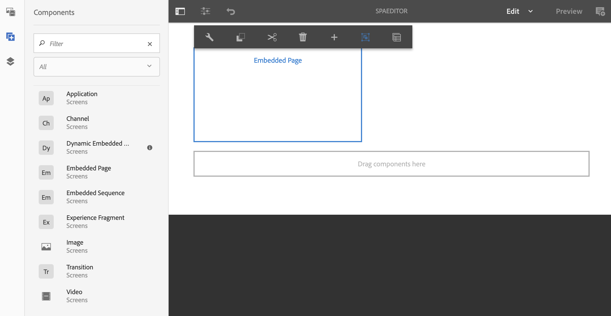

# 使用AEM SPA编辑器嵌入REACT应用程序并与AEM Screens Analytics集成{#embedding-a-react-application-using-the-aem-spa-editor-and-integrating-with-aem-screens-analytics}

本节介绍如何使用AEM SPA编辑器(可由AEM的业务专业人员配置)嵌入使用REACT(或Angular)的交互式单页应用程序，以及如何将交互式应用程序与离线Adobe Analytics集成。

## 使用AEM SPA Editor {#using-the-aem-spa-editor}

请按照以下步骤使用AEM SPA编辑器：

1. 克隆位于[https://github.com/adobe/aem-spa-project-archetype的AEM SPA Editor存储库。](https://github.com/adobe/aem-spa-project-archetype)

   >[!NOTE]
   >
   >此原型会创建一个最小的Adobe Experience Manager项目，作为您自己的SPA项目的起点。 使用此原型时必须提供的属性允许根据需要命名此项目的所有部分。

1. 按照自述文件说明创建AEM SPA编辑器原型项目：

   ```
   mvn clean install archetype:update-local-catalog
   mvn archetype:crawl
   
   mvn archetype:generate \
   -DarchetypeCatalog=internal \
   -DarchetypeGroupId=com.adobe.cq.spa.archetypes \
   -DarchetypeArtifactId=aem-spa-project-archetype \
   -DarchetypeVersion=1.0.3-SNAPSHOT \
   ```

   >[!NOTE]
   >
   >我们使用&#x200B;**GroupId**&#x200B;作为&#x200B;***com.adobe.aem.screens***，使用&#x200B;**ArtifactId**&#x200B;作为&#x200B;***My Sample SPA***（这是默认值）。 您可以根据需要选择自己的。

1. 创建项目后，请使用IDE或您选择的编辑器并导入生成的Maven项目。
1. 使用命令&#x200B;***mvn部署到本地AEM实例clean install -PautoInstallPackage***。

### 在REACT应用程序{#editing-content-in-the-react-app}中编辑内容

要编辑REACT应用程序中的内容，请执行以下操作：

1. 导航到`https://localhost:4502/editor.html/content/mysamplespa/en/home.html`（根据需要替换主机名、端口和项目名称）。
1. 您应该能够编辑在Hello world应用程序中显示的文本。

### 将交互式REACT应用程序添加到AEM Screens {#adding-the-interactive-react-app-to-aem-screens}

按照以下步骤将交互式REACT应用程序添加到AEM Screens:

1. 创建新的AEM Screens项目。 有关更多详细信息，请参阅[创建和管理项目](creating-a-screens-project.md)。

   >[!NOTE]
   >
   >在Screens项目的&#x200B;**渠道**&#x200B;文件夹中创建渠道时，创建&#x200B;**序列渠道**。
   >
   >
   >有关更多详细信息，请参阅[创建和管理渠道](managing-channels.md)。

   

1. 编辑任意序列渠道，并拖放嵌入的页面组件。

   有关更多详细信息，请参阅[将组件添加到渠道](adding-components-to-a-channel.md) 。

   >[!NOTE]
   >
   >在将渠道分配给显示屏时，确保添加用户交互事件。

1. 单击操作栏中的&#x200B;**编辑**&#x200B;以编辑序列渠道的属性。

   

1. 拖放&#x200B;**嵌入式页面**&#x200B;组件并选择mysamplespa应用程序下的主页，例如&#x200B;***/content/mysamplespa/en/home***。

   

1. 为此项目注册一个播放器，您现在应该能够看到您的交互式应用程序正在AEM Screens上运行。

   请参阅[设备注册](device-registration.md)以详细了解有关注册设备的信息。

## 通过AEM Screens将SPA与Adobe Analytics与离线功能集成{#integrating-the-spa-with-adobe-analytics-with-offline-capability-through-aem-screens}

请按照以下步骤通过AEM Screens将SPA与Adobe Analytics集成到离线功能：

1. 在AEM Screens中配置Adobe Analytics。

   请参阅[使用AEM Screens配置Adobe Analytics](configuring-adobe-analytics-aem-screens.md) ，了解如何在Adobe Analytics中使用AEM Screens执行排序，以及使用离线Adobe Analytics发送自定义事件。

1. 在选择的IDE/编辑器中编辑您的react应用程序（尤其是文本组件或您希望开始发出事件的其他组件）。
1. 在要为组件捕获的点击事件或其他事件上，使用标准数据模型添加分析信息。

   有关更多详细信息，请参阅[使用AEM Screens配置Adobe Analytics](configuring-adobe-analytics-aem-screens.md)。

1. 调用AEM Screens Analytics API以离线保存事件，并以连发方式将其发送到Adobe Analytics。

   例如，

   ```
   handleClick() {
       if ((window.parent) && (window.parent.CQ) && (window.parent.CQ.screens) && (window.parent.CQ.screens.analytics))
       {
           var analyticsEvent = {};
           analyticsEvent['event.type'] = 'play'; // Type of event
    analyticsEvent['event.coll_dts'] = new Date().toISOString(); // Start of collecting the event
    analyticsEvent['event.dts_start'] = new Date().toISOString(); // Event start
    analyticsEvent['content.type'] = 'Washing machine'; // Mime Type or product category
    analyticsEvent['content.action'] = 'Path to the washing machine asset in AEM'; // Path in AEM to relevant asset
    analyticsEvent['trn.product'] = 'Washing machine Model number'; // Product being explored
    analyticsEvent['trn.amount'] = 1000; // Product pricing or other numeric value or weight
    analyticsEvent['event.dts_end'] = new Date().toISOString(); // Event end
    analyticsEvent['event.count'] = 100; // Numeric value that may count a number of clicks or keystrokes or wait time in seconds for example
    analyticsEvent['event.value'] = 'My favorite analytics event';
           analyticsEvent['trn.quantity'] = 10; // Quantity of product selection
    analyticsEvent['event.subtype'] = 'end'; // Event subtype if applicable
    window.parent.CQ.screens.analytics.sendTrackingEvent(analyticsEvent);
       }
   }
   ```

   >[!NOTE]
   >
   >播放器固件会自动将有关播放器及其运行时环境的更多详细信息添加到您发送的自定义分析数据中。 因此，除非绝对必要，否则您可能不需要捕获低级操作系统/设备详细信息。 您只需关注业务分析数据。

