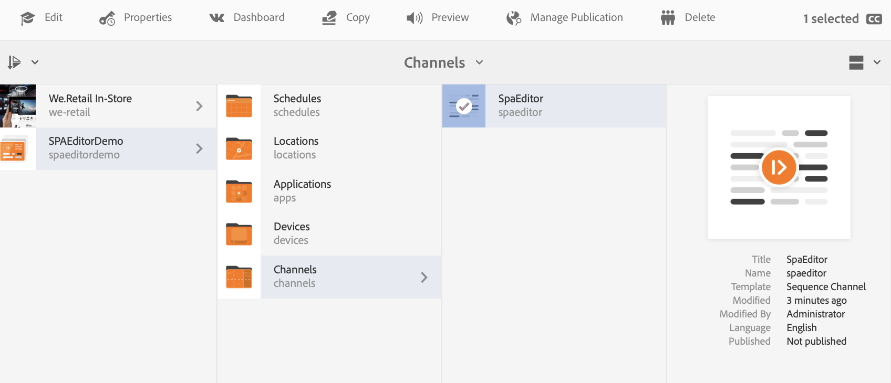

# 使用AEM SPA编辑器嵌入REACT应用程序并与AEM Screens Analytics集成 {#embedding-a-react-application-using-the-aem-spa-editor-and-integrating-with-aem-screens-analytics}

您可以使用REACT(或Angular)嵌入交互式单页应用程序。 您可以使用由AEM中的业务专业人士配置的AEM SPA编辑器来执行此操作。 您还可以了解如何将交互式应用程序与离线Adobe Analytics集成。

## 使用AEM SPA编辑器 {#using-the-aem-spa-editor}

请按照以下步骤使用AEM SPA编辑器：

1. 克隆AEM SPA Editor存储库： [https://github.com/adobe/aem-spa-project-archetype.](https://github.com/adobe/aem-spa-project-archetype)

   >[!NOTE]
   >
   >此原型创建一个规模最小的Adobe Experience Manager项目作为您自己的SPA项目的起点。 使用此原型时必须提供的属性允许您根据需要命名此项目的所有部分。

1. 要创建AEM SPA编辑器原型项目，请按照自述文件说明：

   ```
   mvn clean install archetype:update-local-catalog
   mvn archetype:crawl
   
   mvn archetype:generate \
   -DarchetypeCatalog=internal \
   -DarchetypeGroupId=com.adobe.cq.spa.archetypes \
   -DarchetypeArtifactId=aem-spa-project-archetype \
   -DarchetypeVersion=1.0.3-SNAPSHOT \
   ```

   >[!NOTE]
   >
   >本文档使用 **组ID** 作为 ***com.adobe.aem.screens*** 和 **ArtifactId** 作为 ***我的示例SPA*** （这是默认设置）。 您可以根据需要选择自己的。

1. 创建项目后，请使用所选的IDE或编辑器并导入生成的Maven项目。
1. 使用命令部署到本地AEM实例 ***mvn全新安装 — PautoInstallPackage***.

### 在REACT应用程序中编辑内容 {#editing-content-in-the-react-app}

要编辑REACT应用程序中的内容，请执行以下操作：

1. 导航到 `https://localhost:4502/editor.html/content/mysamplespa/en/home.html` (替换主机名、端口和项目名称（如果适用）。
1. 您应该能够编辑Hello world应用程序中显示的文本。

### 将交互式REACT应用程序添加到AEM Screens {#adding-the-interactive-react-app-to-aem-screens}

执行以下步骤，将交互式REACT应用程序添加到AEM Screens：

1. 创建一个AEM Screens项目。 请参阅 [创建和管理项目](creating-a-screens-project.md) 以了解更多详细信息。
1. 创建 **应用程序渠道** （优选地）（或1x1模板或多区域通道） **渠道** AEM Screens项目的文件夹。

   >[!NOTE]
   >**序列渠道** 对于此用例，我们建议您不要使用，因为它们本身会带有幻灯片放映逻辑，与体验的交互性质冲突。
   >请参阅 [创建和管理渠道](managing-channels.md) 以了解更多详细信息。

1. 编辑任意序列渠道并拖放嵌入的页面组件。

   请参阅 [将组件添加到渠道](adding-components-to-a-channel.md) 以了解更多详细信息。

   >[!NOTE]
   >
   >确保在为显示分配渠道时添加用户交互事件。

1. 单击 **编辑** 以编辑渠道的属性。

   

1. 拖放 **嵌入式页面** 组件中，或者重新使用应用程序渠道中的现有组件，然后选择mysamplespa应用程序下的主页，例如， ***/content/mysamplespa/en/home***.

   

1. 将渠道分配给显示。

   >[!NOTE]
   >确保在为显示分配渠道时添加用户交互事件。

1. 注册此项目的播放器并将其分配给显示区。 现在，您应该能够看到交互式应用程序在AEM Screens上运行。

   请参阅 [设备注册](device-registration.md) 有关注册设备的详细信息。

## 通过AEM Screens将SPA与Adobe Analytics与离线功能集成 {#integrating-the-spa-with-adobe-analytics-with-offline-capability-through-aem-screens}

请按照以下步骤通过AEM Screens将SPA与Adobe Analytics与离线功能集成：

1. 在AEM Screens中配置Adobe Analytics。

   请参阅 [使用AEM Screens配置Adobe Analytics](configuring-adobe-analytics-aem-screens.md) 有关如何使用AEM Screens在Adobe Analytics中执行排序以及使用离线Adobe Analytics发送自定义事件的更多信息。

1. 在所选的IDE/编辑器中编辑您的react应用程序（特别是要开始发送事件的文本组件或其他组件）。
1. 在要捕获组件的单击事件或其他事件上，使用标准数据模型添加分析信息。

   请参阅 [使用AEM Screens配置Adobe Analytics](configuring-adobe-analytics-aem-screens.md) 以了解更多详细信息。

1. 调用AEM Screens Analytics API，以便您可以离线保存事件并将其突发发送到Adobe Analytics。

   例如，

   ```
   handleClick() {
       if ((window.parent) && (window.parent.CQ) && (window.parent.CQ.screens) && (window.parent.CQ.screens.analytics))
       {
           var analyticsEvent = {};
           analyticsEvent['event.type'] = 'play'; // Type of event
    analyticsEvent['event.coll_dts'] = new Date().toISOString(); // Start of collecting the event
    analyticsEvent['event.dts_start'] = new Date().toISOString(); // Event start
    analyticsEvent['content.type'] = 'Washing machine'; // Mime Type or product category
    analyticsEvent['content.action'] = 'Path to the washing machine asset in AEM'; // Path in AEM to relevant asset
    analyticsEvent['trn.product'] = 'Washing machine Model number'; // Product being explored
    analyticsEvent['trn.amount'] = 1000; // Product pricing or other numeric value or weight
    analyticsEvent['event.dts_end'] = new Date().toISOString(); // Event end
    analyticsEvent['event.count'] = 100; // Numeric value that may count a number of clicks or keystrokes or wait time in seconds for example
    analyticsEvent['event.value'] = 'My favorite analytics event';
           analyticsEvent['trn.quantity'] = 10; // Quantity of product selection
    analyticsEvent['event.subtype'] = 'end'; // Event subtype if applicable
    window.parent.CQ.screens.analytics.sendTrackingEvent(analyticsEvent);
       }
   }
   ```

   >[!NOTE]
   >
   >播放器固件会自动将有关播放器及其运行时环境的更多详细信息添加到您发送的自定义分析数据中。 因此，除非必要，否则您可能必须捕获低级操作系统/设备详细信息。 专注于业务分析数据。
