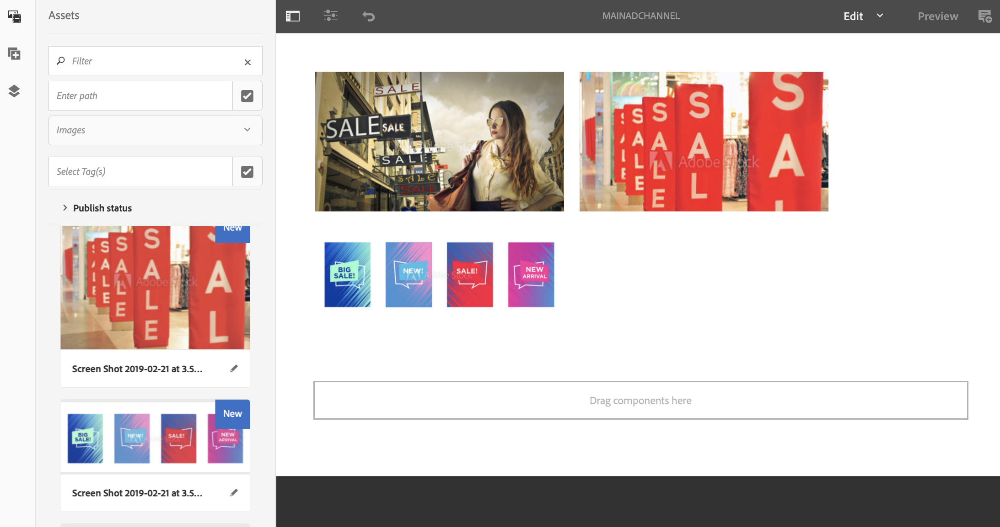
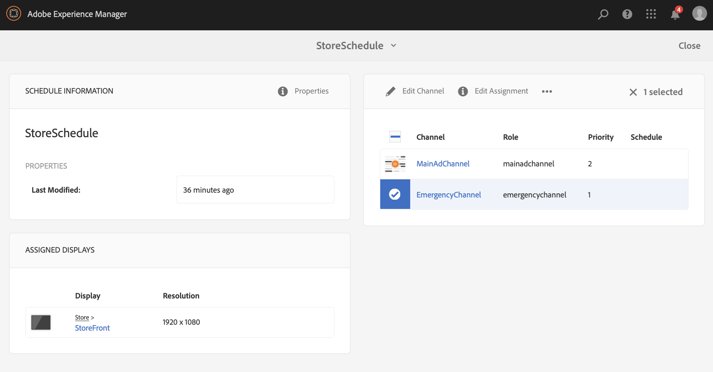

# 紧急渠道 {#emergency-channel}

## 用例描述 {#use-case-description}

本节介绍一个用例示例。 它强调创建和管理紧急通道，内容作者可以在有前提条件的情况下从顺序通道切换紧急通道。

### 前提条件 {#preconditions}

在开始此用例之前，请确保您了解如何：

* **[创建和管理渠道](managing-channels.md)**
* **[创建和管理位置](managing-locations.md)**
* **[创建和管理时间表](managing-schedules.md)**
* **[设备注册](device-registration.md)**

### 主要行为者 {#primary-actors}

内容作者

## 基本流程：设置项目 {#basic-flow-setting-up-the-project}

按照以下步骤设置紧急通道：

1. 创建名为的AEM Screens项目 **紧急渠道**，如下所示。

   >[!NOTE]
   >要了解有关在AEM Screens中创建和管理项目的更多信息，请参阅创建项目。

   

1. **创建序列渠道**

   1. 单击 **渠道** 文件夹并单击 **创建**.

   1. 单击 **序列渠道** 并从向导中创建标题为 **MainAdChannel**.

   

1. **向序列渠道添加内容**

   1. 单击渠道(**MainAdChannel**)。
   1. 单击 **编辑** 从操作栏中。
   1. 将几个资产拖放到您的渠道中。

   

1. **创建紧急渠道**

   1. 单击 **渠道** 文件夹。
   1. 单击&#x200B;**创建**。
   1. 单击 **序列渠道** 并从向导中创建标题为 **紧急渠道**.

   >[!NOTE]
   >
   >通常，您的紧急渠道会添加到预先存在的生产项目中。

   

1. **向紧急渠道添加内容**

   1. 单击渠道(**紧急通道)**.
   1. 单击 **编辑** 从操作栏中。
   1. 将要在紧急情况下运行的资产拖放到渠道中。

   

1. **创建位置**

   1. 导航至 **位置** 文件夹。
   1. 单击 **创建** 从操作栏创建名为的位置 **存储** 从向导中。

   

1. **在您的位置创建显示区**

   导航到您的位置(**存储**)，然后单击 **创建** 从操作栏中。 按照向导中的说明，创建两个 **显示** 标题为 **StoreFront** 和 **StoreRear**.

   

1. **创建时间表**

   1. 导航到 **时间表** 文件夹。
   1. 单击 **创建** 从操作栏中。
   1. 按照该向导，创建标题为 **StoreSchedule**.

   

1. 将两个显示区分配给您的计划和设置优先级

   1. 单击计划 **（存储计划）** 并单击 **仪表板** 从操作栏中。

   1. 单击 **+分配渠道** 从 **已分配渠道** 面板。

   1. 从 **渠道分配** 对话框：

      1. 单击路径 **MainAdChannel**
      1. 设置 **优先级** as 2
      1. 将支持的事件设置为 **初始加载** 和 **空闲屏幕**.
      1. 单击 **保存**

      同样，再次执行相同的步骤来分配 **紧急渠道** 并设置其 **优先级**.

   >[!NOTE]
   >
   >优先级用于对分配进行排序，以防多个分配符合播放标准。 值最高的总是优先于较低的值。

   

1. 单击 **+分配渠道** 从 **已分配渠道** 面板。

1. 从 **渠道分配** 对话框：

   1. 单击路径 **紧急渠道**
   1. 设置 **优先级** as 1

   1. 将支持的事件设置为 **初始加载**， **空闲屏幕**、和 **用户交互**

   1. 单击 **保存**

   

   您可以从以下位置查看分配的渠道： **StoreSchedule** 仪表板。

   

1. **为每次显示分配计划**

   1. 导航到每个显示区，如 **紧急渠道** > **位置** > **存储** >**StoreFront**.

   1. 单击 **仪表板** 从操作栏中。
   1. 单击 **...** 从 **已分配的渠道和计划** 面板并进一步单击 **+分配计划**.

   1. 单击计划的路径(例如，此处， **紧急渠道** > **时间表** >**StoreSchedule**)。

   1. 单击&#x200B;**保存**。

   您可以从以下位置查看分配给显示的计划 **StoreSchedule** 仪表板。
   

1. **设备注册**

   完成设备注册过程。 注册后，您可以在AEM Screens Player上查看以下输出。

   

## 切换到紧急频道 {#switching-to-emergency-channel}

如果出现紧急情况，请执行以下步骤：

1. 导航到 **紧急渠道** > **时间表** > **StoreSchedule** 并单击 **仪表板** 从操作栏中。

   

1. 单击 **紧急渠道** 从 **StoreSchedule** 仪表板并单击 **编辑分配**.

   

1. 更新 **优先级** 的 **紧急渠道** 到 **3** 从 **渠道分配** 对话框，然后单击 **保存**.

   

1. 更新渠道优先级后，所有AEM Screens播放器都会显示 **紧急渠道** 内容。

   

### 结论 {#conclusion}

此 **紧急渠道** 将继续显示其内容，直到内容作者将优先级值重置为1。

当内容作者收到紧急情况已清除的说明时，他们应更新的 **MainAdChannel**. 这样做会导致恢复正常播放。
