# 紧急渠道 {#emergency-channel}

## 用例说明 {#use-case-description}

>[!IMPORTANT]
>此内容对AEM on-premise/AMS（AEM 6.5LTS和AEM 6.5）有效。 有关AEM as a Cloud Service Screens的内容，请参阅[AEM as a Cloud Service指南](https://experienceleague.adobe.com/en/docs/experience-manager-cloud-service/content/screens-as-cloud-service/overview/introduction)。

本节介绍一个用例示例。 它强调创建和管理紧急通道，内容作者可以在有前提条件的情况下从顺序通道切换紧急通道。

### 前提条件 {#preconditions}

在开始此用例之前，请确保您了解如何：

* **[创建和管理渠道](managing-channels.md)**
* **[创建和管理位置](managing-locations.md)**
* **[创建和管理计划](managing-schedules.md)**
* **[设备注册](device-registration.md)**

### 主要行为者 {#primary-actors}

内容作者

## 基本流程：设置项目 {#basic-flow-setting-up-the-project}

按照以下步骤设置紧急通道：

1. 创建一个名为&#x200B;**EmergencyChannel**&#x200B;的AEM Screens项目，如下所示。

   >[!NOTE]
   >要了解有关在AEM Screens中创建和管理项目的更多信息，请参阅创建项目。

   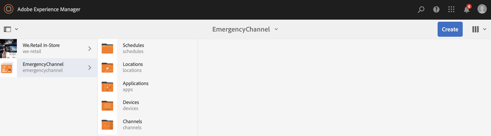

1. **创建序列频道**

   1. 单击&#x200B;**渠道**&#x200B;文件夹，然后单击&#x200B;**创建**。

   1. 单击向导中的&#x200B;**序列频道**，并创建标题为&#x200B;**MainAdChannel**&#x200B;的频道。

   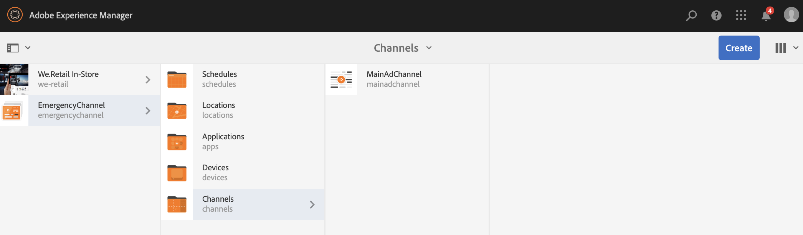

1. **正在向序列频道添加内容**

   1. 单击频道(**MainAdChannel**)。
   1. 单击操作栏中的&#x200B;**编辑**。
   1. 将几个资产拖放到您的渠道中。

   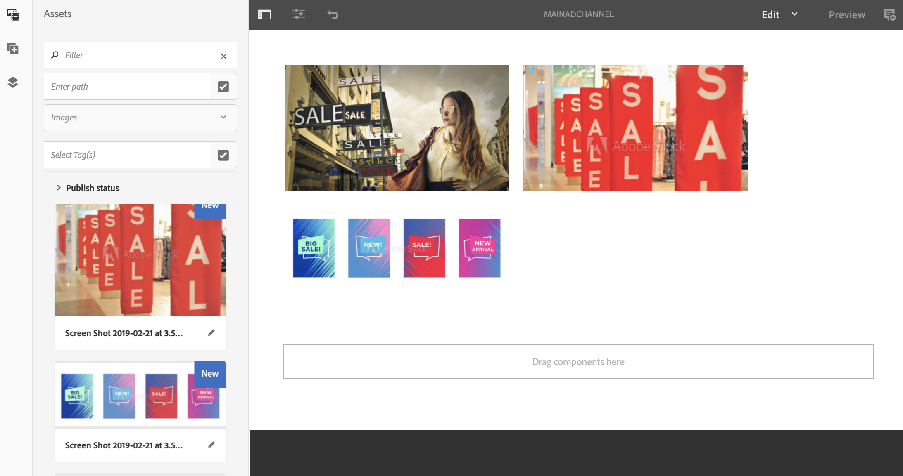

1. **创建紧急频道**

   1. 单击&#x200B;**渠道**&#x200B;文件夹。
   1. 单击&#x200B;**创建**。
   1. 在向导中单击&#x200B;**顺序频道**，并创建标题为&#x200B;**紧急频道**&#x200B;的频道。

   >[!NOTE]
   >
   >通常，您的紧急渠道会添加到预先存在的生产项目中。

   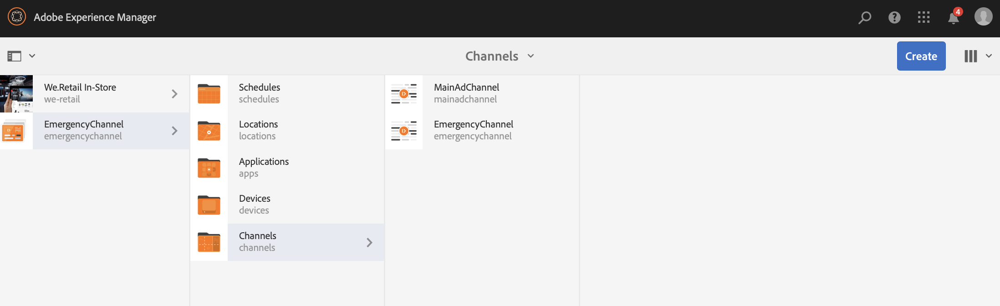

1. **正在向紧急渠道添加内容**

   1. 单击频道（**紧急频道）**。
   1. 单击操作栏中的&#x200B;**编辑**。
   1. 将要在紧急情况下运行的资产拖放到渠道中。

   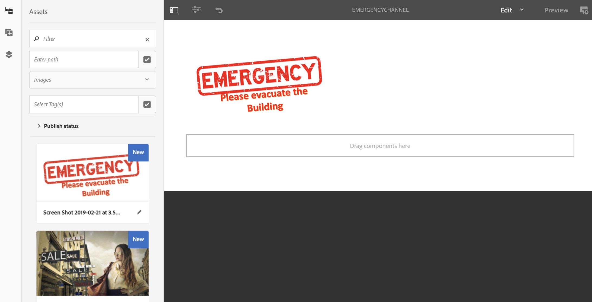

1. **创建位置**

   1. 导航到&#x200B;**位置**&#x200B;文件夹。
   1. 在操作栏中单击&#x200B;**创建**，然后从向导中创建标题为&#x200B;**存储**&#x200B;的位置。

   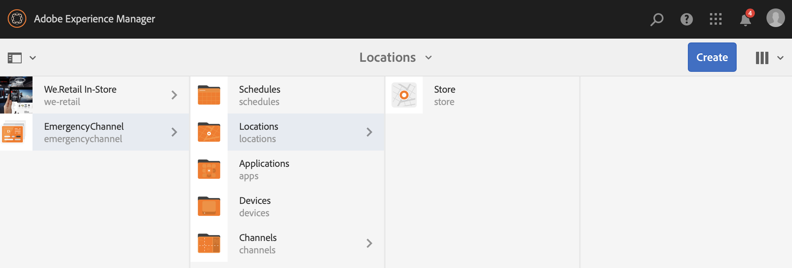

1. **在您的位置创建显示区**

   导航到您的位置（**商店**），然后单击操作栏中的&#x200B;**创建**。 按照该向导，创建两个标题为&#x200B;**StoreFront**&#x200B;和&#x200B;**StoreRear**&#x200B;的&#x200B;**显示区**。

   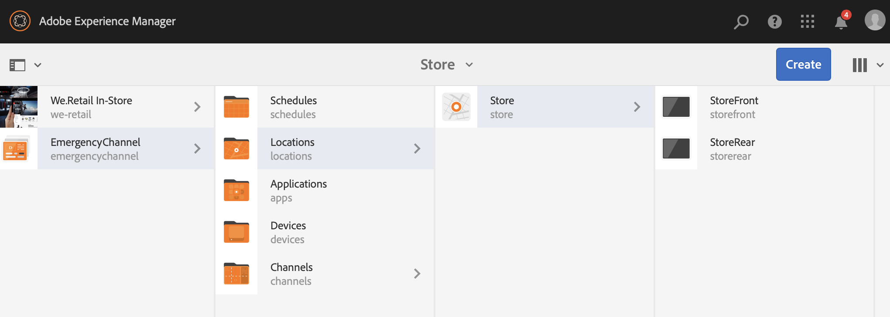

1. **创建计划**

   1. 导航到您的&#x200B;**计划**&#x200B;文件夹。
   1. 单击操作栏中的&#x200B;**创建**。
   1. 按照该向导，创建标题为&#x200B;**StoreSchedule**&#x200B;的计划。

   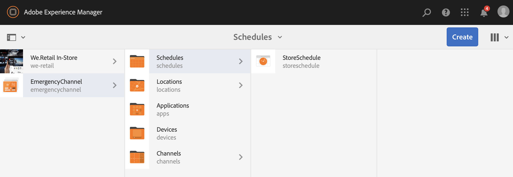

1. 将两个显示区分配给您的计划和设置优先级

   1. 单击计划&#x200B;**(StoreSchedule)**，然后单击操作栏中的&#x200B;**仪表板**。

   1. 从&#x200B;**已分配渠道**&#x200B;面板中单击&#x200B;**+分配渠道**。

   1. 在&#x200B;**渠道分配**&#x200B;对话框中：

      1. 单击&#x200B;**MainAdChannel**&#x200B;的路径
      1. 将&#x200B;**优先级**&#x200B;设置为2
      1. 将支持的事件设置为&#x200B;**初始加载**&#x200B;和&#x200B;**空闲屏幕**。
      1. 单击&#x200B;**保存**

      同样，再次执行相同的步骤来分配&#x200B;**紧急通道**&#x200B;并设置其&#x200B;**优先级**。

   >[!NOTE]
   >
   >优先级用于对分配进行排序，以防多个分配符合播放标准。 值最高的总是优先于较低的值。

   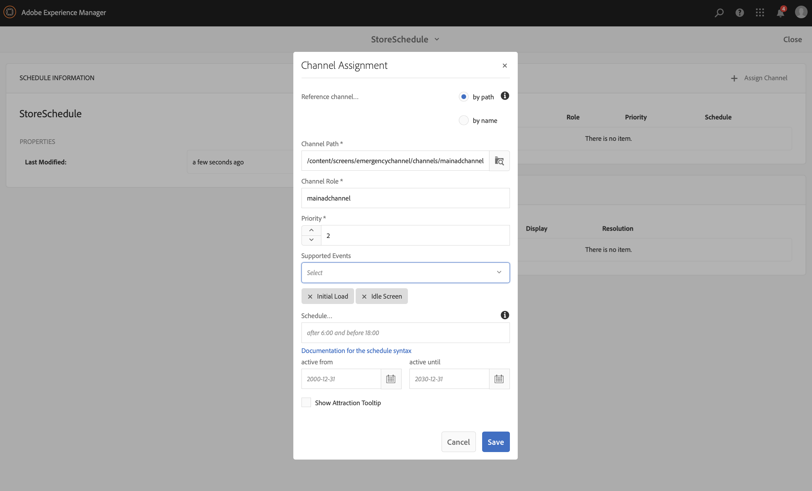

1. 从&#x200B;**已分配渠道**&#x200B;面板中单击&#x200B;**+分配渠道**。

1. 在&#x200B;**渠道分配**&#x200B;对话框中：

   1. 单击&#x200B;**紧急渠道**&#x200B;的路径
   1. 将&#x200B;**优先级**&#x200B;设置为1

   1. 将支持的事件设置为&#x200B;**初始加载**、**空闲屏幕**&#x200B;和&#x200B;**用户交互**

   1. 单击&#x200B;**保存**

   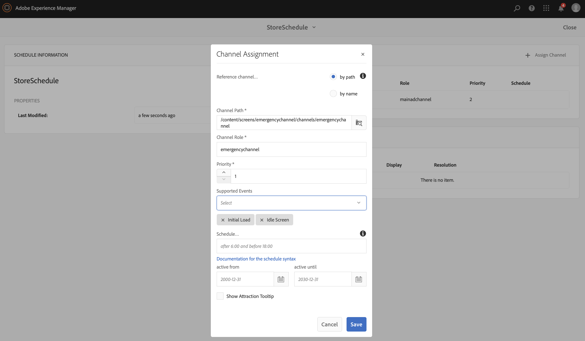

   您可以从&#x200B;**StoreSchedule**&#x200B;仪表板查看分配的渠道。

   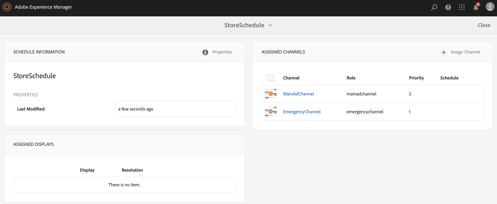

1. **为每个显示区分配计划**

   1. 导航到每个显示区，如&#x200B;**EmergencyChannel** > **位置** > **商店** >**商店前台**。

   1. 单击操作栏中的&#x200B;**仪表板**。
   1. 从&#x200B;**分配的渠道和计划**&#x200B;面板中单击&#x200B;**...**，然后单击&#x200B;**+分配计划**。

   1. 单击计划的路径（例如，此处，**EmergencyChannel** > **计划** >**存储计划**）。

   1. 单击&#x200B;**保存**。

   您可以从&#x200B;**StoreSchedule**&#x200B;仪表板查看分配给显示区的计划。
   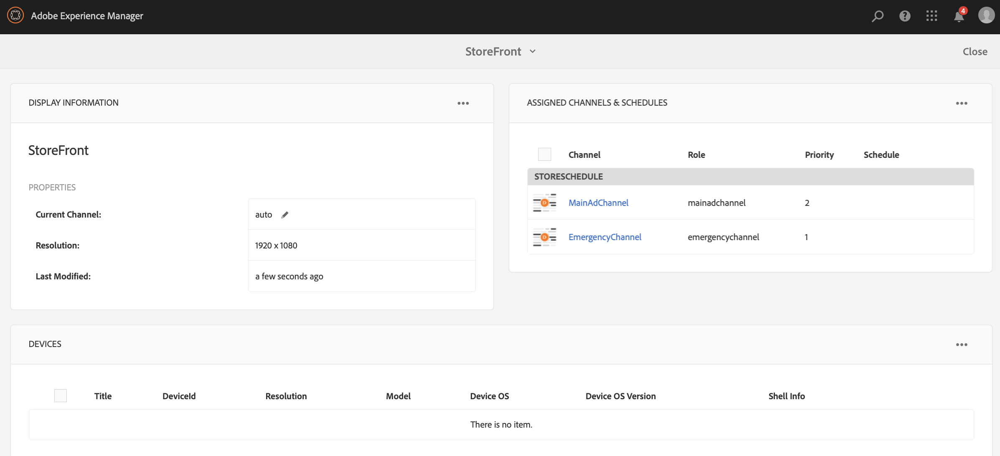

1. **设备注册**

   完成设备注册过程。 注册后，您可以在AEM Screens Player上查看以下输出。

   

## 切换到紧急频道 {#switching-to-emergency-channel}

如果出现紧急情况，请执行以下步骤：

1. 导航到&#x200B;**EmergencyChannel** > **计划** > **存储计划**，然后单击操作栏中的&#x200B;**仪表板**。

   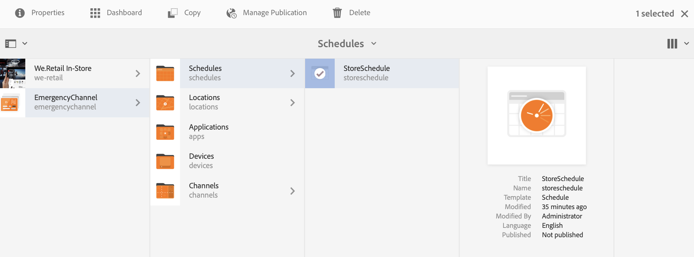

1. 从&#x200B;**StoreSchedule**&#x200B;仪表板中单击&#x200B;**EmergencyChannel**，然后单击&#x200B;**编辑分配**。

   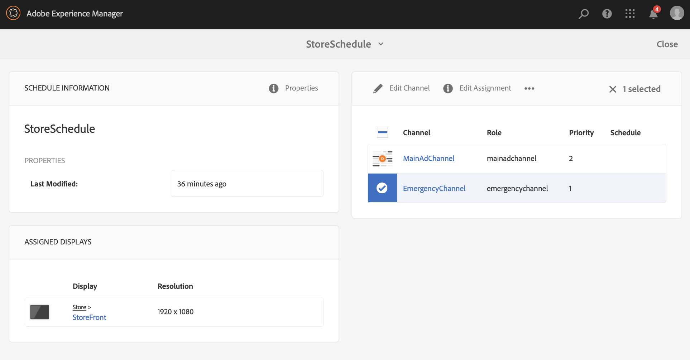

1. 从&#x200B;**渠道分配**&#x200B;对话框将&#x200B;**EmergencyChannel**&#x200B;的&#x200B;**优先级**&#x200B;更新为&#x200B;**3**，然后单击&#x200B;**保存**。

   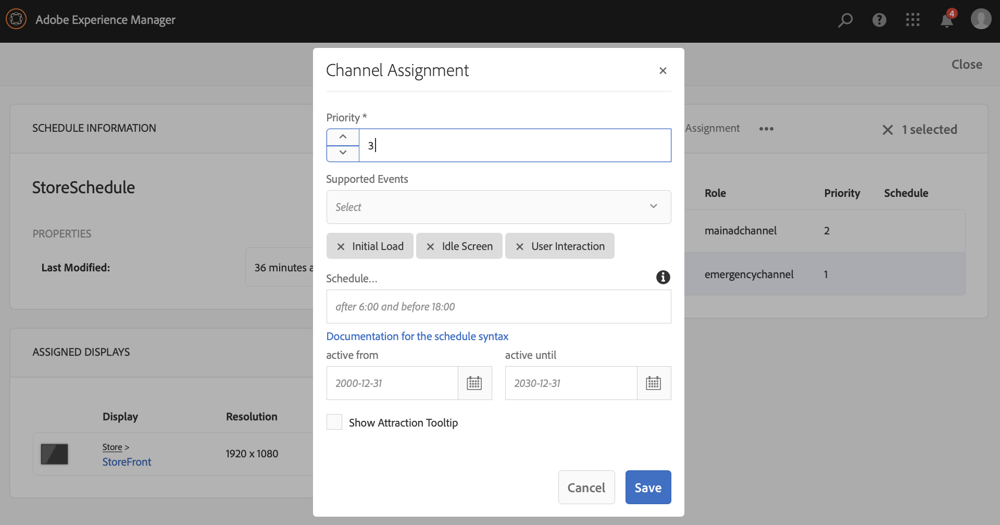

1. 更新渠道优先级后，所有AEM Screens播放器都会显示&#x200B;**EmergencyChannel**&#x200B;内容。

   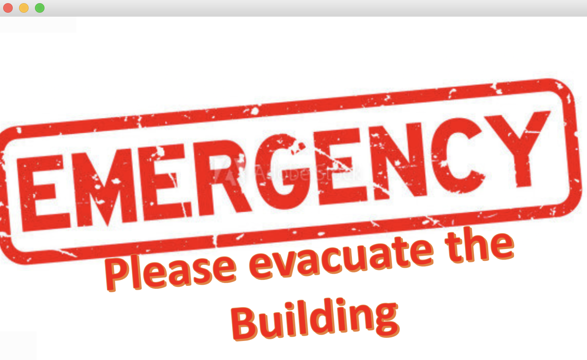

### 结论 {#conclusion}

**EmergencyChannel**&#x200B;继续显示其内容，直到内容作者将优先级值重置为1。

当内容作者收到紧急情况已清除的指示时，他们应更新&#x200B;**MainAdChannel**&#x200B;的优先级。 这样做会导致恢复正常播放。

