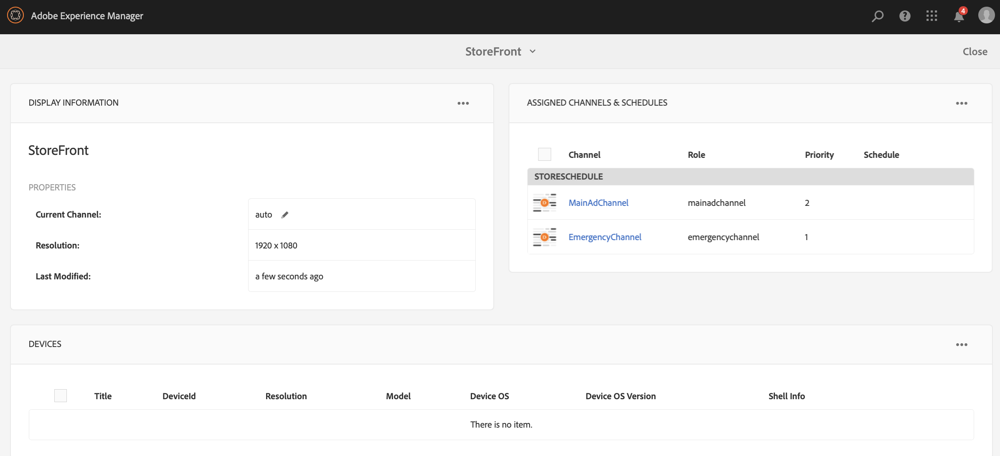

# 紧急渠道 {#emergency-channel}

## 用例描述 {#use-case-description}

本节描述一个用例示例，该示例强调创建和管理紧急渠道，内容作者可以在先决条件的情况下从序列渠道切换该紧急。

### 先决条件 {#preconditions}

在开始此用例之前，请确保您了解如何：

* **[创建和管理渠道](managing-channels.md)**
* **[创建和管理位置](managing-locations.md)**
* **[创建和管理计划](managing-schedules.md)**
* **[设备注册](device-registration.md)**

### 主要演员 {#primary-actors}

内容作者

## 基本流程：设置项目 {#basic-flow-setting-up-the-project}

请按照以下步骤设置紧急渠道:

1. 创建名为EmergencyChannel的AEM Screens **项目**，如下所示。

   >[!NOTE]
   >要了解有关在AEM Screens创建和管理项目的更多信息，请参阅创建项目。

   

1. **创建序列渠道**

   1. 选择 **渠道** 文件夹，然后 **单击创** 建，以打开向导以创建渠道。

   1. 从向 **导中选择** “序列渠道”，然后创建标题为MainAdChannel **的渠道**。

   

1. **将内容添加到序列渠道**

   1. 选择渠道(**MainAdChannel**)。
   1. 单击操作栏中的&#x200B;**编辑**&#x200B;以打开编辑器。将少量资源拖放到您的渠道。

   

1. **创建紧急渠道**

   1. 选择 **渠道** 文件夹。
   1. 单击创 **建** ，打开向导以创建渠道。
   1. 从向 **导中选择** “序列渠道”，然后创建标题为ExergenceChannel **的渠道**。

   >[!NOTE]
   >
   >通常，您的紧急渠道会添加到您先前的生产项目中。

   

1. **将内容添加到紧急渠道**

   1. 选择渠道(**紧急渠道)**。
   1. 单击操作栏中的&#x200B;**编辑**&#x200B;以打开编辑器。将您要在紧急情况下运行的资产拖放到渠道。

   

1. **创建位置**

   1. 导航到 **位置** 文件夹。
   1. 单击 **操作栏** 中的创建，然后从向导中创建标题 **为** Store的位置。

   

1. **在您的位置创建显示屏**

   导航到您的位置(**商店**)，然后 **单击操** 作栏中的“创建”。 按照向导创建标题为 **StoreFront** 和StoreRear的两 **个显** 示 **屏**。

   

1. **创建计划**

   1. 导航到您的 **计划** 文件夹。
   1. 单击操作栏中的&#x200B;**创建**。按照向导创建标题为StoreSchedule的 **计划**。

   

1. 为计划分配显示屏并设置优先级

   1. 选择计划 **(StoreSchedule)** ，然后 **单击操作** 栏中的仪表板。

   1. 单击 **“已指定渠道** ”面板 **中的“指定渠道** ”。

   1. 从“渠道 **分配** ”对话框中：

      1. Select the path to the **MainAdChannel**
      1. 将优先级 **设置为** 2
      1. Set the Supported Events as **Initial Load** and **Idle Screen**.
      1. Click **Save**

      同样，您也必须再次执行相同的步骤来分配 **EmergencyChannel** 并设置其 **优先级**。
   >[!NOTE]
   >
   >优先级用于在多个分配匹配播放条件时对分配进行排序。具有最高值的分配将始终优先于具有较低值的分配。

   

1. 单击 **“已指定渠道** ”面板 **中的“指定渠道** ”。

1. 从“渠道 **分配** ”对话框中：

   1. Select the path to the **EmergencyChannel**
   1. 将优 **先级** 设置为1

   1. 将支持的事件设 **置为初始加**&#x200B;载 **、空闲屏幕**&#x200B;和 **用户交互**

   1. Click **Save**

   

   您可以从StoreSchedule视图仪表板分配 **的渠道** 。

   

1. **将计划分配给每个显示屏**

   1. 导航到每个显示屏， **如EmergyChannel** —>位 **置** — **>商店** —**>商店** Front。

   1. Click **Dashboard** from the action to open the display dashboard.
   1. 从“已 **分配的渠道** 和计划”面 **板中单击** ...，然后进 **一步单击+分配计划**。

   1. 选择计划的路径(例如，此处， **EmergencyChannel** —> **计划****—>** StoreSchedule)。

   1. 单击&#x200B;**保存**。

   您可以从StoreSchedule视图将分配的计划仪表板到 **显示屏** 。
   

1. **设备注册**

   完成设备注册过程，注册后，您将在AEM Screens播放器上视图以下输出。

   

## 切换到紧急渠道 {#switching-to-emergency-channel}

在紧急事件中，执行以下步骤：

1. 导航到 **EmergencyChannel** —> **计划****—>** StoreSchedule **，然后从操** 作栏中选择仪表板。

   

1. 从StoreSchedule仪表板 **中选择** EmergencyChannel **，然后单** 击编辑分配 ****。

   

1. 将EmergencyChannel的 **优先** 级从 **渠道** 分配对话框更 **新为3** , ********&#x200B;然后单击分配对话框。

   

1. 更新渠道的优先级后，所有AEM Screens播放器都将显示 **EmergencyChannel** ，如下所示。

   

### 结论 {#conclusion}

EmergencyChannel **将继续** 显示其内容，直到内容作者将优先级值重置为1。

内容作者收到紧急情况已清除的说明后，应更新MainAdChannel的优先级 **** ，这会导致正常播放恢复。
