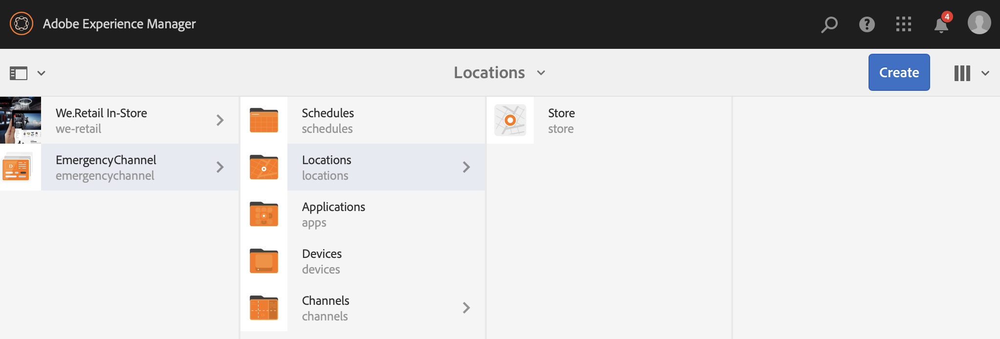

# 紧急通道{#emergency-channel}

## 用例描述 {#use-case-description}

本节介绍一个用例示例，该示例着重介绍如何创建和管理紧急渠道，内容作者可在存在先决条件的情况下从序列渠道进行切换。

### 先决条件 {#preconditions}

在开始使用此用例之前，请确保您了解如何：

* **[创建和管理渠道](managing-channels.md)**
* **[创建和管理位置](managing-locations.md)**
* **[创建和管理计划](managing-schedules.md)**
* **[设备注册](device-registration.md)**

### 主要行为者{#primary-actors}

内容作者

## 基本流程：设置项目{#basic-flow-setting-up-the-project}

请按照以下步骤设置紧急渠道：

1. 创建名为&#x200B;**EmergentChannel**&#x200B;的AEM Screens项目，如下所示。

   >[!NOTE]
   >要了解有关在AEM Screens中创建和管理项目的更多信息，请参阅创建项目。

   

1. **创建序列渠道**

   1. 选择&#x200B;**渠道**&#x200B;文件夹，然后单击&#x200B;**创建**&#x200B;以打开向导以创建渠道。

   1. 从向导中选择&#x200B;**序列渠道**&#x200B;并创建标题为&#x200B;**MainAdChannel**&#x200B;的渠道。

   

1. **向序列渠道添加内容**

   1. 选择渠道(**MainAdChannel**)。
   1. 单击操作栏中的&#x200B;**编辑**&#x200B;以打开编辑器。将几个资产拖放到您的渠道中。

   

1. **创建紧急渠道**

   1. 选择&#x200B;**Channels**&#x200B;文件夹。
   1. 单击&#x200B;**创建**&#x200B;以打开创建渠道的向导。
   1. 从向导中选择&#x200B;**序列渠道**&#x200B;并创建标题为&#x200B;**EmercyChannel**&#x200B;的渠道。

   >[!NOTE]
   >
   >通常情况下，紧急渠道会添加到预先存在的生产项目中。

   

1. **将内容添加到紧急渠道**

   1. 选择渠道（**紧急渠道）**。
   1. 单击操作栏中的&#x200B;**编辑**&#x200B;以打开编辑器。将您要在紧急情况下运行的资产拖放到渠道中。

   

1. **创建位置**

   1. 导航到&#x200B;**Locations**&#x200B;文件夹。
   1. 单击操作栏中的&#x200B;**创建** ，然后从向导中创建标题为&#x200B;**Store**&#x200B;的位置。

   

1. **在您的位置中创建显示屏**

   导航到您的位置(**Store**)，然后单击操作栏中的&#x200B;**创建**。 按照向导创建两个标题为&#x200B;**StoreFront**&#x200B;和&#x200B;**StoreRear**&#x200B;的&#x200B;**显示。**

   

1. **创建计划**

   1. 导航到您的&#x200B;**Schedules**&#x200B;文件夹。
   1. 单击操作栏中的&#x200B;**创建**。按照向导创建标题为&#x200B;**StoreSchedule**&#x200B;的计划。

   

1. 将显示内容分配给计划并设置优先级

   1. 选择计划&#x200B;**(StoreSchedule)**，然后单击操作栏中的&#x200B;**功能板**。

   1. 单击&#x200B;**已分配通道**&#x200B;面板中的&#x200B;**+分配通道**。

   1. 在&#x200B;**渠道分配**&#x200B;对话框中：

      1. 选择&#x200B;**MainAdChannel**&#x200B;的路径
      1. 将&#x200B;**优先级**&#x200B;设置为2
      1. 将支持的事件设置为&#x200B;**初始加载**&#x200B;和&#x200B;**空闲屏幕**。
      1. 单击&#x200B;**Save**

      同样，您也必须再次执行相同的步骤来分配&#x200B;**EmergencyChannel**&#x200B;并设置其&#x200B;**Priority**。
   >[!NOTE]
   >
   >优先级用于在多个分配匹配播放条件时对分配进行排序。具有最高值的分配将始终优先于具有较低值的分配。

   

1. 单击&#x200B;**已分配通道**&#x200B;面板中的&#x200B;**+分配通道**。

1. 在&#x200B;**渠道分配**&#x200B;对话框中：

   1. 选择&#x200B;**EmergentChannel**&#x200B;的路径
   1. 将&#x200B;**优先级**&#x200B;设置为1

   1. 将支持的事件设置为&#x200B;**初始负载**、**空闲屏幕**&#x200B;和&#x200B;**用户交互**

   1. 单击&#x200B;**Save**

   

   您可以从&#x200B;**StoreSchedule**&#x200B;功能板查看分配的渠道。

   

1. **将计划分配给每个显示**

   1. 导航到每个显示屏，如&#x200B;**EmercyChannel** —> **位置** —> **存储** —>**StoreFront**。

   1. 单击操作中的&#x200B;**功能板**&#x200B;以打开显示功能板。
   1. 单击&#x200B;**...**&#x200B;从&#x200B;**已分配的渠道和计划**&#x200B;面板中，进一步单击&#x200B;**+分配计划**。

   1. 选择计划的路径（例如，此处&#x200B;**EmercyChannel** —> **计划** —>**StoreSchedule**）。

   1. 单击&#x200B;**保存**。

   您可以从&#x200B;**StoreSchedule**功能板中查看分配给显示的计划。
   

1. **设备注册**

   完成设备注册过程，注册后，您将在AEM Screens播放器中查看以下输出。

   

## 切换到紧急通道{#switching-to-emergency-channel}

在发生紧急情况时，请执行以下步骤：

1. 导航至&#x200B;**EmergencyChannel** —> **Schedules** —> **StoreSchedule**，然后从操作栏中选择&#x200B;**Dashboard**。

   

1. 从&#x200B;**StoreSchedule**&#x200B;功能板中选择&#x200B;**EmergencyChannel** ，然后单击&#x200B;**编辑分配**。

   

1. 从&#x200B;**渠道分配**&#x200B;对话框中将&#x200B;**EmergencyChannel**&#x200B;的&#x200B;**优先级**&#x200B;更新为&#x200B;**3**，然后单击&#x200B;**Save**。

   

1. 一旦渠道的优先级更新，所有AEM Screens播放器都将显示&#x200B;**EmercyChannel**&#x200B;内容，如下所示。

   

### 结论 {#conclusion}

**EmercyChannel**&#x200B;将继续显示其内容，直到内容作者将优先级值重置为1为止。

内容作者收到紧急情况清除指令后，应更新&#x200B;**MainAdChannel**&#x200B;的优先级，该优先级将导致正常播放恢复。
