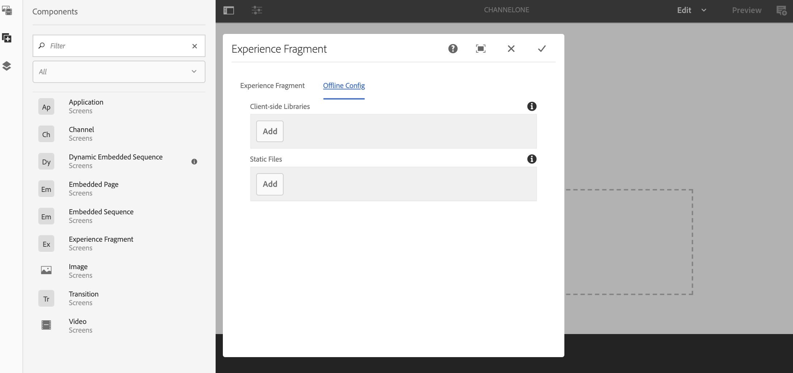

# 使用体验片段 {#using-experience-fragments}

本页涵盖以下主题：

* **概述**
* **在 AEM Screens 中使用体验片段**
* **将更改传播到页面**

## 概述 {#overview}

***体验片段***&#x200B;是由一个或多个组件构成的组件组，包括可在页面内引用的内容和布局。体验片段可以包含任何组件（例如包含一个或多个组件，这些组件又可以包含段落系统内的任何内容），这些组件将被引用到完整体验中或由第三个端点进行请求。

## 在 AEM Screens 中使用体验片段 {#using-experience-fragments-in-aem-screens}

>[!NOTE]
>以下示例使用&#x200B;**We.Retail**&#x200B;作为演示项目，从中将体验片段从&#x200B;**站点**&#x200B;页面引入AEM Screens项目。

例如，以下工作流演示了如何使用站点中We.Retail中的体验片段。 您可以选择网页，并将该内容用于您的某个项目的AEM Screens渠道中。

### 先决条件{#pre-requisites}

**使用渠道创建演示项目**

***创建项目***

1. 单击&#x200B;**创建屏幕项目**&#x200B;以创建新项目。
1. 在“标题”中输入 **DemoProject**。
1. 单击&#x200B;**保存**。

**DemoProject**&#x200B;将添加到您的AEM Screens。

***创建渠道***

1. 导航到您创建的&#x200B;**DemoProject**，然后选择&#x200B;**渠道**&#x200B;文件夹。

1. 单击操作栏中的&#x200B;**创建**&#x200B;以打开向导。
1. 从向导中选择&#x200B;**序列渠道**&#x200B;模板，然后单击&#x200B;**下一步**。

1. 将&#x200B;**标题**&#x200B;输入为&#x200B;**TestChannel**，然后单击&#x200B;**创建**。

**TestChannel**&#x200B;将添加到您的&#x200B;**DemoProject**。\

### 创建体验片段 {#creating-an-experience-fragment}

请按照以下步骤将&#x200B;**We.Retail**&#x200B;中的内容利用到&#x200B;**DemoProject**&#x200B;中的&#x200B;**TestChannel**。

1. **在We.Retail中导航到站点页面**

   1. 导航到站点并选择&#x200B;**We.Retail** -> **美国** -> **英语** -> **设备**，然后选择此页面以将其用作Screens渠道的体验片段。

   1. 单击操作栏中的&#x200B;**编辑**&#x200B;以打开要用作Screens渠道体验片段的页面。

1. **重新使用内容**

   1. 选择要包含在渠道中的片段。
   1. 单击右侧的最后一个图标以打开&#x200B;**转换为体验片段**&#x200B;对话框。

   

1. **创建体验片段**

   1. 选择&#x200B;**操作**&#x200B;作为&#x200B;**创建新体验片段**。

   1. 选择&#x200B;**父路径**。
   1. 选择&#x200B;**模板**。 在此处选择&#x200B;**体验片段 — 屏幕变量**&#x200B;模板（字段`/libs/settings/screens/experience-fragments/templates/experience-fragment-template-screens`中的值）。

   1. 将&#x200B;**片段标题**&#x200B;输入为&#x200B;**ScreensFragment**。

   1. 单击复选标记以完成新体验片段的创建。

   

   注意：要更轻松地选择选项，请单击字段右侧的复选标记以打开选择对话框。

1. **创建体验片段的Live Copy**

   1. 导航到AEM主页。
   1. 选择&#x200B;**体验片段**&#x200B;并高亮显示&#x200B;**ScreensFragment**，然后单击&#x200B;**变量作为Live-copy**，如下图所示：

   

   c.从&#x200B;**创建Live Copy**&#x200B;向导中选择&#x200B;**ScreensFragment**，然后单击&#x200B;**下一步**。

   d.输入&#x200B;**标题**&#x200B;和&#x200B;**名称**&#x200B;作为&#x200B;**屏幕**。

   e.单击&#x200B;**创建**&#x200B;以创建Live Copy。

   f.单击&#x200B;**完成**&#x200B;可返回至&#x200B;**ScreensFragment**&#x200B;页面。

   

   >[!NOTE]
   >
   >创建Screens片段后，您可以编辑片段的属性。 选择片段，然后单击操作栏中的&#x200B;**属性**。

   **编辑屏幕片段的属性**

   1. 导航到&#x200B;**ScreensFragment**（您在前面的步骤中创建），然后单击操作栏中的&#x200B;**属性**。

   1. 选择&#x200B;**脱机配置**&#x200B;选项卡，如下图所示。

   您可以将&#x200B;**客户端库**（java和css）和&#x200B;**静态文件**&#x200B;添加到您的体验片段中。

   以下示例显示了如何在您的体验片段中添加客户端库以及作为静态文件一部分的字体。  

1. **在“屏幕”渠道中将体验片段用作组件**

   1. 导航到要使用&#x200B;**Screens**&#x200B;片段的“屏幕”渠道。
   1. 选择&#x200B;**TestChannel**&#x200B;并单击操作栏中的&#x200B;**编辑**。

   1. 单击侧选项卡中的组件图标。
   1. 将&#x200B;**体验片段**&#x200B;拖放到您的渠道。

   

   e.选择&#x200B;**体验片段**&#x200B;组件，然后选择左上角（扳手）图标以打开&#x200B;**体验片段**&#x200B;对话框。

   f.选择您在&#x200B;**路径**&#x200B;的&#x200B;*步骤3*&#x200B;中创建的片段的&#x200B;**Screens** Live Copy。

   

   f.选择您在&#x200B;**体验片段**&#x200B;中的&#x200B;*步骤3*&#x200B;中创建的片段的&#x200B;**Screens** Live Copy。

   

   h.在&#x200B;**持续时间**&#x200B;中输入毫秒。

   我。从&#x200B;**体验片段**&#x200B;对话框中选择&#x200B;**脱机配置**&#x200B;以定义客户端库和静态文件。

   >[!NOTE]
   >
   >如果除了在步骤(4)中配置的文件之外，还要添加客户端库或静态文件，则可以从&#x200B;**体验片段**&#x200B;对话框的&#x200B;**脱机配置**&#x200B;选项卡添加。

   

   j.单击复选标记以完成该过程。

### 验证结果{#validating-the-result}

完成上述步骤后，您可以通过以下方式验证您在&#x200B;**ChannelOne**&#x200B;中的体验片段：

1. 导航到&#x200B;**TestChannel**。
1. 从操作栏中选择&#x200B;**预览**。

您将视图渠道中&#x200B;**站点**&#x200B;页面（体验片段的Live-Copy）中的内容，如下图所示：\

## 将更改传播到页面{#propagating-changes-from-the-master-page}

***Live*** Copy引用（源的）副本，由同步操作维护，如转出配置所定义。

由于体验片段，因此我们创建的是&#x200B;**站点**&#x200B;页面中的Live Copy，因此，如果您从主控页面对该特定片段进行更改，您将视图渠道中的更改或您使用体验片段的目标。

>[!NOTE]
>
>有关Live Copy的详细信息，请参阅重用内容：多站点管理器和Live Copy。

请按照以下步骤将更改从主控渠道传播到目标渠道:

1. 从&#x200B;**站点**(主控)页面中选择体验片段，然后单击铅笔图标以编辑体验片段中的项目。

   

1. 选择体验片段，然后单击扳手图标以打开对话框以编辑图像。

   

1. 将打开&#x200B;**产品网格**&#x200B;对话框。

   

1. 您可以编辑任何图像。 例如，此处将替换此片段中的第一个图像。

   

1. 选择体验片段，然后单击转出图标以将更改传播到渠道中使用的片段。

   

1. 单击转出以确认更改。

   您将看到更改被转出。

   

### 验证更改{#validating-the-changes}

请按照以下步骤确认渠道中的更改：

1. 导航到&#x200B;**Screens** -> **渠道** -> **TestChannel**。

1. 单击操作栏中的&#x200B;**预览**&#x200B;以确认更改。

下图说明了&#x200B;**TestChannel**&#x200B;中的更改：\

