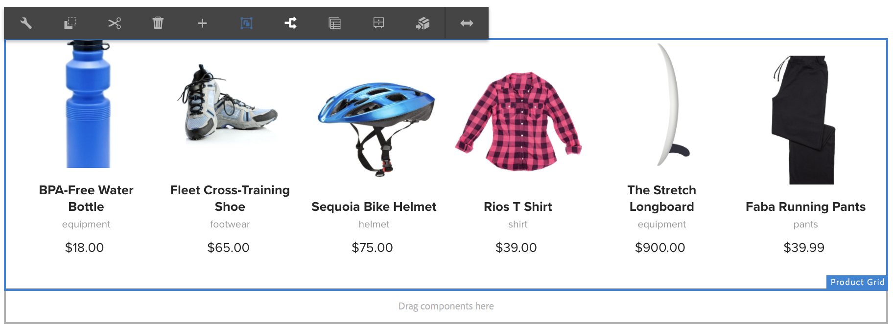

# 使用体验片段 {#using-experience-fragments}

本页涵盖以下主题：

* **概述**
* **在 AEM Screens 中使用体验片段**
* **从主页传播更改**

## 概述 {#overview}

***体验片段**是由一个或多个组件构成的组件组，包括可在页面内引用的内容和布局。*&#x200B;体验片段可以包含任何组件（例如包含一个或多个组件，这些组件又可以包含段落系统内的任何内容），这些组件将被引用到完整体验中或由第三个端点进行请求。

## 在 AEM Screens 中使用体验片段 {#using-experience-fragments-in-aem-screens}

>[!NOTE]
>
>以下示例将 **We.Retail** 用作一个演示项目，从该演示项目将体验片段从站点页面引 **** 入到AEM Screens项目。

例如，以下工作流演示了如何使用站点中We.Retail的体验片段。 您可以选择网页，并在某个项目的AEM Screens渠道中利用该内容。

### Pre-requisites {#pre-requisites}

**使用渠道创建演示项目**

***创建项目***

1. Click Screens and select **Create** --&gt; **Create Project **to create a new project.

1. 从**创建屏幕项目**向导中选择**屏幕**。

1. 在“标题”中输入 **DemoProject**。
1. 单击&#x200B;**创建**。

将 **向AEM Screens添加DemoProject** 。  ***创建渠道***

1. Navigate to the **DemoProject** you created and select the **Channels** folder.

1. Click **Create** from the action bar (see the figure below). 此时将打开一个向导。
1. 从向导中 **选择序列渠道** ，然后单击“下 **一步”**。

1. Enter the **Title** as **TestChannel** and click **Create**.

将 **向DemoProject添加一个TestChannel******。\

### 创建体验片段 {#creating-an-experience-fragment}

请按照以下步骤将 **We.Retail中的内容用于DemoProject中的** TestChannel ********。

1. **导航到We.Retail中的“站点”页面**

   1. 导航到站点并选择**We.Retail **-&gt;** United States **-&gt;**English **，然后选择 **Equipment** （设备）页面以将其用作Screens渠道的体验片段。

   1. 单击 **操作栏中的编辑** ，以打开要用作Screens渠道体验片段的页面。
   

1. **重新使用内容**

   1. 选择要包含在渠道中的片段。
   1. 单击右侧的最后一个图标以打开“转 **换为体验片段** ”对话框。
   

1. **创建体验片段**

   1. 选择操 **作** , **作为新建体验片段**。

   1. 选择父 **路径**。
   1. 选择模 **板**。 在此处选择**体验片段——屏幕变量**模板。

   1. Enter the **Fragment Title **as **ScreensFragment**.

   1. 单击复选标记以完成新体验片段的创建。
   

1. **创建体验片段的Live Copy**

   1. 导航到AEM主页。
   1. 选择 **体验片段** ，高亮显示 **ScreensFragment** ，然后单击 **Variation作为Live-copy**，如下图所示：
   

   c.选择**创建Live Copy **中的** ScreensFragment**向导，然后单击“下 **一步”**。

   d.输入标 **题** , **并输入名** 称 **为Screens**。

   e.单击 **创建** ，以创建Live Copy。

   f.单击 **完成** ，移回 **ScreensFragment页面** 。

   

   >[!NOTE]
   >
   >创建Screens片段后，您可以编辑片段的属性。 选择片段，然后单 **击操作** 栏中的属性。

   **编辑屏幕片段的属性**

   1. 导航到 **ScreensFragment** （您在前面的步骤中创建），然后单击操 **作栏中的属性** 。

   1. 选择“ **脱机配置** ”选项卡，如下图所示。
   您可以将客 **户端库** （java和css）和静态文 **** 件添加到体验片段。

   以下示例显示了如何将客户端库和字体作为静态文件的一部分添加到体验片段中。  

1. **将体验片段用作屏幕渠道中的组件**

   1. 导航到要在其中使用Screens片段的Screens **渠道** 。
   1. 选择 **TestChannel** ，然后 **单击操作栏中的** “编辑”。

   1. 单击侧选项卡中的组件图标。
   1. 将体验片段 **拖放到渠道** 。
   

   e.选择 **体验片段** ，然后选择左上角（扳手）图标以打开体验片 **** 段对话框。

   f.在 ****路径** **字段中，选择您在步骤3 ** 中创建的片段的Screens Live Copy。

   

   f.在 ****体验片段** **字段中，选择您在步骤3 ** 中创建的片段的Screens Live Copy。

   

   h.在**持续时间**字段中输入秒数。

   i.从“体 **验片段** ”对话框中选择 **** “脱机配置”以定义客户端库和静态文件。

   >[!NOTE]
   >
   >如果除了在步骤(4)中配置的外，还要添加客户端库或静态文件，则可以从“体验片段”对话框的“脱机配置 **”选项卡****** 中添加。

   

   j.单击复选标记以完成该过程。

### 验证结果 {#validating-the-result}

完成上述步骤后，您可以通过以下方式在 **ChannelOne中验证您的体验片段** :

1. 导航到 **TestChannel**。
1. 从操作 **栏中选择** “预览”。

您将从渠道中的“站 **点** ”页面（体验片段的Live Copy）查看内容，如下图所示：\

## 从主页传播更改 {#propagating-changes-from-the-master-page}

***Live Copy*** 指由同步操作（由转出配置定义）维护的（源的）副本。

由于体验片段，我们从 **Sites** 页面创建的是Live Copy，因此，如果您从主页面对该特定片段进行了更改，您将在渠道或使用体验片段的目标中查看所做的更改。

>[!NOTE]
>
>有关Live copy的详细信息，请参阅重复使用内容：多站点管理器和Live Copy。

按照以下步骤将更改从主渠道传播到目标渠道：

1. 从“站点” **** （主页）页面中选择体验片段，然后单击铅笔图标以编辑体验片段中的项目。

   

1. 选择体验片段，然后单击扳手图标以打开对话框以编辑图像。

   

1. 将打 **开“产品网格** ”对话框。

   

1. 您可以编辑任何图像。 例如，此处将替换此片段中的第一幅图像。

   

1. 选择体验片段，然后单击转出图标以将更改传播到渠道中使用的片段。

   

1. 单击转出以确认更改。

   您将看到更改已转出。

   

### 验证更改 {#validating-the-changes}

请按照以下步骤确认渠道中的更改：

1. 导航到 **Screens** -&gt;渠道 **-** &gt;测试 **渠道**。

1. 单击 **操作栏** 中的“预览”以确认更改。

下图说明了TestChannel中的 **更改**:\

