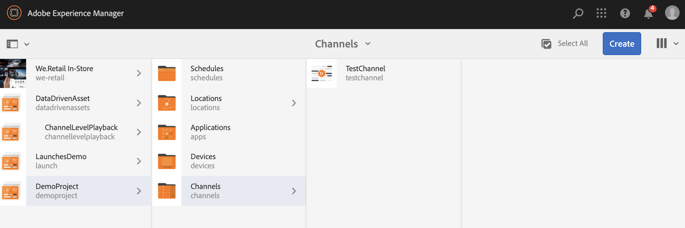
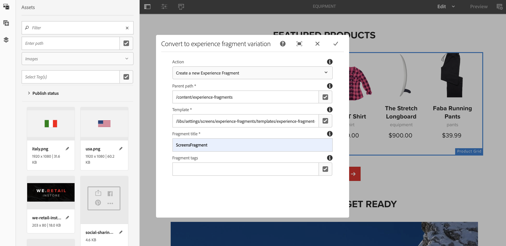

# 使用体验片段 {#using-experience-fragments}

本页涵盖以下主题：

* **概述**
* **在AEM Screens中使用体验片段**
* **将更改传播到页面**

## 概述 {#overview}

An ***体验片段*** 由一个或多个组件组成，包括可在页面中引用的内容和布局。 体验片段可以包含任何组件，例如一个或多个组件，这些组件可以包含段落系统中将被引用到完整体验中或由第三个端点请求的任何内容。

## 在AEM Screens中使用体验片段 {#using-experience-fragments-in-aem-screens}

>[!NOTE]
>以下示例使用 **We.Retail** 作为演示项目，从中利用体验片段 **站点** 页面到AEM Screens项目。

例如，以下工作流演示了对Sites中We.Retail体验片段的使用。 您可以选择网页，并在某个项目的AEM Screens渠道中使用该内容。

### 先决条件 {#pre-requisites}

**使用渠道创建演示项目**

***创建项目***

1. 单击 **创建屏幕项目** 以创建新项目。
1. 输入标题为 **演示项目**.
1. 单击“**保存**”。

A **演示项目** 将被添加到您的AEM Screens中。

***创建渠道***

1. 导航到 **演示项目** 您已创建并选择 **渠道** 文件夹。

1. 单击 **创建** 以打开向导。
1. 选择 **序列渠道** 模板并单击 **下一个**.

1. 输入 **标题** 作为 **TestChannel** 并单击 **创建**.

A **TestChannel** 将添加到您的 **演示项目**.\

### 创建体验片段 {#creating-an-experience-fragment}

执行以下步骤以利用中的内容 **We.Retail** 敬您的 **TestChannel** 在 **演示项目**.

1. **导航到We.Retail中的“站点”页面**

   1. 导航到站点并选择 **We.Retail** -> **美国** -> **英语** -> **设备** 并选择此页面以将其用作Screens渠道的体验片段。

   1. 单击 **编辑** 从操作栏中打开要用作Screens渠道体验片段的页面。

1. **重用内容**

   1. 选择要包含在渠道中的片段。
   1. 单击右侧的最后一个图标以打开 **转换为体验片段** 对话框。

   

1. **创建体验片段**

   1. 选择 **操作** 作为 **创建新的体验片段**.

   1. 选择 **父路径**.
   1. 选择 **模板**. 选择 **体验片段 — 屏幕变量** 此处为模板（字段中的值） `/libs/settings/screens/experience-fragments/templates/experience-fragment-template-screens`)。

   1. 输入 **片段标题** 作为 **ScreensFragment**.

   1. 单击复选标记以完成新体验片段的创建。

   

   注意：要更轻松地选择选项，请单击字段右侧的复选标记以打开选择对话框。

1. **创建体验片段的实时副本**

   1. 导航到AEM主页。
   1. 选择 **体验片段** 并突出显示 **ScreensFragment** 并单击 **live-copy形式的变量**，如下图所示：

   

   c.选择 **ScreensFragment** 起始日期 **创建Live Copy** 向导并单击 **下一个**.

   d.输入 **标题** 和 **名称** 作为 **Screens**.

   e.单击 **创建** 以创建Live Copy。

   f.单击 **完成** 移回到 **ScreensFragment** 页面。

   

   >[!NOTE]
   >
   >创建屏幕片段后，您可以编辑片段的属性。 选择片段并单击 **属性** 操作栏中的。

   **编辑屏幕片段的属性**

   1. 导航到 **ScreensFragment** （在前面步骤中创建的），然后单击 **属性** 操作栏中的。

   1. 选择 **脱机配置** 选项卡，如下图所示。

   您可以添加 **客户端库** （java和css）和 **静态文件** 到您的体验片段中。

   以下示例显示了将客户端库和字体作为静态文件的一部分添加到体验片段的情况。  

1. **在屏幕渠道中使用体验片段作为组件**

   1. 导航到要在其中使用 **Screens** 片段。
   1. 选择 **TestChannel** 并单击 **编辑** 操作栏中的。

   1. 单击侧选项卡中的组件图标。
   1. 拖放 **体验片段** 到您的频道。

   

   e.选择 **体验片段** 组件并选择左上角（扳手）图标以打开 **体验片段** 对话框。

   f.选择 **Screens** 您在中创建的片段的实时副本 *步骤3* 在 **路径**.

   

   f.选择 **Screens** 您在中创建的片段的实时副本 *步骤3* 在 **体验片段**.

   

   h.输入毫秒数，单位： **持续时间**.

   i.选择 **脱机配置** 从 **体验片段** 对话框定义客户端库和静态文件。

   >[!NOTE]
   >
   >如果除了在步骤(4)中配置的库之外，还想添加客户端库或静态文件，您可以从 **脱机配置** 在中选项卡 **体验片段** 对话框。

   

   j.单击复选标记以完成该过程。

### 验证结果 {#validating-the-result}

完成上述步骤后，您可以在中验证您的体验片段 **ChannelOne** 方式：

1. 导航到 **TestChannel**.
1. 选择 **预览** 操作栏中的。

您将从以下位置查看内容 **站点** 页面（体验片段的实时副本）的数量，如下图所示：\

## 将更改传播到页面 {#propagating-changes-from-the-master-page}

***Live Copy*** 指由转出配置定义的同步操作维护的（源的）副本。

由于存在体验片段，因此我们创建的是一个来自 **站点** 因此，如果您从主控页面对该特定片段进行更改，您将在渠道或您使用体验片段的目标中查看更改。

>[!NOTE]
>
>有关Live Copy的更多信息，请参阅重用内容：多站点管理器和Live Copy 。

请按照以下步骤将更改从主控渠道传播到您的目标渠道：

1. 从中选择体验片段 **站点** (主控)页面，然后单击铅笔图标以编辑体验片段中的项目。

   

1. 选择体验片段，然后单击扳手图标，打开对话框以编辑图像。

   

1. 此 **产品网格** 对话框打开。

   

1. 您可以编辑任何图像。 例如，此处第一个图像被替换为此片段中。

   

1. 选择体验片段，然后单击转出图标，以将更改传播到您的渠道中使用的片段。

   

1. 单击转出以确认更改。

   您将看到已转出更改。

   

### 验证更改 {#validating-the-changes}

按照以下步骤确认渠道中的更改：

1. 导航到 **Screens** -> **渠道** -> **TestChannel**.

1. 单击 **预览** 以确认更改。

下图说明了 **TestChannel**：\

