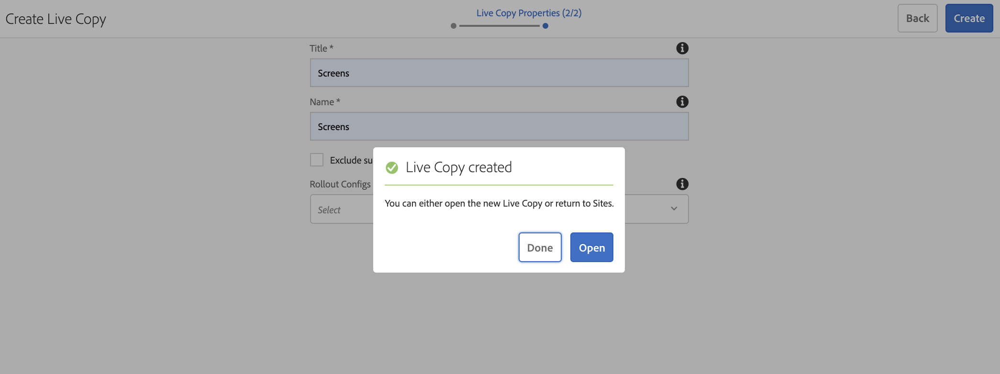

# 使用体验片段 {#using-experience-fragments}

本页涵盖以下主题：

* **概述**
* **在AEM Screens中使用体验片段**
* **将更改传播到页面**

## 概述 {#overview}

***体验片段***&#x200B;是由一个或多个组件组成的组，这些组件包括可在页面中引用的内容和布局。 体验片段可以包含任何组件。 例如，它可以包含一个或多个组件，这些组件可以包含段落系统中被引用到完整体验或由第三个端点请求的任何内容。

## 在AEM Screens中使用体验片段 {#using-experience-fragments-in-aem-screens}

>[!NOTE]
>以下示例使用&#x200B;**`We.Retail`**&#x200B;作为演示项目，其中体验片段从&#x200B;**Sites**&#x200B;页面应用到AEM Screens项目。

例如，以下工作流演示了如何在Sites中使用`We.Retail`中的体验片段。 您可以选择网页，并在某个项目的AEM Screens渠道中使用该内容。

### 先决条件 {#pre-requisites}

**使用渠道创建演示项目**

***创建项目***

1. 要创建项目，请单击&#x200B;**创建Screens项目**。
1. 将标题输入为&#x200B;**演示项目**。
1. 单击&#x200B;**保存**。

已将&#x200B;**DemoProject**&#x200B;添加到您的AEM Screens。

***创建渠道***

1. 导航到您创建的&#x200B;**演示项目**，然后单击&#x200B;**渠道**&#x200B;文件夹。

1. 单击操作栏中的&#x200B;**创建**，以便打开向导。
1. 从向导中选择&#x200B;**序列频道**&#x200B;模板，然后单击&#x200B;**下一步**。

1. 输入&#x200B;**标题**&#x200B;作为&#x200B;**TestChannel**，然后单击&#x200B;**创建**。

**TestChannel**&#x200B;已添加到您的&#x200B;**DemoProject**。\

### 创建体验片段 {#creating-an-experience-fragment}

按照以下步骤将&#x200B;**`We.Retail`**&#x200B;中的内容应用到&#x200B;**DemoProject**&#x200B;中的&#x200B;**TestChannel**。

1. **导航到We.Retail中的站点页面**

   1. 导航到站点，然后单击&#x200B;**`We.Retail`** > **美国** > **英语** > **设备**，然后单击此页面，以便将其用作Screens渠道的体验片段。

   1. 单击操作栏中的&#x200B;**编辑**，以便打开要用作Screens渠道体验片段的页面。

1. **正在重用内容**

   1. 单击要包含在渠道中的片段。
   1. 单击右侧的最后一个图标，以打开&#x200B;**转换为体验片段**&#x200B;对话框。

   

1. **创建体验片段**

   1. 选择&#x200B;**操作**&#x200B;作为&#x200B;**创建新的体验片段**。

   1. 单击&#x200B;**父路径**。
   1. 单击&#x200B;**模板**。 在此处选择&#x200B;**体验片段 — Screens变量**&#x200B;模板（字段`/libs/settings/screens/experience-fragments/templates/experience-fragment-template-screens`中的值）。

   1. 输入&#x200B;**片段标题**&#x200B;作为&#x200B;**ScreensFragment**。

   1. 要完成新体验片段的创建，请单击复选标记。

   

   要选择更简单的选项，请单击字段右侧的复选标记，以便打开选择对话框。

1. **创建体验片段的实时副本**

   1. 导航到AEM主页。
   1. 单击&#x200B;**体验片段**&#x200B;并突出显示&#x200B;**ScreensFragment**，然后单击&#x200B;**变体为Live-copy**，如下图所示：

   

   c.从&#x200B;**创建Live Copy**&#x200B;向导中单击&#x200B;**ScreensFragment**，然后单击&#x200B;**下一步**。

   d.输入&#x200B;**标题**&#x200B;和&#x200B;**名称**&#x200B;作为&#x200B;**Screens**。

   e.单击&#x200B;**创建**&#x200B;以创建Live Copy。

   f.单击&#x200B;**完成**，以便您可以移回&#x200B;**ScreensFragment**&#x200B;页面。

   

   >[!NOTE]
   >
   >创建AEM Screens片段后，可以编辑片段的属性。 单击片段，然后单击操作栏中的&#x200B;**属性**。

   **编辑Screens片段的属性**

   1. 导航到&#x200B;**ScreensFragment**（您在前面的步骤中创建），然后单击操作栏中的&#x200B;**属性**。

   1. 单击&#x200B;**脱机配置**&#x200B;选项卡，如下图所示。

   您可以将&#x200B;**客户端库** (Java™和CSS)和&#x200B;**静态文件**&#x200B;添加到您的体验片段中。

   以下示例显示了作为静态文件的一部分向体验片段添加的客户端库和字体。  

1. **在Screens渠道中使用体验片段作为组件**

   1. 导航到要使用&#x200B;**Screens**&#x200B;片段的Screens渠道。
   1. 单击&#x200B;**TestChannel**，然后单击操作栏中的&#x200B;**编辑**。

   1. 单击侧选项卡中的组件图标。
   1. 将&#x200B;**体验片段**&#x200B;拖放到您的渠道中。

   

   e.单击&#x200B;**体验片段**&#x200B;组件，然后单击左上角（扳手）图标，以打开&#x200B;**体验片段**&#x200B;对话框。

   f.单击您在&#x200B;**路径**&#x200B;中的&#x200B;*步骤3*&#x200B;中创建的&#x200B;**Screens**&#x200B;片段的Live Copy。

   

   f.单击您在&#x200B;**体验片段**&#x200B;中的&#x200B;*步骤3*&#x200B;中创建的&#x200B;**Screens**&#x200B;片段的Live Copy。

   

   h.输入&#x200B;**持续时间**&#x200B;的毫秒数。

   i.单击&#x200B;**体验片段**&#x200B;对话框中的&#x200B;**脱机配置**，以便您可以定义客户端库和静态文件。

   >[!NOTE]
   >
   >要添加客户端库或静态文件，以及您在步骤(4)中配置的内容，您可以从&#x200B;**体验片段**&#x200B;对话框的&#x200B;**脱机配置**&#x200B;选项卡中添加。

   

   j.单击复选标记，以便完成该流程。

### 验证结果 {#validating-the-result}

完成上述步骤后，您可以通过以下方式在&#x200B;**ChannelOne**&#x200B;中验证体验片段：

1. 导航到&#x200B;**TestChannel**。
1. 从操作栏中选择&#x200B;**预览**。

查看渠道中&#x200B;**站点**&#x200B;页面（体验片段的实时副本）的内容，如下图所示：\

## 将更改传播到页面 {#propagating-changes-from-the-master-page}

***Live Copy***&#x200B;引用由转出配置定义的同步操作维护的（源的）副本。

由于您创建的体验片段是来自&#x200B;**站点**&#x200B;页面的Live Copy，而您从主页面更改了该特定片段，因此您可以在渠道中查看更改。 或者，查看您使用体验片段的目标。

>[!NOTE]
>
>有关Live Copy的更多信息，请参阅重用内容：多站点管理器和Live Copy 。

请按照以下步骤将更改从主渠道传播到您的目标渠道：

1. 单击&#x200B;**站点**（主要）页面中的体验片段，然后单击铅笔图标，以便您可以编辑体验片段中的项目。

   

1. 单击体验片段，然后单击扳手图标，以打开对话框来编辑图像。

   

1. 将打开&#x200B;**产品网格**&#x200B;对话框。

   

1. 您可以编辑任何图像。 例如，此处替换了此片段中的第一个图像。

   

1. 单击体验片段，然后单击转出图标，以使您可将更改传播到渠道中使用的片段。

   

1. 单击“转出”。

   请注意，这些更改已转出。

   

### 验证更改 {#validating-the-changes}

请按照以下步骤确认对渠道所做的更改：

1. 导航到&#x200B;**Screens** > **渠道** > **TestChannel**。

1. 在操作栏中单击&#x200B;**预览**。

下图说明了&#x200B;**TestChannel**&#x200B;中的更改：\

