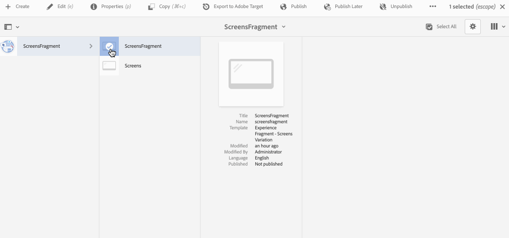

# 使用体验片段 {#using-experience-fragments}

本页介绍以下主题：

* **概述**
* **在 AEM Screens 中使用体验片段**
* **将更改传播到页面**

## 概述 {#overview}

***体验片段***&#x200B;是由一个或多个组件构成的组件组，包括可在页面内引用的内容和布局。体验片段可以包含任何组件（例如包含一个或多个组件，这些组件又可以包含段落系统内的任何内容），这些组件将被引用到完整体验中或由第三个端点进行请求。

## 在 AEM Screens 中使用体验片段 {#using-experience-fragments-in-aem-screens}

>[!NOTE]
>以下示例将 **We.Retail** 用作演示项目，从Sites页面将体验片段 **用于** AEM Screens项目。

例如，以下工作流演示了如何在站点中使用We.Retail中的体验片段。 您可以选择网页，并在您的某个项目的AEM Screens渠道中利用该内容。

### Pre-requisites {#pre-requisites}

**使用渠道创建演示项目**

***创建项目***

1. 单击 **“创建Screens项目** ”以创建新项目。
1. 在“标题”中输入 **DemoProject**。
1. 单击&#x200B;**保存**。

您 **的AEM Screens** 将添加一个DemoProject。

***创建渠道***

1. Navigate to the **DemoProject** you created and select the **Channels** folder.

1. Click **Create** from the action bar to open the wizard.
1. 从向导 **中选择** “序列渠道”模板，然后单 **击“下一步**”。

1. Enter the **Title** as **TestChannel** and click **Create**.

将 **向Demo** Project添加一个 **TestChannel**。\

### 创建体验片段 {#creating-an-experience-fragment}

请按照以下步骤将We.Retail中的 **内容用****于DemoProject** 中 **的TestChannel**&#x200B;中。

1. **导航到We.Retail中的“站点”页面**

   1. 导航到站点，然 **后选择We.Retail In** -Store -> **渠道** ->空闲渠道-夜间&#x200B;**** ，并选择此页面以将其用作Screens渠道的体验片段。

   1. 单 **击操** 作栏中的编辑以打开要用作Screens渠道体验片段的页面。

1. **重新使用内容**

   1. 选择要包含在渠道中的片段。
   1. 单击右侧的最后一个图标以打开“转 **换为体验片段** ”对话框。

   

1. **创建体验片段**

   1. 选择操 **作** , **作为创建新体验片段**。

   1. 选择父 **路径**。
   1. 选择 **模板**。 在此处 **选择体验片段** -屏幕变量模板。

   1. Enter the **Fragment Title** as **ScreensFragment**.

   1. 单击复选标记以完成新体验片段的创建。

   

1. **创建体验片段的Live Copy**

   1. 导航到AEM主页。
   1. 选择 **体验片段** ，高亮显 **示ScreensFragment** ，然 **后单击变量作为Live**-Copy，如下图所示：

   

   c.从创建 **Live Copy** 向导 **中选择ScreensFragment** ，然后单 **击下一**&#x200B;步。

   d.在标题 **和名** 称中 **输入** “ **屏幕**”。

   e.单 **击创** 建以创建Live Copy。

   f.单 **击完** ，返回 **ScreensFragment** 页。

   

   >[!NOTE]
   >
   >创建Screens片段后，您可以编辑片段的属性。 选择片段，然后单 **击操** 作栏中的属性。

   **编辑屏幕片段的属性**

   1. 导航到 **ScreensFragment** （您在前面的步骤中创建），然后 **单击操作** 栏中的“属性”。

   1. 选择“ **脱机配置** ”选项卡，如下图所示。

   您可以将客 **户端库** （java和css）和静态 **文件添加到** 体验片段。

   以下示例显示了如何将客户端库和字体作为静态文件的一部分添加到体验片段。  

1. **在Screens渠道中将体验片段用作组件**

   1. 导航到要使用Screens片段的“屏幕”渠道 **卡** 。
   1. 选择TestChannel **** ，然后 **单击操** 作栏中的“编辑”。

   1. 单击侧选项卡中的组件图标。
   1. 将体验片 **段拖放** 到渠道。

   

   e.选择 **体验片段** ，然后选择左上角（扳手）图标以打开体验 **片段对话框** 。

   f.选择您 **在** Path中的步骤3中创建的片 *段的* Screens **Live** Copy。

   

   f.选择您 **在** “体验片段”的第3步 *中创建的片* 段的 **Screens** Live Copy。

   

   h.在“持续时间”中输 **入毫秒**。

   我。从“体 **验片段** ”对 **话框中选** 择脱机配置，以定义客户端库和静态文件。

   >[!NOTE]
   >
   >如果除了在步骤(4)中配置的外，还要添加客户端库或静态文件，则可以从“体验片段”对话框的“脱 **机配置** ”选项卡 **中添加** 。

   

   j.单击复选标记以完成该过程。

### 验证结果 {#validating-the-result}

完成上述步骤后，您可以通过以下方式在ChannelOne中验 **证您的** 体验片段：

1. 导航到 **TestChannel**。
1. 从操 **作栏** 中选择预览。

您将视图您 **渠道中** “站点”页面（体验片段的Live Copy）的内容，如下图所示：\

## 将更改传播到页面 {#propagating-changes-from-the-master-page}

***Live Copy*** 指由同步操作（由转出配置定义）维护的（源的）副本。

由于体验片段，我们创建的是站点页面中的 **Live** copy，因此，如果您从主控页面对该特定片段进行更改，您将在渠道或已使用体验片段的目标中视图所做的更改。

>[!NOTE]
>
>有关Live Copy的详细信息，请参阅重复使用内容：多站点管理器和Live Copy。

请按照以下步骤将更改从主控渠道传播到目标渠道:

1. 从“站点”(主控 **** )页面中选择体验片段，然后单击铅笔图标以编辑体验片段中的项目。

   

1. 选择体验片段并单击扳手图标以打开对话框以编辑图像。

   

1. “产 **品网格** ”(Product Grid)对话框打开。

   

1. 您可以编辑任何图像。 例如，此处将替换此片段中的第一幅图像。

   

1. 选择体验片段，然后单击转出图标以将更改传播到渠道中使用的片段。

   

1. 单击转出以确认更改。

   您将看到更改已转出。

   

### 验证更改 {#validating-the-changes}

请按照以下步骤确认渠道中的更改：

1. 导航到 **Screens** -> **渠道****->** TestChannel。

1. 单击 **操作** 栏中的预览以确认更改。

下图说明了TestChannel中的 **更改**:\

