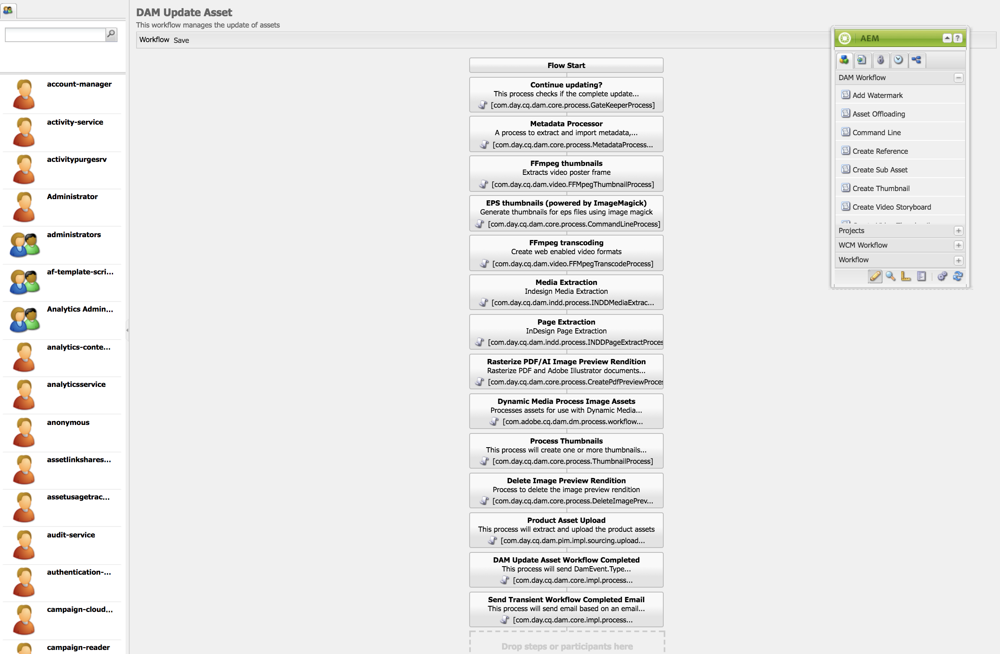

# 视频演绎版 {#video-renditions}

您可以生成手动和自动的全高清呈现。 以下部分介绍了将演绎版添加到资源的工作流。

## 自动生成全高清呈现版本 {#automatically-generating-full-hd-renditions}

>[!NOTE]
>
>如果AEM Screens视频演绎版无法在您的设备上以最佳方式播放，请联系硬件供应商以了解视频的规格。 这样做有助于在设备上获得最佳性能。 它可帮助您创建自己的自定义视频配置文件，您可以在其中为FFMPEG提供相应的参数以生成演绎版。 然后，使用以下步骤将自定义视频配置文件添加到配置文件列表。
>
>另请参阅[视频疑难解答](troubleshoot-videos.md)，以调试和解决频道中的视频播放问题。

请按照以下步骤自动生成全高清呈现：

1. 单击Adobe Experience Manager链接（左上方），然后单击锤子图标，以便您能够单击&#x200B;**工作流**。

   单击&#x200B;**模型**。

   

1. 在工作流模型管理中，单击&#x200B;**DAM更新资产**&#x200B;模型，然后单击操作栏中的&#x200B;**编辑**。

   

1. 在&#x200B;**DAM更新资产**&#x200B;窗口中，双击&#x200B;**FFmpeg转码**&#x200B;步骤。

   

1. 单击&#x200B;**进程**&#x200B;选项卡。
1. 在&#x200B;**参数**中向列表输入全高清配置文件，如下所示：
   ***`,profile:fullhd-bp,profile:fullhd-hp`***
1. 单击&#x200B;**确定**。

   

1. 单击&#x200B;**DAM更新资产**&#x200B;屏幕左上角的&#x200B;**保存**。

   

1. 导航到&#x200B;**Assets**&#x200B;并上传新视频。 单击视频，然后打开演绎版侧边栏。 请注意两个全高清视频。

   

1. 从侧边栏打开&#x200B;**呈现版本**。

   

1. 请注意两个新的全高清呈现版本。

   

## 手动生成全高清呈现版本 {#manually-generating-full-hd-renditions}

请按照以下步骤手动生成全高清呈现：

1. 单击Adobe Experience Manager链接（左上方），然后单击锤子图标，以便您可以单击“工具”并单击“**工作流**”。

   单击&#x200B;**模型**。

   

1. 在工作流模型管理中，单击&#x200B;**Screens更新资产**&#x200B;模型，然后单击&#x200B;**启动工作流**&#x200B;以打开&#x200B;**运行工作流**&#x200B;对话框。

   

1. 单击&#x200B;**有效负载**&#x200B;中所需的视频，然后单击&#x200B;**运行**。

   

1. 导航到&#x200B;**Assets**，深入到您的资源，然后单击该资源。

   

1. 打开&#x200B;**呈现形式**&#x200B;侧边栏。 请注意新的全高清呈现版本。

   
