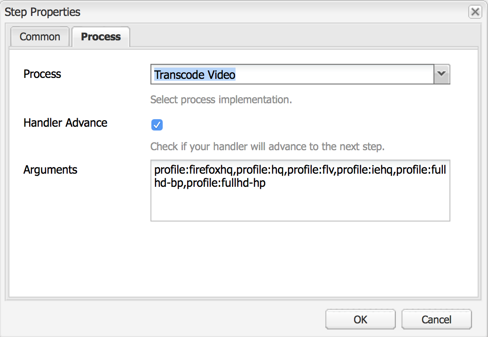

# 视频演绎版 {#video-renditions}

您可以生成手动和自动全高清呈现版本。 以下部分介绍了将演绎版添加到资源的工作流。

## 自动生成全高清呈现版本  {#automatically-generating-full-hd-renditions}

>[!NOTE]
>
>如果AEM Screens视频演绎版无法在您的设备上以最佳方式播放，请联系硬件供应商以了解视频的规格。 这将有助于在设备上获得最佳性能，从而创建您自己的自定义视频配置文件，您可以在其中为FFMPEG提供适当的参数来生成演绎版。 随后，使用以下步骤将自定义视频配置文件添加到配置文件列表。
>
>此外，请参阅 [视频疑难解答](troubleshoot-videos.md) 调试和排查渠道中的视频播放问题。

请按照以下步骤自动生成全高清呈现版本：

1. 选择Adobe Experience Manager链接（左上方），然后单击锤子图标以选择要选择的工具 **工作流**.

   单击 **模型** 以进入工作流模型管理。

   

1. 选择 **DAM更新资产** ，然后单击操作栏中的“编辑”以打开 **DAM更新资产** 窗口。

   

1. 双击 **FFmpeg转码** 步骤。

   

1. 选择 **进程** 选项卡以编辑进程参数。 将全高清配置文件输入列表 **参数** 作为： ***，profile:fullhd-bp,profile:fullhd-hp*** 并单击 **确定**.

   

1. 单击 **保存** 左上角的 **DAM更新资产** 屏幕。

   

1. 导航到 **资产** 并上传新视频。 单击视频，然后打开呈现版本侧边栏，您会看到两个全高清视频。

   

1. 打开 **演绎版** 从侧边栏上删除。

   

1. 您将会注意到两个新的全高清呈现版本。

   

## 手动生成全高清呈现版本 {#manually-generating-full-hd-renditions}

请按照以下步骤手动生成全高清呈现版本：

1. 选择Adobe Experience Manager链接（左上方），然后单击锤子图标以选择要选择的工具 **工作流**.

   单击 **模型** 以进入工作流模型管理。

   

1. 选择 **屏幕更新资产** 模型，然后单击 **启动工作流** 以打开 **运行工作流** 对话框。

   

1. 在中选择所需的视频 **有效负荷** 并单击 **运行**.

   

1. 导航到 **资产**，深入到您的资源，然后单击该资源。

   

1. 打开 **演绎版** 侧边栏中，您会看到新的全高清呈现版本。

   
