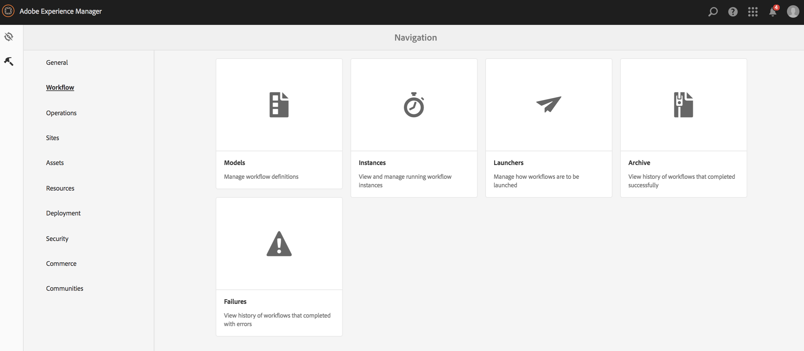

# 视频演绎版 {#video-renditions}

您可以手动和自动生成全高清演绎版。以下部分介绍了将演绎版添加到资产的工作流。

## 自动生成全高清演绎版  {#automatically-generating-full-hd-renditions}

>[!NOTE]
>
>如果 AEM Screens 视频演绎版在您的设备上播放效果不佳，请联系硬件供应商以获取视频的规格。这将有助于在设备上获得最佳性能，并因此创建您自己的自定义视频配置文件，您可以在该配置文件中为 FFMPEG 提供适当的参数以生成演绎版。随后，可使用以下步骤将您的自定义视频配置文件添加到配置文件列表。
>
>另外，还请参阅[对视频进行故障诊断](troubleshoot-videos.md)，以调试渠道中播放的视频并对视频问题进行故障诊断。

请按照以下步骤自动生成全高清演绎版：

1. 选择 Adobe Experience Manager 链接（左上方），然后单击锤子图标以选择工具，从而选择&#x200B;**工作流**。

   Click **Models** to enter the workflow models management.

   

1. Select the **DAM Update Asset** model and click Edit from the action bar to open the **DAM Update Asset** window.

   

1. 双击 **FFmpeg 转码**&#x200B;步骤。

   

1. 选择&#x200B;**进程**&#x200B;选项卡以编辑进程参数。Enter the full HD profiles to the list in **Arguments** as: ***,profile:fullhd-bp,profile:fullhd-hp*** and click **OK**.

   

1. 单击 **DAM 更新资产**&#x200B;屏幕左上方的&#x200B;**保存**。

   

1. 导航到&#x200B;**资产**，然后上传一个新视频。单击视频并打开演绎版侧边栏，您会注意到这两个全高清视频。

   

1. Open **Renditions** from the side rail.

   

1. 您将发现两个新的全高清演绎版。

   

## 手动生成全高清演绎版 {#manually-generating-full-hd-renditions}

请按照以下步骤手动生成全高清演绎版：

1. 选择 Adobe Experience Manager 链接（左上方），然后单击锤子图标以选择工具，从而选择&#x200B;**工作流**。

   Click **Models** to enter the workflow models management.

   

1. Select the **Screens Update Asset** model, and click the **Start Workflow** to open the **Run Workflow** dialog box.

   

1. Select the desired video in the **Payload** and click **Run**.

   

1. 导航到&#x200B;**资产**，向下展开您的资产，然后单击它。

   

1. 打开&#x200B;**演绎版**&#x200B;侧边栏，此时您将发现新的全高清演绎版。

   

