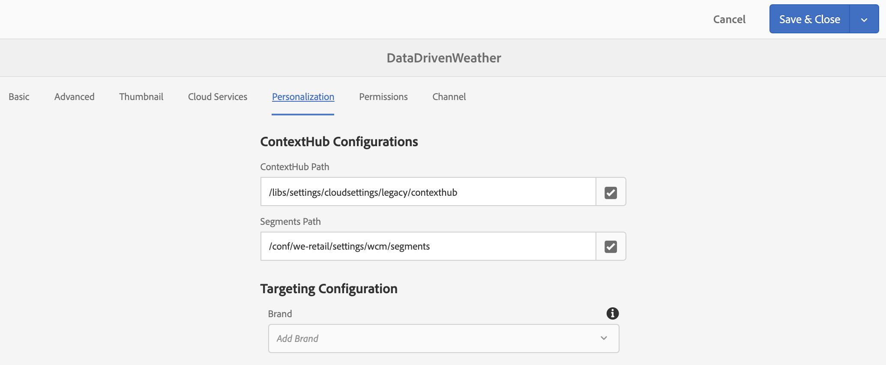

# 酒店预订激活{#hospitality-reservation-activation}

以下用例演示了如何使用基于Google工作表中填充的值的医院预订激活。

## 描述 {#description}

对于此用例，Google Sheet中填充了两家餐馆&#x200B;**Restaurant1**&#x200B;和&#x200B;**Restaurant2**&#x200B;的预订百分比。 根据Restaurant1和Restaurant2的值应用公式，并根据公式将值1或2分配给&#x200B;**AdTarget**&#x200B;列。

如果&#x200B;**Restaurant1** > **Restaurant2**&#x200B;的值，则为&#x200B;**AdTaget**&#x200B;赋值&#x200B;**1**，否则为&#x200B;**AdTarget**&#x200B;赋值&#x200B;**2**.. 值1生成&#x200B;*牛排食品*&#x200B;选项，值2在显示屏上显示&#x200B;*泰国食品*&#x200B;选项。

## 先决条件{#preconditions}

在开始实施保留激活之前，您必须了解如何设置AEM Screens项目中的&#x200B;***受众存储***、***数据分段***&#x200B;和&#x200B;***为渠道***&#x200B;启用定位。

有关详细信息，请参阅AEM Screens](configuring-context-hub.md)中的[配置ContextHub。

## 基本流{#basic-flow}

请按照以下步骤为您的AEM Screens项目实施酒店预订激活使用案例：

1. **填充Google工作表并添加公式。**

   例如，将公式应用到第三列&#x200B;**AdTarget**，如下图所示。

   

1. **根据要求在受众中配置区段**

   1. 导航到受众中的区段(请参阅&#x200B;***步骤2:在&#x200B;**[在AEM Screens](configuring-context-hub.md)**页面中配置ContextHub中设置受众分段***，了解更多详细信息)。

   1. 选择&#x200B;**工作表A1 1**&#x200B;并单击&#x200B;**编辑**。

   1. 选择比较属性，然后单击配置图标以编辑属性。
   1. 从&#x200B;**属性名称**&#x200B;的下拉菜单中选择&#x200B;**googlesheets/value/1/2**

   1. 从下拉菜单中选择&#x200B;**运算符**&#x200B;作为&#x200B;**equal**

   1. 将&#x200B;**Value**&#x200B;输入为&#x200B;**1**

   1. 同样，选择&#x200B;**工作表A1 2**&#x200B;并单击&#x200B;**编辑**。

   1. 选择比较属性，然后单击配置图标以编辑属性。
   1. 从&#x200B;**属性名称**&#x200B;的下拉菜单中选择&#x200B;**googlesheets/value/1/2**

   1. 选择&#x200B;**Operator**&#x200B;作为&#x200B;**2**

1. 导航并选择渠道()，然后单击操作栏中的&#x200B;**编辑**。 在下面的示例中，**DataDrivenRestaurant**&#x200B;使用顺序渠道来展示该功能。

   >[!NOTE]
   >
   >您的渠道应已拥有默认映像，且应按照AEM Screens](configuring-context-hub.md)中的[配置ContextHub中所述预配置受众。

   

   >[!CAUTION]
   >
   >您应该已使用渠道&#x200B;**属性** —> **个性化**&#x200B;选项卡设置&#x200B;**ContextHub** **配置**。

   

1. 从编辑器中选择&#x200B;**定位**，然后从下拉菜单中选择&#x200B;**品牌**&#x200B;和&#x200B;**活动**，然后单击&#x200B;**开始定位**。
1. **检查预览**

   1. 单击&#x200B;**预览。** 此外，打开您的Google Sheets并更新其值。
   1. 更新&#x200B;**Restaurant1**&#x200B;和&#x200B;**Restaurant2**&#x200B;列中的值。 如果&#x200B;**Restaurant1** > **Restaurant2,**，您应能够视图&#x200B;*牛排*&#x200B;食品的图像，否则，屏幕上将显示&#x200B;*泰国*&#x200B;食品图像。

   

