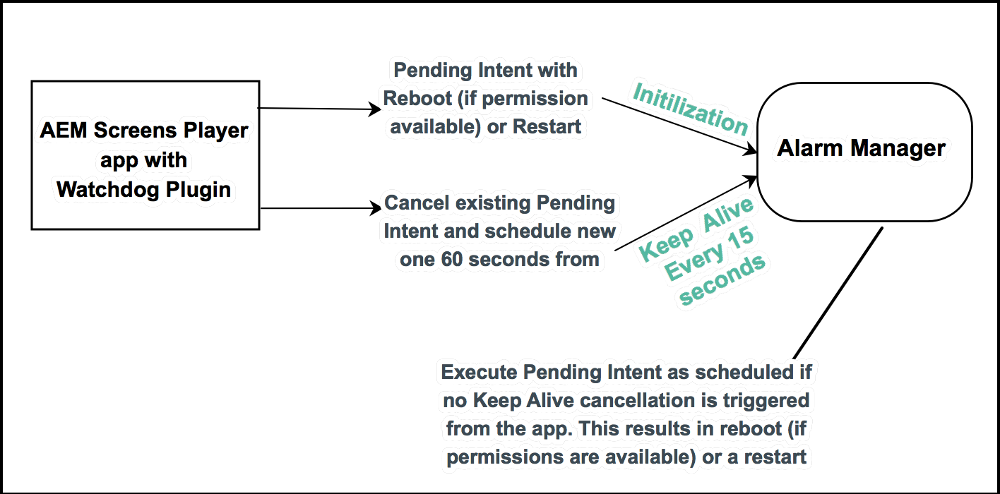

# 实施Android™ Player {#implementing-android-player}

>[!CAUTION]
>Adobe建议您升级到Adobe Experience Manager 6.5 (AEM 6.5)的最新版本。 您可以从[此处](https://experienceleague.adobe.com/zh-hans/docs/experience-manager-65/content/release-notes/release-notes)获取最新版本信息。

本节介绍如何配置Android™播放器。 它提供了有关配置文件和可用选项的信息，以及开发和测试时要使用的设置的建议。

此外，**Watchdog**&#x200B;是一种从崩溃中恢复播放器的解决方案。 应用程序必须向监视程序服务注册自己，然后定期向服务发送其处于活动状态的消息。 如果监视程序服务在规定的时间内未收到保持活动状态消息，则该服务将尝试重新启动设备。 此操作可用于执行干净恢复（如果它有足够的权限）或重新启动应用程序。

## 安装Android™ Player {#installing-android-player}

要实施适用于AEM Screens的Android™ Player，请安装适用于AEM Screens的Android™ Player。

访问&#x200B;[**AEM 6.5播放器下载**](https://download.macromedia.com/screens/)页面。

### 为AEM Screens 6.5.5 Service Pack设置环境 {#fp-environment-setup}

>[!NOTE]
>如果您使用Android 6.5.5 Service Pack，请为AEM Screens™播放器设置环境。

在所有AEM创作和发布实例上，将登录令牌Cookie **的** SameSite属性从&#x200B;**Lax**&#x200B;设置为&#x200B;**None**(从&#x200B;**Adobe Experience Manager Web控制台配置**)。

应遵循以下步骤：

1. 使用`http://localhost:4502/system/console/configMgr`导航到&#x200B;**Adobe Experience Manager Web控制台配置**。

1. 搜索&#x200B;*Adobe Granite令牌身份验证处理程序*。

1. 将登录令牌Cookie **的** SameSite属性从&#x200B;**Lax**&#x200B;设置为&#x200B;**None**。
   

1. 单击&#x200B;**保存**。


### Ad Hoc方法 {#ad-hoc-method}

Ad-Hoc方法允许您安装最新的Android™播放器(*.exe*)。 访问&#x200B;[**AEM 6.5播放器下载**](https://download.macromedia.com/screens/)页面。

下载应用程序后，请按照播放器上的步骤完成临时安装：

1. 长按左上角以打开管理面板。
1. 从左侧操作菜单中导航到&#x200B;**配置**，输入要连接的AEM实例的位置（地址），然后单击&#x200B;**保存**。

1. 从左侧操作菜单中导航到&#x200B;**设备** **注册**&#x200B;链接，以便您可以检查设备注册过程的状态。

>[!NOTE]
>
>如果&#x200B;**状态**&#x200B;是&#x200B;**已注册**，则可以看到已填充&#x200B;**设备ID**&#x200B;字段。
>
>如果&#x200B;**状态**&#x200B;是&#x200B;**已取消注册**，则可以使用&#x200B;**令牌**&#x200B;来注册设备。

## 实施Android™ Watchdog {#implementing-android-watchdog}

由于Android™的架构，重新启动设备要求应用程序具有系统权限。 使用制造商的签名密钥对应用程序进行签名，否则，监视程序可以重新启动播放器应用程序而不重新启动设备。

### Android的标牌™ `apks`使用制造商密钥 {#signage-of-android-apks-using-manufacturer-keys}

要访问Android的某些特权API™如&#x200B;*PowerManager*&#x200B;或&#x200B;*HDMIControlServices*，请使用制造商的密钥对Android™ `apk`进行签名。

>[!CAUTION]
>
>先决条件：
>
>执行以下步骤之前，您应该先安装Android™ SDK。

按照以下步骤使用制造商的密钥对Android™ apk进行签名：

1. 从Google Play或[AEM Screens播放器下载](https://download.macromedia.com/screens/)页面下载apk
1. 从制造商处获取平台密钥，以便获取&#x200B;*pk8*&#x200B;和&#x200B;*pem*&#x200B;文件

1. 使用查找`~/Library/Android/sdk/build-tools -name "apksigner"`在Android™ SDK中找到`apksigner`工具
1. `<pathto> /apksigner sign --key platform.pk8 --cert platform.x509.pem aemscreensplayer.apk`
1. 在Android™ SDK中查找邮政编码对齐工具的路径
1. `<pathto> /zipalign -fv 4 aemscreensplayer.apk aemscreensaligned.apk`
1. 使用adb install将&#x200B;***aemscreensaligned.apk***&#x200B;安装到设备

## 了解Android™监视程序服务 {#android-watchdog-services}

跨Android™监视程序服务是使用&#x200B;*AlarmManager*&#x200B;作为Cordova插件实现的。

下图显示了监视程序服务的实现：



**1. 初始化** — 在初始化Cordova插件时，将检查权限以查看您是否具有系统权限，从而检查是否具有Reboot权限。 如果满足这两个条件，则会创建挂起的重启意图，否则会创建挂起的重启应用程序意图（基于其启动活动）。

**2。保持活动状态计时器** — 保持活动状态计时器用于每15秒触发一次事件。 在该事件中，取消现有的挂起意图（重新启动或重新启动应用程序）并在以后的60秒内注册新的挂起意图（实际上延迟了重新启动）。

>[!NOTE]
>
>在Android™中，*AlarmManager*&#x200B;用于注册&#x200B;*pendingIntents*，即使应用程序已崩溃且其警报投放与API 19 (Kitkat)不准确也可以执行该操作。 在计时器的间隔和&#x200B;*AlarmManager的* *pendingIntent的*&#x200B;警报之间保持一定的间距。

**3。 应用程序崩溃** — 如果发生崩溃，则不再重置向AlarmManager注册的pendingIntent for Reboot。 因此，它会运行重新启动或重新启动应用程序（取决于Cordova插件初始化时可用的权限）。

## 批量配置Android™ Player {#bulk-provision-android-player}

批量推出Android™播放器时，需要配置播放器以指向AEM实例，并配置其他资产，而无需在管理员UI中手动输入它们。

>[!NOTE]
>Android™播放器42.0.372提供此功能。

执行以下步骤，在Android™播放器中允许批量配置：

1. 创建名为`player-config.default.json`的配置JSON文件。
查看[示例JSON策略](#example-json)和描述各种[策略属性](#policy-attributes)的使用的表。

1. 使用MDM、ADB或Android™ Studio文件资源管理器将此策略JSON文件拖放到Android™设备上的&#x200B;*sdcard*&#x200B;文件夹中。

1. 部署文件后，使用MDM安装播放器应用程序。

1. 当播放器应用程序启动时，将读取此配置文件，并将其指向相应的AEM服务器，在服务器中进行注册和控制。

   >[!NOTE]
   >首次启动应用程序时，此文件为&#x200B;*只读*，无法用于后续配置。 如果在删除配置文件之前启动播放器，则只需在设备上卸载并重新安装应用程序即可。

### 策略属性 {#policy-attributes}

下表汇总了策略属性并提供了示例策略JSON以供参考：

| **策略名称** | **用途** |
|---|---|
| *server* | Adobe Experience Manager服务器的URL。 |
| *分辨率* | 设备的分辨率。 |
| *rebootSchedule* | 重新启动计划适用于所有平台。 |
| *enableAdminUI* | 启用管理UI以在站点上配置设备。 在完全配置并投入生产后，设置为&#x200B;*false*。 |
| *启用OSD* | 为用户启用通道切换器UI以在设备上切换通道。 在完全配置并投入生产后，请考虑将其设置为&#x200B;*false*。 |
| *enableActivityUI* | 如果要显示下载和同步等活动的进度，则启用此选项。 在完全配置并投入生产后，启用以进行故障排除并禁用。 |
| *enableNativeVideo* | 如果要使用本机硬件加速进行视频播放，请启用(仅限Android™)。 |

### 示例JSON策略 {#example-json}

```java
{
  "server": "https://author-screensdemo.adobecqms.net",
"device": "",
"user": "",
"password": "",
"resolution": "auto",
"rebootSchedule": "at 4:00 am",
"maxNumberOfLogFilesToKeep": 10,
"logLevel": 3,
"enableAdminUI": true,
"enableOSD": true,
"enableActivityUI": false,
"enableNativeVideo": false,
"enableAutoScreenshot": false,
"cloudMode": false,
"cloudUrl": "https://screens.adobeioruntime.net",
"cloudToken": "",
"enableDeveloperMode": true
}
```

>[!NOTE]
>无论是否插入实际的`*sdcard*`，所有Android™设备都有`*sdcard*`文件夹。 此文件在部署时将与Downloads文件夹处于同一级别。 某些MDM（如Samsung Knox）可能会将此&#x200B;*sdcard*&#x200B;文件夹位置视为&#x200B;*内部存储*。

## 使用企业移动性管理批量配置Android™ Player {#bulk-provisioning}

批量部署Android™播放器时，手动向AEM注册每个播放器会变得繁琐起来。 使用EMM （企业移动性管理）解决方案，如[`VMWare Airwatch`](https://docs.samsungknox.com/admin/uem/vm-configure-appconfig.htm)、MobileIron或Samsung Knox，以便您可以远程配置和管理您的部署。 AEM Screens Android™播放器支持行业标准EMM AppConfig以允许远程配置。

## 命名Android™ Player {#name-android}

您可以为Android™播放器分配一个用户友好的设备名称，然后将分配的设备名称发送到AEM (Adobe Experience Manager)。 此功能不仅允许您为Android™播放器命名，还允许您轻松分配相应的内容。

>[!NOTE]
>您只能在注册之前选择播放器名称。 注册播放器后，无法再更改播放器名称。

执行以下步骤，在Android™播放器中配置名称：

1. 导航到&#x200B;**设置** > **关于设备**
1. 编辑您的设备名称并将其设置为命名您的Android™播放器

### 使用企业移动性管理实施Android™ Player的批量配置 {#implementation}

执行以下步骤以允许在Android™ Player中进行批量配置：

1. 确保您的Android™设备支持Google Play服务。
1. 使用您喜爱的支持AppConfig的EMM解决方案注册您的Android™播放器设备。
1. 登录到EMM控制台，然后从Google Play中提取AEM Screens Player应用程序。
1. 单击托管配置或相关选项。
1. 您现在应该会看到可配置的播放器选项列表，例如服务器和批量注册代码。
1. 配置这些参数，保存策略并将其部署到设备。

   >[!NOTE]
   >设备应该会收到应用程序以及配置。 它应指向具有所选配置的正确AEM服务器。 如果您选择配置批量注册代码并将其与AEM中配置的代码相同，则播放器应该能够自动注册自身。 如果您配置了默认显示，则它还可以下载并显示某些默认内容（这些内容以后可以根据您的方便进行更改）。

此外，您还应就AppConfig支持问题与EMM供应商联系。 最受欢迎的[`VMWare Airwatch`](https://docs.samsungknox.com/admin/uem/vm-configure-appconfig.htm)、[`Mobile Iron`](https://docs.samsungknox.com/admin/uem/mobileiron2-configure-appconfig.htm)、[`SOTI`](https://docs.samsungknox.com/admin/uem/soti-configure-appconfig.htm)、[`BlackBerry&reg; UEM`](https://docs.samsungknox.com/admin/uem/bb-configure-appconfig.htm)、[`IBM&reg; Maas360`](https://docs.samsungknox.com/admin/uem/ibm-configure-appconfig.htm)和[`Samsung Knox`](https://docs.samsungknox.com/admin/uem/km-configure-appconfig.htm)等支持此行业标准。

### 使用Screens远程控制 {#using-remote-control}

AEM Screens提供远程控制功能。 在此处了解有关此功能的更多信息：[Screens远程控制](implementing-remote-control.md)
