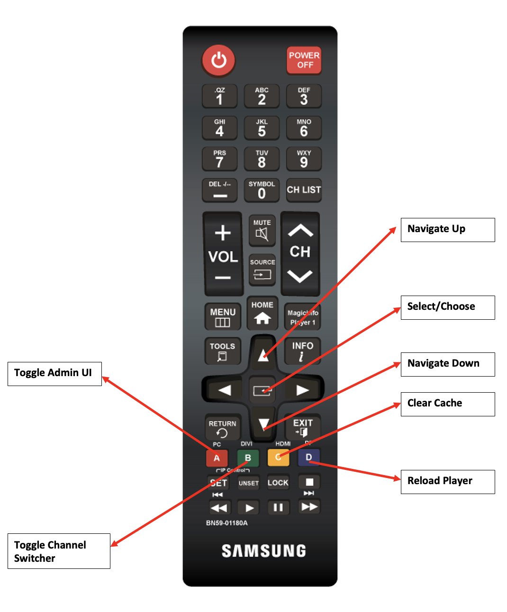

# 使用Screens远程控制  {#implementing-remote-control}

利用远程控制功能，可更轻松地访问管理员UI、渠道切换器或清除缓存和重新加载等功能。 此外，它还为您提供了查看播放器本地固件版本和系统信息的方法。 这特别有用，因为很难连接鼠标并在无法连接的生产设备上操作，如果播放器与AEM断开连接，则会更是如此。 在使用Samsung RMS时，这也很有用，因为分辨率差异可能会使用鼠标查找和打开管理员UI非常困难。

## 常用远程控制键组合 {#using-common-remote-control}

在所有播放器上，您都可以在Screens远程控制中使用以下组合键：

1. 切换管理员UI - CTRL + 1
1. 切换渠道切换器 — CTRL + 2
1. 清除缓存 — CTRL + ALT + 3
1. 重新加载播放器 — CTRL + 4

## Tizen专用遥控键组合 {#using-tizen-remote-control}

特定于Tizen播放器，您可以使用Samsung RMS中提供的硬件远程或软件远程访问这些功能：

1. A — 切换管理员UI
1. B — 切换渠道切换器
1. C — 清除缓存
1. D — 重新加载播放器

## 其他使用说明 {#using-additional-remote-control}

1. 打开管理员UI后，您可以使用向上和向下箭头导航选项卡以查看各个选项卡的信息。
1. 打开渠道切换器后，您可以使用向上和向下箭头键浏览渠道，并按Enter键（或远程箭头中心的按钮）切换渠道。

下图说明了Samsung远程服务器的主要用法：


>[!NOTE]
>如果将enableAdminUI和/或enableOSD的设备配置值设置为false，则远程设备将不会切换管理员UI和渠道切换器。 您也无法使用箭头键在管理员UI或渠道中导航。 但是，您仍可以清除缓存并重新加载播放器。 如果任何键盘组合与您的交互式内容发生冲突，您可以使用以下代码禁用远程控制功能：

```javascript require(/['util/ScreensDisplay'/], function() /{window.ScreensDisplay.ignoreRemoteControl = true;/}); ```
