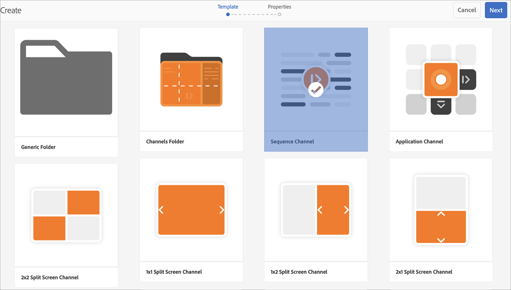
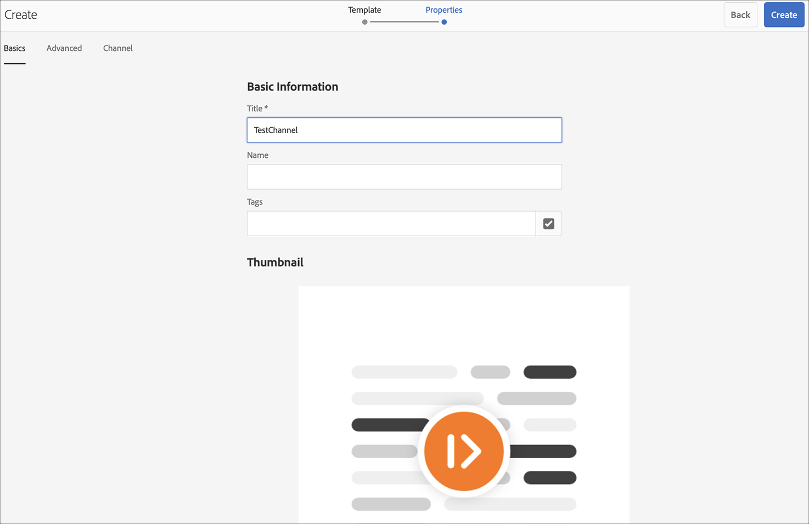
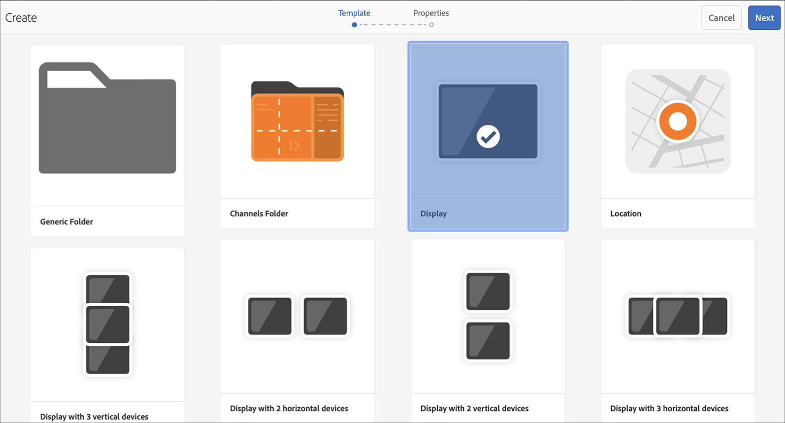
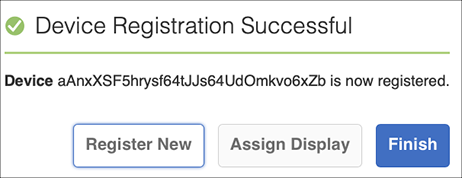

# 踢球指南 {#kickstart-guide}

AEM Screens项目启动演示了如何设置和运行AEM Screens项目。 它指导您设置基本的数字标牌体验，向每个渠道添加资产和／或视频等内容，并进一步将内容发布到AEM Screens播放器。

>[!NOTE]
>在开始处理项目详细信息之前，请确保您已安装最新的AEM Screens功能包。 您可以使用您的Adobe ID从软件分发 [门户下载最](https://experience.adobe.com/#/downloads/content/software-distribution/en/aem.html) 新的功能包。

## 前提条件 {#prerequisites}

请按照以下步骤为AEM Screens创建示例项目，并进一步将内容发布到Screens播放器。

>[!NOTE]
>以下教程展示在Chrome OS播放器中播放渠道的内容。

>[!IMPORTANT]
>**OSGi配置设置**
>必须启用空推荐人才能允许设备向服务器发布数据。 例如，如果禁用了空推荐人属性，则设备将无法发布屏幕截图。 目前，其中一些功能仅在OSGi配置中启用了Apache Sling推荐人过滤器允许空时才可用。 仪表板可能会显示警告，指出安全设置可能会阻止某些功能正常工作。
>请按照以下步骤启用Apache ***Sling推荐人过滤器允许空***:

## 允许空推荐人请求 {#allow-empty-referrer-requests}

1. 通过AEM **实例** —>锤子图标—>操作—> Web Console **，导航到** Adobe Experience Manager **Web Console** Configuration。

   

1. **Adobe Experience ManagerWeb控制台配置** 打开。 搜索吊带推荐人。

   要搜索sling推荐人属性， **请按Command** +F( **Mac)****和** Control+F(Windows ****)。

1. 选中“ **允许空** ”选项，如下图所示。

   

1. 单击 **“保存** ”以启用Apache Sling推荐人过滤器“允许为空”。

## 在5分钟内创建数字标牌体验 {#creating-a-digital-signage-experience-in-minutes}

### Creating an AEM Screens Project {#creating-project}

第一步是创建一个AEM Screens项目。

1. 导航到您的Adobe Experience Manager(AEM)实例，然后单击“屏 **幕”**。 或者，您也可以直接从中导 `https://localhost:4502/screens.html/content/screens](https://localhost:4502/screens.html/content/screens`航。

1. Click **Create Screens Project** to create a new Screens project. Enter the title as **DemoScreens** and click **Save**.

   

   >[!NOTE]
   >创建项目后，它将您带回到“Screens项目”主页。 现在，您可以选择自己的项目。在项目中，有五个不同的文件夹，标题 **为** Applications ****、 **渠道****、**&#x200B;设备、位 **置、**&#x200B;和计划。

### 创建渠道 {#creating-channel}

创建AEM Screens项目后，您需要创建新渠道来管理内容。

请按照以下步骤为项目创建新渠道:

1. 创建项目后，选择 **DemoScreens项** 目 **，然后选择** 渠道文件夹，如下图所示。 Click **+ Create** from the action bar.

   

1. 从向导 **中选择序列渠道** ，然后单击“下 **一步”**。
   

1. Enter the **Title** as **TestChannel** and click **Create**.

   

   现 **在将** TestChannel添加到您的渠道文件夹，如下图所示。

   

### Adding Content to a Channel {#adding-content}

渠道就位后，您需要向渠道添加AEM Screens播放器将显示的内容。

请按照以下步骤将内容添加到项&#x200B;**目渠道**(TestChannel):

1. Navigate to the **DemoProject** you created and select the **TestChannel** from the **Channels** folder.

1. Click **Edit** from the action bar (see the figure below). The editor for the **TestChannel** opens.

   

1. 单击操作栏左侧用于切换侧面板的图标以打开资产和组件。

1. 将您希望添加的组件拖放到渠道中。

   

### 创建位置 {#creating-location}

渠道就位后，您需要创建一个位置。

>[!NOTE]
>***位置*** ，将您的各种数字标牌体验划分为不同的区域，并根据不同屏幕的位置包含显示屏的配置。

请按照以下步骤为项目创建新位置：

1. Navigate to the **DemoProject** you created and select the **Locations** folder.

1. Click **+ Create** from the action bar.

1. Select **Location** from the wizard and click **Next**.

1. Enter the **Name** for your location (enter the title as **TestLocation**) and click **Create**.

将创 **建TestLocation** 并将其添加到您的 **Locations** 文件夹。

### 创建位置显示 {#creating-display}

创建位置后，您需要为位置创建新显示屏。

>[!NOTE]
>***Display*** 表示在一个或多个屏幕上运行的数字体验。

1. 导航到 **TestLocation** 并选择它。

1. 单击操作栏中的&#x200B;**创建**。

   

1. Select **Display** from the **Create** wizard and click **Next**.

   

1. Enter the **Title** as **LobbyDisplay** and click **Create**.

   

   现在，将新增一个标 **题为** TestDisplay的显示屏添加 **到您的**&#x200B;位置TestLocation，如下图所示。

   

### Assigning a Channel {#assigning-channel}

项目设置完成后，您必须将渠道分配给显示屏以视图内容。

1. 从DemoScreens —>位置 **—** > TestLocation **—** > LobbyDisplay中导航到 ********&#x200B;所需的显示屏。

1. Tap/click **Assign Channel** from the action bar.

   

   或者，

   点按／单 **击操作** 栏中的仪表板，然后单 **击“已分配** 的计划和渠道”面板中的 **“** +分配渠道”。

   

1. The **Channel Assignment** dialog box opens.

1. 从“设 **置** ”选项中，按路径选 **择渠道** ，并 **选择支持的** 事件作为“初始负 ********&#x200B;载”和“”。

   >[!NOTE]
   >
   >默认 **情况下**，会 **填充**“渠道角 **色”、“优** 先级”和“中断方法”。 请参 [阅渠道属性](/help/user-guide/channel-assignment-latest-fp.md#channel-properties) 部分，进一步了解渠道分配属性。

   

   此外，还可以选择“激活 **窗口** ”和“ **重复计划**”。

   >[!NOTE]
   >循环 *计划* ，允许您为渠道设置循环计划。 为渠道设置多个重复计划。
   >有关更 [多详细信息](/help/user-guide/channel-assignment-latest-fp.md#recurrence-schedule) ，请参阅重复计划。

1. 配置 **首选项** 后，单击“保存”。

### 注册设备并将设备分配到显示屏 {#registering-device}

您需要使用AEM仪表板注册设备。

>[!IMPORTANT]
>Chrome OS播放器可以在开发人员模式下作为Chrome浏览器插件安装，无需使用实际的Chrome播放器设备。 要进行安装，请按照以下步骤操作：
>
>1. 单击 [此处](https://download.macromedia.com/screens/) ，下载最新的Chrome播放器。
>1. 解压并保存到磁盘。
>1. 打开Chrome浏览器，从菜 **单中** 选择“扩展”，或直接导航 ***到chrome://extensions***。
>1. 从右上角 **打开** “开发人员”模式。
>1. 单击左 **上角的** “Load Unpacked”（加载解压缩的Chrome Player）。
>1. 检查 **AEM ScreensChrome Player** plugin(如果扩展列表中提供)。
>1. 打开新选项卡，单击左上 **角的** “应用程序”图标，或直接导航到 ***chrome://apps***。
>1. 单击 **AEM Screens** Plugin以启动Chrome Player。 默认情况下，播放器以全屏模式启动。 按 **Esc** 退出全屏模式。

打开Chrome OS播放器后，请按照以下步骤注册Chrome设备。

1. 从AEM实 **例** 导航到项目的Devices文件夹。

1. Tap/click the **Device Manager** from the action bar.

   

1. 点按／单击右 **上方的** “设备注册”。

1. 选择所需的设备，然后点按／单 **击注册设备**。

   

1. 等待设备发送其注册代码，并同时从 **Chrome设备** 检查注册代码。
   

1. 如果注 **册代码** （在两台计算机上）相同 **，请点按／单击AEM** 中的验证。

1. 将设备的所需名 **称设置为** ChromeDeviceforDemo **，然后单击“注**&#x200B;册”。

   

1. 从“ **设备注册** ”对话框 **中单击“指定显** 示”。

   

1. 选择显示的路径，如 **DemoScreens** —> **位置** — **> TestLocation** **—>休息室显******&#x200B;示并单击分配。

   

1. 成功分配设备后，您将看到以下确认信息。

   

1. Tap/click **Finish** to complete the registration process. 您应该能够从显示视图中仪表板注册的设备。

   

### 在Chrome Player中查看内容 {#viewing-content-output}

您渠道中的所有资源现在都在Chrome OS播放器上播放。

恭喜您正在AEM Screens渠道中播放内容！

